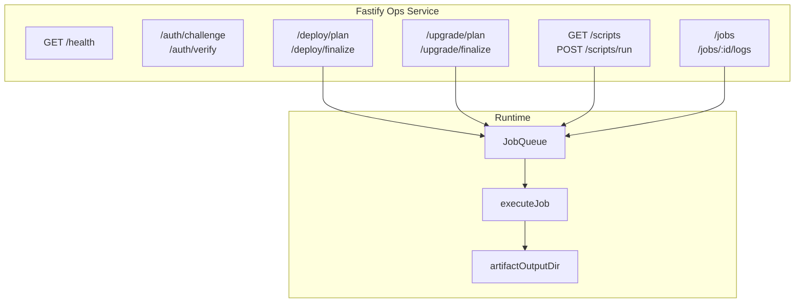

import {NextBestAction, StatusBadge} from "@site/src/components/docs";

# Ops Package

<StatusBadge status="Live" />



The ops package is a local Fastify service for authenticated operational jobs. It is not the contract deployment script directory and it is not infrastructure-as-code documentation. It wraps deploy/upgrade/script requests in a queued HTTP surface so an authorized operator can plan, finalize, run, inspect, and stream job logs.

## Service surface

| Route | Purpose |
| --- | --- |
| `GET /health` | Returns service host, port, artifact output directory, and server time. |
| `POST /auth/challenge` | Creates a wallet-signable challenge for a valid address. |
| `POST /auth/verify` | Verifies the signature and returns a session token. |
| `GET /scripts` | Lists allowed script definitions for authenticated sessions. |
| `POST /deploy/plan` | Queues a deploy planning job. |
| `POST /deploy/finalize` | Queues a deploy finalization job. |
| `POST /upgrade/plan` | Queues an upgrade planning job. |
| `POST /upgrade/finalize` | Queues an upgrade finalization job. |
| `POST /scripts/run` | Queues an allowed script execution. |
| `GET /jobs` / `GET /jobs/:jobId` | Lists jobs or returns one job. |
| `GET /jobs/:jobId/logs` | Streams job logs and status as server-sent events. |

## Builder contract

- Treat auth state, request parsing, queueing, execution, and job serialization as separate surfaces.
- Keep allowed script definitions explicit; do not add arbitrary shell execution.
- Preserve the plan/finalize split for deploys and upgrades so operators can inspect before broadcast.
- Keep generated artifacts under the configured artifact output directory.

## Commands

```bash
cd packages/ops
bun run dev
bun run test
bun run typecheck
bun run build
```

<NextBestAction
  title="Next best action"
  why="Contract deployment docs explain the underlying deploy and verification wrappers that ops jobs call into."
  actionLabel="Open contract deployments"
  actionHref="../deployments/contracts-deploy"
  alternatives={[
    {label: "Deployment status", href: "../deployments/status"},
    {label: "Contracts package", href: "./contracts"},
  ]}
/>
