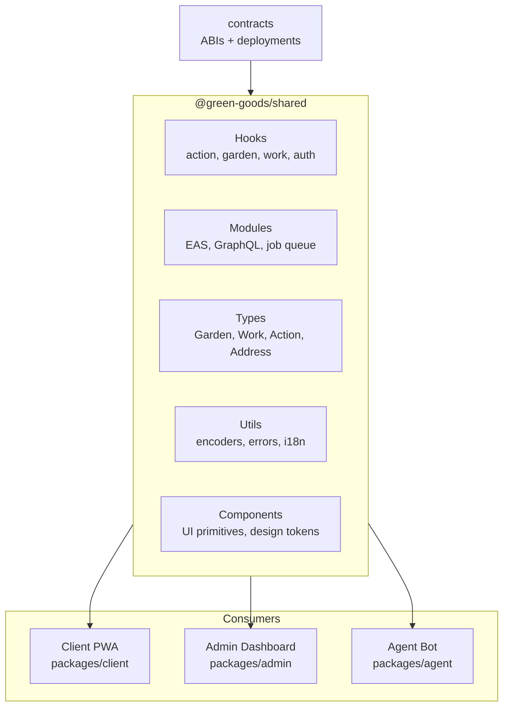

# Shared Library

:::info Coming Soon
This page is under development. Check back soon for full content.
:::

## Overview
Shared hooks, types, utilities, and modules used across all frontend packages.

## What to Expect
- Hook boundary pattern
- Domain type system
- i18n and localization
