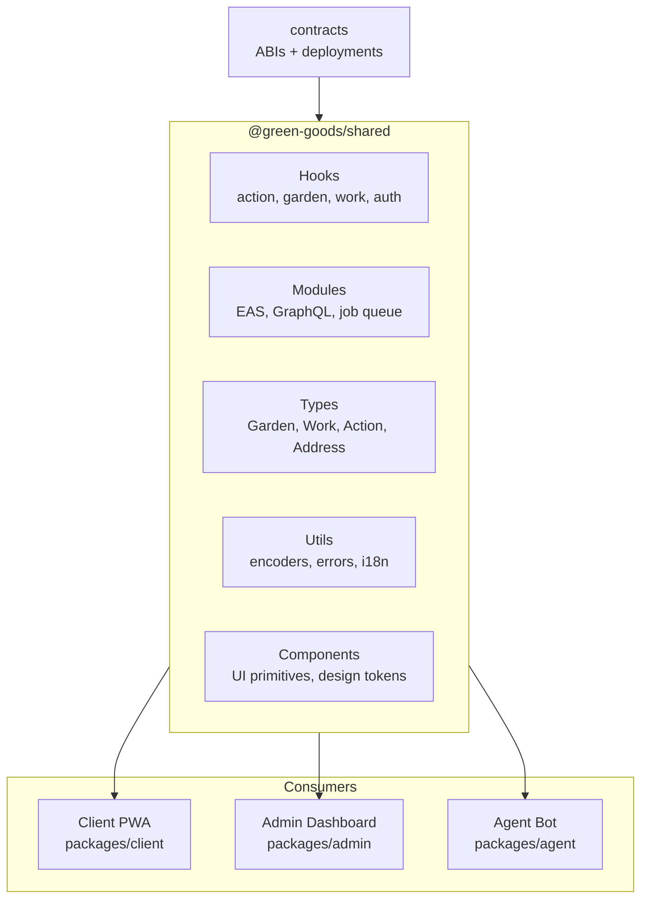

import {NextBestAction, StatusBadge} from "@site/src/components/docs";

# Shared Library

<StatusBadge status="Live" />



`@green-goods/shared` is the single home for cross-app hooks, providers, stores, modules, types, i18n, utility functions, and Storybook-backed UI foundations. Client, admin, and agent packages should consume shared behavior through the package barrel instead of rebuilding local versions.

## What this package owns

- Reusable React hooks for gardens, work, actions, roles, auth, media, and async data.
- Domain types including address-shaped values and shared entity models.
- Data modules for EAS, Envio GraphQL, IPFS/media, marketplaces, vaults, and other protocol reads.
- Shared UI foundations, canvas primitives, cards, form helpers, feedback components, and token documentation.
- i18n dictionaries for all user-facing frontend strings.
- Storybook aggregation for shared, admin, and client stories.

## Builder contract

- Put reusable hooks and providers here before app packages consume them.
- Export public APIs through package barrels; avoid teaching downstream packages deep import paths.
- Use centralized query keys and app chain helpers rather than ad-hoc arrays or wallet-chain defaults.
- Add tests and Storybook coverage when changing shared UI primitives or major variants.
- Keep admin-facing primitives aligned with the admin package contract before adding local admin shims.

## Commands

```bash
cd packages/shared
bun run test
bun run typecheck
bun run coverage
bun run check:stories
```

Run `check:story-quality`, `test:stories:ci`, or `build-storybook` when a change touches curated Storybook surfaces.

<NextBestAction
  title="Next best action"
  why="Storybook is the review surface for shared UI foundations and curated admin/client states."
  actionLabel="Open Storybook testing"
  actionHref="../testing/storybook"
  alternatives={[
    {label: "Admin package contract", href: "./admin"},
    {label: "Client package", href: "./client"},
  ]}
/>
