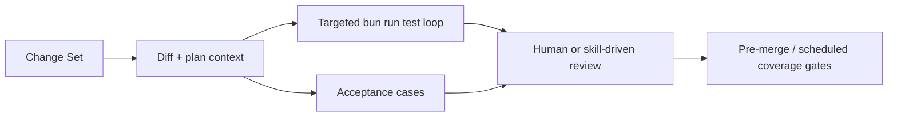

import {NextBestAction, StatusBadge} from "@site/src/components/docs";

# Agentic Evaluation Testing

<StatusBadge status="Live" />

Green Goods still uses agentic evaluation, but the runnable benchmark-pack layer is intentionally small. The current harness combines product acceptance cases, guidance-consistency checks, targeted test loops, and human review instead of maintaining separate model benchmark packs for retired agents.



## What It Checks

### Active Eval Surfaces

| Surface | Purpose | Status |
|-------|---------|--------|
| `.claude/evals/acceptance/` | Product acceptance cases and workflow-level checks | Live |
| `node .claude/scripts/check-skill-frontmatter.js` | Skill registry/frontmatter, command route, bundle, and retired-surface checks | Live |
| `docs/routines/pr-review.md` / `docs/routines/health-watch.md` | Routine/native-review checks for repo guidance, production health drift, and invariant violations | Live |

The only live eval directory under `.claude/evals/` today is `acceptance/`. Automated benchmark packs for `triage`, `code-reviewer`, `oracle`, and `cracked-coder` are retired. Drift around that retirement state is now handled by Claude routines, Copilot automatic review, and human review instead of a dedicated eval workflow. The committed agent surface is currently `cracked-coder` plus `oracle`; specialization otherwise routes through skills and plan-hub lanes.

### Model Selection

Model choice still matters for judgment-heavy work:

- **Opus** -- suited to implementation, review, and architecture judgment
- **Sonnet** -- suited to straightforward lookups and mechanical transforms
- **Haiku** -- keep for trivial routing or small deterministic work, not review

### Evaluation Criteria

#### Change Quality

Agent-assisted changes are evaluated against these criteria:

1. **Grounding** -- every finding or fix should point to specific files, tests, or plan artifacts
2. **False positive rate** -- findings should be rare, specific, and anchored in current repo surfaces rather than retired workflows
3. **Actionability** -- findings must suggest a concrete next step, not just a label
4. **Context awareness** -- the agent must read surrounding code, current docs, and feature-hub state before claiming drift or failure

#### Product Acceptance Quality

When feature work needs user-level verification, consult the acceptance cases in `.claude/evals/acceptance/`:

- user stories should map to concrete product behavior
- acceptance cases complement code-level heuristics rather than replacing them
- passing targeted tests does not guarantee the workflow matches product intent

## How It's Configured

### The Three-Strike Protocol

If an agent fails to fix an issue after three attempts:

1. **Strike 1** -- Reassess assumptions. Is the test failing for the right reason?
2. **Strike 2** -- Question the architecture. Is there a fundamentally different approach?
3. **Strike 3** -- Stop and escalate. Document what was tried and what the agent's hypothesis was.

This prevents agents from burning context window on unproductive loops.

### Claude Guidance Surface Check

The `check-skill-frontmatter.js` script validates the Claude-owned guidance structure: skill frontmatter, skills registry records, command aliases, command bundles, retired guidance surfaces, and selected forbidden guidance patterns.

```bash
node .claude/scripts/check-skill-frontmatter.js
```

Run this locally with `bun run check:claude-guidance` when changing Claude guidance. It is a structural guardrail, not a semantic contradiction checker for every line in `CLAUDE.md`, `AGENTS.md`, `.claude/agents/`, and `.claude/rules/`. Routine review and human review now catch semantic drift.

### Inner-Loop Policy

For iterative agent work, use the fastest honest loop:

- targeted `bun run test -- <file>` while shaping a change
- `bash scripts/quality/check-test-quality.sh` when touching test governance
- broader package or repo gates only once the local loop is green

Coverage remains a scheduled floor on package CI and pre-merge validation, not the per-change inner loop.

## Running & Troubleshooting

### Eval Surface Sync

Dedicated eval-sync Actions are retired. Eval surface drift is checked through `pr-review`, `drift-watch`, Copilot automatic review, and manual local commands:

1. `bun run check:claude-guidance` validates the committed Claude guidance structure
2. `bun run check:codex-guidance` validates Codex guidance parity
3. `drift-watch` opens rolling issues when retired surfaces or guidance claims drift

Diff-scoped automated review happens through GitHub native review, Copilot automatic review, Claude `pr-review`, and human validation, not through retired benchmark suites.

### Lessons Learned

- Repo-truth drift is more dangerous than missing a benchmark pack. Keep docs, workflows, and committed agent surfaces aligned.
- Targeted loops beat blanket coverage during active implementation. Use broader coverage only once the scoped loop is already green.
- Acceptance cases are a useful backstop for product intent, especially when code-level checks pass but the user workflow still feels off.
- Context window management matters. Long sessions can checkpoint to `session-state.md` and `tests.json`, but `.plans/` remains the durable repo truth.

## Resources

- [Husky Git Hooks](./husky) -- Local quality gates that run before code reaches the repository
- [Regression Testing](./regression) -- Regression suites that agents help maintain
- [GitHub Actions](./gh-actions) -- CI pipeline including the eval surface sync
- [Test Cases](./test-cases) -- Test case strategy that agents follow during TDD
- Agent specs: `.claude/agents/*.md`
- Claude guidance surface check: `.claude/scripts/check-skill-frontmatter.js`

<NextBestAction
  title="Next best action"
  why="See how git hooks enforce code quality gates before code reaches the repository."
  actionLabel="Husky Git Hooks"
  actionHref="./husky"
  alternatives={[
    {label: "Regression Testing", href: "./regression"},
    {label: "GitHub Actions", href: "./gh-actions"},
  ]}
/>
