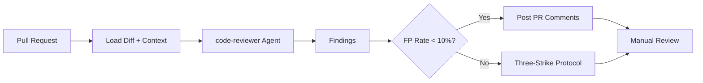

import {NextBestAction, StatusBadge} from "@site/src/components/docs";

# Agentic Evaluation Testing

<StatusBadge status="Live" />

AI agents assist with code review, test generation, and audit tasks in the Green Goods workflow. This page covers how agent outputs are evaluated for quality and how to avoid common pitfalls.



## What It Checks

### Agent Roles in QA

| Agent | Purpose | Model Requirement |
|-------|---------|-------------------|
| `code-reviewer` | PR review, pattern enforcement | Opus (judgment tasks) |
| `cracked-coder` | Implementation with TDD | Opus (complex reasoning) |
| `oracle` | Architecture guidance | Opus (cross-package context) |
| `triage` | Issue classification | Sonnet (sufficient for classification) |

Agent specs live in `.claude/agents/*.md`. Each defines activation criteria, workflow phases, and constraints.

### Model Selection

Model choice directly impacts evaluation quality:

- **Opus** -- Required for any task involving judgment: code reviews, security audits, architecture analysis, test quality assessment. Produces accurate findings grounded in semantic context.
- **Sonnet** -- Suitable for straightforward tasks: file lookups, simple searches, factual queries, mechanical transforms.
- **Haiku** -- Appropriate only for trivial tasks. Not suitable for code review -- it produces high false-positive rates by flagging patterns syntactically without reading semantic context.

### Evaluation Criteria

#### Code Review Quality

Agent-generated code reviews are evaluated against these criteria:

1. **Grounding** -- Every finding must reference a specific file and line number
2. **False positive rate** -- Target below 10% (Opus typically achieves this; Haiku exceeded 95%)
3. **Actionability** -- Findings must include a concrete fix, not just a description
4. **Context awareness** -- The agent must read surrounding code (guards, retry paths, comments) before flagging

#### Test Generation Quality

When agents generate tests (via the `cracked-coder` TDD workflow), evaluate:

- No no-op assertions (`expect(true).toBe(true)` is not a real test)
- Error paths are covered, not just happy paths
- Mock fidelity -- mocks use `createMock*` factories, not ad-hoc objects
- Cleanup is verified for hooks with timers, listeners, or async effects
- Assertions are specific (exact values, not just truthy/falsy)

## How It's Configured

### The Three-Strike Protocol

If an agent fails to fix an issue after three attempts:

1. **Strike 1** -- Reassess assumptions. Is the test failing for the right reason?
2. **Strike 2** -- Question the architecture. Is there a fundamentally different approach?
3. **Strike 3** -- Stop and escalate. Document what was tried and what the agent's hypothesis was.

This prevents agents from burning context window on unproductive loops.

### Guidance Consistency

The `check-guidance-consistency.js` script validates that agent instructions across `CLAUDE.md`, `AGENTS.md`, `.claude/agents/`, and `.claude/rules/` do not contradict each other:

```bash
node .claude/scripts/check-guidance-consistency.js
```

This runs in CI via `.github/workflows/claude-guidance.yml` to catch drift between guidance files.

## Running & Troubleshooting

### Automated Review Workflow

The `claude-code-review.yml` workflow runs agent-powered code review on PRs. It:

1. Checks out the PR branch
2. Loads relevant context files based on changed paths
3. Runs the `code-reviewer` agent against the diff
4. Posts findings as PR comments

Review scope is limited by the `.claude/rules/` path-scoped rules -- a PR touching only `packages/contracts/` will load `contracts.md` rules but not `react-patterns.md`.

### Lessons Learned

- Agent reviews that scan entire codebases produce noise. Scope reviews to the diff and its immediate dependencies.
- Always validate agent findings manually before merging. Even Opus makes mistakes on novel patterns.
- Agent-generated tests are a starting point. Review them for test adequacy before trusting them as a regression safety net.
- Context window management matters. Long sessions should checkpoint state to `session-state.md` and `tests.json` before compaction.

## Resources

- [Husky Git Hooks](./husky) -- Local quality gates that run before code reaches the repository
- [Regression Testing](./regression) -- Regression suites that agents help maintain
- [GitHub Actions](./gh-actions) -- CI pipeline including the automated review workflow
- [Test Cases](./test-cases) -- Test case strategy that agents follow during TDD
- Agent specs: `.claude/agents/*.md`
- Guidance consistency script: `.claude/scripts/check-guidance-consistency.js`

<NextBestAction
  title="Next best action"
  why="See how git hooks enforce code quality gates before code reaches the repository."
  actionLabel="Husky Git Hooks"
  actionHref="./husky"
  alternatives={[
    {label: "Regression Testing", href: "./regression"},
    {label: "GitHub Actions", href: "./gh-actions"},
  ]}
/>
