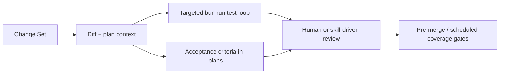

import {NextBestAction, StatusBadge} from "@site/src/components/docs";

# Agentic Evaluation Testing

<StatusBadge status="Live" />

Green Goods still uses agentic evaluation, but the runnable benchmark-pack layer is intentionally small. The current harness combines acceptance criteria in the feature hub, guidance-consistency checks, targeted test loops, and human review instead of maintaining separate benchmark packs or committed eval directories.


```mermaid
flowchart LR
    Change[Change Set] --> Diff[Diff + plan context]
    Diff --> Tests[Targeted bun run test loop]
    Diff --> Acceptance[Acceptance criteria in .plans]
    Tests --> Review[Human or skill-driven review]
    Acceptance --> Review
    Review --> Merge[Pre-merge / scheduled coverage gates]
```

## What It Checks

### Eval Surfaces: Live vs Retired

| Surface | Purpose | Status |
|-------|---------|--------|
| `bun run check:codex-guidance` | Codex guidance consistency -- AGENTS.md guides and documented commands stay real | Live |
| `.claude/loop.md` maintenance loop | Guidance consistency, stale-reference grep, build health spot-check | Live |
| `docs/routines/pr-review.md` / `docs/routines/health-watch.md` | Routine/native-review checks for repo guidance, production health drift, and invariant violations | Live |
| `.claude/evals/` (incl. `acceptance/`) | Committed eval directories | Retired |
| `check-skill-frontmatter.js` / `bun run check:claude-guidance` | Skill registry/frontmatter structural checks | Retired |

The `.claude/evals/` directory is gone entirely -- the lean-skills consolidation removed its last live surface (`acceptance/`) along with the skills registry, after the automated benchmark packs for `triage`, `code-reviewer`, `oracle`, and `cracked-coder` had already been retired. There are no committed agent definitions anymore either; specialization routes through the 10 skills, built-in subagent types, and plan-hub lanes. Drift around that retirement state is handled by CI guidance checks (`check-guidance-links.mjs` in the supply-chain workflow), Claude routines, Copilot automatic review, and human review instead of a dedicated eval workflow.

One deliberately small eval survives the retirement: `bun run eval:skills` (`scripts/harness/skill-trigger-eval.mjs` + `scripts/data/skill-trigger-eval.json`) routes ~30 realistic queries against the live `SKILL.md` frontmatter descriptions through a single cheap `claude -p` call. It tests **description routing only** -- not harness trigger behavior and not skill output quality -- and exists to catch description regressions after trigger edits (a trimmed description that stops firing, a greedy one that swallows a sibling's queries). It runs on demand, never in CI.

### Model Selection

Model choice still matters for judgment-heavy work:

- **Opus** -- suited to implementation, review, and architecture judgment
- **Sonnet** -- suited to straightforward lookups and mechanical transforms
- **Haiku** -- keep for trivial routing or small deterministic work, not review

### Evaluation Criteria

#### Change Quality

Agent-assisted changes are evaluated against these criteria:

1. **Grounding** -- every finding or fix should point to specific files, tests, or plan artifacts
2. **False positive rate** -- findings should be rare, specific, and anchored in current repo surfaces rather than retired workflows
3. **Actionability** -- findings must suggest a concrete next step, not just a label
4. **Context awareness** -- the agent must read surrounding code, current docs, and feature-hub state before claiming drift or failure

#### Product Acceptance Quality

Committed acceptance-case packs under `.claude/evals/acceptance/` were retired with the lean-skills consolidation. When feature work needs user-level verification, that intent now lives closer to the work:

- acceptance criteria belong in the feature hub (`.plans/active/<feature>/spec.md`, with optional `eval.md` verification notes)
- user stories should map to concrete product behavior
- passing targeted tests does not guarantee the workflow matches product intent -- staging QA and the `qa-triage` flow close that loop

## How It's Configured

### The Three-Strike Protocol

Codified in the `debug` skill. If an agent fails to fix an issue after three attempts:

1. **Strike 1** -- Reassess assumptions. Is the test failing for the right reason?
2. **Strike 2** -- Question the architecture. Is there a fundamentally different approach?
3. **Strike 3** -- Stop and escalate. Document what was tried and what the agent's hypothesis was.

This prevents agents from burning context window on unproductive loops.

### Guidance Checks

The `check-skill-frontmatter.js` script and the `bun run check:claude-guidance` entry it powered were retired with the lean-skills consolidation, together with the skills registry they validated -- the filesystem plus each skill's `SKILL.md` frontmatter is now the registry, with no structure left for a dedicated checker to police. What remains:

```bash
bun run check:codex-guidance   # AGENTS.md guides and documented commands stay real
```

plus the `.claude/loop.md` maintenance loop, which runs that check, greps `.claude/`, `CLAUDE.md`, and `AGENTS.md` for references to retired surfaces (removed skills, the old registry, retired agent definitions), and spot-checks lint health. These are structural guardrails, not semantic contradiction checkers for every line in `CLAUDE.md`, `AGENTS.md`, and `.claude/rules/`. Routine review and human review catch semantic drift.

### Inner-Loop Policy

For iterative agent work, use the fastest honest loop:

- targeted `bun run test -- <file>` while shaping a change
- `bash scripts/quality/check-test-quality.sh` when touching test governance
- broader package or repo gates only once the local loop is green

Coverage remains a scheduled floor on package CI and pre-merge validation, not the per-change inner loop.

## Running & Troubleshooting

### Eval Surface Sync

Dedicated eval-sync Actions are retired. Guidance and eval surface drift is checked through CI, routines, and local checks:

1. the `guidance` job in the supply-chain workflow runs `check:codex-guidance`, `check-guidance-links.mjs` (link integrity + retired-name sweep + banner/frontmatter parity), `plan-hub validate`, and the plan-hub test suite on every guidance-touching PR
2. `bun run drift:check --scope guidance` runs the same content checks locally; `.claude/loop.md` keeps the judgment-only prose-form sweep
3. `bun run eval:skills` checks description routing after skill trigger edits (on demand)
4. the `pr-review` and `health-watch` routines catch guidance claims and production health drift on their scheduled runs

Diff-scoped automated review happens through GitHub native review, Copilot automatic review, Claude `pr-review`, and human validation, not through retired benchmark suites.

### Lessons Learned

- Repo-truth drift is more dangerous than missing a benchmark pack. Keep docs, workflows, and committed guidance surfaces aligned.
- Targeted loops beat blanket coverage during active implementation. Use broader coverage only once the scoped loop is already green.
- Acceptance cases are a useful backstop for product intent, especially when code-level checks pass but the user workflow still feels off.
- Context window management matters. Long sessions can checkpoint to `session-state.md` and `tests.json`, but `.plans/` remains the durable repo truth.

## Resources

- [Husky Git Hooks](./husky) -- Local quality gates that run before code reaches the repository
- [Regression Testing](./regression) -- Regression suites that agents help maintain
- [GitHub Actions](./gh-actions) -- CI pipeline
- [Test Cases](./test-cases) -- Test case strategy that agents follow during TDD
- Maintenance loop: `.claude/loop.md`
- Codex guidance parity: `scripts/quality/check-codex-docs.js` (`bun run check:codex-guidance`)

<NextBestAction
  title="Next best action"
  why="See how git hooks enforce code quality gates before code reaches the repository."
  actionLabel="Husky Git Hooks"
  actionHref="./husky"
  alternatives={[
    {label: "Regression Testing", href: "./regression"},
    {label: "GitHub Actions", href: "./gh-actions"},
  ]}
/>
