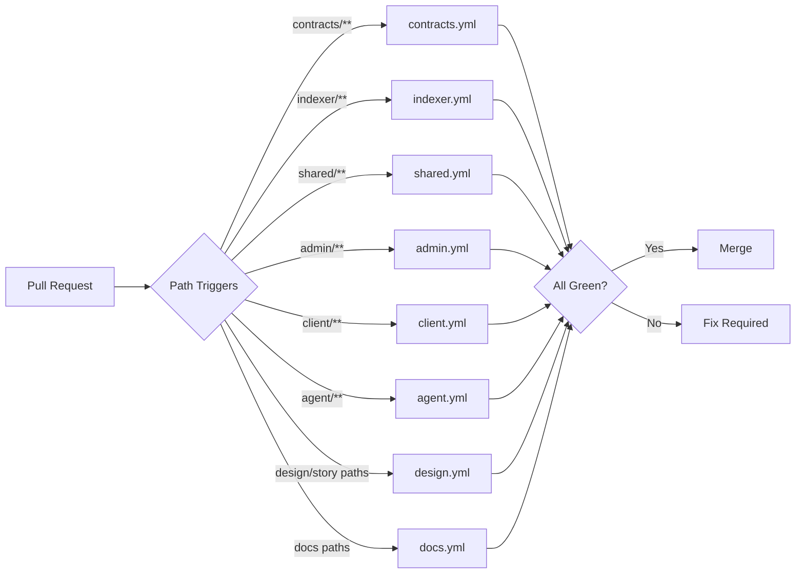

import {NextBestAction, StatusBadge} from "@site/src/components/docs";

# GitHub Actions

<StatusBadge status="Live" />

The CI/CD pipeline uses eight GitHub Actions lanes with path-based triggering and concurrency controls. Actions own deterministic execution: package tests/builds, CodeQL, focused Playwright projects, design/Storybook checks, docs deploy, trusted contract fork readiness, advisory Lighthouse jobs, and client/admin source-map uploads. Standalone Storybook publication is owned by Vercel, not a ninth Actions workflow.



## What It Checks

### Workflow Architecture

Each package has a dedicated lane, with design and docs as cross-cutting lanes:

| Workflow | Trigger Paths | Key Steps |
|----------|---------------|-----------|
| `contracts.yml` | `packages/contracts/**`, root deps/config, contract audit scripts | Foundry install, unit tests, lint, build, realism audit; fork readiness on trusted push/manual only |
| `indexer.yml` | `packages/indexer/**`, contract ABI/deployment/runtime paths | Boundary check, local Envio codegen, generated setup, Mocha tests, lint, build |
| `shared.yml` | `packages/shared/**`, root deps/config, CodeQL config, JS/TS/Actions security paths | Shared coverage, lint, and typecheck for shared-impacting changes; CodeQL for `javascript-typescript` and `actions` |
| `client.yml` | `packages/client/**`, `packages/shared/**`, focused Playwright paths, contract artifacts | Vitest coverage, lint/build, `client-ci` Playwright, manual Lighthouse advisory |
| `admin.yml` | `packages/admin/**`, `packages/shared/**`, focused Playwright paths, contract artifacts | Vitest coverage, lint/build, `admin-ci` Playwright, manual Lighthouse advisory |
| `agent.yml` | `packages/agent/**`, `packages/shared/**`, root deps/config | Vitest coverage, lint, typecheck, build |
| `design.yml` | DesignMD, Storybook, shared/admin/client UI surfaces | DesignMD checks, generated-token checks, vocabulary lint, story coverage/quality, Storybook smoke/build, optional Chromatic |
| `docs.yml` | `docs/**`, root dependency/config paths | Docusaurus build and trusted Pages deploy |

## How It's Configured

### Common Configuration

All workflows share these patterns:

#### Concurrency Control

```yaml
concurrency:
  group: ${{ github.workflow }}-${{ github.ref }}
  cancel-in-progress: true
```

This ensures only the latest push for a given branch runs, canceling stale builds.

#### Bun Setup

```yaml
- name: Setup Bun
  uses: oven-sh/setup-bun@v2
  with:
    bun-version: latest

- name: Install dependencies
  run: bun install --frozen-lockfile
```

`--frozen-lockfile` ensures CI uses the exact dependency versions from the lockfile. Bun setup is inline in every lane; there is no local composite Bun action.

#### Permissions

Workflows use minimal permissions (`contents: read` by default). Write permissions are added only where needed (deployment workflows, PR comment workflows).

### Contract Tests

The contracts lane has four jobs:

1. **`unit`** -- Unit tests with `bun run test` using the package script
2. **`lint-build`** -- Contract lint and build through package scripts
3. **`realism-audit`** -- Test-realism guardrail artifacts
4. **`fork-readiness`** -- Fork tests with a 90-minute timeout, requiring RPC URL secrets

Fork tests run against real chain state and use `foundry-rs/foundry-toolchain@v1` for Foundry installation. They do not run on pull requests, so fork PR CI does not depend on private RPC secrets.

### E2E Tests

The old standalone E2E workflow is retired. Browser CI is package-scoped:

- `client.yml` runs `playwright test --project=client-ci`
- `admin.yml` runs `playwright test --project=admin-ci`
- broader projects such as mobile, fork, passkey, and testnet stay manual through Playwright scripts

### Storybook CI

`design.yml` is triggered by changes to design files, Storybook config, story quality scripts, and component/view files in the UI packages:

```yaml
paths:
  - "packages/shared/src/components/**"
  - "packages/shared/.storybook/**"
  - "packages/admin/src/components/**"
  - "packages/client/src/components/**"
```

The Storybook/design gate runs `check:design-md`, `check:design-generated`, `check:design-tokens`, `lint:vocab`, `check:stories`, `check:story-quality`, `test:stories:ci`, and `build-storybook`. Chromatic publishes only when `CHROMATIC_PROJECT_TOKEN` is configured.

### Deployment Workflows

| Workflow | Purpose |
|----------|---------|
| `docs.yml` | Build Docusaurus and deploy Pages on trusted push/manual refs only |
| `client.yml` | Manual client Lighthouse advisory |
| `admin.yml` | Manual admin Lighthouse advisory |

Storybook publication is deliberately outside GitHub Actions. `design.yml` validates and uploads the Storybook artifact for PR review; the standalone public site is deployed by the Vercel project rooted at `packages/shared`, using `packages/shared/vercel.json` to build `@green-goods/shared` and serve `packages/shared/storybook-static`.

Client and admin PostHog source maps are handled by GitHub Actions, not Vercel project environment variables. The `client.yml` and `admin.yml` workflows upload source maps to the app-specific PostHog environment on trusted `main` pushes using GitHub secrets such as `POSTHOG_CLI_TOKEN` and the app environment ID. Vercel runs plain package builds only. `GG_ENABLE_SOURCEMAPS` is an upload-lane flag, not a durable frontend Vercel setting; current Vite source-map emission remains coupled to `SENTRY_AUTH_TOKEN` until the build config is decoupled.

## Running & Troubleshooting

### Adding a New Workflow

Do not add a new workflow file by default. First decide whether the work belongs in one of the eight lanes, a Claude routine, Copilot automatic review, or GitHub native review. A ninth workflow should require an explicit human-approved exception.

When changing a lane:

1. Use path-based triggers scoped to the package directory
2. Add concurrency control with `cancel-in-progress: true`
3. Set `permissions: contents: read` unless write access is needed
4. Use `bun install --frozen-lockfile` for reproducible installs
5. Run tests with `bun run test` (not `bun test`)

## Resources

- [Husky Git Hooks](./husky) -- Local quality gates that run before CI
- [Regression Testing](./regression) -- Regression strategy that CI enforces
- [Agentic Evaluation](./agentic-eval) -- Agent-powered review and guidance checks through routines/native review
- [Test Cases](./test-cases) -- Test case strategy behind the CI test suites
- [Playwright](../testing/playwright) -- E2E testing framework used by `client.yml` and `admin.yml`
- [Storybook](../testing/storybook) -- Component stories validated by `design.yml`
- [Forge](../testing/forge) -- Foundry testing used in `contracts.yml`

<NextBestAction
  title="Next best action"
  why="Review the builder glossary for quick definitions of terms used across these guides."
  actionLabel="Glossary"
  actionHref="/builders/glossary"
  alternatives={[
    {label: "Husky Git Hooks", href: "./husky"},
    {label: "Regression Testing", href: "./regression"},
  ]}
/>
