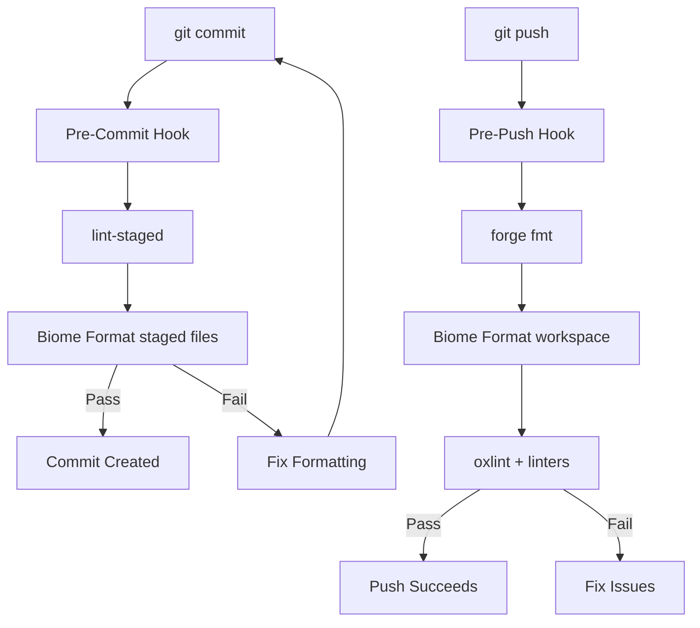

import {NextBestAction, StatusBadge} from "@site/src/components/docs";

# Husky Git Hooks

<StatusBadge status="Live" />

Git hooks enforce code quality gates before commits and pushes reach the repository. Husky manages hook scripts in the `.husky/` directory.



## What It Checks

Git hooks enforce formatting and linting standards on every commit and push. The pre-commit hook formats staged files with Biome, and the pre-push hook runs both formatting and linting across the workspace.

### What Hooks Do Not Cover

Hooks intentionally skip expensive operations:

- **Tests** are not run in pre-commit or pre-push (too slow for the feedback loop)
- **Type checking** is deferred to CI (cross-package type resolution requires full build)
- **Contract compilation** is not triggered (adaptive build handles this during development)

These checks run in CI via GitHub Actions workflows instead.

## How It's Configured

### Pre-Commit

The pre-commit hook runs `lint-staged` to format only staged files:

```bash
# .husky/pre-commit (simplified)
if command -v bun >/dev/null 2>&1; then
  bunx lint-staged
elif command -v npm >/dev/null 2>&1; then
  npx lint-staged
fi
```

`lint-staged` is configured in the root `package.json`:

```json
{
  "lint-staged": {
    "*.{js,jsx,ts,tsx,json}": [
      "npx @biomejs/biome format --write"
    ]
  }
}
```

This applies Biome formatting to all staged JavaScript/TypeScript/JSON files, excluding contract build artifacts (`packages/contracts/out/`).

### Pre-Push

The pre-push hook runs formatting and linting checks:

```bash
# .husky/pre-push (simplified)
$RUNNER format:contracts    # forge fmt
$RUNNER format              # biome format
$RUNNER lint                # oxlint + package linters
```

The pre-push hook auto-fixes formatting before checking lint. This ensures consistent formatting across the team without requiring developers to remember to run formatters manually.

### Shell Compatibility

Both hooks are written for POSIX `sh` compatibility with careful handling of edge cases:

- `set -eu` enables strict mode (exit on error, undefined variables)
- `pipefail` is enabled only if the shell supports it (dash does not)
- `nvm` sourcing only runs under bash (nvm is not POSIX-sh safe)
- `PATH` is prepended with `~/.bun/bin` and `~/.local/bin` to find bun in non-interactive shells

### Package Manager Detection

Hooks prefer `bun` but fall back to `npm`:

```bash
if command -v bun >/dev/null 2>&1; then
  RUNNER="bun run"
elif command -v npm >/dev/null 2>&1; then
  RUNNER="npm run"
else
  echo "Error: Neither bun nor npm found."
  exit 1
fi
```

## Running & Troubleshooting

### Hook Not Running

If hooks are not executing after a fresh clone:

```bash
bun install     # Husky install runs as a postinstall script
chmod +x .husky/pre-commit .husky/pre-push
```

### Biome Format Conflicts

If `lint-staged` fails because Biome disagrees with existing formatting:

```bash
bun format      # Run the full formatter to fix everything
git add -u      # Re-stage the fixed files
```

### Skipping Hooks

Hooks should not be skipped in normal development. If a hook is failing, investigate and fix the underlying issue rather than bypassing with `--no-verify`. The pre-commit hook only formats staged files, so failures typically indicate a genuine formatting or lint issue.

## Resources

- [GitHub Actions](./gh-actions) -- CI pipeline that runs the checks hooks intentionally skip (tests, type checking)
- [Regression Testing](./regression) -- Regression suites that complement local hook checks
- [Agentic Evaluation](./agentic-eval) -- How AI agents enforce quality alongside git hooks
- [Test Cases](./test-cases) -- Test case strategy and coverage targets

<NextBestAction
  title="Next best action"
  why="See the full CI/CD pipeline that runs tests, linting, and deployment on every push."
  actionLabel="GitHub Actions"
  actionHref="./gh-actions"
  alternatives={[
    {label: "Regression Testing", href: "./regression"},
    {label: "Agentic Evaluation", href: "./agentic-eval"},
  ]}
/>
