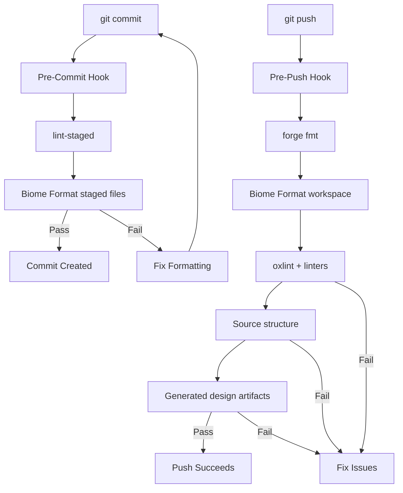

import {NextBestAction, StatusBadge} from "@site/src/components/docs";

# Husky Git Hooks

<StatusBadge status="Live" />

Git hooks enforce code quality gates before commits and pushes reach the repository. Husky manages hook scripts in the `.husky/` directory.


```mermaid
flowchart TD
    GC[git commit] --> PC[Pre-Commit Hook]
    PC --> LS[lint-staged]
    LS --> BF[Biome Format staged files]
    BF --> |Pass| Commit[Commit Created]
    BF --> |Fail| Fix[Fix Formatting]
    Fix --> GC
    GP[git push] --> PP[Pre-Push Hook]
    PP --> FC[forge fmt]
    FC --> BF2[Biome Format workspace]
    BF2 --> Lint[oxlint + linters]
    Lint --> SS[Source structure]
    SS --> DG[Generated design artifacts]
    DG --> |Pass| Push[Push Succeeds]
    Lint --> |Fail| Fix2[Fix Issues]
    SS --> |Fail| Fix2
    DG --> |Fail| Fix2
```

## What It Checks

Git hooks enforce formatting, linting, source-structure, and generated-artifact standards before changes reach the repository. The pre-commit hook formats staged files with Biome. The pre-push hook runs workspace formatting and linting, checks changed package source against the file-size and TypeScript boundaries, and verifies that generated design artifacts match their source.

### What Hooks Do Not Cover

Hooks intentionally skip expensive operations:

- **Tests** are not run in pre-commit or pre-push (too slow for the feedback loop)
- **Type checking** stays in the intent-aware validation selector and CI (cross-package type resolution requires full build)
- **Storybook smoke checks** stay in the intent-aware validation selector and CI
- **Contract compilation** is not triggered (adaptive build handles this during development)

The validation selector routes these checks to the appropriate package suites before CI repeats them.

## How It's Configured

### Pre-Commit

The pre-commit hook runs `lint-staged` to format only staged files:

```bash
# .husky/pre-commit (simplified)
command -v bun >/dev/null 2>&1 || exit 1
bunx lint-staged
```

`lint-staged` is configured in the root `package.json`:

```json
{
  "lint-staged": {
    "*.{js,jsx,ts,tsx,json}": [
      "bunx @biomejs/biome format --write"
    ]
  }
}
```

This applies Biome formatting to all staged JavaScript/TypeScript/JSON files, excluding contract build artifacts under `packages/contracts/.generated/`.

### Pre-Push

The pre-push hook runs formatting, linting, source-structure, and generated-design checks:

```bash
# .husky/pre-push (simplified)
$RUNNER check:foundry-version
$RUNNER format:check
$RUNNER format:contracts:check
$RUNNER lint
if git rev-parse --verify --quiet origin/develop >/dev/null; then
  SOURCE_STRUCTURE_BASE_REF="${SOURCE_STRUCTURE_BASE_REF:-origin/develop}" $RUNNER check:source-structure
else
  $RUNNER check:source-structure
fi
$RUNNER check:design-generated
```

The pre-push hook is non-mutating. When `origin/develop` exists, the source-structure check uses it as the default base while preserving a caller-supplied `SOURCE_STRUCTURE_BASE_REF`. In clones without that remote ref, it falls back to checking working-tree changes. When a check fails, the hook prints the formatting, linting, and design-generation recovery commands before retrying the push.

### Shell Compatibility

Both hooks are written for POSIX `sh` compatibility with careful handling of edge cases:

- `set -eu` enables strict mode (exit on error, undefined variables)
- `pipefail` is enabled only if the shell supports it (dash does not)
- `nvm` sourcing only runs under bash (nvm is not POSIX-sh safe)
- `PATH` is prepended with `~/.bun/bin` and `~/.local/bin` to find bun in non-interactive shells

### Package Manager Detection

Hooks require `bun`, matching the repository package-manager contract:

```bash
command -v bun >/dev/null 2>&1 || exit 1
RUNNER="bun run"
```

## Running & Troubleshooting

### Hook Not Running

If hooks are not executing after a fresh clone:

```bash
bun install     # Husky install runs as a postinstall script
chmod +x .husky/pre-commit .husky/pre-push
```

### Biome Format Conflicts

If `lint-staged` fails because Biome disagrees with existing formatting:

```bash
bun format      # Run the full formatter to fix everything
git add -u      # Re-stage the fixed files
```

### Skipping Hooks

Hooks should not be skipped in normal development. If a hook is failing, investigate and fix the underlying issue rather than bypassing with `--no-verify`. The pre-commit hook only formats staged files, so failures typically indicate a genuine formatting or lint issue.

## Resources

- [GitHub Actions](./gh-actions) -- CI pipeline that runs the checks hooks intentionally skip (tests, type checking)
- [Regression Testing](./regression) -- Regression suites that complement local hook checks
- [Agentic Evaluation](./agentic-eval) -- How AI agents enforce quality alongside git hooks
- [Test Cases](./test-cases) -- Test case strategy and coverage targets

<NextBestAction
  title="Next best action"
  why="See the full CI/CD pipeline that runs tests, linting, and deployment on every push."
  actionLabel="GitHub Actions"
  actionHref="./gh-actions"
  alternatives={[
    {label: "Regression Testing", href: "./regression"},
    {label: "Agentic Evaluation", href: "./agentic-eval"},
  ]}
/>
