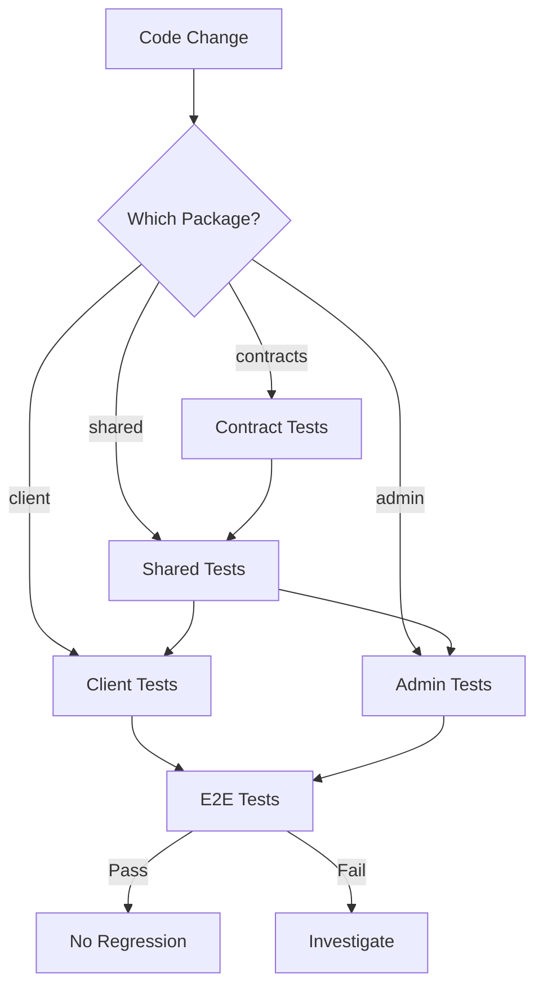

import {NextBestAction, StatusBadge} from "@site/src/components/docs";

# Regression Testing

<StatusBadge status="Live" />

Regression testing ensures that changes to one package do not break behavior in dependent packages. The monorepo's layered architecture makes this particularly important since shared hooks propagate to both client and admin.



## What It Checks

### Build-Order Validation

The build dependency chain (contracts -> shared -> indexer -> client/admin/agent) means regressions can cascade. The CI pipeline validates each layer independently:

1. **Contract tests** run first -- ABI changes are caught before downstream packages compile
2. **Shared tests** validate hooks and modules that both frontends depend on
3. **Client and admin tests** run in parallel, each testing their own components against the shared package
4. **E2E tests** validate full user flows across the stack

### Path-Based Triggering

Each CI workflow uses `paths` filters to only run when relevant files change. This avoids false confidence from skipped test suites -- if `packages/shared/**` changes, the shared, client, admin, and E2E workflows all trigger.

### Critical Paths

The following flows have dedicated regression coverage:

| Flow | Test Type | Location |
|------|-----------|----------|
| Work submission | E2E (mock) | `tests/specs/client.work-submission.ci.spec.ts` |
| Work approval | E2E (mock) | `tests/specs/client.work-approval.ci.spec.ts` |
| Offline sync | E2E (mock) | `tests/specs/client.offline-sync.ci.spec.ts` |
| Garden creation | Workflow test | `packages/admin/src/__tests__/workflows/` |
| Authentication | E2E | `tests/specs/client.auth.spec.ts` |
| Contract deployment | Fork test | `packages/contracts/test/fork/` |

#### Mock-Based CI Tests

Specs ending in `.ci.spec.ts` use lightweight mocks instead of real infrastructure. These run on every PR and catch UI regressions without the overhead of blockchain interaction or indexer queries.

## How It's Configured

### Contract Regression

#### Test Realism Audit

The contracts package includes audit scripts that verify test quality:

```bash
# Check test realism (advisory mode)
cd packages/contracts && bun run test:audit:realism

# Full audit (realism + coverage)
cd packages/contracts && bun run test:audit:full
```

The realism audit checks that tests use realistic parameters, proper mock implementations, and don't rely on behaviors that differ between test and production environments.

#### ABI Compatibility

When a contract interface changes, the `build:abis` script regenerates ABI JSON files consumed by the shared package. Forgetting this step causes type errors in downstream hook tests -- a common regression vector.

### Hook Regression

Shared hooks have extensive test coverage in `packages/shared/src/__tests__/hooks/`. The test structure mirrors the source tree:

```
__tests__/hooks/
  action/       # useActionForm, useFilteredActions
  app/          # useCarousel, useTheme, useInstallGuidance
  assessment/   # useAssessmentDraft, useAssessmentForm
  blockchain/   # useContractTxSender, useBaseLists, prefetch
  conviction/   # useConvictionHooks, useGardenCommunityAndPools
  garden/       # useCreateGardenForm, useGardenDraft, useGardenTabs
  work/         # useDrafts, useMyWorks, useWorkMutation
  ...
```

Each hook test validates query keys, enabled conditions, error paths, and queryFn delegation. Adding a new hook requires a corresponding test file in this structure.

## Running & Troubleshooting

```bash
# Full monorepo test suite
bun run test

# Per-package regression
cd packages/shared && bun run test
cd packages/admin && bun run test
cd packages/contracts && bun run test

# Critical path E2E (mock-based, fast)
npx playwright test --project=critical-path
```

## Resources

- [Agentic Evaluation](./agentic-eval) -- How AI agents are evaluated for quality in QA workflows
- [Test Cases](./test-cases) -- Test case strategy and coverage targets
- [GitHub Actions](./gh-actions) -- CI pipeline that runs regression suites automatically
- [Vitest](../testing/vitest) -- Unit testing framework used for hook and component tests
- [Playwright](../testing/playwright) -- E2E testing framework for critical path specs
- [Forge](../testing/forge) -- Foundry testing for contract regression

<NextBestAction
  title="Next best action"
  why="Learn how AI agents are evaluated for quality in the Green Goods QA workflow."
  actionLabel="Agentic Evaluation"
  actionHref="./agentic-eval"
  alternatives={[
    {label: "Test Cases", href: "./test-cases"},
    {label: "GitHub Actions", href: "./gh-actions"},
  ]}
/>
