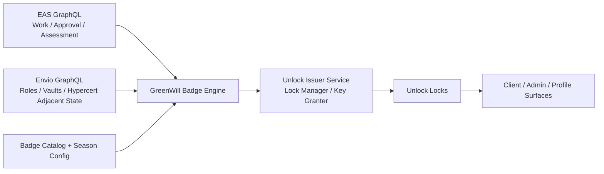

# GreenWill Badging + GIF Analysis

## Executive Summary

Green Goods already has the right primitives for a meaningful badge system:

- durable contribution records through EAS work attestations
- review and trust signals through work approvals
- strategic and evaluative depth through assessments
- role identity through Hats Protocol
- impact assetization through Hypercerts
- capital participation through Octant vault flows

What it does **not** have today is a live badge stack. The repository contains a partial `UnlockModule`, but Unlock is not wired into the deployed contract graph, the shared app config, the indexer, or the current user-facing flows. The docs also still describe badges as planned.

The strongest near-term move is:

- use **Unlock Protocol for recognitions and credentials**
- keep **Hats for permissions**
- keep **Hypercerts for impact assets**
- treat **GreenWill** as the cross-cutting reputation and badge layer that sits above those systems
- mint **network-wide GreenWill badges canonically on Celo**, while preserving provenance for activity that happened on Arbitrum or other supported source chains
- add a minimal **on-chain GreenWillRegistry** early, instead of waiting for a later phase
- launch a **recognition-first** badge system in the next two weeks
- defer **governance-weighted badge power** until the sybil, fairness, and weighting model is much clearer

The repo is close enough that this can be specified cleanly now, but not close enough that it should be implemented as a single onchain “approve work and mint badge in the same flow” path for V1.

My recommendation is to launch V1 with an **asynchronous badge issuer** that watches Green Goods data sources and grants Unlock keys automatically. That fits the current architecture better, preserves non-blocking approvals, and gets you to first badges faster.

---

## Companion Docs

This document is the full architecture and strategy reference.

The companion docs are:

- [GreenWill One-Pager](/builders/specs/greenwill-gif-one-pager-2026-03)
- [GreenWill Implementation Spec](/builders/specs/greenwill-gif-implementation-spec-2026-03)
- [GreenWill Evaluation Plan](/builders/specs/greenwill-gif-evaluation-plan-2026-03)

Use them this way:

- read the **one-pager** for the shareable overview
- read the **implementation spec** for the package-by-package backlog
- read the **evaluation plan** for test gates, acceptance criteria, and pilot assessment

---

## What This Analysis Covered

### Attached strategy and framework documents

- `Greenpill Impact Framework Development`
- `Greenpill Impact Framework: The Fractal Y2I Architecture`
- `x-daoip-5`
- `House of Alignment`
- `DIVAD-Greenpill Strategic Analysis`
- `Greenpill Strategy & ToC Workshop`
- `GreenPill Garden Evolution`
- community chat notes from March 17, 2026
- product sync notes from March 18, 2026

### Repository surfaces reviewed

- contracts and deployment registry
- EAS resolvers and attestation schemas
- assessment and work workflows in shared/client packages
- Envio indexer schema and config
- docs pages for badges, recognition, Unlock, and roadmap
- power registry and Gardens governance primitives

### External sources checked

- official Unlock Protocol docs
- official Octalysis overview

---

## The GIF Lens: What The Badge System Should Actually Do

The attached Greenpill Impact Framework (GIF) documents make one thing very clear: Green Goods is not trying to build a generic loyalty program. It is trying to build a regenerative verification and coordination layer.

That means badges should do four jobs:

- make contribution **visible**
- make progress **felt**
- make trust **portable**
- make the impact cycle **legible**

### Use the GIF “3s” as the badge logic

The framework repeatedly centers:

- **Purpose**
- **Practice**
- **Progress**

This maps cleanly to badges:

| GIF axis | What the badge should recognize | Example badge family |
|---|---|---|
| Purpose | alignment, commitment, entry into a season, role acceptance | seasonal commitment, operator stewardship |
| Practice | actual behavior inside MDR and domain work | first submission, first approval, domain badge |
| Progress | outcomes, funding, assessments, impact asset creation | assessment author, funder, harvest badges |

### Use the GIF “4s” as the seasonal design language

The framework’s seasonal structure is one of the strongest opportunities in the whole system:

- **Soil**: strategy and governance
- **Roots**: structure and staking
- **Growth**: work execution and CIDS capture
- **Harvest**: Hypercerts, yield, reporting, retrospective

This should not only be copy or artwork. It should be a real badge grammar:

- onboarding and commitment badges can carry **Soil**
- role and support badges can carry **Roots**
- work and domain badges can carry **Growth**
- outcome, funding, and hypercert badges can carry **Harvest**

That gives the system an internal logic that is much more “Greenpill” than a flat list of achievements.

### The notes point to a very specific emotional goal

The March 17, 2026 community notes were especially useful here. The repeated theme was not “how do we maximize token incentives?” It was closer to:

- start with a few easy badges
- cheer people on
- make it feel more like a running app or Duolingo than a grant backend
- keep it automatic, not manual
- use domain and seasonality, but do not overcomplicate V1

That is the right instinct. Early badges should create a sense of:

- “I showed up”
- “my work was seen”
- “I belong here”
- “I’m moving through a real cycle”

Not:

- “I gamed the system”
- “I farmed points”
- “I now have governance power because I spammed uploads”

---

## Current-State Repo Audit

## 1. The core impact stack is already real

Green Goods already has a coherent contribution pipeline:

- `WorkResolver` validates work submissions through EAS
- `WorkApprovalResolver` validates approvals and keeps Karma GAP integration non-blocking
- `AssessmentResolver` and the client workflow support more strategic garden-level reporting
- Hypercerts are already treated as the asset layer
- Hats already define role-based permissions
- Octant infrastructure already models funder participation and yield routing

The practical implication is important:

**you do not need to invent badge triggers from scratch.** The protocol already emits the events and attestations that a badge engine wants.

## 2. Unlock exists in contracts, but not as a live product path

The repo already contains:

- `packages/contracts/src/modules/Unlock.sol`
- `packages/contracts/src/interfaces/IUnlock.sol`
- unlock fields in the deployment registry ABI and config surfaces

The current contract model is:

- one lock per garden
- badge issuance on approved work
- non-blocking intent at the module level

That is a useful starting point, but it is not the best topology for the first GreenWill badge system.

Why:

- it models badges as **garden-local**
- it is tied mainly to **work approval**
- it does not express **badge families**, **seasons**, or **cross-garden user reputation**
- it is not wired into the current deployment and UI stack

## 3. The deployment and app surfaces still treat Unlock as absent

The deployment registry reserves future fields for:

- `integrationRouter`
- `unlockFactory`
- `greenWillRegistry`

But the test deployment base still writes `address(0)` for the Unlock-related fields, and the live deployment artifacts do not expose an Unlock module address.

The shared blockchain config exposes:

- `gardenToken`
- `actionRegistry`
- `workResolver`
- `workApprovalResolver`
- `deploymentRegistry`
- `octantModule`
- `octantFactory`
- `hatsModule`
- `karmaGAPModule`

It does **not** expose an Unlock badge module or GreenWill registry.

## 4. The indexer boundary matters

The current data architecture is split:

- Envio indexes core contract state such as gardens, hats, vaults, and hypercert events
- EAS attestations are queried directly from EAS GraphQL

That means badge triggers already span **two sources of truth**:

- EAS for work, approvals, and assessments
- Envio for roles, vault participation, and hypercert-adjacent flows

This is a strong argument against a rushed “all badge logic inside one resolver” approach for V1.

## 5. The docs and models have drift that matters for badging

### Domain drift

The public docs describe **four action domains**.

The on-chain and shared code currently model only **four**:

- Solar
- Agro
- Education
- Waste

That means:

- domain badges can be launched safely for the four coded domains
- a mutual-credit badge should **not** be presented as part of the first canonical badge system unless the domain model is expanded first

### Capital-language drift

The public narrative around the 8 forms of capital is conceptually strong, but the labels are not perfectly normalized across all surfaces. That does not block V1 badges, but it does matter if later badges reference capital classes directly in metadata, art, or governance formulas.

---

## Strategic Recommendation

### Separate the three layers clearly

| Layer | Recommended primitive | What it should do |
|---|---|---|
| Permissions | Hats Protocol | who can do what |
| Recognitions / credentials | Unlock Protocol + GreenWill | what a person or garden has earned |
| Impact assets / finance | Hypercerts + Octant | what value has been certified or funded |

This separation is the cleanest way to avoid turning badges into a muddled mix of:

- access control
- status theater
- governance power
- financial claims

### Define GreenWill as the reputation layer, not just “some NFTs”

GreenWill should be the policy layer that answers:

- which badges exist
- what they mean
- whether they are permanent or seasonal
- which event sources can issue them
- whether they are display-only or ever contribute to governance later

Unlock is the credential substrate. GreenWill is the meaning system.

---

## Recommended Badge Taxonomy

## 1. Genesis participant badges

Purpose:

- recognize the first season cohort
- create cultural memory for the network
- mark the users who helped shape GreenWill before it was mature

These are not just onboarding badges. They are origin badges.

The right first form is a **role-specific Genesis family**:

- `participant.genesis.gardener.s1`
- `participant.genesis.operator.s1`
- `participant.genesis.evaluator.s1`
- `participant.genesis.community.s1`
- `participant.genesis.funder.s1`

For the immediate launch cohort, the first active variants are likely:

- Genesis Gardener
- Genesis Operator

Because the initial audience is mostly a mix of gardeners and operators, with substantial overlap between those roles.

## 2. Starter badges

Purpose:

- fast encouragement
- onboarding momentum
- visible proof of first actions

These should be the first badges people see.

## 3. Domain badges

Purpose:

- recognize real work inside each Green Goods domain
- give each domain a visible identity
- support domain-specific cadence without flattening everything into one generic streak

## 4. Role and stewardship badges

Purpose:

- acknowledge operators, evaluators, and funders
- make care work and coordination visible
- give the system social depth beyond work upload counts

## 5. Seasonal badges

Purpose:

- make participation time-bounded and narratively legible
- create collectibility without relying on artificial scarcity alone
- keep the platform feeling alive across cycles

Seasonal badges should use a **dual-state model**:

- they can expire as an **active** credential
- they remain permanently visible as a **historical** credential

That means a holder can still prove they earned a season badge even after its active season has ended.

## 6. Garden badges

Purpose:

- recognize collective achievement
- make garden-level identity visible
- support healthy inter-garden comparison later

These are useful, but they should come after individual badges are stable.

## 7. Outcome and harvest badges

Purpose:

- connect verified work to the funding and impact layer
- recognize successful assessments, hypercert creation, and funder support

These are strategically important, but they should remain smaller in number than work and stewardship badges.

---

## Recommended V1 Badge Set

The next launch window should stay small and legible, but it now needs enough room for the Genesis cohort. I would launch **11-12 badge classes max**.

### V1 core badge classes

| Badge class ID | Working display name | Audience | Trigger | Why it belongs in V1 |
|---|---|---|---|---|
| `participant.genesis.gardener.s1` | Genesis Gardener | Gardener | qualified participation in the first live season cohort | commemorates the first cohort and supports the Celo/Unlock launch story |
| `participant.genesis.operator.s1` | Genesis Operator | Operator | qualified participation in the first live season cohort | distinguishes founding coordination labor from general participation |
| `starter.first_submission` | First Seed | Gardener | first valid work submission attested | instant onboarding reward |
| `starter.first_approval` | Verified Sprout | Gardener | first approved work | strongest early “my work mattered” signal |
| `practice.first_assessment` | Reflection Steward | Operator / Evaluator | first assessment authored | ties badges to strategy, not just activity |
| `support.first_support` | Root Backer | Funder | first qualifying support action: vault deposit, cookie jar funding, or hypercert purchase | creates one clear entry badge for supporters across multiple support surfaces |
| `domain.solar.v1` | Solar Steward | Gardener | threshold of approved solar work | gives Solar identity immediately |
| `domain.agro.v1` | Agro Steward | Gardener | threshold of approved agro work | supports slower ecological work |
| `domain.edu.v1` | Learning Steward | Gardener | threshold of approved education work | makes Education visible, not secondary |
| `domain.waste.v1` | Circular Steward | Gardener | threshold of approved waste work | strong fit for visible community action |
| `role.operator.season` | Season Steward | Operator | active operator for the season with review minimum | acknowledges coordination labor |
| `role.evaluator.season` | Verification Steward | Evaluator | active evaluator contribution during the season | keeps evaluator reputation distinct from operator reputation |

### What I would intentionally leave out of the first launch

- leaderboards
- streak-heavy mechanics
- cross-garden rank ladders
- badge-based voting power
- garden competition mechanics
- too many social “engagement” badges

Those can all wait.

---

## Domain Badge Rules: Default Cadence Recommendations

The meeting notes were right to surface cadence differences. Domain badges should not all use the same threshold.

### Default V1 rule recommendations

| Domain | Default V1 rule | Why |
|---|---|---|
| Solar | 3 approved actions | generally discrete, repeatable, faster feedback loops |
| Waste | 3 approved actions | discrete, observable, high-frequency work |
| Education | 2 approved actions or one mini-series | education is cyclical but often event-based |
| Agro | 2 approved actions across at least 21 days | slower biological cycles and longer evidence windows |

These should be treated as:

- initial defaults
- stored as offchain config in V1
- revisited after gardener survey feedback

The survey idea from the call notes is correct and should happen before Q2 expansion.

---

## Unlock Topology: What Kind Of Locks To Use

The review feedback sharpens this section considerably:

**GreenWill should use one lock per badge class.**

That includes:

- permanent one-off badge classes
- role-specific Genesis classes
- seasonal classes that renew each cycle

In other words, a renewed seasonal badge is not “the same lock rolling forward.” It is a **new badge class for the new cycle**.

## Recommended topology: one lock per badge class

Example:

- one lock for `participant.genesis.gardener.s1`
- one lock for `starter.first_approval`
- one lock for `domain.solar.v1`
- one lock for `role.operator.season.q2_2026`

### Pros

- very clean analytics
- easy to show on profiles
- simple to reason about in UI
- badge meaning stays consistent across the network
- works cleanly with network-wide GreenWill identities
- makes Celo the canonical badge layer without fragmenting badge meaning by garden or source chain

### Cons

- more contracts than a single monolithic lock
- requires a canonical registry to keep class-to-lock mappings clear

### Verdict

**Best option for GreenWill overall.**

The key implementation detail is not “hybrid topology.” It is **class discipline**:

- each badge class gets its own lock
- seasonal renewals become new class IDs
- all classes are registered canonically in GreenWillRegistry

This gives the cleanest mix of legibility, portability, and historical clarity.

---

## Canonical Chain Strategy

The campaign brief and current deployment state both point toward the same answer:

- **Celo should be the canonical GreenWill mint chain**
- Green Goods activity can still originate on **Arbitrum or Celo**
- GreenWill badges remain **network-wide**, not chain-specific

This avoids a fragmented identity layer where a user’s reputation is scattered across multiple chains.

### Recommended chain model

| Layer | Recommended chain strategy |
|---|---|
| GreenWill registry | Celo canonical |
| Unlock badge locks | Celo canonical |
| Badge source events | Arbitrum and Celo initially, plus any future supported source chain |
| Hypercert marketplace-derived badges | source-chain aware; mint to Celo even if purchase occurs elsewhere |

### Why Celo should be canonical

- it fits the Celo x Unlock x Green Goods launch narrative
- it creates one public badge surface for users and partners
- Celo is already a supported Green Goods production chain
- most of the Green Goods stack can be deployed or mirrored there, even if the Hypercert marketplace is still the exception

### How cross-chain attribution should work

A badge minted on Celo should still encode where the underlying action happened.

Every proof surface should include:

- `mintChainId`
- `sourceChainId`
- `sourceType`
- `sourceRef`
- `sourceTxHash` or attestation UID where applicable

That preserves truth without forcing the badge itself to live on the source chain.

### Recommended source types

- `eas.work`
- `eas.workApproval`
- `eas.assessment`
- `vault.deposit`
- `cookieJar.deposit`
- `hypercert.purchase`

---

## Recommended Technical Architecture

## V1 architecture: asynchronous issuer

This is the cleanest fit for the repo as it exists today.



### Why this is the right V1 choice

- it matches the current split between EAS data and Envio data
- it keeps work approval non-blocking
- it avoids contract rewiring across multiple packages in the first badge launch
- it supports automatic badge appearance without manual mint links
- it is easier to make idempotent and observable

### V1 components

| Component | Responsibility |
|---|---|
| GreenWillRegistry | canonical badge class registry on Celo; maps class IDs to lock addresses, season metadata, role families, status behavior, and provenance schema |
| Badge catalog | canonical badge class definitions, names, family, domain, seasonality, rule config, metadata CID |
| Season config | canonical season IDs, dates, labels, Soil/Roots/Growth/Harvest mapping |
| Badge engine worker | reads EAS + Envio, evaluates badge rules, prevents duplicate awards |
| Unlock issuer | grants keys on Celo to recipients using lock-manager or key-granter authority |
| Badge read adapter | reads wallet badge holdings for profile display |
| UI surfaces | shows earned badges, upcoming badges, and earn moments |

### V1 data sources

| Trigger type | Best source |
|---|---|
| first work submitted | EAS work attestations |
| approved work | EAS work approvals |
| first assessment | EAS assessments |
| role-based stewardship | Envio Hats events plus EAS review counts |
| first support | vault deposits, cookie jar deposits, and hypercert purchases where supported |
| genesis cohort qualification | allowlist or season roster backed by GreenWillRegistry plus role snapshots |

### V1 idempotency rule

For each badge award, the engine should treat the tuple below as canonical:

- recipient
- badge class ID
- season ID if applicable
- source chain fingerprint where the class is source-derived

That avoids duplicate mints when jobs are re-run or data is backfilled.

---

## Why I Would Not Use The Current UnlockModule As-Is For V1

The existing module is useful conceptually, but I would not make it the center of the first release.

### Reasons

- it assumes garden-centric locks
- it is focused mainly on work approval
- it is not wired into the deployed app surfaces
- the current interface should be revalidated against current Unlock factory guidance before production use
- the badge engine needs to combine EAS and Envio state anyway

### Better use of the current module

Treat the existing module as:

- a reference implementation
- a future onchain path for garden-local credentials
- a candidate for `UnlockBadgeModuleV2` after the badge catalog and season model are stable

---

## GreenWill Contract Direction

You asked specifically what the contract path could look like in Solidity. I would phase it.

## Phase 1: minimal on-chain GreenWill registry required

The review feedback makes this more concrete:

- GreenWill should launch with a lightweight on-chain `GreenWillRegistry`
- the registry should live on Celo
- Unlock locks should be registered against badge class IDs there

That gives the system a canonical source of truth early, instead of waiting for a later “registry phase.”

### Proposed responsibility of `GreenWillRegistry`

- register badge classes
- map badge class IDs to lock addresses
- map badge classes to family, domain, and seasonality
- map badge classes to role variants
- record whether a badge is permanent, seasonal-history, or active-until-expiry
- expose metadata CIDs and current season config
- store canonical mint-chain and provenance schema expectations
- emit canonical badge-class events for indexers and UIs

### Example sketch

```solidity
struct BadgeClass {
    bytes32 classId;
    address lock;
    bytes32 family;
    uint8 domain;      // optional
    uint8 role;        // optional
    bool seasonal;
    bool activeExpires;
    string metadataCID;
}

function registerBadgeClass(BadgeClass calldata badgeClass) external;
function setSeason(bytes32 seasonId, uint64 start, uint64 end, string calldata metadataCID) external;
function getBadgeClass(bytes32 classId) external view returns (BadgeClass memory);
```

## Phase 2: optional on-chain issuer module

Later, if you want tighter contract-native flows, add an `UnlockBadgeModuleV2` or `GreenWillIssuer` that:

- is authorized by governance
- emits canonical `BadgeIssued` events
- can be called by approved routers or relayers
- optionally integrates with the registry

### Example event shape

```solidity
event BadgeIssued(
    address indexed recipient,
    bytes32 indexed classId,
    bytes32 indexed seasonId,
    address garden,
    bytes32 sourceRef
);
```

That event shape is valuable because it gives the indexer a clean, protocol-owned surface independent of raw Unlock events.

## Phase 3: optional governance adapter

The repo’s `UnifiedPowerRegistry` already supports ERC-721 sources for power calculations. That means GreenWill badges could eventually contribute to governance.

I would explicitly **not** do that in V1.

Only consider it later if all of the following are true:

- sybil resistance is stronger
- badge quality rules are stable
- the team has decided which badges represent trust and not just participation
- fairness across domains has been tested

---

## Unlock-Specific Recommendations

## 1. Use Unlock as the credential layer, not the rules engine

Unlock is excellent for:

- issuing recognizable credentials
- wallet-visible badge ownership
- manager and granter roles
- future token-gated community experiences

It should not be forced to also be:

- the entire badge policy engine
- the seasonal configuration system
- the cross-source data reconciler

## 2. Keep badge minting automatic

The notes were clear that this should feel more like Discord role assignment than a manual mint claim.

So the user flow should be:

1. a valid event happens
2. the badge engine detects it
3. the issuer grants the key
4. the app surfaces the badge automatically

No claim links. No “go mint your reward” as the default path.

## 3. Use static metadata first, dynamic hooks later

Unlock supports hooks, including `tokenURI`-style customization. That is useful, but it is not necessary for the first launch.

### V1 metadata recommendation

- pre-generate SVG or PNG assets from a modular template system
- upload badge metadata and images to IPFS
- attach static metadata per badge class or seasonal badge lock

### V2 metadata recommendation

Use hooks only if you later want:

- dynamic seasonal visuals
- richer token attributes
- custom external proof pages

## 4. Revalidate the factory interface before production wiring

The repo currently models a minimal factory around `createLock(bytes,uint16)`.

Official Unlock docs currently emphasize upgradeable lock deployment paths and current access-control roles. Before deploying any production GreenWill contract that creates locks directly, the factory interface and deployment assumptions should be checked against the current Unlock production docs and target-chain contracts.

---

## Visual System Recommendation

The art discussion in the community notes was one of the strongest parts of the inputs.

The right design constraint is:

**build a badge system as a modular language, not a collection of one-off illustrations.**

## Core badge template layers

| Layer | Meaning | Should change often? |
|---|---|---|
| Base frame | badge family | no |
| Background field | domain color or seasonal context | yes |
| Center glyph | core badge meaning | yes |
| Role marker | gardener / operator / evaluator / funder / garden | yes |
| Seasonal ribbon | Soil / Roots / Growth / Harvest or season label | yes |
| Progress pips | level or tier if used | sometimes |
| Texture / ornament | rarity or prestige | rarely |

## Recommended visual grammar

### Domain colors

Use the current protocol palette first:

- Solar: amber / gold
- Agro: green
- Education: blue
- Waste: orange

Do not invent a fifth mutual-credit badge palette until the domain model is canonical.

### Family shapes

Keep family distinction structural:

- starter badges: circles or seeds
- domain badges: shields or petals
- stewardship badges: hexes or pillars
- funder badges: rings or roots
- seasonal badges: banded tokens with ribbons

### Seasonal overlay

Use a consistent seasonal visual marker:

- Soil: earth base / darker grounding tone
- Roots: line-work, lattice, subterranean pattern
- Growth: upward leaves / rays / motion
- Harvest: fruiting accent / crown / burst

### Badge naming rule

Keep internal IDs stable and poetic names flexible.

For example:

- class ID: `starter.first_approval`
- display name: `Verified Sprout`

That lets you evolve naming and marketing without contract churn.

---

## Metadata Template Recommendation

Every badge metadata object should at minimum include:

```json
{
  "name": "Verified Sprout",
  "description": "Awarded for receiving your first approved work attestation in Green Goods.",
  "image": "ipfs://...",
  "external_url": "https://...",
  "attributes": [
    { "trait_type": "Family", "value": "Starter" },
    { "trait_type": "Domain", "value": "None" },
    { "trait_type": "Role", "value": "Gardener" },
    { "trait_type": "Seasonal", "value": "No" },
    { "trait_type": "Source", "value": "EAS Work Approval" },
    { "trait_type": "Version", "value": "V1" }
  ]
}
```

### Recommended additional fields for GreenWill proof pages

- source attestation UID or transaction hash
- garden address or garden slug
- season ID
- issue timestamp
- badge class ID
- domain
- role

Those do not all need to live in the onchain token metadata itself, but they should exist in the proof surface.

---

## UI Surface Recommendation

Badges should not live in a hidden profile tab only.

### Highest-value UI surfaces for V1

- post-approval success state
- work dashboard profile header
- garden participant cards
- funder profile / funding dashboard
- operator and evaluator profile summaries

### Best immediate dopamine surface

After a badge is issued, show:

- a lightweight earned-badge modal or toast
- badge art
- one-sentence explanation
- optional proof link

That is the product moment the community notes were pointing toward.

---

## Octalysis Guidance For GreenWill

Octalysis is useful here, but only if it is used carefully.

The strongest badge system for Green Goods should emphasize the “white hat” side of motivation:

- **Epic Meaning & Calling**: “This work matters”
- **Development & Accomplishment**: “I am progressing”
- **Ownership & Possession**: “This is part of my impact portfolio”
- **Social Influence & Relatedness**: “My community can see my contribution”

### Best fit for Green Goods

| Octalysis drive | How it should show up in Green Goods |
|---|---|
| Meaning | badges tied to regenerative service, not generic gamification |
| Accomplishment | quick starter wins and visible domain progression |
| Ownership | portable onchain badge history |
| Social influence | profile display, garden display, recognition of operators and funders |
| Creativity / feedback | earned moments tied to real review and reflection |

### Implementing Octalysis by journey phase

The official Octalysis framework also describes four journey phases:

- Discovery
- Onboarding
- Scaffolding
- Endgame

That is a strong fit for GreenWill.

| Journey phase | GreenWill product move | Primary drives |
|---|---|---|
| Discovery | Celo campaign framing, “building good things,” visible Genesis cohort, season identity | Meaning, Social influence, Unpredictability |
| Onboarding | first submission, first approval, first support, quick earned moments | Meaning, Accomplishment, Empowerment |
| Scaffolding | domain badge progress, role-separated paths, proof pages, favorites, active seasonal status | Accomplishment, Ownership, Social influence |
| Endgame | stewardship badges, composite credentials, season archive, pilot badge progression, contribution to registry/rule design | Meaning, Ownership, Creativity, Social influence |

### Eight-core-drive implementation sketch

| Core drive | GreenWill implementation direction |
|---|---|
| Epic Meaning & Calling | Genesis cohort framing, regenerative mission language, “building good things” narrative |
| Development & Accomplishment | starter badges, domain progress, role paths, visible thresholds |
| Empowerment of Creativity & Feedback | pilot badges, choose-one paths, contribution to rule design, garden-specific experimentation before canonization |
| Ownership & Possession | favorites, badge portfolio, detailed proof pages, historical season archive |
| Social Influence & Relatedness | badge display on profiles and gardens, role distinction, cohort identity, builder/researcher participation |
| Scarcity & Impatience | limited Genesis windows, seasonal palettes, time-boxed campaigns used lightly |
| Unpredictability & Curiosity | earned-badge reveals, seasonal drops, pilot badge discovery, selective surprise moments |
| Loss & Avoidance | seasonal active status can expire while the badge remains historically held; countdowns only where they clarify, not manipulate |

### Octalysis guardrails

GreenWill should stay mostly on the white-hat side of Octalysis.

That means:

- use Scarcity to make seasons special, not to pressure people constantly
- use Loss/Avoidance mainly through expiring **active status**, not through badge deletion
- prioritize mission, accomplishment, and belonging over obsession loops

This is especially important because Green Goods is a regenerative coordination system, not a pure consumer retention product.

### What to avoid

- overusing streak pressure
- fake scarcity for its own sake
- issuing too many badges too early
- rewarding raw submission volume over verified quality
- turning badges into social comparison before users have basic wins

Green Goods is closer to a trust-and-care system than a casino. Octalysis can help shape motivation, but it should not overpower the regenerative ethos.

---

## Metrics That Matter

If GreenWill launches, I would watch these first:

| Metric | Why it matters |
|---|---|
| first-badge rate | are new users getting early positive feedback? |
| approval-to-badge latency | does the experience feel immediate enough? |
| badge display rate | are users actually seeing and sharing badges? |
| domain badge completion by domain | are thresholds fair across domains? |
| 30-day return after first badge | are badges helping retention? |
| operator season-badge attainment | are stewardship badges actually reachable? |
| first-deposit to repeat-deposit rate | do funder badges reinforce support? |

### Metrics I would not over-index on initially

- total badge count minted
- leaderboard density
- badge rarity theater

Those can look healthy while the actual system still feels flat or unfair.

---

## Phased Roadmap

## Phase 0: V1 launch window

### March 19, 2026 to early April 2026

Goal: launch the first real badge system without blocking the rest of v1 beta.

### Scope

- finalize badge catalog for 11-12 classes
- define season object for the current cycle
- deploy a minimal `GreenWillRegistry` on Celo
- create Celo Unlock locks for permanent and seasonal V1 badge classes
- implement cross-chain attribution fields for source events coming from Arbitrum or Celo
- include Genesis role variants for gardeners and operators
- ship asynchronous issuer design
- expose badge display on at least one core user surface
- ship “earned badge” feedback moment

### Explicit non-goals

- governance weighting
- fully generalized GreenWill contract system
- garden-level competition
- dynamic metadata hooks
- mutual-credit badge family

## Phase 1: Q2 expansion

### April 1, 2026 to June 30, 2026

Goal: make GreenWill feel like a real reputation layer.

### Scope

- add garden-level badges
- add more funder and operator badges
- normalize season handling
- add better badge browsing and filtering
- add Unlock event indexing or a badge cache layer
- add `GreenWillRegistry` if the team wants onchain catalog ownership
- test proof pages and badge sharing

## Phase 2: post-Q2 maturity

Goal: connect GreenWill to deeper protocol logic carefully.

### Scope

- potential governance adapter
- cross-garden trust weighting experiments
- capital-sensitive or impact-sensitive badges
- tokenURI or metadata hooks for dynamic traits
- partner-facing reputation views for funders and evaluators

---

## Risks And Anti-Patterns

## 1. Overbadging

If too many badges appear too quickly, none of them feel meaningful.

## 2. Quantity over quality

If the system rewards uploads more than verified impact, behavior will drift toward spam.

## 3. Domain unfairness

Agro and Education work often operate on slower cycles than Waste or Solar. Flat thresholds will distort behavior.

## 4. Permission confusion

If Hats and GreenWill overlap semantically, users will not understand whether a badge is symbolic or authoritative.

## 5. Governance capture too early

If badges become voting power before the trust model is mature, the system will be easy to game and hard to defend.

## 6. Model drift

If public docs say five domains but the protocol enforces four, badge claims will confuse users and create edge cases in metadata and UI.

## 7. Protocol brittleness

If badge issuance sits directly on the critical work approval path too early, unrelated protocol failures will become user-facing friction.

---

## Decisions I Would Make Now

1. GreenWill V1 is a **recognition layer**, not a governance layer.
2. Celo is the **canonical GreenWill mint chain**.
3. GreenWill badges are **network-wide badges**, even when they are triggered by activity on Arbitrum or another supported source chain.
4. Unlock is the credential substrate.
5. Hats remains the permission substrate.
6. Hypercerts remain the impact-asset substrate.
7. A minimal on-chain **GreenWillRegistry** should exist in V1.
8. V1 badge issuance is **automatic and asynchronous**.
9. V1 launches with **Genesis + starter + domain + separate operator/evaluator stewardship + support** badge families.
10. Seasonal badges can lose **active** status while remaining permanently held as historical credentials.
11. First support should include **vault deposit, cookie jar funding, or hypercert purchase**.
12. The art system is template-first and layer-based from day one, with a palette that shifts each cycle.

---

## Resolved Review Decisions

The March 25, 2026 review clarifies the following:

- Genesis cohort badges should be role-specific rather than generic
- all first-launch badges should be network-wide GreenWill badges
- operators and evaluators are separate badge families
- support recognition should aggregate multiple support surfaces
- seasonal palettes should evolve each cycle
- survey work should focus first on usefulness and perceived value

## Remaining Open Questions

1. What exact qualification window defines the Genesis cohort for each role?
2. Should community and funder Genesis variants mint in the same first cycle, or follow once those cohorts are more clearly formed?
3. What is the default proof surface: public summary only, or full source-detail proof by default?
4. Which source events should be indexed first for support badges on Celo: vault deposits, cookie jar deposits, or both in the first technical milestone?

---

## Reference Patterns Appendix

The strongest external badge systems fall into a few reusable families:

- mastery and progression systems
- verifiable credential systems
- community reputation systems
- seasonal challenge systems
- participation receipt systems

GreenWill should not copy any one of them outright. It should combine the right parts of each.

### Best-fit analogs

| System | Best lesson for GreenWill | What to borrow | What to avoid |
|---|---|---|---|
| Scouting America | structured domain mastery | explicit requirements, sign-off, required vs elective progression | too much bureaucracy |
| Trailhead | guided progression | easy early badges, paths, ranks, superbadges | over-pointification |
| Open Badges / Credly | proof and portability | issuer, criteria, evidence, metadata, shareability | sterile enterprise feel |
| Stack Overflow / Discourse | healthy behavior shaping | onboarding badges, auto-awards, early adopter badges, repeatables where justified | optimizing only for raw counts |
| GitHub / Google Developer Program | profile controls | favorites, hiding badges, optional visibility, removable membership badges | opaque criteria everywhere |
| Strava / Garmin | seasonal energy | progress bars, limited-time campaigns, repeatables with caps, non-competitive group goals | leaderboard-first design |
| POAP / Galxe | web3 credential intuition | commemorative drops, onchain identity, issuer/verifier thinking, token-gating potential | quest farming |

### Scouting America

Scouting is still one of the clearest badge models because it combines:

- explicit requirements
- reviewed completion
- elective specialization
- a required-core path for major advancement

The most reusable pattern is the structure:

- core foundation badges
- domain electives
- a few higher-trust synthesis badges

That suggests a future GreenWill model with required starter badges, domain paths, and a small number of stewardship badges with stronger review.

### Scouting Test Lab

Scouting’s Test Lab is a strong precedent for pilot badges.

GreenWill should adopt that idea directly for:

- seasonal pilot badges
- garden-specific experiments
- social or stewardship badges that need validation before becoming permanent

This is the cleanest way to explore new badge types without pretending the first catalog is final.

### Trailhead

Trailhead is the best reference for progression:

- small early wins
- visible paths
- ranks above badges
- superbadges for integrated capability

GreenWill should borrow:

- starter badges as approachable wins
- role or domain badge paths
- a very small number of “superbadge” style credentials for operators or evaluators

### Open Badges and Credly

If GreenWill is more than decorative art, every meaningful badge should eventually have:

- issuer
- criteria
- evidence
- issue date
- optional expiration
- portable metadata

That is the strongest design rule from Open Badges and Credly. Even if Unlock is the issuance layer, GreenWill should still think like a verifiable credential system.

### Stack Overflow and Discourse

These systems show how badges can:

- teach the product
- encourage positive behavior
- reward early adopters
- operate automatically from queryable data

That supports the first GreenWill badge classes directly:

- first submission
- first approval
- first assessment
- first deposit
- beta or genesis participation badges

### GitHub and Google Developer Program

These are the clearest precedents for badge display controls.

GreenWill should support:

- favorites
- hiding individual badges
- optional profile display
- a distinction between permanent accomplishments and membership-dependent badges

Some GreenWill badges should be historical forever. Others, especially membership badges, may need to disappear if the underlying affiliation ends.

### Strava and Garmin

These are the strongest references for seasonal energy.

The most useful patterns are:

- time-boxed campaigns
- progress bars
- earned vs available badge views
- limited-time drops
- repeatables with caps
- group goals that do not require direct competition

This is a better fit for GreenWill than endless streak pressure.

### POAP and Galxe

These are useful web3 references, but they should be used carefully.

POAP is great for:

- attendance
- participation memory
- lightweight token-gating

Galxe is useful for:

- issuer / verifier / holder mental models
- thinking about revocable vs permanent credentials
- later-stage identity and reputation design

But GreenWill should avoid becoming a quest-farming system. The regenerative context demands more seriousness than most campaign-driven web3 badge products.

### Recommended synthesis

The cleanest shorthand is:

- Scouting for mastery
- Trailhead for progression
- Open Badges for proof
- GitHub for profile control
- Strava for seasons
- POAP for commemorative participation

That combination is much closer to Green Goods than copying any one NFT or gamification product.

---

## Bottom Line

Green Goods is in a strong position to launch a badge system because the platform already produces real evidence, real review, real roles, and real funding traces.

The right V1 is not a maximal system. It is a **small, emotionally legible, automatically issued, GIF-aligned credential layer** that:

- celebrates first contributions
- respects domain differences
- recognizes stewardship
- makes funding support visible
- creates a portable portfolio of regenerative trust

If GreenWill starts there, it will feel native to Green Goods and can grow into something much more powerful during Q2 2026 without forcing premature governance or protocol coupling.

---

## Sources

### Internal documents

- `packages/contracts/src/modules/Unlock.sol`
- `packages/contracts/src/interfaces/IUnlock.sol`
- `packages/contracts/src/registries/Deployment.sol`
- `packages/contracts/src/resolvers/WorkApproval.sol`
- `packages/contracts/src/registries/Power.sol`
- `packages/contracts/test/helpers/DeploymentBase.sol`
- `packages/indexer/config.yaml`
- `packages/indexer/schema.graphql`
- `packages/shared/src/config/blockchain.ts`
- `packages/shared/src/types/domain.ts`
- `packages/contracts/config/actions.json`
- `docs/docs/builders/specs/v1-0.mdx`
- `docs/docs/builders/integrations/unlock.mdx`
- `docs/docs/community/gardener-guide/earning-badges.mdx`
- `docs/docs/community/operator-guide/earning-recognition.mdx`
- `docs/docs/community/evaluator-guide/earning-badges.mdx`
- `docs/docs/community/funder-guide/earning-recognition.mdx`
- `docs/docs/community/where-were-headed.mdx`
- `docs/docs/community/welcome.mdx`

### User-provided strategy docs

- `Greenpill Impact Framework Development`
- `Greenpill Impact Framework: The Fractal Y2I Architecture`
- `x-daoip-5`
- `House of Alignment`
- `DIVAD-Greenpill Strategic Analysis`
- `Greenpill Strategy & ToC Workshop`
- `GreenPill Garden Evolution`
- `Community Chat - 2026_03_17`
- `Product Sync - 2026_03_18`
- `CELO x UNLOCK x GreenPill DevGuild`

### External references

- [Unlock Protocol docs](https://docs.unlock-protocol.com/core-protocol/unlock/)
- [Unlock Public Lock access control](https://docs.unlock-protocol.com/core-protocol/public-lock/access-control/)
- [Unlock lock deployment docs](https://docs.unlock-protocol.com/core-protocol/public-lock/deploying-locks)
- [Unlock hooks docs](https://docs.unlock-protocol.com/core-protocol/public-lock/hooks)
- [Unlock litepaper](https://docs.unlock-protocol.com/assets/files/unlock-protocol-litepaper-5283b0791c09dd16bf35d32881c947df.pdf)
- [Octalysis framework overview](https://octalysisgroup.com/framework/)
- [Scouting America Merit Badges](https://www.scouting.org/programs/Scouts-bsa/advancement-and-awards/merit-badges/)
- [Scouting America All Merit Badges A-Z](https://www.scouting.org/skills/merit-badges/all/)
- [Scouting America Test Lab](https://www.scouting.org/skills/merit-badges/test-lab/)
- [Trailhead home](https://trailhead.salesforce.com/)
- [Trailhead for companies](https://trailhead.salesforce.com/content/learn/modules/trailhead-for-companies/get-started-using-trailhead-in-your-company)
- [1EdTech Open Badges](https://www.1edtech.org/standards/open-badges)
- [Credly: What is a badge?](https://support.credly.com/hc/en-us/articles/360021222071-What-is-a-badge)
- [Stack Overflow: What are badges?](https://stackoverflow.com/help/what-are-badges)
- [Discourse: Understanding and using badges](https://meta.discourse.org/t/understanding-and-using-badges/32540)
- [GitHub Blog: Introducing Achievements](https://github.blog/news-insights/product-news/introducing-achievements-recognizing-the-many-stages-of-a-developers-coding-journey/)
- [Google Developer Program: Badges](https://developers.google.com/profile/help/badges)
- [Strava Challenges](https://support.strava.com/hc/en-us/articles/216919177-Strava-Challenges)
- [Garmin Connect badge achievements](https://support.garmin.com/en-IN/?faq=6pECo6UIFn7ergw8kNmfu9&tab=topics)
- [POAP: What is POAP?](https://help.poap.xyz/hc/en-us/articles/9494654007437-What-is-POAP)
- [Galxe Identity Protocol](https://docs.galxe.com/identity/introduction)
