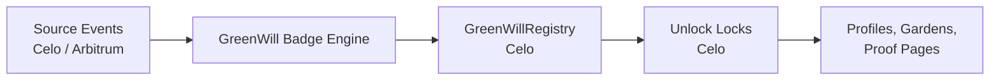

# GreenWill One-Pager

## What GreenWill Is

GreenWill is the badge and reputation layer for Green Goods.

It is meant to:

- recognize regenerative action
- make contribution visible
- create a portable badge portfolio
- distinguish participation from stewardship
- help Green Goods users feel progress, belonging, and meaning

GreenWill is **not** the permission layer and **not** the impact asset layer.

Those stay separate:

- **Hats** = permissions
- **GreenWill + Unlock** = badges and credentials
- **Hypercerts + Octant** = impact assets and capital flows

---

## Why This Matters

Green Goods already captures:

- work
- approvals
- assessments
- vault participation
- governance roles

What it does not yet have is a clean recognition layer that helps users and communities understand:

- who is participating
- who is stewarding
- who is supporting
- who was part of the first cohort

GreenWill fills that gap.

---

## Current Direction

The current design direction is:

- mint **network-wide GreenWill badges on Celo**
- allow qualifying activity to come from **Celo, Arbitrum, and other supported source chains**
- preserve source-chain provenance in proof data
- use **one lock per badge class**
- add a lightweight **GreenWillRegistry** on Celo early
- keep badge issuance **automatic and asynchronous**
- separate **operators** from **evaluators**
- let seasonal badges expire as **active** credentials while remaining permanently visible as historical achievements

This creates one public identity layer without fragmenting badge meaning by chain.

---

## Launch Badge Families

The first launch should stay focused.

## 1. Genesis participant badges

These mark the first live cohort.

Role-specific variants:

- Genesis Gardener
- Genesis Operator
- Genesis Evaluator
- Genesis Community
- Genesis Funder

The immediate first cohort is most likely:

- Genesis Gardener
- Genesis Operator

## 2. Starter badges

These are the first quick wins:

- first submission
- first approval
- first assessment
- first support

## 3. Domain badges

These track work across the first four canonical domains:

- Solar
- Agro
- Education
- Waste

## 4. Stewardship badges

These are higher-trust badges for recurring coordination work:

- Operator stewardship
- Evaluator stewardship

## 5. Seasonal badges

These mark a specific cycle and can later become a visible archive of participation.

---

## Canonical Chain Model

GreenWill should use a simple chain model:

- **Celo** is the canonical badge mint chain
- **source events** may come from Celo or Arbitrum
- the badge itself remains a single GreenWill credential on Celo

This is the right fit because:

- Celo aligns with the launch campaign
- Green Goods is already live on Celo in core areas
- it avoids reputation fragmentation
- it keeps the badge story legible for partners and community members

The main current exception is the **Hypercert marketplace**, which is not yet supported on Celo.

That means marketplace-derived support badges should still mint on Celo, but their proof needs to reference the source chain clearly.

---

## Architecture At A Glance

### Core pieces

- **GreenWillRegistry**: canonical registry of badge classes, seasons, role variants, lock mappings, and status rules
- **Badge Engine**: evaluates rules from EAS, Envio, and other source data
- **Unlock Locks**: one lock per badge class
- **Proof Surface**: shows why a badge exists and where the underlying action happened

---

## Proof And Reputation Model

Every serious GreenWill badge should eventually answer:

- who earned it
- who issued it
- why it was issued
- which season it belongs to
- which chain the source activity happened on
- whether it is still active or only historical

Recommended proof fields:

- badge class ID
- mint chain ID
- source chain ID
- source type
- source reference
- issue date
- season ID
- active-until date if relevant
- role
- garden slug or address where relevant

---

## Octalysis Direction

GreenWill should use Octalysis carefully.

The strongest fit is on the white-hat side:

- **Meaning**: this work matters
- **Accomplishment**: I am progressing
- **Ownership**: I have a real portfolio of contribution
- **Social influence**: my community can see and recognize this

GreenWill should use black-hat mechanics lightly:

- seasonal windows
- Genesis qualification windows
- expiring active status

It should avoid:

- streak addiction
- pure leaderboard pressure
- quest farming
- rewarding low-quality volume

---

## Where Builders And Researchers Can Contribute

The highest-value contribution areas right now are:

## 1. Registry design

- badge class schema
- season schema
- role-family modeling
- active-vs-historical status rules

## 2. Source attribution and proof

- Celo as canonical mint chain
- Arbitrum/Celo source provenance
- source reference schema
- proof page design

## 3. Badge rule design

- Genesis qualification rules
- support badge qualification rules
- domain cadence calibration
- operator/evaluator stewardship thresholds

## 4. Badge UX

- earned moment modal or toast
- profile display
- garden display
- favorites and hiding controls

## 5. Visual system

- layered badge templates
- role-specific variant system
- seasonal palette evolution
- family shapes and glyph language

## 6. Octalysis and behavior design

- mission-first onboarding
- healthy seasonal motivation
- participation without manipulation
- progression paths by role

---

## Where Feedback Is Most Needed

The most useful open feedback areas are:

1. What qualifies someone for the Genesis cohort by role?
2. Should community and funder Genesis badges launch in the same first cycle as gardener/operator Genesis badges?
3. What proof detail should be public by default?
4. Which support surfaces should be indexed first for `support.first_support`?
5. How should seasonal palette changes work without weakening family recognition?

---

## Read More

- Full spec: [GreenWill Badging + GIF Analysis](/builders/specs/greenwill-gif-analysis-2026-03)
- Implementation spec: [GreenWill Implementation Spec](/builders/specs/greenwill-gif-implementation-spec-2026-03)
- Evaluation plan: [GreenWill Evaluation Plan](/builders/specs/greenwill-gif-evaluation-plan-2026-03)

This one-pager is the shareable overview.

The full spec contains:

- badge taxonomy
- lock topology
- Celo chain strategy
- registry direction
- Octalysis implementation notes
- reference systems
- phased roadmap

The companion docs contain:

- an implementation-facing backlog and package map
- a TDD-style evaluation and release-gating plan
