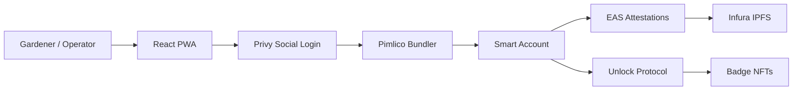

import {NextBestAction, StatusBadge} from "@site/src/components/docs";

# v0.1 — Privy, EAS, Pimlico, TBA

<StatusBadge status="Live" />

## Overview

Building on the Camp Green project, Green Goods v0.1 focused on simplifying the capture and reward of biodiversity impact -- making impact equal profit. The goal was to create a user-friendly interface for proposing actions, performing work, and earning rewards for completed contributions. Users are recognized for actions created and work performed with badges in the form of hypercerts. With this application, we set out to reimagine how people capture impact and help communities and individuals capture the value of the impact they create.

## Problems

- Lack of tooling to capture impact actions addressing biodiversity loss
- Lack of tooling to reward impact for addressing biodiversity problems
- Ecosystems with low biodiversity are less resilient

## Solutions

- Progressive Web App (PWA) for users to record and capture biodiversity impact
- Progressive Web App (PWA) for users to receive rewards for biodiversity impact
- Platform specifically built to address biodiversity loss in ecosystems

## Target Audience

**Garden Operator** -- Person managing an ecosystem, creating actions, and gathering resources to improve biodiversity.

**Gardener** -- Person doing work to prevent biodiversity loss and improve the quality and quantity of life in the ecosystem.

## User Stories

### Login and Onboarding

As a gardener, I want a simple way to login to complete and approve work for biodiversity actions.

- User can login with phone number
- User can login with email
- User has account created upon first login

### Managing Gardeners

As a garden operator, I want an easy way to add gardeners for my garden.

- User can add gardeners using email or phone number
- User can set roles for gardeners
- User can whitelist actions for a gardener
- User can remove a gardener

### Viewing Actions

As a gardener, I want to view actions to complete work.

- User can view actions
- User can view an action
- User can view an action and press a button to upload work

### Uploading Work

As a gardener, I want a simple tool to upload my work done improving biodiversity.

- User can upload work
- User can classify work under a category
- User can add media highlighting work
- User can review work before uploading

### Viewing Work

As a gardener, I want to view my biodiversity work completed.

- User can view work
- User can view a piece of work
- User can view the action connected to a piece of work
- User can view a piece of work's approval status

### Approving Work

As a garden operator, I want to approve biodiversity work to reward work completed.

- User can approve work done for an action
- User can reject work done for an action
- User can leave feedback on work

### Badges and Recognition

As a user, I want to receive recognition for my actions created and work completed on the platform.

- User can view badges in profile
- User can view token details of badges
- User can share badges on social media

## User Flows

### Garden Operator Login

1. User presses login button
2. Privy popover opens for user to sign in with social account or wallet
3. User chooses sign-in option and authenticates
4. On success: user redirected to app viewing the Actions tab
5. On error: user receives notification and is redirected back to login screen

### Gardener Login

1. User presses login button
2. Privy popover opens for user to sign in with social account or wallet
3. User chooses sign-in option and authenticates
4. On success: user redirected to app viewing the Actions tab
5. On error: user receives notification and is redirected back to login screen

### Garden Operator Add Gardeners

1. User navigates to profile tab
2. User presses tab in profile to view gardeners added
3. User presses plus button to add a gardener
4. User enters the gardener's email
5. User presses button to add gardener
6. On success: page refreshes and list is updated with new gardener
7. On error: toast notification indicating error

### Gardener Performs Work

1. User presses the perform work tab link
2. User enters basic details about the work
3. User presses button to add media assets
4. User captures and uploads photos and videos of work
5. User presses button to review work
6. User reviews work submission
7. User presses button to upload work
8. On success: user sees success page and can upload more work or view current work
9. On error: toast notification indicating error with a button to retry

### Gardener Views Work

1. User presses the work tab link
2. User sees list of their work with a filter for status
3. User presses on a work card to view details
4. User views work with its metadata and status

### Garden Operator Approves Work

1. User presses the actions tab link
2. User presses notification icon button to view work to approve
3. User views notifications list
4. User presses on a work notification card, opening work details
5. User reviews work
6. User presses button to approve or reject work
7. Approve: on success the page refreshes with status approved; on error a toast notification appears
8. Reject: on success the page refreshes with status rejected; on error a toast notification appears

### User Views Badge

1. User presses profile tab link
2. User presses tab in profile page to view badges
3. User views list of badges
4. User presses on a badge to view details
5. User sees dialog with badge details
6. User can press links to view the transaction that minted the badge or share on social media

## Features

- **Gasless Onboarding** -- Users login with Privy, mint their user token, and deploy their user account that owns their badges and is connected to all attestations made for actions and work.
- **Upload Biodiversity Work** -- Gardeners use a mobile-friendly interface to upload their work. Once approved, they earn tokens and badges for themselves and their community.
- **Badge System Based on Work** -- Active garden operators and gardeners earn badges and tokens for their actions created and work completed, gaining future governance eligibility and airdrop eligibility.

## Technical Requirements

### Privy with Pimlico

Social login with Privy and account abstraction user operations with Pimlico to facilitate proposing actions, performing work, and earning badges.

**Smart Account:**
- Properties: Role (Gardener or Operator)
- Methods: `createAction`, `updateAction`, `uploadWork`, `approveWork`

### PWA-Driven Interface

Interface for both operators and gardeners, fully mobile-built and accessible via the web as a PWA.

### Infura API

Metadata stored for attestations on IPFS with the Infura API. Also used for contract RPC calls to Optimism for querying data and performing transactions.

### EAS (Ethereum Attestation Service)

Action and work stored as attestations on-chain, allowing easy verification while tapping into blockchain network effects. A resolver mints hypercerts as badge rewards as users complete work and create actions.

**Work Attestation Schema:**

| Field | Type | Description |
|-------|------|-------------|
| `attester` | address | Gardener address |
| `recipient` | address | Project address |
| `id` | string | Generated by EAS |
| `action_id` | string | Associated action |
| `title` | string | Work title |
| `description` | string | Work description |
| `media` | string[] | IPFS media hashes |

**Work Approval Attestation Schema:**

| Field | Type | Description |
|-------|------|-------------|
| `attester` | address | Operator address |
| `recipient` | address | Gardener address |
| `id` | string | Generated by EAS |
| `action_id` | string | Associated action |
| `work_id` | string | Associated work |
| `approved` | bool | Approval status |
| `feedback` | string | Operator feedback |

### Action Registry Contract

Contract mapping actions to an attestation and storing certain action properties that may be updated, such as frequency for an action.

**Properties:**
- `action_id` to owner address mapping
- `action_id` to action struct mapping

**Methods:**
- `registerAction(action_id, frequency, category, metadata)` -- requires sender whitelisted as operator
- `updateAction(action_id, frequency, metadata)` -- requires sender is owner

**Action Struct:** id, createdAt, frequency, category (enum), metadata (IPFS JSON with title, description, instruction, media)

### Unlock Protocol

Using Unlock to create smart accounts for users using their email.

## Milestones

| Phase | Scope |
|-------|-------|
| **Designs for Garden Operator UI** | Screen designs for operator flows |
| **Designs for Gardener UI** | Screen designs for gardener flows |
| **Interface for Capturing Work** | Gardeners submit work for actions and earn rewards once approved |
| **Interface for Approving Work** | Garden operators approve work done by gardeners |
| **Interface for Rewards and Rank** | Profile view for badges and status within the community |

## Success Metrics

- **Users Onboarded** -- 100 to 1,000 unique users in the first quarter
- **Work Completed** -- 1,000 to 10,000 work items in the first quarter
- **Badges Earned** -- 100 to 1,000 badges in the first quarter

## Go-To-Market

- **Partner with Brazil Biodiversity Networks** -- Integrate with existing networks to onboard users and capture work
- **Integrate with Greenpill Chapters** -- Onboard chapters working on biodiversity (Los Angeles, Ottawa)
- **Apply for Grants** -- Submit applications with emphasis on OP and Gitcoin ecosystems

## Risks and Challenges

- **Hardware Access** -- Many biodiversity workers in rural areas share phones; the platform needed to accommodate this use case
- **Language Translation** -- English content must be properly translated to Brazilian Portuguese
- **Partnering with Existing Networks** -- Gaining adoption from established networks was expected to be difficult
- **Existing Tools** -- Web2 and web3 solutions for biodiversity already existed (e.g., Silvi)

## Roadmap

| Quarter | Focus |
|---------|-------|
| **Q2** | Simple MVP for gardeners and operators to create actions and perform work, earning badges |
| **Q3** | Bug fixes and incorporating user feedback into new features |
| **Q4** | Integrate with other dev guild tooling (impact voice app for proposals) |

## Conclusion

Green Goods has the potential to redefine the biodiversity ecosystem by bringing it on-chain with hypercerts and attestations. By using these two primitives and providing a user-friendly experience to create and capture impact, we can help expand the demand for web3 public goods infrastructure and make impact equal profit with retroactive and proactive rewards.

## Resources

- [Miro Board](https://miro.com/app/board/uXjVLjVA-xQ=/) -- Ideas, diagrams, and documentation
- [Figma Designs](https://www.figma.com/design/nSZR8RzIJCHwmrfq5oU4zZ/Designs) -- Screen designs with user flows
- [GitHub Repo (community-host)](https://github.com/greenpill-dev-guild/community-host) -- React PWA with Privy, Viem, Pinata, and EAS
- [GitHub Project Board](https://github.com/orgs/greenpill-dev-guild/projects/7/views/3) -- User stories and tasks
- [GitHub Impact Discussion](https://github.com/orgs/greenpill-dev-guild/discussions) -- Discussion on ideas for impact tooling and approaches
- [Agroforestry Carbon](https://agroforestrycarbon.com/) -- Startup collecting landscape data and paying small farmers with carbon debit income
- [AgroforestDAO](https://agroforestdao.org/) -- Decentralized organization focused on land stewardship for agroforestry systems
- [Ekonavi](https://ekonavi.com/) -- Regen social network collecting regen data and rewarding engaged users

---

<NextBestAction
  title="Next: v0.4 Specification"
  why="See how passkey authentication improved the user experience."
  actionLabel="v0.4 — Passkey, EAS, Pimlico, TBA, Karma"
  actionHref="/builders/specs/v0-4"
  alternatives={[
    { label: "v1.0 Specification", href: "/builders/specs/v1-0" },
    { label: "Getting Started", href: "/builders/getting-started" }
  ]}
/>
