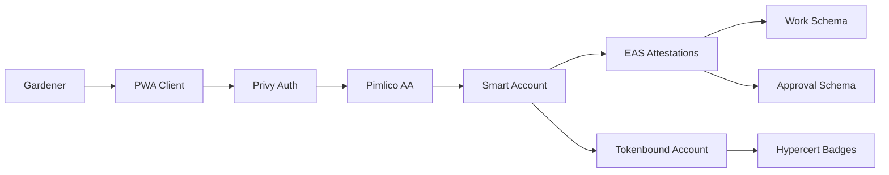

import {NextBestAction, StatusBadge} from "@site/src/components/docs";

# v0.4 — Passkey, EAS, Pimlico, TBA, Karma

<StatusBadge status="Live" />

## Overview

Green Goods builds on the achievements of the Camp Green project, focusing on enhancing the management and operational efficiency of conservation gardens. The initiative features an intuitive app that tracks every action within garden management — from scouting for invasive species, engaging with property owners, establishing gardens, recruiting volunteers, gathering resources, and the full lifecycle of plant management including removal of invasive species to planting and nurturing new seeds. Each activity is documented on a digital ledger to ensure transparency and accountability.

### Purpose

Our mission is to make it easier to capture and reward environmental impact, linking impact directly to profit, with a special focus on biodiversity. Green Goods offers a straightforward platform where users can propose initiatives, carry out tasks, and receive rewards for their contributions through digital badges known as hypercerts. By redefining how individuals and communities can measure and capitalize on their contributions to environmental stewardship, Green Goods aims to enhance garden health and biodiversity globally.

## Stakeholders

- **Product Owner and Engineers** — Core development team
- **Garden Operators** — Key users and contributors to data collection and impact tracking
- **Gardeners** — Field workers performing conservation activities
- **Property Owners** — Providing access to properties harboring invasive species
- **Local Government** — Providing funding and regulating standards for garden reporting

## Problems

- Inefficiency in documenting and tracking garden health and biodiversity impacts
- Difficulty in acquiring funding for biodiversity garden operations
- Lack of standardized metrics and methods for evaluating conservation efforts
- Difficulty in engaging volunteers and operators in a proactive, growth-oriented manner

## Solutions

- Develop an app that facilitates documentation and tracking of garden health through photos, approvals, and verifications
- Cohere around standardized biodiversity metrics and tracking methods recognized by government and funding sources
- Use hypercerts to tie in-app efforts to impact reports, showing effectiveness of conservation efforts to attract funding
- Implement features for garden expansion and gardener recruitment engagement within the app

## Target Audience

**Garden Operators:**

- **Who they are:** Individuals or organizations responsible for managing conservation gardens, overseeing activities such as planting, maintenance, and restoration efforts.
- **Needs:** Streamlined tools for efficiently documenting and tracking garden activities, including invasive species removal, planting, and volunteer coordination.
- **Pain Points:** Difficulty in maintaining detailed records, managing multiple tasks simultaneously, and demonstrating the impact of their work to secure funding.

**Gardeners:**

- **Who they are:** Individuals who participate in conservation efforts, helping with tasks such as planting, pruning, and other garden maintenance activities.
- **Needs:** Clear guidance on what tasks need to be done, recognition for their contributions, and an easy way to document their work.
- **Pain Points:** Lack of structured tasks, minimal recognition for efforts, and difficulty in tracking the impact of their contributions.

## User Stories

### Gardener Login

As a **Gardener**, I want a simple way to login to complete and approve work for biodiversity actions:

- Can login with phone number
- Can login with email
- Has account created upon first login

### View Actions

As a **Gardener**, I want to view actions created by operators:

- Can view an action that needs to be completed
- Can select an action and complete their work

### Upload Work

As a **Gardener**, I want a simple tool to upload my work done improving biodiversity:

- Can take a "before" photo of the garden area before starting work
- Can take an "after" photo once the task is completed

### View Completed Work

As a **Gardener**, I want to view my biodiversity work completed:

- Can view a piece of work
- Can view the action connected to a piece of work
- Can view a piece of work's approval status

### Approve Work

As a **Garden Operator**, I want to approve biodiversity work to reward work completed:

- Can approve work done for an action
- Can reject work done for an action
- Can leave feedback on work

## User Flows

### Gardener Login

1. User presses the login button
2. Privy popover opens for sign in with social account or wallet
3. User authenticates
4. **Success** — Redirected to the app viewing the actions tab
5. **Error** — Notification displayed and redirected to login screen

### Gardener Performs Work

1. User presses the perform work tab link
2. Enters basic details about the work
3. Presses button to add media assets
4. Captures and uploads photos and videos
5. Presses button to review work
6. Reviews work submission
7. Presses button to upload
8. **Success** — Sees success page with option to upload more
9. **Error** — Toast notification with retry button

### Gardener Views Work

1. Presses the work tab link
2. Sees list of work with status filter
3. Presses a work card for details
4. Views work with metadata and status

### Garden Operator Approves Work

1. Presses the actions tab link
2. Presses the notification icon to view work to approve
3. Views notifications list
4. Presses a work notification card to open details
5. Reviews work
6. Presses approve or reject
7. **Success** — Page refreshes with new status
8. **Error** — Toast with retry option

## Features

- **Gasless Onboarding** — Users login with Privy, mint their user token, and deploy their user account that owns badges and attestations
- **Upload Biodiversity Work** — Mobile-friendly interface for gardeners to upload work and earn tokens/badges once approved
- **Photo Documentation Workflow** — Structured "before" and "after" photos to document impact of gardener actions, essential for tasks like covering ground with biomass, planting propagules, pruning, and separating biomass
- **Work Details Entry** — Gardeners document activities like invasive species removal, biomass creation, and planting, including volume removed, biomass generated, and estimated carbon sequestered

## Technical Requirements

Same core stack as v0.1 (Privy + Pimlico, PWA, Infura, EAS, Unlock Protocol) with the following additions.

### Components Architecture

1. **Core Functionality** — Photo upload and tagging, approval and verification workflows, user-friendly data entry and retrieval
2. **Impact Data Collection** — Integration of biodiversity metrics, templates and guidelines for data collection, dashboard for monitoring garden health
3. **Funding and Impact Reporting** — Hypercert integration for distributing badges, linkage of hypercerts to garden activities, impact report generation, tools for sharing reports with funders
4. **Engagement and Expansion** — Garden expansion planning, interactive maps of garden areas, resource allocation and task management
5. **Advanced Reporting and Analytics** — In-depth long-term tracking, customizable reporting tools, predictive analytics
6. **User Feedback and Iteration** — Feedback collection mechanism, regular updates, beta testing program

### Understanding EAS Attestations

EAS attestations are cryptographic proofs that record and verify specific actions on the Ethereum blockchain:

- **Documentation and Verification** — Attestations document garden management, biodiversity assessments, and conservation efforts
- **Impact Reports** — Attestations tie into hypercerts to generate impact reports demonstrating conservation effectiveness
- **Standardization** — Standardized schemas ensure consistent and reliable data

**Who performs attestations:**

- **Garden Operators** — Create and manage actions and attest to completion
- **Biodiversity Scientists** — Assess and attest to health and biodiversity metrics
- **Community Members** — Participate in attesting to impact through governance

**Benefits of EAS Attestations:**

- **Transparency** — All actions and results are transparently recorded on the blockchain, making data immutable and publicly accessible
- **Trust** — Cryptographic proofs build trust among stakeholders including gardeners, scientists, funders, and the community
- **Efficiency** — Automating documentation and verification reduces human errors and streamlines operations
- **Funding** — Verified impact reports generated through attestations attract funding from grants and investors

**Integration with Green Goods:**

- **Smart Accounts** — Each garden and gardener operates as a smart account, with actions and metrics linked through EAS attestations
- **Contracts** — Core contracts deployed on Arbitrum including garden, action, and community registries utilize EAS for attesting protocol actions
- **Community Engagement** — During workshops and community events, tokens and rewards are attested and distributed, encouraging active participation

## Metrics

### User Engagement

| Metric | Description |
|--------|-------------|
| **Active Users** | Daily, weekly, and monthly active users |
| **Task Completion Rate** | Percentage of tasks completed within set timeframe |
| **User Retention Rate** | Percentage continuing over time |
| **Photo Documentation Rate** | Percentage of tasks with complete before/after photos |
| **User Feedback Score** | Average rating on experience |

### Ecological Impact

| Metric | Description |
|--------|-------------|
| **Volume of Invasive Species Removed** | Total volume documented |
| **Biomass Generated** | Total kg/tons created and documented |
| **Carbon Sequestration Estimates** | Estimated metric tons sequestered |
| **Increase in Native Species** | Number planted and established |
| **Funding Secured** | Total funding as result of app documentation |

### Operational

| Metric | Description |
|--------|-------------|
| **Verification Rate** | Percentage successfully verified after submission |
| **Time to Complete Task** | Average time from assignment to verification |
| **Data Integrity Incidents** | Number of reported data issues |

## Go-To-Market

- **Partner with Brazil Biodiversity Networks** — Integrate with existing networks
- **Integrate with Greenpill Chapters** — Onboard chapters (Los Angeles, Ottawa)
- **Apply for Grants** — OP and Gitcoin ecosystems
- **Premium App Features** — Future monetization

## Risks and Challenges

- **Hardware Access** — Rural biodiversity workers share phones
- **Language Translation** — English to Brazilian Portuguese translation needed
- **Partnering with Existing Networks** — Integration adoption challenges
- **Existing Tools** — Competition from Silvi and others

## Assumptions and Constraints

- **Assumptions:** Users will have access to smartphones or computers; local governments will support the initiative
- **Constraints:** Limited initial funding; reliance on volunteer engagement

## Milestones

| Milestone | Scope |
|-----------|-------|
| Designs for Gardeners UI | Updated screen designs |
| Attestations for Assessments and Work | Assessment attestation flow |
| Interface for Capturing Work | Submit work and earn rewards |
| Interface for Approving Work | Operator approval flows |
| Interface for Rewards and Rank | Badge and status views |

## Roadmap

| Quarter | Focus |
|---------|-------|
| **Q4 2024** | Simple MVP for gardeners and operators to create actions and perform work |
| **Q1 2025** | Bug fixes and incorporating user feedback into new features |
| **Q2 2025** | Integrate with other dev guild tooling (impact voice app) |

## Conclusion

Green Goods has the potential to redefine the biodiversity ecosystem by bringing it on-chain with hypercerts and attestations. By using these two primitives and providing a user-friendly experience to create and capture impact, we can help expand the demand for web3 public goods infrastructure and make impact equal profit with retroactive and proactive rewards.

## Resources

- [Miro Board](https://miro.com/app/board/uXjVLjVA-xQ=/) — Ideas, diagrams, and documentation
- [Figma Designs](https://www.figma.com/design/nSZR8RzIJCHwmrfq5oU4zZ/Designs) — Screen designs with user flows
- [GitHub Repo](https://github.com/greenpill-dev-guild/community-host) — React PWA codebase
- [GitHub Project Board](https://github.com/orgs/greenpill-dev-guild/projects/7/views/3) — User stories and tasks

---

<NextBestAction
  title="Next: v1.0 Specification"
  why="Explore the full production architecture with all integrations."
  actionLabel="v1.0 — Hypercerts, Octant, Gardens, Cookie Jar"
  actionHref="/builders/specs/v1-0"
  alternatives={[
    { label: "v0.1 Specification", href: "/builders/specs/v0-1" },
    { label: "Getting Started", href: "/builders/getting-started" }
  ]}
/>
