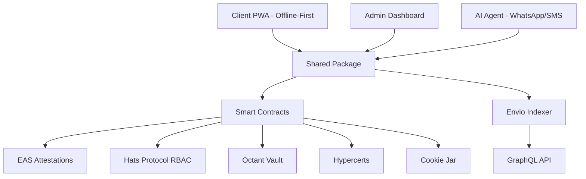

import {NextBestAction, StatusBadge} from "@site/src/components/docs";

# v1.0 — Hypercerts, Octant, Gardens, Cookie Jar

<StatusBadge status="Live" />

## 1. Overview

### 1.1 One-Liner

Green Goods is a Regenerative Compliance and Local First Impact Reporting Platform that enables verifiable tracking of ecological actions, tokenization of impact via Hypercerts, and capital formation through Octant Vaults and Revnets.



### 1.2 Context

The global landscape for environmental finance is currently navigating a profound structural transformation, precipitated by a dual crisis of credibility in voluntary carbon markets (VCM) and an urgent, unmet demand for verifiable data in government-funded climate and ecological initiatives. The prevailing paradigms of "Monitoring, Reporting, and Verification" (MRV) are failing to scale, burdened by high-cost manual audits that exclude the vast majority of grassroots regenerative projects from accessing capital markets. Traditional certifiers rely on extractive consulting models where a single verification event can cost upwards of $5,000, rendering the model economically unviable for smallholder farmers, community gardens, and hyper-local ecological stewards.

Simultaneously, governments are deploying historic levels of capital but face immense legislative pressure to prove results in "disadvantaged communities" (DACs). This creates a "Verification Gap." Green Goods bridges this gap by pivoting to Compliance-as-a-Service (CaaS), operationalizing the "Regenerative Stack" to connect physical ecological labor with onchain capital.

### 1.3 Why Now

- **The Yield Economy Has Matured** — Octant V2 enables endowment models where principal is preserved.
- **AI at the Edge** — LLM costs dropped 90% in 2025, making Agri-Advisor agents viable at under $0.01 per interaction.
- **Greenpill Garden Season One** — 8+ Gardens are ready to adopt the protocol.

### 1.4 Competitive Positioning

Green Goods differentiates from Silvi (trees only, centralized, enterprise pricing), GainForest (requires satellite, high technical barrier), and Regen Network (Cosmos-based, methodology-heavy) through multi-domain coverage, Ethereum-native DeFi integration, accessible MDR methodology, and community governance via Fractal Gardens and Conviction Voting.

**Key moats:** Network effects from Greenpill chapters, switching costs from attestation history, data moat from accumulated actions, and community ownership through local tokens.

### 1.5 Target Release

- **Release:** Green Goods Protocol v1 (Beta Candidate)
- **Season:** Q1 2026 (Transition from Alpha to Beta)
- **Network Deployment:** Arbitrum One and Ethereum

### 1.6 Owners

- **Product and Engineering Lead:** Afolabi Aiyeloja
- **Design and QA Lead:** Nansel Rimsah

---

## 2. Goals and Success

The architecture of Green Goods v1 is driven by three primary strategic objectives designed to bridge the "Verification Gap" and create a closed-loop regenerative economy. These goals move beyond simple metrics of usage to encompass the structural integrity of the "Regenerative Stack."

### 2.1 Goals

#### Goal 1: Capital Formation (High Sustainability)

The economic goal is to enable Capital Formation rather than simple circulation. By utilizing Octant Vaults, the protocol creates "Local Endowments" where low-risk staking yields systematically purchase Hypercerts, establishing a "Risk-Free Impact Floor" for ecological labor. Simultaneously, the integration of Juicebox Revnets enables "The Growth" layer, allowing communities to grow revenue and manage treasuries where tokens represent governance rights and a claim on future success, rather than just donation receipts.

#### Goal 2: Impact Reporting Accessibility (High Reach)

The accessibility goal is to ensure the protocol is available to the "Last Mile" of users, regardless of technical literacy or connectivity. This involves expanding the interface beyond the browser to include AI Agents that interact via WhatsApp and SMS. This allows even the most rural Gardeners to interface with the protocol using natural language to log work, query earnings, and receive alerts. We also plan to address the ease of aggregating impact into a single asset and make it simple and friendly for individuals to mint Hypercerts for impact certification.

#### Goal 3: Onchain Governance and Reputation (High Coordination)

The governance goal is to implement a robust badging and reputation system built on Unlock Protocol (GreenWill) and Hats Protocol. These tools serve as the permission layer for the Gardens platform, ensuring that governance is driven by those who create value. By using Conviction Voting, the protocol empowers reputation holders to signal distinct priorities: deciding on hypercert yield allocation and prioritizing specific garden actions.

### 2.2 Success Metrics

| Metric | Definition | Target |
|--------|------------|--------|
| **Total Verified Impact Value (TVIV)** | Cumulative dollar value of all Hypercerts minted, sold, or held within the protocol ecosystem | $40,000 by end of Q1 2026 |
| **Vault TVL** | Total value locked in Octant Vaults | $20,000 |
| **Active Gardeners** | Unique wallet addresses (including Smart Accounts via AI Agent) submitting verified actions in 30-day window | 150 users on a rolling 30-day basis |
| **Reputation Density** | Number of active users holding a GreenWill "Steward" or "Sprout" badge via Unlock Protocol | 32+ users |
| **Verification Efficiency** | Percentage of submitted actions processed (Approved/Rejected) by Evaluators/Operators within 72 hours | >90% |
| **Conviction Participation** | Percentage of token holders actively signaling/voting on yield allocation via Conviction Voting | >48% |
| **Hypercerts Minted** | Number of ERC-1155 impact certificates created from verified actions | 12+ by end of Q1 2026 |
| **Gardens Active** | Number of distinct Gardens using Arbitrum for impact reporting | 8+ by end of Q1 2026 |
| **CIDS Compliance Rate** | Percentage of actions structured per Common Impact Data Standard | 80%+ per cohort |
| **Karma GAP Updates** | Number of verified actions pushed to Karma GAP as milestone updates | 100+ by end of Q1 2026 |

### 2.3 Guardrails

- **Redemption Rate (Revnet):** The cash-out tax on Garden Tokens must remain between 80-90% to prevent treasury depletion.
- **Data Integrity Score:** The rejection rate of submissions flagged by IoT/Silvi oracles must not exceed 15%.

---

## 3. Users and Use Cases

The product architecture serves a 5-sided marketplace, ensuring checks and balances between labor, management, capital, verification, and community beneficiaries.

### 3.1 Primary Users and Personas

#### Persona A: The Gardener (The Laborer)

- **Profile:** Field workers in bio-regions (e.g., Nigeria, Brazil). May operate in low-connectivity zones.
- **Motivation:** Livelihood security and community improvement.
- **Key Interface:** AI Agent (WhatsApp/SMS) for reporting; PWA for deep management.
- **Definition of Success:** Successfully logging work via a text message or photo and receiving payment notification without managing a crypto wallet.

#### Persona B: The Garden Operator (The Steward)

- **Profile:** Local chapter administrator or NGO program manager.
- **Motivation:** Funding sustainability and coordinating local labor.
- **Key Interface:** Admin Dashboard.
- **Definition of Success:** Efficiently verifying queues of submissions, minting Hypercerts, and managing the Garden Treasury.

#### Persona C: The Evaluator (The Verifier)

- **Profile:** Domain experts (e.g., sustainability experts, material scientists) or specialized Oracles.
- **Motivation:** Ensuring integrity, preventing greenwashing, and maintaining professional reputation.
- **Key Interface:** Admin Dashboard (Evaluator View).
- **Definition of Success:** Reviewing completed Impact Reports or Assessments and cryptographically certifying the quality of the data.

#### Persona D: The Funder (The Capital Provider)

- **Profile:** Institutional donors, Government Agencies (e.g., California Natural Resources Agency), or Octant stakers.
- **Motivation:** Verified Impact (MRV), compliance with legal mandates, and capital efficiency.
- **Key Interface:** Admin Funder Dashboard and Octant Vaults.
- **Definition of Success:** Depositing assets into a vault and receiving an automated Karma GAP report showing yield utilization.

#### Persona E: The Community Member (The Beneficiary)

- **Profile:** Local residents living in the bioregion affected by the Garden's work.
- **Motivation:** Ensuring the work actually benefits the local ecosystem and holding the Garden accountable.
- **Key Interface:** Public Signal Feed and Gardens Conviction Voting.
- **Definition of Success:** Ability to "Signal" or "Attest" that the work exists and is healthy, providing a "Proof of State" from the ground up, and signaling prioritization for future actions.

### 3.2 Top Jobs-to-be-Done (JTBD)

| JTBD | User | Context | Job | Outcome |
|------|------|---------|-----|---------|
| Low Bandwidth Submission | Gardener | In the field with no data plan | Text a photo to the AI Agent | Labor logged even without a high-end smartphone |
| Impact Report Aggregation | Operator | Quarter ends and reporting is due | Aggregate all verified actions into a single Impact Report | Mint a Hypercert bundle and sell it to the Octant Vault |
| Principal-Preserving Funding | Funder | Want to support a region without losing principal | Stake ETH in an Octant Vault | Yield acts as a perpetual endowment for the local community |
| Impact Evaluation | Evaluator | A Garden claims "Biodiversity Increase" | Review aggregated data and sensor logs | Cryptographically sign an attestation verifying the claim |
| Community Prioritization | Community Member | A Garden proposes a new project | Signal priority via Conviction Voting | Yield flows to the actions that matter most |

### 3.3 Use Cases

- **PWA Impact Reporting:** An Operator uses the PWA to aggregate 500 individual tree planting actions into a "Q1 Reforestation Report." The system formats this data according to the Common Impact Data Standard (CIDS) for Karma GAP integration.
- **Impact Reporting Certification:** An Evaluator receives the "Q1 Reforestation Report." They analyze the attached Silvi sensor data and satellite imagery. Satisfied with the quality, they sign the report using their Hats Protocol "Verifier" authority, certifying it for minting.
- **Garden Revenue Tokenization:** A Garden mints a Hypercert based on the certified report. They list this Hypercert on the Revnet. The Octant Vault automatically purchases it using yield, and the revenue flows into the Garden's treasury, backing the value of the local Garden Token.
- **Prioritization Signaling:** Community members stake their reputation (GreenWill Badges) on specific actions within the Garden's governance page, signaling that "Water Conservation" is a higher priority than "Planting" for the upcoming season.

### 3.4 Action Domains and Target Outcomes

Green Goods is not a generic impact tracking tool. It is purpose-built to capture and verify specific categories of regenerative work emerging from Greenpill Network chapters and aligned initiatives. The protocol optimizes for five core action domains that reflect where local communities are actively creating value.

#### Domain 1: Solar Infrastructure (DePIN Pillar)

**Primary Chapter:** Greenpill Nigeria through the Tech and Sun program.

**Key Outcome:** Energy access plus staking yield at Nigerian universities.

The Tech and Sun initiative deploys solar-powered container hubs at University of Nigeria Nsukka and Nnamdi Azikiwe University. These hubs provide reliable electricity, Starlink internet, Ethereum staking infrastructure, and co-learning spaces for Web3 education. Green Goods captures each phase of hub deployment and ongoing operations, creating an immutable audit trail for funders and enabling yield routing from staking rewards.

**Action Lifecycle:**

1. **Site Acquisition** — Documents land/space agreement with university through photos of location, signed agreement scan, and GPS coordinates.
2. **Container Procurement** — Records purchase and delivery of 20ft shipping container through delivery receipt and photos.
3. **Solar Installation** — Captures panel, inverter, and battery setup through photos and Switch meter data.
4. **Connectivity Setup** — Documents Starlink deployment through speed test results and subscription proof.
5. **Node Deployment** — Records Ethereum staking node setup through validator address and deposit transaction.
6. **Hub Launch** — Documents official opening through event photos and attendance count.
7. **Ongoing Operations** — Captures daily usage through user count, energy generated (kWh), and session duration.
8. **Workshop Hosted** — Records educational events through attendance list and participant feedback.

**Impact Metrics:**

| Metric | Description |
|--------|-------------|
| Energy Generated | Total kWh produced |
| Users Served | Unique individuals |
| Node Uptime | Percentage availability |
| Yield Generated | ETH staking rewards |
| Workshops Hosted | Count of sessions |
| Cost per kWh | Efficiency metric |

#### Domain 2: Waste Management (Environment Pillar)

**Primary Chapters:** Greenpill Cape Town, Greenpill Ivory Coast, Greenpill Koh Phangan, and Greenpill Rio Brasil.

**Key Outcome:** Circular economy systems reducing environmental waste.

Waste management is being tackled across multiple chapters with varying approaches. Cape Town focuses on community beach cleanups for coastal ecosystems. Ivory Coast addresses urban waste collection in informal settlements. Koh Phangan optimizes island waste for resort areas and marine debris. Rio Brasil builds systematic waste management for urban and suburban circular economy. Green Goods standardizes capture across these diverse approaches while allowing local customization of waste categories and processing methods.

**Action Lifecycle:**

1. **Area Assessment** — Surveys location to understand waste problem through GPS, photos of waste accumulation, and area size estimate.
2. **Cleanup Event** — Collects and removes waste through before/after photos, waste weight, and participant count.
3. **Waste Sorting** — Categorizes collected waste by type through photos of sorted piles and weight by category.
4. **Recycling Delivered** — Transports recyclables to processing facility through delivery receipt and materials list.
5. **Composting** — Processes organic waste into compost through compost pile photos and input/output weights.
6. **Upcycling Project** — Transforms waste into useful products through input materials and output products documentation.

**Impact Metrics:**

| Metric | Description |
|--------|-------------|
| Total Waste Removed | kg collected |
| Diversion Rate | Percentage recycled vs. landfilled |
| Area Cleaned | Total square meters restored |
| Participants Engaged | Unique individuals |
| Material Recovery Value | Economic value of recyclables |

#### Domain 3: Agroforestry and Planting (DeSci + Environment Pillars)

**Primary Chapters:** Greenpill Brasil through AgroforestryDAO (led by Diogo), and Greenpill Uganda (led by Jonathan).

**Key Outcome:** Biodiversity increase, carbon sequestration, and intergenerational knowledge transfer.

Two distinct approaches define this domain. The AgroforestryDAO approach in Brasil builds not just a system to capture work but one that spreads knowledge to future generations through documentation of sustainable farming practices and biodiversity corridors. The Educational Planting approach in Uganda combines planting with education where Jonathan visits schools and churches to plant native, fruit-bearing trees. Each student becomes a caretaker for a specific tree, creating personal relationships with the ecosystem and enshrining the importance of trees from environmental, nutritional, and spiritual perspectives.

**Action Lifecycle:**

1. **Site Assessment** — Evaluates land for planting suitability through GPS, soil photos, and existing vegetation survey.
2. **Species Selection** — Chooses appropriate native species through species list, rationale, and seed source.
3. **Site Preparation** — Clears and amends soil through before photos and soil test results if available.
4. **Planting** — Completes tree and seedling installation through species, count, GPS of each tree if feasible, and photos.
5. **Student Assignment** — Assigns tree to student caretaker (Uganda model) through student name, tree ID, and assignment photo.
6. **Monitoring and Observation** — Checks health, growth, and identifies issues through photos, measurements, and health status.
7. **Harvesting** — Collects fruits, seeds, or other products through yield weight, quality, and distribution plan.
8. **Knowledge Documentation** — Records farming techniques for future generations through written guide, video, and languages used.

**Impact Metrics:**

| Metric | Description |
|--------|-------------|
| Trees Planted | Total count by species |
| Native Species Ratio | Percentage of native vs. non-native |
| Survival Rate | Trees alive at 6-month and 1-year checkpoints |
| Caretakers Engaged | Students and community members assigned |
| Knowledge Records | Documentation pieces created |
| Carbon Sequestration Estimate | tCO2e using standard factors |
| Fruit and Harvest Yield | kg of produce |

#### Domain 4: Education and Web3 Workshops (Education Pillar)

**Primary Chapters:** All Greenpill chapters plus Artizen Fund student cohort.

**Key Outcome:** Skill building in coordination mechanisms and intergenerational knowledge transfer.

Green Goods serves as the verification layer for educational initiatives across three program types. General Web3 Workshops teach coordination and governance mechanisms across all chapters. Artizen Fund Cohort consists of students funded to host events using regenerative tools, with Green Goods verifying attendance and learning outcomes. Tech and Sun Educational Programs deliver blockchain and ReFi training at solar hubs in Nigeria.

**Action Lifecycle:**

1. **Event Planning** — Schedules and prepares workshop through event details, curriculum, and venue confirmation.
2. **Workshop Hosted** — Conducts educational session through attendance list, photos, and materials used.
3. **Participant Attendance** — Records individual attendance through sign-in, photo proof, and engagement evidence.
4. **Learning Assessment** — Evaluates through quiz, project, or demonstration with results and submissions.
5. **Certificate Issued** — Provides completion credential through NFT badge or attestation.
6. **Follow-up Action** — Documents participant applying learning through evidence of real-world application.

**Impact Metrics:**

| Metric | Description |
|--------|-------------|
| Workshops Hosted | Total count by type |
| Participants Trained | Unique individuals across all sessions |
| New Web3 Users Onboarded | First-time wallet creators |
| Completion Rate | Percentage completing full curriculum |
| Follow-up Actions | Documented applications of learning |
| Geographic Reach | Countries and regions served |
| Artizen Fund Compliance Rate | Verified vs. funded events |

#### Domain 5: Mutual Credit and Farmer Verification (DePIN + DeSci Pillars)

**Primary Chapter:** Greenpill Brasil through commitment pooling pilot.

**Key Outcome:** Credit access for rural farmers through verified productive capacity.

Rural farmers often lack access to credit due to inability to verify their productive capacity. Green Goods serves as the verification tool for commitment pooling pilots in Brasil, where farmers demonstrate consistent agricultural output to unlock mutual credit lines. This creates a pathway from verified work to financial inclusion.

**Action Lifecycle:**

1. **Farm Registration** — Documents farm location, size, and crops through GPS boundaries, land ownership proof, and crop inventory.
2. **Planting Season** — Records what was planted, when, and where through planting photos, seed receipts, and area planted.
3. **Growth Monitoring** — Provides regular updates on crop progress through photos over time and growth measurements.
4. **Harvest Documentation** — Records harvest quantity and quality through harvest photos, weight, count, and quality grade.
5. **Sale and Distribution** — Documents where produce went through buyer receipt, market photos, and price achieved.
6. **Commitment Fulfilled** — Demonstrates completion of stated commitment through summary of promised vs. delivered output.

**Impact Metrics:**

| Metric | Description |
|--------|-------------|
| Farms Registered | Total verified farms |
| Harvest Volume | Total kg documented |
| Commitment Fulfillment Rate | Percentage meeting stated targets |
| Credit Unlocked | Value of credit lines enabled |
| Yield per Hectare | Productivity metrics by crop |

### 3.5 Action Schema Registry

Green Goods maintains a registry of standardized action schemas that Gardens can activate based on their focus area. Actions are tagged with the Eight Forms of Capital they create or enhance.

#### Core Actions (All Gardens)

| Action | Capital Forms |
|--------|--------------|
| Planting | Living, Material, Experiential |
| Identify Plant | Living, Intellectual, Experiential |
| Watering | Living, Material, Experiential |
| Harvesting | Living, Material, Experiential |
| Waste Cleanup | Material, Social, Experiential |
| Web3 Workshop | Intellectual, Social, Experiential |
| Event Attendance | Intellectual, Social |

#### Domain-Specific Actions

| Action | Capital Forms | Availability |
|--------|--------------|--------------|
| Solar Hub Session | Material, Intellectual, Social | TAS Gardens only |
| Node Deployment | Material, Financial | TAS Gardens only |
| Waste Sorting | Material, Intellectual | Waste-focused Gardens |
| Tree Assignment | Living, Social, Cultural | Educational Gardens |
| Knowledge Documentation | Intellectual, Cultural | AgroforestryDAO Gardens |
| Farm Registration | Living, Material | Credit Pool Gardens |
| Commitment Fulfilled | Financial, Material | Credit Pool Gardens |

#### Eight Forms of Capital Reference

| Capital | Description |
|---------|-------------|
| **Living** | Biodiversity, ecosystems, soil, and water |
| **Material** | Physical infrastructure, equipment, and land |
| **Financial** | Money, credit, and investment |
| **Social** | Relationships, trust, and networks |
| **Intellectual** | Knowledge, skills, and data |
| **Experiential** | Wisdom from practice and tacit knowledge |
| **Cultural** | Traditions, identity, and meaning |
| **Spiritual** | Purpose, connection, and meaning |

### 3.6 Schema Validation Plan

Before launch, all action schemas must be validated with actual users in each domain to:

- Confirm that fields capture necessary data without creating friction
- Identify missing fields that domain experts require
- Test AI Agent parsing accuracy
- Measure completion rates

#### Solar Domain Validation

- **Participants:** 3-5 Tech and Sun operators from Nigeria (including Anthony Amio and Mmeri Anosike) plus university coordinators
- **Duration:** 90 minutes per session, 2 sessions planned
- **Validation Criteria:** Completing submission in under 5 minutes via PWA; AI Agent correctly parsing session type, user count, and energy reading; Switch smart meter readings being easily captured
- **Fields to Validate:** `sessionType` options, `energyGenerated` capture method, `nodeUptime` format

#### Waste Domain Validation

- **Participants:** 2-3 members from each of Cape Town, Koh Phangan, and Rio Brasil chapters (6-9 total)
- **Duration:** 60 minutes per session, 3 sessions
- **Validation Criteria:** Logging while doing physical cleanup work with one-handed operation; waste type selection covering all local materials; weight estimation feasibility without scales
- **Fields to Validate:** `wasteSelection` options (fishing nets, e-waste), `estimatedWeight` (with potential bag count alternative), `disposalMethod` (local options)

#### Agroforestry Domain Validation

- **Participants:** Diogo and 2-3 AgroforestryDAO members in Brasil, plus Jonathan and 2-3 team members in Uganda
- **Duration:** 90 minutes per session, 2 sessions
- **Brasil session** focuses on Knowledge Documentation schema and Portuguese language support
- **Uganda session** focuses on Planting schema with Student Assignment extension during actual school planting event
- **Fields to Validate:** `plantSelection` (species database needs), `caretakerName` (privacy concerns), `seedSource` (local options)

#### Education Domain Validation

- **Participants:** 3-5 workshop facilitators plus 2 Artizen Fund cohort members
- **Duration:** 45 minutes per session, 3 sessions conducted during actual workshop events
- **Validation Criteria:** Logging attendance without disrupting workshop flow; capturing meaningful learning outcomes
- **Fields to Validate:** `topics` options, `learningOutcome` format

#### Mutual Credit Domain Validation

- **Participants:** 3-5 farmers from Brasil commitment pooling pilot
- **Duration:** 60 minutes per session, 2 sessions
- **Validation Criteria:** Farmers with limited tech literacy completing harvest logging; quality grading being understandable
- **Fields to Validate:** `qualityGrade` definitions, `commitmentPoolId` linking, `estimatedValue` (local currency)

---

## 4. Problem Statement

### 4.1 What's Broken Today

- **Verification Gap:** Traditional MRV is too expensive for small projects ($5,000-15,000 per verification event), while simple photo uploads lack scientific rigor and trust for institutional capital.
- **Capital Volatility:** Crypto-philanthropy often relies on volatile tokens or one-off grants. When the market crashes or donors churn, projects die.
- **Accessibility Wall:** Most web3 impact tools require a smartphone, a wallet, and ETH for gas. This excludes the poorest and most vital ecological laborers.
- **Missing Feedback Loops:** Beneficiaries (local communities) and Experts (Evaluators) are often excluded from the verification loop, leading to "paper parks" or greenwashing.

### 4.2 Why It Matters Now

- **Global South Adoption:** The environment for crypto and blockchain technology is becoming increasingly friendly and vital in the Global South (e.g., Nigeria, Brazil). High mobile penetration combined with a need for stable financial rails makes these regions ideal adopters for a "Local-First" regenerative economy.
- **The Yield Economy:** The maturity of Octant and DeFi allows for "endowment models" where principal is preserved and only yield is spent.
- **AI at the Edge:** LLMs have become efficient enough to run "Agri-Advisor" agents that can democratize access to complex protocols via simple text.

---

## 5. Scope

### 5.1 In Scope (This Release)

**Interfaces:**
- **PWA** — Offline-first web app with localization support (Spanish/Portuguese)
- **Admin Dashboard** — UI for managing Gardens and creating impact reports
- **AI Agent (Beta)** — WhatsApp/SMS bot for Gardener submissions

**Protocol Layer:**
- **Karma GAP** — Automated reporting pipelines
- **Octant Vaults** — Deployment of yield-bearing vaults for capital formation
- **Revnets** — Configuration of Juicebox Revnets for Garden Treasury management
- **Hypercerts** — Minting logic for verified impact claims
- **Conviction Voting** — Module for yield allocation and action prioritization

**Identity and Reputation:**
- **Unlock Protocol** — Minting of GreenWill reputation badges (NFTs) based on user activity
- **Hats Protocol** — Management of on-chain roles (e.g., Operator, Evaluator) and permissions

**Verification:**
- **Operators** — Tools for initial data aggregation and verification
- **Evaluators** — Admin Dashboard view for certifying Impact Reports
- **Community Signaling** — Mechanism for beneficiaries to flag issues or upvote priorities

### 5.2 Revnet Configuration (The Fractal Gardens Model)

Green Goods adopts a two-tiered Fractal Gardens architecture using Juicebox V4 Revnets.

**Level 1: Protocol Revnet ($GG Token)**

Issues the core Green Goods governance token. Funds shared infrastructure including servers, indexers, legal, and development. Receives tribute from Level 2 Gardens at 2.5-5% of incoming funds and tokens.

**Level 2: Garden Revnets (Local Tokens)**

Each community operates its own Revnet (e.g., $LAGOS, $BRAZIL, $NIGERIA). Issues local tokens representing governance rights and treasury claims. Routes tribute percentage to Level 1 Protocol.

### 5.3 The Octant-Backstopped Impact Floor

This mechanism creates sustainable funding independent of speculation:

1. **Deposit** — Funders stake assets in Octant Vault.
2. **Yield Generation** — Low-risk DeFi strategies generate returns.
3. **Programmatic Buyback** — Yield automatically purchases Hypercerts from Gardens.
4. **Floor Rising** — Each purchase increases backing per token, creating a minimum wage for ecological labor backed by Ethereum staking rewards.

### 5.4 Out of Scope

- **Robust Identity System (DID)** — A fully decentralized identity system backed by W3C DIDs is deferred to a future release; v1 relies on WebAuthn and standard maturation.
- **Global IoT Network** — Full integration with hardware sensors.
- **Scope 3 Data Marketplace** — Insurance/Finance data sales are Phase 3.

### 5.5 Assumptions

**A1: Onchain impact reporting is more valuable than traditional reporting.**

- *Validation:* Track funder preference in post-pilot surveys. Compare funding secured by onchain-reporting Gardens vs. traditional reporting projects.
- *Red Flag:* If traditional tooling improves via AI and the onchain value-add is not perceived as differentiated by Q2 2026.

**A2: Projects can long-term earn enough yield to be sustainable.**

- *Validation:* Calculate yield-to-impact ratio across pilot Vaults. Model time-to-sustainability for different capital levels.
- *Red Flag:* If funders perceive yield as too passive and prefer direct donation models.

**A3: Impact certificate marketplaces will develop around Hypercerts.**

- *Validation:* Monitor Hypercerts ecosystem liquidity. Track secondary sales volume.
- *Red Flag:* By Q3 2026, no impact marketplaces building liquidity around Hypercerts.

**A4: AI Agents can accurately parse natural language impact submissions.**

- *Validation:* Measure Agri-Advisor accuracy rate on image identification and metadata extraction.
- *Red Flag:* If error rate exceeds 15%, requiring Operator intervention on the majority of submissions.

**A5: Community members will participate in Conviction Voting without direct financial incentives.**

- *Validation:* Track participation rates across Gardens. Correlate with GreenWill badge levels.
- *Red Flag:* If voting participation drops below 30% after initial novelty period.

**A6: Gasless transactions via Pimlico remain economically viable at scale.**

- *Validation:* Monitor sponsorship costs per transaction. Model break-even point.
- *Red Flag:* If gas costs exceed 5% of yield generated per action.

**A7: Evaluators will maintain integrity under reputation staking model.**

- *Validation:* Track dispute rates and community flagging of Evaluator decisions.
- *Red Flag:* If collusion patterns emerge in Gardens with concentrated Evaluator power.

---

## 6. Solution Overview

### 6.1 Experience Summary

Green Goods v1 acts as a bridge. For the Gardener, it is a helpful WhatsApp contact that pays them for work. For the Funder, it is a high-yield savings account that heals the planet. For the Evaluator, it is a data-rich platform for certifying truth.

### 6.2 Core Workflow Pattern (MDR)

1. **Capture/Input** — Photos, metadata, GPS, and voice notes via PWA or AI Agent.
2. **Details/Structure** — CIDS-compliant action schema, attestation construction, and Hypercert metadata.
3. **Review/Confirm** — Operator approval queue, Evaluator certification, and Hypercert minting.

### 6.3 Key User Flows

#### Flow 1: AI Agent Impact Reporting (High Accessibility)

1. **Capture** — Gardener sends photo to WhatsApp Bot.
2. **Process** — AI Agent identifies object, cross-references with "Action Schema."
3. **Sign** — Agent uses server-side Smart Account (signer controlled) to sign payload.
4. **Store** — Data anchored on IPFS (Storacha) and stored onchain with EAS.

#### Flow 2: Impact Report Minting and Evaluation (High Trust)

1. **Aggregate** — Operator selects 20 verified "Tree Planting" actions in the PWA and clicks "Create Report."
2. **Certify** — The Evaluator receives the report. They review the aggregated evidence (data + photos). They attest to the validity of the report using their Hats Protocol authority.
3. **Mint** — The system now allows the Operator to mint the Hypercert, which references the Evaluator's certification attestation.

#### Flow 3: Capital Formation and Allocation (Sustainability)

1. **Deposit** — Funder stakes assets in a Garden's Octant Vault.
2. **Yield** — Yield accrues in the Vault.
3. **Buyback** — Protocol programmatically uses the allocated yield to buy verified Garden Hypercert shares, raising the "Impact Floor" price.

#### Flow 4: Governance and Signaling (High Coordination)

1. **Yield Allocation** — Garden members (operator, gardener, community member) vote via Conviction Voting to determine the split of yield to send to hypercerts.
2. **Action Prioritization** — Garden operators and gardeners signal which specific actions (e.g., "Waste Cleanup") the Garden should prioritize. This signal directs the Operator's focus for the next cycle.

---

## 7. Requirements

### 7.1 Functional Requirements

| ID | Requirement | Description |
|----|-------------|-------------|
| FR-P-001 | AI Agent Interface | Integration of LLM wrapper (e.g., Twilio/OpenAI) to parse natural language submissions via WhatsApp/SMS |
| FR-P-002 | Admin Dashboard | Comprehensive dashboard for Operators to manage submissions and for Evaluators to review and certify Impact Reports |
| FR-P-003 | Octant Vaults | ERC-4626 Vault contracts configured to route yield to specific Garden Revnets |
| FR-P-004 | Hypercerts Minting | Minting logic for verified impact claims as ERC-1155 certificates |
| FR-P-005 | Revnet Configuration | Deployment of Juicebox V4 Revnets with configurable redemption rates (80-90%) and reserved rates |
| FR-P-006 | Conviction Voting | Implementation of the Gardens Conviction Voting module for yield allocation and signaling action priorities |
| FR-P-007 | GreenWill Badging | Integration with Unlock Protocol to mint NFT badges based on user activity thresholds |
| FR-P-008 | Role Management | Integration with Hats Protocol to assign and manage on-chain permissions for Operators and Evaluators |
| FR-P-009 | Smart Account Automation | Backend infrastructure to manage Safe accounts for users interacting solely via AI Agents |
| FR-P-010 | Karma GAP Sync | Bi-directional sync between Green Goods actions and Karma GAP milestone updates |
| FR-P-011 | Passkey Authentication | WebAuthn-based biometric login with Safe Smart Account deployment via Pimlico |

### 7.2 Non-Functional Requirements

| ID | Category | Requirement |
|----|----------|-------------|
| NFR-001 | **Localization** | PWA must support dynamic localization, launching with full support for EN/ES/PT. All user-facing strings externalized. Date, time, and number formatting must respect locale settings. |
| NFR-002 | **Latency** | AI Agent must respond within 5 seconds. PWA page load within 3 seconds on 3G. Admin Dashboard queries within 2 seconds for datasets under 1,000 records. |
| NFR-003 | **Trust** | All Evaluator actions must be on-chain and auditable. Evaluator reputation must be slashable. Complete action provenance trail from submission to Hypercert must be queryable. |
| NFR-004 | **Cost** | Gardeners must pay $0 gas via Pimlico sponsorship. Sponsorship budget must be monitored with alerts at 80% consumption. Fallback mechanism required if Pimlico is unavailable. |
| NFR-005 | **Performance** | Full offline capability with sync on reconnect. Service Worker cache must support 500+ pending actions. IndexedDB storage must not exceed 50MB per session. Image compression under 500KB before IPFS pinning. |
| NFR-006 | **Reliability** | 99.5% uptime for core flows. Graceful degradation (if IPFS fails, queue locally; if Arbitrum is congested, batch transactions). Auto-retry with exponential backoff. Circuit breaker pattern for Twilio and OpenAI. |
| NFR-007 | **Security** | Deterministic CREATE2 addresses for Smart Account deployments. Passkey credentials never leave device. Rate limiting at 100 req/min per wallet. Hats-enforced RBAC at contract level. |
| NFR-008 | **Privacy** | GPS obfuscated to 3 decimal places (~111m) for public display. User PII encrypted on IPFS with only wallet address on-chain. GDPR-compliant deletion. Analytics use anonymized wallet hashes. |
| NFR-009 | **Accessibility** | WCAG 2.1 AA. Touch targets minimum 44x44px. High contrast mode for outdoor/bright light. Screen reader compatibility for all core flows. |
| NFR-010 | **Compatibility** | Chrome 90+, Safari 15+, Firefox 90+, Samsung Internet 15+. iOS 14+, Android 10+. Minimum device: 2GB RAM, 16GB storage. Offline mode on devices with no active data plan. |

---

## 8. Feature Breakdown

| ID | Feature | Priority | Status | Effort | Dependencies | Notes |
|----|---------|----------|--------|--------|--------------|-------|
| GG-FEAT-001 | PWA Offline-First Architecture | Critical | In Progress | 3 weeks | IndexedDB, Service Workers | Core to Last Mile access |
| GG-FEAT-002 | Passkey Authentication | Critical | In Progress | 2 weeks | WebAuthn, Safe, Pimlico | Removes Privy dependency |
| GG-FEAT-003 | AI Agent (WhatsApp/SMS) | High | Planned | 4 weeks | Twilio, OpenAI/Llama | Billions interface |
| GG-FEAT-004 | Admin Dashboard v2 | High | Planned | 3 weeks | React, Envio | Operator verification queue |
| GG-FEAT-005 | Hypercerts Minting | High | Planned | 4 weeks | ERC-1155, IPFS | Aggregation + atomic mint |
| GG-FEAT-006 | Octant Vault Integration | High | Planned | 4 weeks | ERC-4626, DeFi strategies | Yield-bearing deposits |
| GG-FEAT-007 | Revnet Configuration | Medium | Planned | 3 weeks | Juicebox V4 | Garden treasury management |
| GG-FEAT-008 | Conviction Voting Module | Medium | Planned | 3 weeks | Gardens Protocol | Yield allocation governance |
| GG-FEAT-009 | GreenWill Badging | Medium | Planned | 2 weeks | Unlock Protocol | Reputation NFTs |
| GG-FEAT-010 | Hats Protocol Roles | Medium | Planned | 2 weeks | Hats Protocol | Operator/Evaluator permissions |
| GG-FEAT-011 | Karma GAP Sync | High | In Progress | 2 weeks | EAS, Karma API | CIDS-compliant reporting |
| GG-FEAT-012 | Localization (ES/PT) | Medium | In Progress | 2 weeks | i18n framework | Brazilian and LatAm access |
| GG-FEAT-013 | Report Generator | Medium | Planned | 2 weeks | PDF, JSON export | Grant compliance automation |

---

## 9. Economic Model and Sustainability

This section provides financial modeling for Green Goods sustainability including vault economics, gas costs, and break-even analysis.

### 9.1 Model Assumptions

**Token and Network Assumptions:**
- ETH price at $3,000 USD (conservative baseline)
- Arbitrum gas price at 0.1 gwei average
- Pimlico bundler fee at $0.02 per transaction

**Yield Assumptions:**
- Octant Vault base yield at 4% APY (ETH staking via Lido)
- Enhanced yield with DeFi strategies at 6-8% APY
- Yield distribution: 80% to Hypercert purchases, 20% to protocol operations

**Activity Assumptions (per Arbitrum grant targets):**
- Active Gardeners: 150 by end of Q1 2026
- Actions per Gardener per month: 10 average
- Total actions per month: 1,500
- Actions per Hypercert bundle: 50 average
- Hypercerts minted per month: 30

### 9.2 Vault TVL Sustainability Analysis

**Monthly Operating Costs:**

| Item | Calculation | Cost |
|------|-------------|------|
| Pimlico gas sponsorship | 1,500 actions x $0.02 | $30 |
| IPFS pinning (Storacha) | 1,500 images x $0.001 | $1.50 |
| AI Agent API costs | 1,500 interactions x $0.01 | $15 |
| Indexer and infrastructure | Flat | $100 |
| **Total monthly infrastructure** | | **~$150** |

**TVL Required — Infrastructure Only:**

| Yield Rate | TVL Required |
|------------|--------------|
| 4% APY | $45,000 |
| 6% APY | $30,000 |
| 8% APY | $22,500 |

**TVL Required — Infrastructure + $500/mo Hypercert Purchases:**

| Yield Rate | TVL Required |
|------------|--------------|
| 4% APY | $195,000 |
| 6% APY | $130,000 |
| 8% APY | $97,500 |

**Conclusion:** The Arbitrum grant target of $20,000 TVL is a starting point but not sustainable long-term. The protocol needs to grow to approximately $100,000-$200,000 TVL for self-sustaining operations with meaningful Hypercert purchasing power.

### 9.3 Gas Sponsorship Budget Analysis

**Pimlico Sponsorship Budget** — $2,000 allocated from Arbitrum grant:

```
Sponsored actions = $2,000 / $0.02 = 100,000 actions
```

| Pace | Runway |
|------|--------|
| 1,500 actions/month | 66 months |
| 5,000 actions/month | 20 months |
| 10,000 actions/month | 10 months |

**Yield-Funded Sponsorship:**
- Monthly gas need at 1,500 actions: $30
- Required TVL at 6% APY: $6,000
- This is achievable with minimal vault deposits.

**High Growth Scenario (10x activity):**
- Monthly gas need at 15,000 actions: $300
- Required TVL at 6% APY: $60,000

**Recommendation:** Implement gas budget monitoring with alerts at 50%, 75%, and 90% consumption. Plan transition from grant-funded to yield-funded sponsorship by Month 6.

### 9.4 Revnet Token Economics Simulation

**Simulation Parameters:**
- Initial treasury: 10 ETH ($30,000)
- Monthly inflows: 2 ETH from new contributions + 0.5 ETH from yield
- Monthly redemptions: 10% of circulating tokens

| Configuration | Redemption | Reserved | Month 12 Treasury | Token Backing | Tokens in Circulation | Assessment |
|---------------|------------|----------|-------------------|---------------|-----------------------|------------|
| **A** | 80% | 10% | 18.5 ETH | 1.15x initial | 85% of peak | Healthy growth, moderate holder returns |
| **B** | 85% | 15% | 22.3 ETH | 1.28x initial | 78% of peak | Stronger treasury, balanced holder returns |
| **C** | 90% | 20% | 26.1 ETH | 1.42x initial | 71% of peak | Maximum treasury growth, lower short-term holder returns |

**Recommendation:** Start with Configuration B (85% redemption, 15% reserved) as the default. This balances treasury health with reasonable returns for Gardeners who need to cash out for real-world expenses.

### 9.5 Hypercert Pricing Model

**Approach A — Cost-Plus Pricing:**

Calculate cost to produce verified actions (labor, tools, materials), add margin for Garden sustainability (20-30%).

```
Example: 50 tree plantings x $2 cost each = $100 base + 25% = $125 Hypercert price
```

**Approach B — Impact-Based Pricing:**

Calculate estimated impact value (carbon, biodiversity, social factors) using standard impact factors (Gold Standard, Verra).

```
Example: 50 trees x 0.5 tCO2e/tree x $15/tCO2e = $375 Hypercert price
```

**Approach C — Market-Driven Pricing:**

Let Gardens list Hypercerts at their desired price. Octant Vault purchases at market clearing price. Price discovery through supply and demand.

**Recommendation:** Use Approach A (Cost-Plus) for initial pricing to establish floor, with Approach C (Market-Driven) as the long-term model once liquidity develops.

### 9.6 Break-Even Analysis

**Protocol Break-Even** (infrastructure costs covered by yield):
- Target: $30,000 TVL at 6% APY
- Timeline: Month 6 of beta program

**Gardener Break-Even** (redemption value exceeding effort):
- Token value must exceed local minimum wage equivalent
- If a Gardener submits 20 actions/month and can redeem for $50, this beats minimum wage in Nigeria (~$70/month) but not Brasil (~$260/month) at early scale
- Implication: Early Gardeners are motivated by GreenWill reputation and future upside rather than immediate income

**Garden Break-Even** (treasury growth exceeding outflows):
- Monthly inflows (contributions + yield) must exceed monthly redemptions
- With 85% redemption rate and 10% monthly redemption, need 15% monthly treasury growth
- Implication: Gardens must actively attract new funders or reduce redemption frequency

### 9.7 Financial Dashboard Metrics

**Vault Metrics:**
- Total TVL across all vaults (USD and ETH)
- Monthly yield generated
- Yield allocation breakdown (Hypercert purchases vs. operations)

**Treasury Metrics:**
- Protocol Revnet treasury balance
- Garden Revnet treasury balances (aggregate and per-garden)
- Token backing ratio (treasury / circulating supply)
- Monthly redemption volume

**Cost Metrics:**
- Gas sponsorship burn rate
- Monthly infrastructure costs
- Cost per verified action

**Revenue Metrics:**
- Hypercerts sold (count and value)
- Tribute received from Gardens
- Protocol fee revenue (if applicable)

---

## 10. Localization Strategy

This section details the approach to supporting multiple languages and regional variations.

### 10.1 Language Support Tiers

**Tier 1 — Full Support at Launch:**
- **English (US)** — Default language
- **Portuguese (Brazilian)** — For Greenpill Brasil and AgroforestryDAO
- **Spanish (Latin American)** — For broader LatAm expansion

**Tier 2 — Planned for v1.x:**
- **French (West African)** — For Ivory Coast chapter
- **Swahili** — For East African expansion including Uganda
- **Pidgin English** — For Nigeria (critical for TAS adoption)

**Tier 3 — Roadmap for v2:**
- **Thai** — For Koh Phangan chapter
- **Arabic** — For future MENA expansion

### 10.2 Localization Components

#### PWA Localization

All user-facing text stored in JSON locale files with no hardcoded strings:

```
locales/en-US/common.json    — Shared strings
locales/en-US/actions.json   — Action schema labels
locales/pt-BR/common.json    — Brazilian Portuguese
locales/es-419/common.json   — Latin American Spanish
```

- Date and time formatting uses `Intl.DateTimeFormat` with user locale
- Number formatting uses `Intl.NumberFormat` respecting locale decimal separator

#### AI Agent Localization

- Language detection from first message with option to ask user preference if ambiguous
- Separate prompt templates per language to handle greeting patterns, date formats, local plant/crop names, and regional slang

#### Pidgin English Handling (Nigeria)

Many Nigerians code-switch between English and Pidgin, so the AI Agent must handle mixed messages:

- "I don plant tree" parses as "I planted a tree"
- "Wetin you wan do?" parses as "What do you want to do?"

Build Pidgin-specific prompt layer tested with Nigerian users. UI defaults to English with option for Pidgin (some users prefer English UI but Pidgin conversation).

#### Portuguese Handling (Brasil)

- Brazilian Portuguese has significant vocabulary differences from European Portuguese
- Use "voce" form for Brazilian locale
- Recognize both Brazilian and European forms in AI parsing but default to Brazilian

#### Action Schema Localization

Every schema field has label translations:

| Field | English | Portuguese | Spanish |
|-------|---------|------------|---------|
| `plantSelection` | Plant Species/Name | Especie/Nome da Planta | Especie/Nombre de la Planta |

All select options have translations. Placeholder text localized with culturally relevant examples (e.g., "e.g., Mango, Avocado, Oak" becomes "ex., Manga, Abacate, Ipe" in Portuguese).

### 10.3 Regional Considerations

| Region | Currency | Date Format | Decimal | Language Default |
|--------|----------|-------------|---------|------------------|
| Nigeria | Naira (NGN) | DD/MM/YYYY | Period | English with Pidgin option |
| Brasil | Real (BRL, R$) | DD/MM/YYYY | Comma (1.000,50) | Portuguese (Southeast dialect) |
| Latin America | Varies by country | Varies | Varies | Spanish (es-419) over Spain (es-ES) |

### 10.4 Translation Workflow

**Initial Translation:**
- English (US) is source language for all translations
- Professional translation for Tier 1 languages with review by native-speaking community members
- Translation partners: Diogo and AgroforestryDAO team for Portuguese; Greenpill LatAm network for Spanish

**Ongoing Translation:**
1. Developer adds string to `en-US` locale file
2. String flagged as "needs translation" in other locales
3. Weekly translation batch sent to community translators
4. Translations reviewed by second native speaker
5. Merged and deployed

**Quality Assurance:**
- Native speaker review from target region (Brazilian for pt-BR, not Portuguese)
- Contextual testing — translators see strings in context
- Back-translation check for critical strings

### 10.5 Right-to-Left Roadmap

- **Current Status:** No RTL support in v1.
- **Technical Preparation:** CSS using logical properties (`margin-inline-start` instead of `margin-left`). Bidirectional text handling in components. RTL-aware icon placement.
- **Timeline:** RTL support planned for v2 when Arabic expansion is prioritized.

### 10.6 Localization Success Metrics

- **Adoption by Language** — Track active users by locale setting
- **Completion Rates by Language** — Compare action submission completion rates across languages; if Portuguese completion is lower than English, investigate friction
- **AI Agent Accuracy by Language** — Track parse success rate per language; target within 5% of English baseline
- **Translation Coverage** — Percentage of strings translated per language; target 100% for Tier 1 at launch

---

## 11. Privacy and Data Handling

This section assesses privacy risks and documents data handling practices.

### 11.1 Data Inventory

**Data Collected from Gardeners:**

| Data Type | When Collected | Storage | Purpose |
|-----------|----------------|---------|---------|
| Wallet Address | Passkey creation | On-chain (immutable) | Identification |
| GPS Coordinates | Each action | IPFS (obfuscated to 3 decimal places) | Location verification |
| Photos and Media | Submissions | IPFS via Storacha | Verification evidence |
| Timestamps | Automatically | On-chain (attestations) | Provenance |
| Action Metadata | Per schema | IPFS and on-chain | Impact tracking |
| Device Information | Analytics | Anonymized | Usage patterns |
| Optional Profile (name, bio) | User-provided | IPFS with encryption | Identity |

**Data Collected from Operators and Evaluators:**

| Data Type | Storage | Purpose |
|-----------|---------|---------|
| Wallet Address | On-chain | Identification |
| Hats Protocol Role | On-chain | Permissions |
| Verification Decisions | On-chain | Audit trail |

**Data Collected from Funders:**

| Data Type | Storage | Purpose |
|-----------|---------|---------|
| Wallet Address | On-chain | Identification |
| Deposit Amounts | On-chain | Treasury management |
| Conviction Votes | On-chain | Yield allocation |

### 11.2 Data Flow and Residency

**Action Submission Flow:**

| Step | Action | Privacy Risk |
|------|--------|-------------|
| 1 | Gardener captures photo on device | Low |
| 2 | Gardener adds metadata (GPS) | Medium |
| 3 | User submits via PWA or AI Agent (encrypted in transit) | Low |
| 4 | Backend processes in server memory (ephemeral) | Medium |
| 5 | Image uploaded to IPFS (distributed, immutable) | High |
| 6 | Attestation created on Arbitrum (permanent, public) | High |
| 7 | Envio indexes attestation (centralized copy) | Medium |

**Data Residency:**

| Location | Data | Characteristics |
|----------|------|-----------------|
| On-chain (Arbitrum) | Attestations, wallet addresses, transactions | Immutable, global |
| IPFS (Storacha) | Images, metadata JSON, profile data | Immutable once pinned, global |
| Backend | Processing logs, session data | Ephemeral, deleted after processing |
| Analytics | Anonymized usage data | Provider region |

### 11.3 Privacy Risks and Mitigations

#### GPS Location Reveals Sensitive Information

- **Risk:** Precise coordinates could reveal home locations or sensitive sites.
- **Likelihood:** High | **Impact:** Medium | **Level:** High
- **Mitigations:** GPS obfuscated to 3 decimal places (~111m precision) before IPFS storage; raw GPS never stored on-chain; users informed during onboarding; future option to disable GPS for privacy-sensitive users.
- **Residual Risk:** 111m precision still identifies general area but is acceptable for environmental verification.

#### Photos Contain Identifiable Information

- **Risk:** Photos may contain faces, license plates, or property features.
- **Likelihood:** Medium | **Impact:** High | **Level:** High
- **Mitigations:** Future AI face detection prompting user to retake; Operator review flagging PII before Hypercert minting; user guidance to avoid including faces; clear notice that IPFS photos are public.
- **Residual Risk:** Users have responsibility with guidance provided.

#### Blockchain Data Is Immutable

- **Risk:** Once on-chain, data cannot be deleted, conflicting with GDPR right to erasure.
- **Likelihood:** Certain | **Impact:** High | **Level:** High
- **Mitigations:** Minimize on-chain PII (only wallet address); profile data on IPFS with encryption where key destruction renders data unreadable; attestations reference IPFS CIDs where unpinning empties the shell; privacy notice clearly explaining immutability during signup; GDPR interpretation that wallet address may not be personal data if not linked to real identity.
- **Residual Risk:** Wallet address is pseudonymous but potentially linkable — legal gray area.

#### AI Agent Processes Sensitive Conversations

- **Risk:** WhatsApp/SMS messages may contain unintended personal information.
- **Likelihood:** Medium | **Impact:** Medium | **Level:** Medium
- **Mitigations:** AI prompts scoped to action reporting with personal queries redirected; message content not stored long-term; WhatsApp Business API compliance; opt-out available (use PWA only).
- **Residual Risk:** Conversational interfaces may elicit more disclosure than forms.

#### Third-Party Service Data Exposure

- **Risk:** Data shared with Twilio, OpenAI, Pimlico, and Storacha creates exposure.
- **Likelihood:** Low | **Impact:** High | **Level:** Medium
- **Mitigations:** Data Processing Agreements with all processors; minimize data shared; review third-party policies; Twilio and OpenAI have SOC 2 compliance.
- **Residual Risk:** Third-party policies may change, requiring ongoing monitoring.

#### Caretaker Data in Educational Planting

- **Risk:** Uganda model assigns trees to students and may collect student names (minors' data).
- **Likelihood:** Medium | **Impact:** High | **Level:** High
- **Mitigations:** Student names as optional field allowing pseudonyms; no photos of minors required; school administrator as adult Operator; parental consent process for any minor data; student ID codes instead of names.
- **Residual Risk:** Children's privacy requires extra care — default to minimal collection.

### 11.4 Data Subject Rights Implementation

- **Right to Access** — Users can export all data via Profile settings (submitted actions, attestations, profile data).
- **Right to Rectification** — Users can update profile data. Action data can be flagged for Operator correction via new attestation with correction reference (original is not deleted).
- **Right to Erasure** — Profile data: destroy encryption key (IPFS data becomes unreadable). On-chain attestations: content references become empty if IPFS unpinned. Analytics: deletion request to provider. **Limitation:** Full erasure not possible for blockchain data; users informed before signup.
- **Right to Portability** — Data export in machine-readable JSON format (action history, attestation references, profile data).

### 11.5 Compliance Requirements

**GDPR Compliance:**
- Lawful basis: consent (explicit during signup)
- Privacy notice required (to be drafted)
- Data Processing Agreements required with all processors
- Data Protection Officer: not required (under 250 employees threshold)
- Data breach notification process to be documented
- Cross-border transfers: Standard Contractual Clauses

**LGPD Compliance (Brasil):**
- Similar requirements to GDPR
- Portuguese language privacy notice required

**POPIA Compliance (South Africa):**
- Similar requirements to GDPR
- Local registration may be required

### 11.6 Privacy Documentation Required

| Document | Purpose | Timeline |
|----------|---------|----------|
| Privacy Notice | User-facing, explaining data collection, use, and rights | Before launch |
| Cookie Policy | Required if any cookies used (PWA may use local storage) | Before launch |
| Data Processing Agreements | Contracts with Twilio, OpenAI, Pimlico, Storacha, Envio | Before launch |
| Data Retention Policy | Internal document specifying retention periods | Before launch |
| Data Breach Response Plan | Internal procedure for handling security incidents | Before launch |

---

## 12. Dependencies and Partnerships

### 12.1 Technical Dependencies

- **Arbitrum One** — L2 Settlement
- **Ethereum** — L1 for Octant
- **Twilio** — SMS and WhatsApp
- **OpenAI / Llama** — LLM
- **Pimlico** — Gasless Transactions
- **Envio** — Blockchain Indexer

### 12.2 Protocol Partners

| Partner | Role |
|---------|------|
| **Octant** | Yield generation |
| **Hypercerts** | Impact certificates |
| **Juicebox** | Revnet infrastructure |
| **Karma GAP** | Compliance reporting |
| **Unlock Protocol** | Reputation (GreenWill) |
| **Hats Protocol** | Permission layer |
| **Gardens Protocol** | Conviction Voting |

### 12.3 Funding and Milestones

**Arbitrum New Protocols and Ideas Grant** — $25,000 USD total:

| Milestone | Timeline | Deliverable | Amount |
|-----------|----------|-------------|--------|
| M1 | Month 1 | PRD v2 and Designs | $4,000 |
| M2 | Months 1-2 | Hypercerts Integration | $8,000 |
| M3 | Months 2-3 | DeFi Integration | $8,000 |
| M4 | Months 1-2 | Community Activations | $4,000 |
| M5 | Month 3 | Final Reporting | $1,000 |

**Celo Builders Fund x Unlock Protocol** — TBD

---

## 13. QA, Rollout, and Ops

### 13.1 QA Strategy

#### Test Approach

- **Unit Tests:** Jest for frontend components, Foundry for Solidity contracts
- **Integration Tests:** End-to-end flows using Playwright
- **UAT:** Structured testing with 5 Gardeners and 3 Operators per pilot Garden
- **Pilot Program:** Live testing with Greenpill Nigeria, Brasil, and Cape Town chapters

#### Device and Platform Coverage

**P0 Priority:**

| Device | OS | Browsers |
|--------|----|----------|
| Android mid-range (Samsung A-series) | Android 11+ | Chrome, Samsung Internet |
| iPhone SE 2020+ | iOS 15+ | Safari |

**P1 Priority:**

| Device | OS | Browsers |
|--------|----|----------|
| Low-end Android (under 2GB RAM) | Android 10+ | Chrome |
| Desktop (Windows 10+, macOS 12+) | — | Chrome, Firefox |

#### Acceptance Gates

- All P0 devices must pass happy-path flows
- Offline-to-sync flow must complete without data loss
- Gas sponsorship must succeed for all test transactions
- Hypercert minting must produce valid ERC-1155 tokens
- Karma GAP sync must produce correctly-structured attestations

#### QA Environments

| Environment | Network | Deployment |
|-------------|---------|------------|
| Dev | Arbitrum Sepolia | Continuous deployment |
| Staging | Arbitrum Sepolia | Release candidates |
| Production | Arbitrum One | Gated rollout |

### 13.2 Rollout Plan

| Phase | Timeline | Cohort | Features | Gate |
|-------|----------|--------|----------|------|
| **Phase 1: Internal Alpha** | Weeks 1-2 | Core team (8 users) | PWA core, Passkey auth, basic submission | Under 5% error rate on submission flow |
| **Phase 2: Pilot Beta** | Weeks 3-6 | Nigeria (25) + Brasil (25) | Full PWA, AI Agent (WhatsApp), Admin Dashboard | NPS >= 50, under 10% support ticket rate |
| **Phase 3: Extended Beta** | Weeks 7-10 | 8 Gardens total | Hypercerts minting, Octant Vault integration | >= $12k TVL, >= 12 Hypercerts minted |
| **Phase 4: General Availability** | Weeks 11-12 | Open enrollment | Full protocol + Conviction Voting | — |

#### First 72-Hour Monitoring Signals

- Error rate by flow (submission, approval, minting)
- Latency percentiles (p50, p95, p99)
- Gas sponsorship consumption rate
- User session length and completion funnels
- Support channel volume (Discord and Telegram)

#### Rollback Plan

- Feature flags can disable any new feature within 5 minutes
- Contract upgrades via Diamond pattern require 24-hour timelock
- Database migrations must include rollback scripts
- IPFS pins are immutable — metadata corrections require new CIDs

### 13.3 Support Plan

| Channel | Purpose |
|---------|---------|
| Telegram (per Garden) | Primary Gardener support |
| Discord #green-goods-support | Secondary technical support |
| GitHub Issues | Escalation with reproduction steps |

**Severity Definitions:**

| Severity | Description | Response SLA | Resolution SLA |
|----------|-------------|-------------|----------------|
| P0 Critical | Protocol down, funds at risk, or data loss | 4 hours | 4 hours |
| P1 High | Core flow blocked for >10% of users | 12 hours | 24 hours |
| P2 Medium | Feature degraded but workaround exists | 72 hours | 1 week |
| P3 Low | Cosmetic or minor inconvenience | 2 weeks | Next release |

### 13.4 Analytics Plan

**Events:**

| Event | Trigger | Properties | Purpose |
|-------|---------|------------|---------|
| `session_start` | Session start | device_type, os, browser, locale | Usage patterns |
| `passkey_created` | Passkey creation | success, error_code | Auth funnel |
| `action_submitted` | Action submission | garden_id, action_type, offline_queued | Submission funnel |
| `action_approved` | Action approval | garden_id, action_type, evaluator_id | Verification flow |
| `hypercert_minted` | Hypercert minting | garden_id, actions_bundled, value | Impact tokenization |
| `vault_deposit` | Vault deposit | amount, asset, garden_allocation | Capital formation |
| `conviction_vote` | Conviction vote | garden_id, stake_amount, direction | Governance participation |
| `ai_agent_interaction` | AI Agent interaction | channel, intent_parsed, success | Agent effectiveness |

**Dashboards:**

| Dashboard | Metrics |
|-----------|---------|
| Executive | TVIV, TVL, Active Gardeners, Hypercerts Minted |
| Garden Health | Per-garden metrics, verification queue depth, yield allocation |
| Funnel Analysis | Onboarding completion, submission-to-approval conversion |
| Technical Health | Error rates, latency, gas consumption |

**Review Cadence:**
- **Daily:** Error rates and critical funnel metrics
- **Weekly:** Full dashboard review with team
- **Monthly:** Cohort analysis, NPS review, milestone progress

---

## 14. Risks and Mitigations

### 14.1 Technical Risks

| ID | Risk | Likelihood | Impact | Mitigation |
|----|------|------------|--------|------------|
| R-T1 | AI Hallucination | High | Medium | Agent prompts include strict bounds; Agent stages data for Operator review, never finalizes directly |
| R-T2 | Passkey Adoption Friction | Medium | High | Fallback to email magic link for devices without biometric support; clear onboarding guidance |
| R-T3 | Pimlico Downtime | Low | High | Queue transactions locally; secondary bundler fallback; alert on sponsorship failures |
| R-T4 | IPFS Pinning Failures | Medium | Medium | Storacha with Filecoin backup; retry logic with exponential backoff; local queue preservation |
| R-T5 | Smart Contract Vulnerability | Low | Critical | Apply for Arbitrum audit program; formal verification of core flows; bug bounty program post-launch |
| R-T6 | Envio Indexer Lag | Medium | Medium | Optimistic UI updates; background sync status indicators; fallback to direct RPC for critical queries |

### 14.2 Economic Risks

| ID | Risk | Likelihood | Impact | Mitigation |
|----|------|------------|--------|------------|
| R-E1 | Insufficient Yield for Sustainability | Medium | High | Model break-even scenarios pre-launch; diversify vault strategies; set realistic expectations with Gardens |
| R-E2 | Revnet Token Price Collapse | Medium | Medium | Cash-out tax (80-90%) preserves treasury floor; focus narrative on work value not speculation |
| R-E3 | Hypercert Illiquidity | High | Medium | Protocol acts as buyer of first resort via Octant yield; build relationships with retro funding rounds (Optimism, Gitcoin) |
| R-E4 | Gas Cost Spike on Arbitrum | Low | Medium | Transaction batching; L3 migration path via Arbitrum Orbit; monitor gas consumption patterns |

### 14.3 Governance and Social Risks

| ID | Risk | Likelihood | Impact | Mitigation |
|----|------|------------|--------|------------|
| R-G1 | Evaluator Collusion | Medium | High | Evaluators must stake reputation and tokens; Community Members can flag decisions; escalation to Protocol-level review |
| R-G2 | Low Conviction Voting Participation | High | Medium | Low threshold for conviction to take effect; gamify with GreenWill badges; direct notification on pending votes |
| R-G3 | Garden Operator Abandonment | Medium | High | Multi-sig requirement for Garden administration; succession planning in onboarding; Protocol can appoint interim steward |
| R-G4 | Community Pay-to-Complain Dynamics | Medium | Medium | Signal staking requires reputation (GreenWill) not just tokens; anti-sybil checks on new accounts |

### 14.4 Regulatory and Legal Risks

| ID | Risk | Likelihood | Impact | Mitigation |
|----|------|------------|--------|------------|
| R-L1 | Evaluator Liability for False Verification | Medium | High | Pursue legal opinion before beta launch; indemnification in Terms of Service |
| R-L2 | Token Classification as Security | Low | Critical | Structure Revnet tokens as governance + utility; no profit-sharing language; engage securities counsel |
| R-L3 | GDPR Compliance for EU Users | Medium | Medium | Implement data deletion flows; minimize on-chain PII; encryption for off-chain storage |

### 14.5 Operational Risks

| ID | Risk | Likelihood | Impact | Mitigation |
|----|------|------------|--------|------------|
| R-O1 | Team Burnout and Capacity Constraints | High | High | Scope management; clear "No" list in Section 5.4; async-first operations; buffer in timeline |
| R-O2 | Dependency on Partner Protocols | Medium | High | Document fallback strategies for each integration; maintain relationships with alternative providers |
| R-O3 | Dialect and Language Accuracy in AI Agent | High | Medium | Pre-launch testing with native speakers; iterative prompt refinement; human-in-the-loop for edge cases |

---

## 15. Open Questions

| # | Question | Owner | Due |
|---|----------|-------|-----|
| Q1 | What is the legal framework for Evaluator liability if they verify false data? | Legal Lead | Q1 2026 |
| Q2 | Can the WhatsApp Agent support dialects (e.g., Pidgin, Portuguese) effectively at launch? | Product Lead | Feb 2026 |
| Q3 | How do we incentivize Community Members to signal without creating a "pay-to-complain" market? | Community Lead | Feb 2026 |
| Q4 | What is the minimum viable vault TVL for sustainable yield generation? | Finance Lead | Jan 2026 |
| Q5 | Should Gardens have the ability to customize their Revnet parameters (redemption rate, reserved rate)? | Product Lead | Feb 2026 |
| Q6 | How do we handle disputes when Community Members flag Evaluator decisions? | Governance Lead | Mar 2026 |

---

## 16. Appendix

### 16.1 Glossary

| Term | Definition |
|------|------------|
| **Garden** | A hyper-local hub of community and environmental action, represented as a Juicebox Revnet with its own token, treasury, and governance |
| **Action** | A discrete unit of ecological work (e.g., planting a tree, cleaning a beach) that is captured, verified, and attested |
| **Work** | The aggregate of Actions submitted by a Gardener, awaiting approval |
| **Work Approval** | The Operator/Evaluator review process that converts submitted Work into verified Attestations |
| **Assessment** | A quarterly or seasonal goal set by Garden Operators that maps to Karma GAP Milestones |
| **Report** | An aggregated bundle of approved Actions formatted for grant compliance or Hypercert minting |
| **MDR** | Monitoring, Data, Reporting — the protocol's internal term for the action capture-to-attestation-to-reporting pipeline |
| **Hypercert** | An ERC-1155 impact certificate that bundles verified Actions into a tradable asset |
| **Revnet** | A Juicebox V4 project with programmatic issuance, redemption, and revenue routing |
| **GreenWill** | Reputation tokens (Unlock Protocol NFTs) earned through verified regenerative actions |
| **Conviction Voting** | A continuous governance mechanism where voting power compounds over time based on stake duration |
| **CIDS** | Common Impact Data Standard — a structured format for describing impact work |
| **TVIV** | Total Verified Impact Value — the North Star metric for protocol health |
| **YTI / YTIC** | Yield To Impact / Yield To Impact Curve |
| **Fractal Gardens** | The two-tiered Revnet architecture connecting local Gardens to the Protocol treasury |
| **Cash-out Tax** | The percentage of redemption value that stays in the Revnet treasury when tokens are burned, permanently increasing backing per remaining token |
| **Impact Floor** | The minimum price per token guaranteed by treasury backing, which rises as the Octant Vault purchases Hypercerts |

### 16.2 References

| Resource | Link | Purpose |
|----------|------|---------|
| Miro Board | [miro.com/app/board/uXjVLjVA-xQ=](https://miro.com/app/board/uXjVLjVA-xQ=/) | Visual documentation and ideation |
| Figma Designs | [figma.com/design/nSZR8RzIJCHwmrfq5oU4zZ](https://www.figma.com/design/nSZR8RzIJCHwmrfq5oU4zZ/Designs) | UI screens and user flows |
| GitHub Repository | [github.com/greenpill-dev-guild/green-goods](https://github.com/greenpill-dev-guild/green-goods) | Monorepo codebase |
| Revnet Whitepaper | [github.com/rev-net/whitepaper](https://github.com/rev-net/whitepaper) | Economic mechanics |
| Hypercerts Docs | [hypercerts.org/docs](https://hypercerts.org/docs) | Impact certificate standard |
| Octant V2 Docs | [docs.v2.octant.build](https://docs.v2.octant.build) | Yield vault architecture |
| Karma GAP | [karmahq.xyz](https://www.karmahq.xyz) | Grantee accountability protocol |
| Juicebox V4 Docs | [docs.juicebox.money/dev](https://docs.juicebox.money/dev) | Revnet implementation |
| CIDS Specification | [commonapproach.org/cids](https://commonapproach.org/cids) | Impact data standard |
| Safe + Passkeys | [docs.safe.global/advanced/passkeys](https://docs.safe.global/advanced/passkeys) | Authentication architecture |
| Pimlico Docs | [docs.pimlico.io](https://docs.pimlico.io) | ERC-4337 bundler and paymaster |

### 16.3 Related Documents

- **Arbitrum Grant Application** — Internal document (success metrics, milestones, budget)
- **Greenpill Garden Strategy** — Theory of Change and strategic context
- **Revnet Model for Vrbs DAO** — Fractal Gardens architecture detail
- **Tech and Sun Round Documentation** — Solar hub deployment plans and budgets
- **Project Board** — Sprint tracking and user stories

---

<NextBestAction
  title="Next: Getting Started"
  why="Get started building with the v1.0 architecture."
  actionLabel="Getting Started"
  actionHref="/builders/getting-started"
  alternatives={[
    { label: "v0.4 Specification", href: "/builders/specs/v0-4" },
    { label: "Architecture", href: "/builders/architecture" }
  ]}
/>
