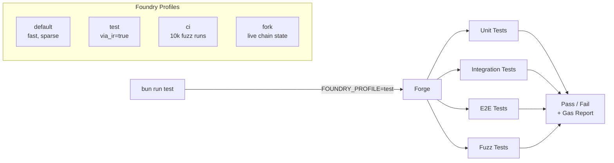

import {NextBestAction, StatusBadge} from "@site/src/components/docs";

# Forge Contract Testing

<StatusBadge status="Live" />



Smart contract tests use Foundry Forge, wrapped by bun scripts that manage profiles, environment, and exclusions.

## How To Approach Tests

Forge tests verify Solidity contract behavior in isolation and against live chain state. The guiding philosophy is: never use raw `forge` commands — always go through the bun script wrappers that set the correct profile, environment variables, and exclusion flags.

### Foundry Profiles

The `foundry.toml` in `packages/contracts/` defines multiple profiles, each targeting a different use case:

| Profile | `via_ir` | Purpose |
|---------|----------|---------|
| `default` | `false` (selective) | Local iteration; fastest builds via `sparse_mode = true` |
| `test` | `true` | Unit tests; separate `out-test` artifacts avoid stale cache |
| `ci` | `true` | GitHub Actions; 10,000 fuzz runs for thorough coverage |
| `fork` | `true` | Fork tests against live chains; 32 fuzz runs, 30M gas limit |
| `production` | `true` | Deploy builds; `optimizer_runs = 1` for smallest bytecode |

Certain contracts always require `via_ir` due to stack depth limits. The default profile uses `compilation_restrictions` to selectively enable it for `Action.sol`, `Deployment.sol`, `Karma.sol`, and mock contracts.

### Test Organization

All tests extend shared base contracts that provide common setup:

- **Unit tests** (`test/unit/`) -- isolated contract logic with mock dependencies
- **Integration tests** (`test/integration/`) -- multi-contract interaction with shared fixtures
- **E2E tests** (`test/E2E*.t.sol`) -- full protocol workflow from deploy through attestation
- **Fuzz tests** (`test/Fuzz*.t.sol`) -- property-based testing with configurable run count

## Completing Test Coverage

### ABI Encoding Convention

Resolvers use **tuple decode**, not struct decode. EAS stores attestation data as flat tuples (encoded by the client with `encodeAbiParameters`), so all resolver contracts must decode accordingly:

```solidity
// Correct: tuple decode
(string memory title, address contributor) = abi.decode(data, (string, address));

// Wrong: struct decode (will revert on real attestation data)
WorkData memory work = abi.decode(data, (WorkData));
```

### Mock Contracts

Mock contracts must implement **all** called functions, not just the ones under test. Import enums from the concrete contract, not the interface. All test addresses must be checksummed.

### Fork Test Patterns

Fork tests run against real chain state via RPC. They load RPC URLs through `vm.envString()` rather than `[rpc_endpoints]` in foundry.toml (which would cause all tests to fail if env vars are missing).

Fork tests use `ForkTestBase._deployFullStackOnFork()` which calls `_setupHatsTreeOnFork()` to bootstrap the Hats Protocol tree using real chain constants from `HatsLib.sol`.

## Running Tests

### Unit Tests

Always use bun scripts, never raw `forge` commands:

```bash
# Unit tests (excludes E2E and fork tests)
cd packages/contracts && bun run test

# Fast subset (excludes integration-heavy tests)
cd packages/contracts && bun run test:fast

# Match specific test files
cd packages/contracts && bun run test:match test/unit/MyContract.t.sol
```

The `bun run test` script sets `FOUNDRY_PROFILE=test` and applies `--no-match-contract 'E2E' --no-match-path 'test/fork/**'` automatically.

### Fork Tests

```bash
# Run all fork tests (requires RPC URLs in .env)
cd packages/contracts && bun run test:fork

# Chain-specific E2E fork tests
cd packages/contracts && bun run test:e2e:sepolia
cd packages/contracts && bun run test:e2e:arbitrum
cd packages/contracts && bun run test:e2e:celo
```

### Build System

The adaptive build system (`bun build`) defaults to fast mode (~2s cached) and only triggers a full build when necessary. For CI and deployments, use `bun build:full` which compiles with `--skip test --skip script`.

```bash
bun build                 # Adaptive (fast by default)
bun build:fast            # Force fast mode
bun build:full            # Full build (CI/deploy)
bun build:target -- src/registries/Action.sol  # Single target
```

### CI Integration

The `contracts-tests.yml` workflow runs on pushes and PRs touching `packages/contracts/`. It installs Foundry via `foundry-rs/foundry-toolchain@v1`, runs `bun run test` for unit tests, and has a separate `fork` job with a 90-minute timeout for chain-specific E2E tests.

## Resources

- [Foundry Book](https://book.getfoundry.sh/) -- Official Foundry documentation
- [Forge Test Reference](https://book.getfoundry.sh/reference/forge/forge-test) -- Test command reference
- Contract source: `packages/contracts/src/`
- Test source: `packages/contracts/test/`
- Build config: `packages/contracts/foundry.toml`
- CI workflow: `.github/workflows/contracts-tests.yml`

<NextBestAction
  title="Next: Playwright E2E Testing"
  why="Learn how to write end-to-end tests for the client PWA and admin dashboard."
  actionLabel="Playwright E2E Testing"
  actionHref="/builders/testing/playwright"
/>
