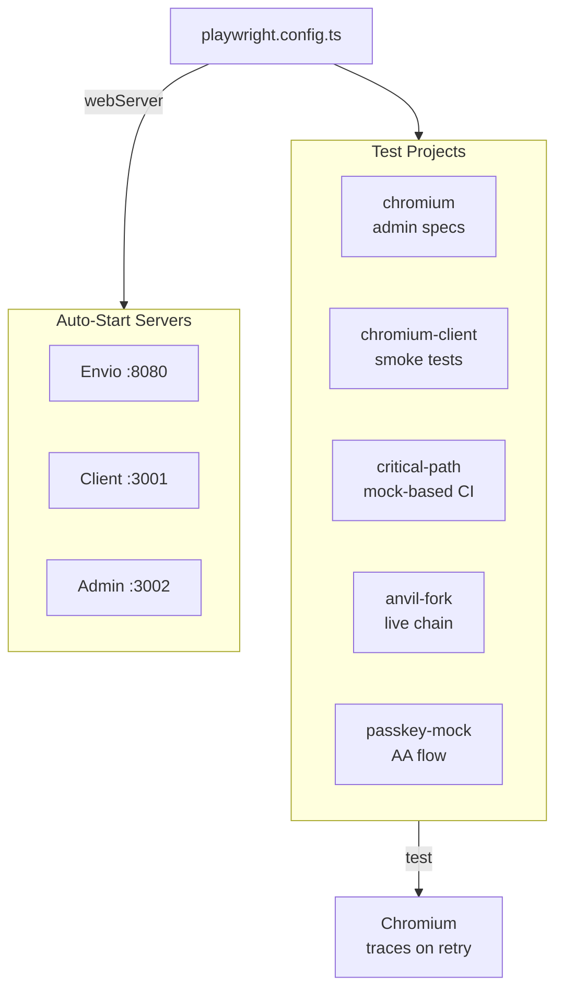

import {NextBestAction, StatusBadge} from "@site/src/components/docs";

# Playwright E2E Testing

<StatusBadge status="Live" />



End-to-end tests validate the client PWA and admin dashboard using Playwright, with fixtures for Anvil fork interaction and mock-based critical path testing.

## How To Approach Tests

Playwright E2E tests verify complete user journeys through the browser — from page navigation to blockchain interaction. The philosophy is to keep E2E tests focused on critical paths, using mock-based CI variants for speed and Anvil fork variants for fidelity.

### Test Directory Structure

Tests live in the `tests/` directory at the monorepo root:

```
tests/
  fixtures/         # Anvil fork, contract helpers, config
  helpers/          # Shared test utilities
  mocks/            # Pimlico bundler/paymaster mocks
  specs/            # Test specifications
  global-setup.ts   # Pre-test environment bootstrap
  global-teardown.ts
```

### Test Projects

The config defines several Playwright projects for different testing scopes:

| Project | Matches | Purpose |
|---------|---------|---------|
| `chromium` | `admin*.spec.ts` | Admin dashboard tests |
| `chromium-client` | `client.smoke.spec.ts` | Client smoke tests (default CI) |
| `critical-path` | `*.ci.spec.ts` | Mock-based critical UI flows |
| `performance` | `performance.spec.ts` | Load time and resource checks |
| `anvil-fork` | `*.fork.spec.ts` | Tests with local Anvil fork (60s timeout) |
| `passkey-mock` | `*.passkey.spec.ts` | Passkey E2E with mocked Pimlico |
| `client-full` | `client*.spec.ts` | Full client suite (optional) |

Mobile projects (`mobile-chrome`, `mobile-safari`) are available but disabled by default -- enable with `--project`.

### Web Server Configuration

Playwright config (`playwright.config.ts`) auto-starts three web servers when running locally: the Envio indexer on port 8080, client on 3001, and admin on 3002. Set `SKIP_WEBSERVER=true` to use already-running services.

## Completing Test Coverage

### Spec Conventions

Spec files follow the naming pattern `{package}.{feature}.spec.ts`:

- `client.navigation.spec.ts` -- Client routing and page transitions
- `client.work-submission.spec.ts` -- Full work submission flow
- `admin.auth.spec.ts` -- Admin authentication and role checks
- `client.offline-sync.spec.ts` -- Offline-first behavior and sync

CI-specific variants (`*.ci.spec.ts`) use lightweight mocks instead of real infrastructure, enabling faster and more reliable CI runs.

### Test Fixtures

#### Anvil Fork Fixture

The `anvil-fork.ts` fixture spawns a local Anvil process forking from Sepolia, providing:

- `testClient` -- Anvil manipulation (mine blocks, set balances, impersonate)
- `publicClient` -- Read operations against forked state
- `walletClient` -- Write operations with test accounts

```typescript
const context = await startAnvilFork();
try {
  await context.testClient.setBalance({
    address: TEST_ACCOUNTS.gardener1.address,
    value: parseEther('100'),
  });
  // ... test blockchain interactions
} finally {
  await context.cleanup();
}
```

#### Contract Helpers

The `contract-helpers.ts` fixture provides deployment artifact types and utility functions for interacting with deployed contracts during E2E tests. It reads addresses from `packages/contracts/deployments/{chainId}-latest.json`.

## Running Tests

```bash
# Run default CI test suite
npx playwright test

# Run specific project
npx playwright test --project=chromium

# Run a single spec file
npx playwright test tests/specs/client.navigation.spec.ts

# Run with UI mode for debugging
npx playwright test --ui
```

### Configuration Details

Key settings from `playwright.config.ts`:

- **Retries**: 1 locally, 2 in CI
- **Workers**: 4 locally, 2 in CI
- **Traces**: Captured on first retry
- **Video**: Retained on failure (local only)
- **Screenshots**: Only on failure
- **Timeouts**: 30s navigation, 15s actions; fork tests get 60s, testnet gets 120s

The global setup (`global-setup.ts`) bootstraps the test environment, and `global-teardown.ts` handles cleanup. Both use ESM-compatible imports.

## Resources

- [Playwright Documentation](https://playwright.dev/docs/intro) -- Official Playwright docs
- [Playwright Test API](https://playwright.dev/docs/api/class-test) -- Test API reference
- Test specs: `tests/specs/`
- Test fixtures: `tests/fixtures/`
- Playwright config: `playwright.config.ts`

<NextBestAction
  title="Next: Vitest Unit Testing"
  why="Learn how to write unit and integration tests for TypeScript packages with Vitest."
  actionLabel="Vitest Unit Testing"
  actionHref="/builders/testing/vitest"
/>
