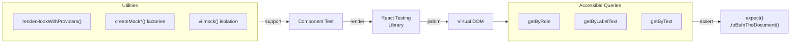

import {NextBestAction, StatusBadge} from "@site/src/components/docs";

# React Testing Library

<StatusBadge status="Live" />



Component and hook tests use Vitest with React Testing Library. All shared hooks are tested in `packages/shared/src/__tests__/`, while component tests live alongside their respective packages.

## How To Approach Tests

React Testing Library encourages testing components the way users interact with them — through accessible queries and real DOM behavior, not implementation details. The philosophy: if a user can't see it or interact with it, the test shouldn't depend on it.

### Test Environment

Tests use `@vitest-environment jsdom` for browser API emulation. Each test file can specify its environment via a docblock comment at the top:

```typescript
/**
 * @vitest-environment jsdom
 */
```

The `beforeEach` block should call `vi.clearAllMocks()` to reset mock state between tests.

### Test Utilities

The shared test utilities in `packages/shared/src/__tests__/test-utils/` provide wrappers that set up the provider tree needed by most hooks and components.

#### `createTestWrapper`

Wraps components with `QueryClientProvider` and `IntlProvider`:

```typescript
import { createTestWrapper, createTestQueryClient } from '../test-utils';

const queryClient = createTestQueryClient();
const wrapper = createTestWrapper(queryClient);

const { result } = renderHook(() => useMyHook(), { wrapper });
```

The test `QueryClient` disables retries, garbage collection, and stale time to make tests deterministic.

#### `renderHookWithProviders`

A convenience wrapper that combines `renderHook` with the full provider setup:

```typescript
import { renderHookWithProviders } from '../test-utils';

const { result } = renderHookWithProviders(() => useGardenActions(address, chainId));
```

#### `createIntlWrapper`

For hooks that need `IntlProvider` but not React Query:

```typescript
import { createIntlWrapper } from '../test-utils';

const { result } = renderHook(() => useTranslation(), {
  wrapper: createIntlWrapper(),
});
```

## Completing Test Coverage

### Testing Hooks vs Components

#### Hook Tests

Most business logic lives in hooks within `@green-goods/shared`. Test hooks by:

1. Mocking external dependencies (`vi.mock`)
2. Rendering the hook with `renderHookWithProviders`
3. Asserting on `result.current` values and mock call arguments

```typescript
it("passes correct query key", () => {
  useGardenActions(GARDEN, CHAIN_ID);
  expect(mockUseQuery).toHaveBeenCalledWith(
    expect.objectContaining({
      queryKey: ["greengoods", "actions", "byGarden", GARDEN, CHAIN_ID],
    })
  );
});
```

#### Component Tests

Component tests in `packages/admin` and `packages/client` focus on rendering and user interaction:

```typescript
import { render, screen } from "@testing-library/react";
import userEvent from "@testing-library/user-event";

it("renders the action card", () => {
  render(<ActionCard action={mockAction} />, { wrapper: createTestWrapper() });
  expect(screen.getByText(mockAction.title)).toBeInTheDocument();
});
```

Use accessibility-first queries (`getByRole`, `getByLabelText`) over `getByTestId`. Test IDs are a last resort.

### Mock Patterns

#### Module Mocking

Hooks are tested by mocking their dependencies at the module level with `vi.mock()`. The convention is to declare mocks before imports:

```typescript
const mockGetGardenActions = vi.fn();
vi.mock("../../../modules/data/greengoods", () => ({
  getGardenActions: (...args: unknown[]) => mockGetGardenActions(...args),
}));

const mockUseQuery = vi.fn();
vi.mock("@tanstack/react-query", () => ({
  useQuery: (options: any) => mockUseQuery(options),
}));

// Import the hook under test AFTER mocks
import { useGardenActions } from "../../../hooks/action/useGardenActions";
```

#### Mock Factories

The `mock-factories.ts` file exports `createMock*` factory functions for generating test data with sensible defaults:

```typescript
import { createMockGarden, createMockAction } from '../test-utils';

const garden = createMockGarden({ name: 'Test Garden' });
const action = createMockAction({ gardenAddress: garden.address });
```

Always use these factories instead of hand-crafting test objects -- they ensure type safety and keep tests resilient to schema changes.

## Running Tests

Tests run through Vitest (never bun's built-in test runner):

```bash
# Run all tests across the monorepo
bun run test

# Run tests for a specific package
cd packages/shared && bun run test
cd packages/admin && bun run test
cd packages/client && bun run test

# Watch mode
cd packages/shared && bun run test:watch
```

:::warning
Always use `bun run test`, never `bun test`. The latter uses bun's built-in runner which ignores vitest configuration, environment setup, and test utilities.
:::

### CI Integration

Per-package test workflows run on push/PR to `main` and `develop`, triggered by path filters. The shared package workflow additionally generates coverage reports.

## Resources

- [React Testing Library Documentation](https://testing-library.com/docs/react-testing-library/intro/) -- Official RTL docs
- [Testing Library Queries](https://testing-library.com/docs/queries/about) -- Query priority guide
- Test utilities: `packages/shared/src/__tests__/test-utils/`
- Mock factories: `packages/shared/src/__tests__/test-utils/mock-factories.ts`

<NextBestAction
  title="Next: Storybook Testing"
  why="Learn how to document and visually test components with Storybook."
  actionLabel="Storybook Testing"
  actionHref="/builders/testing/storybook"
/>
