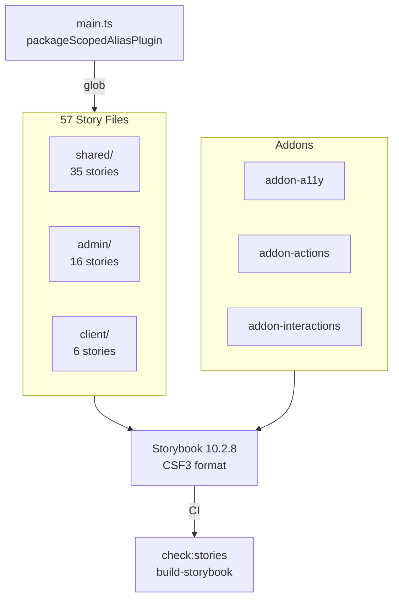

import {NextBestAction, StatusBadge} from "@site/src/components/docs";

# Storybook Testing

<StatusBadge status="Live" />



Storybook serves as the component documentation and visual testing layer. Stories span all three UI packages (shared, admin, client) and are aggregated into a single Storybook instance hosted from `packages/shared`.

## How To Approach Tests

Storybook stories serve a dual purpose: living component documentation and visual regression testing. The philosophy is that every exported component should have a story, and stories should demonstrate the component's full range of states — default, edge cases, responsive behavior, and error states.

### Architecture

The Storybook config lives at `packages/shared/.storybook/main.ts` and pulls stories from three glob patterns:

```typescript
stories: [
  "../src/**/*.stories.@(ts|tsx)",                        // shared
  "../../../packages/admin/src/**/*.stories.@(ts|tsx)",   // admin
  "../../../packages/client/src/**/*.stories.@(ts|tsx)",  // client
]
```

A custom `packageScopedAliasPlugin` Vite plugin resolves `@/` imports dynamically based on the importing file's package. Files under `packages/admin/` resolve `@/` to `packages/admin/src/`, and files under `packages/client/` resolve to `packages/client/src/`.

### Addons

Three addons are configured (order matters -- actions must precede interactions):

1. `@storybook/addon-a11y` -- Accessibility audits via axe-core
2. `@storybook/addon-actions` -- Action logging for event handlers
3. `@storybook/addon-interactions` -- Step-through interaction tests

## Completing Test Coverage

### Story Format

All stories use Component Story Format 3 (CSF3). Each story file exports a `meta` default export and named story exports:

```typescript
import type { Meta, StoryObj } from "@storybook/react";
import { MyComponent } from "./MyComponent";

const meta = {
  title: "Shared/Components/MyComponent",
  component: MyComponent,
  tags: ["autodocs"],
} satisfies Meta<typeof MyComponent>;

export default meta;
type Story = StoryObj<typeof meta>;

export const Default: Story = {
  args: { label: "Click me" },
};

export const Disabled: Story = {
  args: { label: "Disabled", disabled: true },
};
```

### Title Hierarchy

Stories are organized by package in the sidebar:

- `Shared/Components/*` -- Design system primitives (Button, Card, Badge)
- `Shared/Tokens/*` -- Design token documentation (Colors, Typography, Shadows, Animations)
- `Admin/Components/*` -- Admin-specific components
- `Admin/Views/*` -- Admin page-level stories
- `Client/Components/*` -- Client-specific components

### Design Token Stories

The `packages/shared/src/components/Tokens/` directory contains stories that document the design system's visual language:

- `Colors.stories.tsx` -- Semantic color tokens from `theme.css`
- `Typography.stories.tsx` -- Font scales and text styles
- `Shadows.stories.tsx` -- Elevation levels
- `Animations.stories.tsx` -- Motion tokens

These are not interactive components -- they serve as living documentation of the design system.

### Mock Patterns in Stories

Stories that depend on React Query or routing use decorators to provide the necessary context:

```typescript
export default {
  title: "Admin/Components/GardenCard",
  decorators: [
    (Story) => (
      <QueryClientProvider client={createTestQueryClient()}>
        <MemoryRouter>
          <Story />
        </MemoryRouter>
      </QueryClientProvider>
    ),
  ],
};
```

For components that rely on shared hooks, mock the hook return values using `parameters` or wrapper decorators rather than mocking modules directly.

### Viewport Patterns

Stories for responsive components include viewport-specific stories:

```typescript
export const Mobile: Story = {
  parameters: {
    viewport: { defaultViewport: "mobile1" },
  },
};
```

Admin components use standard responsive breakpoints (`sm:`, `md:`, `lg:`), while some client components use container queries (`@[480px]:`) for container-aware responsiveness.

## Running Tests

```bash
# Development server
cd packages/shared && bun run storybook

# Build static site
cd packages/shared && bun run build-storybook

# Check story coverage (CI gate)
cd packages/shared && bun run check:stories
```

### CI Integration

The `storybook.yml` workflow triggers on PRs that modify component files in any of the three packages. It runs two checks:

1. **Story coverage** (`check:stories`) -- Ensures all exported components have corresponding stories
2. **Build verification** (`build-storybook`) -- Confirms the static Storybook site compiles without errors

The built artifact is uploaded via `actions/upload-artifact@v4` for review.

## Resources

- [Storybook Documentation](https://storybook.js.org/docs) -- Official Storybook docs
- [CSF3 Format](https://storybook.js.org/docs/api/csf) -- Component Story Format reference
- Storybook config: `packages/shared/.storybook/main.ts`
- Design tokens: `packages/shared/src/components/Tokens/`
- CI workflow: `.github/workflows/storybook.yml`

<NextBestAction
  title="Next: Test Cases"
  why="Learn about the test case structure and quality standards across the project."
  actionLabel="Test Cases"
  actionHref="/builders/quality/test-cases"
/>
