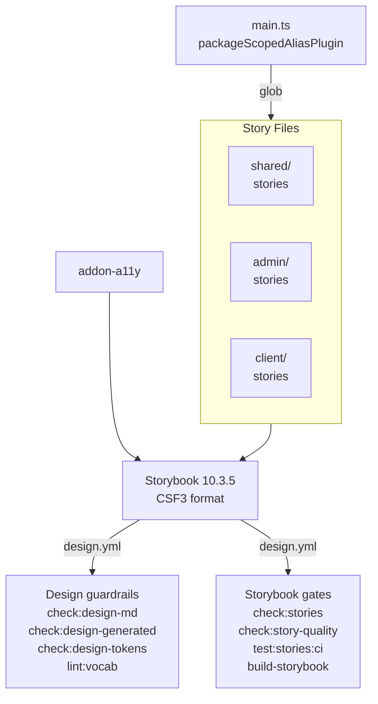

import {NextBestAction, StatusBadge} from "@site/src/components/docs";

# Storybook Testing

<StatusBadge status="Live" />



Storybook serves as the component documentation and local interaction layer. Stories span all three UI packages (shared, admin, client) and are aggregated into a single Storybook instance hosted from `packages/shared`.

The public component library deploys as a standalone Vercel-hosted Storybook site at `https://design.greengoods.app/`. The deployed build uses the public browser dialect as its Storybook chrome and exposes the design-tool import bundle from the same root URL. GitHub Actions validates the build through `design.yml`; Vercel owns publication.

## How To Approach Tests

Storybook stories serve two practical purposes: living component documentation and a fast local surface for exploring component states. The philosophy is that every shared foundation should have a story, and stories should demonstrate the component's range of states — default, edge cases, responsive behavior, and error states.

Storybook is now a light regression gate. The repo CI verifies the DesignMD contract, generated artifacts, design-token runtime projection, banned vocabulary, required Storybook coverage for shared foundations plus curated admin surfaces and client dialect shell stories, story-quality guardrails for admin, shared Canvas, and curated client PWA/public stories, a small browser-mode Storybook test lane for `storybook-ci` stories, then builds the unified Storybook to catch compile-time issues. Keep the CI tag curated; do not tag every story by default.

### Architecture

The Storybook config lives at `packages/shared/.storybook/main.ts` and pulls stories from three glob patterns:

```typescript
stories: [
  "../src/**/*.stories.@(ts|tsx)",                        // shared
  "../../../packages/admin/src/**/*.stories.@(ts|tsx)",   // admin
  "../../../packages/client/src/**/*.stories.@(ts|tsx)",  // client
]
```

A custom `packageScopedAliasPlugin` Vite plugin resolves `@/` imports dynamically based on the importing file's package. Files under `packages/admin/` resolve `@/` to `packages/admin/src/`, and files under `packages/client/` resolve to `packages/client/src/`.

The preview CSS imports the shared theme plus the admin M3 token/override CSS used by `Admin/*` stories. Shell and canvas stories should use private helpers from `packages/shared/.storybook` so their frame matches the intended canvas context without depending on package app entrypoints.

### Addons

The current Storybook config enables:

1. `@storybook/addon-a11y` -- Accessibility audits via axe-core
2. `@storybook/addon-docs` -- Autodocs pages for `tags: ["autodocs"]`
3. `@storybook/addon-vitest` -- Browser-mode story smoke and `play()` tests
4. `@storybook/addon-mcp` -- Local MCP endpoint for agent access to Storybook knowledge
5. `@chromatic-com/storybook` -- Visual testing UI integration when Chromatic is configured

## Completing Test Coverage

### Story Format

All stories use Component Story Format 3 (CSF3). Each story file exports a `meta` default export and named story exports:

```typescript
import type { Meta, StoryObj } from "@storybook/react";
import { MyComponent } from "./MyComponent";

const meta = {
  title: "Shared/Primitives/MyComponent",
  component: MyComponent,
  tags: ["autodocs"],
} satisfies Meta<typeof MyComponent>;

export default meta;
type Story = StoryObj<typeof meta>;

export const Default: Story = {
  args: { label: "Click me" },
};

export const Disabled: Story = {
  args: { label: "Disabled", disabled: true },
};
```

### Title Hierarchy

Stories are organized by package and ownership in the sidebar:

- `Shared/Primitives/*`, `Shared/Canvas/*`, `Shared/Form/*`, `Shared/Feedback/*`, `Shared/Display/*`, `Shared/Cards/*`, `Shared/Progress/*` -- Storybook-backed shared foundations
- `Shared/Tokens/*` -- Design token documentation (colors, typography, shadows, animation, material roles)
- `Admin/Primitives/*` -- Admin-only `Admin*` wrappers
- `Admin/Shell/*` -- Admin-owned canvas shell and account surfaces
- `Admin/Workflows/*` -- Curated reusable admin workflow surfaces
- `Client/PWA/*` -- Installed-PWA shell, status, and protected route state catalogs
- `Client/Public/*` -- Public browser shell, route frames, and website navigation
- `Client/*` -- Legacy client component stories outside the required contract until they are migrated

For consolidated state views, prefer a `StateCatalog` story name over generic `Gallery`. Keep individual stories for states that agents need to link to directly, and use the theme toolbar instead of adding one-off dark-mode duplicates unless the component has a dark-mode-specific behavior.

### Deterministic Fixtures

Admin stories and shared stories consumed by admin must be deterministic:

- Use fixture helpers from `packages/shared/.storybook/fixtures.ts`.
- Do not use `Date.now()`, zero-argument `new Date()`, `picsum.photos`, or placeholder IPFS CIDs.
- Use the frozen Storybook clock (`STORYBOOK_NOW_SECONDS`, `hoursAgo`, `daysAgo`, `daysFromNow`) for relative-time or expiry states.
- Use data URL fixture images (`FIXTURE_WORK_MEDIA`, `FIXTURE_IMAGE_*`) instead of live external media.

This is the model for future shared/client cleanup. Full cleanup can happen incrementally, but anything that backs admin review or the client PWA/public shell contract should follow it now.

### Design Token Stories

The `packages/shared/src/components/Tokens/` directory contains stories that document the design system's visual language:

- `Colors.stories.tsx` -- Semantic color tokens from `theme.css`
- `Typography.stories.tsx` -- Font scales and text styles
- `Shadows.stories.tsx` -- Elevation levels
- `Animations.stories.tsx` -- Motion tokens
- `DesignToolImports.stories.tsx` -- Import map for Google Stitch, Claude Design, Storybook MCP, and other tools

These are not interactive components -- they serve as living documentation of the design system.

### Design Tool Imports

Storybook prepares a generated static bundle before local dev, test, and build commands run:

```bash
cd packages/shared && bun run storybook:prepare-design-assets
```

The bundle is served from the Storybook root. In the Vercel standalone deploy, that means:

- `https://design.greengoods.app/DESIGN.md` -- canonical Warm Earth DesignMD source
- `https://design.greengoods.app/DESIGN.browser.md` -- preferred public-browser dialect for the component library
- `https://design.greengoods.app/design-md.generated.json` -- machine-readable DesignMD tokens
- `https://design.greengoods.app/theme.css` -- runtime CSS token projection
- `https://design.greengoods.app/storybook-design-manifest.json` -- machine-readable map across design files, story roots, and import surfaces
- `https://design.greengoods.app/index.json` -- Storybook component and state catalog
- `https://design.greengoods.app/social-card.png` -- 1200x630 social preview image for shared Storybook links

Google Stitch should load the root DesignMD file, the browser dialect file, and the generated token JSON. Claude Design should load the same files plus `index.json` so it can reference actual story roots and component states. Storybook MCP remains a local development server capability via `@storybook/addon-mcp`; the static deploy provides the shareable story index and design exports.

### Vercel Deploy

Standalone Storybook publication is owned by Vercel, not GitHub Actions. Configure the Vercel project with:

1. **Root Directory** -- `packages/shared`
2. **Include source files outside of the Root Directory in the Build Step** -- enabled
3. **Build config** -- read from `packages/shared/vercel.json`
4. **Production domain** -- `design.greengoods.app`

The shared-package `vercel.json` moves back to the repository root during install/build commands so Bun can resolve the workspace lockfile and cross-package Storybook stories, then serves `packages/shared/storybook-static` as the root of `design.greengoods.app`.

The standalone site also injects Open Graph and Twitter card metadata through Storybook head files. Storybook root URLs and `?path=/docs/...` URLs share the same social preview image because the manager shell serves those routes from one static HTML entrypoint.

### Agent Workflow

For agent-driven TDD, treat Storybook as the state catalog and Vitest/RTL as the assertion layer:

1. add or update a real component story by default; use a mock-only render only when the story is clearly tagged `visual-harness`
2. use deterministic fixtures from `packages/shared/.storybook/fixtures.ts` or `adminFixtures.ts`
3. use `StateCatalog` for state matrices instead of generic `Gallery`; keep axis catalogs such as `VariantGallery` and `SizeGallery`
4. write the focused Vitest/RTL test for the behavior or contract
5. add a `play()` interaction only when it catches meaningful behavior without making the story brittle
6. tag only stable, high-value story files with `storybook-ci`
7. use Storybook locally to inspect the resulting UI states and interaction paths

That keeps stories useful for exploration without turning CI into a slow, brittle browser harness.

### New Admin Component Flow

When adding an admin UI component, build the Storybook state catalog before wiring the component deeply into a route:

1. decide ownership first: reusable primitive, hook, provider, store, or config goes in `@green-goods/shared`; admin-only workflow or shell composition stays in `packages/admin`
2. compose from existing shared Canvas primitives and admin `Admin*` wrappers before adding a new wrapper
3. add a co-located CSF3 story with deterministic fixtures and the relevant `packages/shared/.storybook` decorators
4. render the real component by default; use `visual-harness` only for audited wallet-bound or provider-bound exceptions
5. cover the useful state catalog: default, loading, empty, error, permission/role, edge, and responsive states where applicable
6. add focused Vitest/RTL tests for behavior Storybook cannot prove, such as permissions, routing, mutation handling, and data transforms
7. wire the component into the admin route after the Storybook surface is coherent
8. run `check:stories`, `check:story-quality`, and `build-storybook`; run `test:stories:ci` only when adding or changing curated `storybook-ci` coverage

This keeps Storybook as the first operator-visible review surface while preserving tests as the assertion layer.

### Mock Patterns in Stories

Stories that depend on React Query or routing use decorators to provide the necessary context:

```typescript
export default {
  title: "Admin/Workflows/GardenCard",
  decorators: [withRouter(["/garden"])],
};
```

Private Storybook helpers live under `packages/shared/.storybook`. Prefer those helpers for router, query, theme, and canvas wrappers before adding one-off decorators. For components that rely on shared hooks, mock the hook return values using `parameters` or wrapper decorators rather than mocking modules directly.

### Viewport Patterns

Stories for responsive components include viewport-specific stories:

```typescript
export const Mobile: Story = {
  parameters: {
    viewport: { defaultViewport: "mobile1" },
  },
};
```

Admin components use standard responsive breakpoints (`sm:`, `md:`, `lg:`), while some client components use container queries (`@[480px]:`) for container-aware responsiveness.

## Running Tests

```bash
# Development server
cd packages/shared && bun run storybook

# Curated browser-mode Storybook smoke / play tests
cd packages/shared && bun run test:stories:ci

# Build static site
cd packages/shared && bun run build-storybook

# Check the required Storybook contract for shared foundations, curated admin surfaces,
# and required client PWA/public shell stories (CI gate)
cd packages/shared && bun run check:stories

# Check admin/shared Canvas plus curated client shell story determinism and harness conventions
cd packages/shared && bun run check:story-quality
```

### CI Integration

The `design.yml` workflow triggers on PRs that modify DesignMD files, Storybook config, story files, the curated story coverage contract, and component or view files that feed the unified Storybook build. It runs eight required command gates:

1. **DesignMD lint** (`check:design-md`) -- Validates the root, admin, client, and docs DesignMD files
2. **Generated DesignMD artifacts** (`check:design-generated`) -- Confirms generated design artifacts are current
3. **Design-token contract** (`check:design-tokens`) -- Confirms the shared theme runtime projection still exposes the expected Warm Earth tokens
4. **Vocabulary guardrail** (`lint:vocab`) -- Blocks banned product and UI vocabulary across protected surfaces
5. **Storybook contract** (`check:stories`) -- Ensures shared foundations, curated admin surfaces, and required client PWA/public shell stories have corresponding stories
6. **Story quality** (`check:story-quality`) -- Catches nondeterministic fixtures, unmarked mock harnesses, generic gallery exports, and dark-mode duplicate stories across the protected Storybook surface
7. **Storybook interaction smoke** (`test:stories:ci`) -- Runs browser-mode Vitest against curated `storybook-ci` stories
8. **Build verification** (`build-storybook`) -- Confirms the static Storybook site compiles without errors across shared, admin, and client stories

The built artifact is uploaded via `actions/upload-artifact@v4` for review.

### Chromatic Flow

Chromatic runs after the local Storybook gates, not instead of them:

1. `check:stories` verifies that required shared foundations and curated admin surfaces have stories.
2. `test:stories:ci` runs browser-mode Vitest against stable `storybook-ci` stories.
3. `build-storybook` creates `packages/shared/storybook-static` and uploads it as the CI review artifact.
4. If `CHROMATIC_PROJECT_TOKEN` is configured, `bun run --filter @green-goods/shared chromatic -- --exit-zero-on-changes` publishes that built Storybook to Chromatic.

The first lane is intentionally non-blocking for visual diffs: `--exit-zero-on-changes` lets Chromatic collect baselines and surface screenshot changes without failing the PR while the design lane is being established. Once the team has approved baselines and decided which component roots should be visual-release gates, remove `--exit-zero-on-changes` and protect the Chromatic check.

The standalone component library deploy is owned by Vercel. The Storybook GitHub Actions lane remains the validation gate for Storybook coverage, interaction smoke tests, and the static Storybook build artifact.

The docs deploy is owned by `docs.yml` and only ships Docusaurus. The standalone component library deploy is owned by Vercel, while `design.yml` remains the GitHub Actions validation gate for design tokens, Storybook coverage, interaction smoke tests, and the static Storybook build artifact.

## Resources

- [Storybook Documentation](https://storybook.js.org/docs) -- Official Storybook docs
- [CSF3 Format](https://storybook.js.org/docs/api/csf) -- Component Story Format reference
- Storybook config: `packages/shared/.storybook/main.ts`
- Design tokens: `packages/shared/src/components/Tokens/`
- CI workflow: `.github/workflows/design.yml`
- Storybook deploy config: `packages/shared/vercel.json`

<NextBestAction
  title="Next: Test Cases"
  why="Learn about the test case structure and quality standards across the project."
  actionLabel="Test Cases"
  actionHref="/builders/quality/test-cases"
/>
