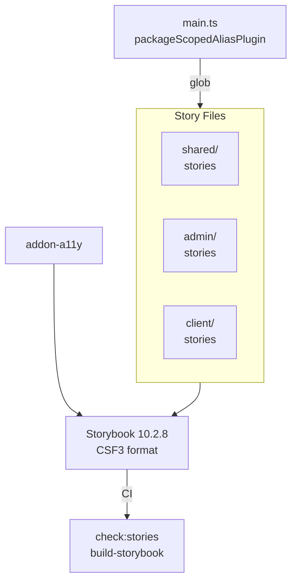

import {NextBestAction, StatusBadge} from "@site/src/components/docs";

# Storybook Testing

<StatusBadge status="Live" />



Storybook serves as the component documentation and local interaction layer. Stories span all three UI packages (shared, admin, client) and are aggregated into a single Storybook instance hosted from `packages/shared`.

## How To Approach Tests

Storybook stories serve two practical purposes: living component documentation and a fast local surface for exploring component states. The philosophy is that every shared foundation should have a story, and stories should demonstrate the component's range of states — default, edge cases, responsive behavior, and error states.

Storybook is not currently a standalone regression gate. The repo CI verifies the required Storybook contract for shared foundations plus curated admin surfaces, then builds the unified Storybook to catch compile-time issues. `play()` functions are valuable local interaction checks, but they are not executed in CI today.

### Architecture

The Storybook config lives at `packages/shared/.storybook/main.ts` and pulls stories from three glob patterns:

```typescript
stories: [
  "../src/**/*.stories.@(ts|tsx)",                        // shared
  "../../../packages/admin/src/**/*.stories.@(ts|tsx)",   // admin
  "../../../packages/client/src/**/*.stories.@(ts|tsx)",  // client
]
```

A custom `packageScopedAliasPlugin` Vite plugin resolves `@/` imports dynamically based on the importing file's package. Files under `packages/admin/` resolve `@/` to `packages/admin/src/`, and files under `packages/client/` resolve to `packages/client/src/`.

The preview CSS imports the shared theme plus the admin M3 token/override CSS used by `Admin/*` stories. Shell and canvas stories should use private helpers from `packages/shared/.storybook` so their frame matches the intended canvas context without depending on package app entrypoints.

### Addons

The current Storybook config enables:

1. `@storybook/addon-a11y` -- Accessibility audits via axe-core

## Completing Test Coverage

### Story Format

All stories use Component Story Format 3 (CSF3). Each story file exports a `meta` default export and named story exports:

```typescript
import type { Meta, StoryObj } from "@storybook/react";
import { MyComponent } from "./MyComponent";

const meta = {
  title: "Shared/Primitives/MyComponent",
  component: MyComponent,
  tags: ["autodocs"],
} satisfies Meta<typeof MyComponent>;

export default meta;
type Story = StoryObj<typeof meta>;

export const Default: Story = {
  args: { label: "Click me" },
};

export const Disabled: Story = {
  args: { label: "Disabled", disabled: true },
};
```

### Title Hierarchy

Stories are organized by package and ownership in the sidebar:

- `Shared/Primitives/*`, `Shared/Canvas/*`, `Shared/Form/*`, `Shared/Feedback/*`, `Shared/Display/*`, `Shared/Cards/*`, `Shared/Progress/*` -- Storybook-backed shared foundations
- `Shared/Tokens/*` -- Design token documentation (colors, typography, shadows, animation, material roles)
- `Admin/Primitives/*` -- Admin-only `Admin*` wrappers
- `Admin/Shell/*` -- Admin-owned canvas shell and account surfaces
- `Admin/Workflows/*` -- Curated reusable admin workflow surfaces
- `Client/*` -- Existing client component stories only

For consolidated state views, prefer a `StateCatalog` story name over generic `Gallery`. Keep individual stories for states that agents need to link to directly, and use the theme toolbar instead of adding one-off dark-mode duplicates unless the component has a dark-mode-specific behavior.

### Design Token Stories

The `packages/shared/src/components/Tokens/` directory contains stories that document the design system's visual language:

- `Colors.stories.tsx` -- Semantic color tokens from `theme.css`
- `Typography.stories.tsx` -- Font scales and text styles
- `Shadows.stories.tsx` -- Elevation levels
- `Animations.stories.tsx` -- Motion tokens

These are not interactive components -- they serve as living documentation of the design system.

### Agent Workflow

For agent-driven TDD, treat Storybook as the state catalog and Vitest/RTL as the assertion layer:

1. add or update the story that expresses the intended state
2. write the focused Vitest/RTL test for the behavior or contract
3. use Storybook locally to inspect the resulting UI states and interaction paths

That keeps stories useful for exploration without turning CI into a slow, brittle browser harness.

### Mock Patterns in Stories

Stories that depend on React Query or routing use decorators to provide the necessary context:

```typescript
export default {
  title: "Admin/Workflows/GardenCard",
  decorators: [withRouter(["/garden"])],
};
```

Private Storybook helpers live under `packages/shared/.storybook`. Prefer those helpers for router, query, theme, and canvas wrappers before adding one-off decorators. For components that rely on shared hooks, mock the hook return values using `parameters` or wrapper decorators rather than mocking modules directly.

### Viewport Patterns

Stories for responsive components include viewport-specific stories:

```typescript
export const Mobile: Story = {
  parameters: {
    viewport: { defaultViewport: "mobile1" },
  },
};
```

Admin components use standard responsive breakpoints (`sm:`, `md:`, `lg:`), while some client components use container queries (`@[480px]:`) for container-aware responsiveness.

## Running Tests

```bash
# Development server
cd packages/shared && bun run storybook

# Build static site
cd packages/shared && bun run build-storybook

# Check the required Storybook contract for shared foundations + curated admin surfaces (CI gate)
cd packages/shared && bun run check:stories
```

### CI Integration

The `storybook.yml` workflow triggers on PRs that modify Storybook config, story files, the curated story coverage contract, and component or view files that feed the unified Storybook build. It runs two checks:

1. **Storybook contract** (`check:stories`) -- Ensures shared foundations plus curated admin surfaces have corresponding stories
2. **Build verification** (`build-storybook`) -- Confirms the static Storybook site compiles without errors across shared, admin, and client stories

The built artifact is uploaded via `actions/upload-artifact@v4` for review.

## Resources

- [Storybook Documentation](https://storybook.js.org/docs) -- Official Storybook docs
- [CSF3 Format](https://storybook.js.org/docs/api/csf) -- Component Story Format reference
- Storybook config: `packages/shared/.storybook/main.ts`
- Design tokens: `packages/shared/src/components/Tokens/`
- CI workflow: `.github/workflows/storybook.yml`

<NextBestAction
  title="Next: Test Cases"
  why="Learn about the test case structure and quality standards across the project."
  actionLabel="Test Cases"
  actionHref="/builders/quality/test-cases"
/>
