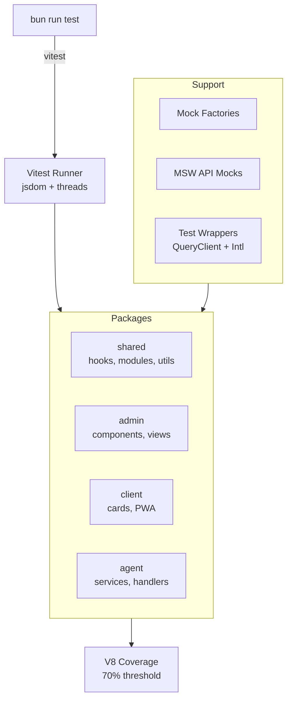

import {NextBestAction, StatusBadge} from "@site/src/components/docs";

# Vitest

<StatusBadge status="Live" />



Unit and integration testing framework for all TypeScript packages. Each package has its own `vitest.config.ts` with package-specific aliases, environment settings, and coverage thresholds.

## How To Approach Tests

Vitest is the standard test runner for all TypeScript packages in the monorepo. The key philosophy: each package owns its test configuration, but shared utilities and mock factories live in `@green-goods/shared` to keep tests consistent and resilient to schema changes.

### Critical: `bun run test` not `bun test`

`bun test` invokes Bun's built-in test runner, which **ignores vitest configuration entirely** (setup files, aliases, environment, coverage thresholds). Always use `bun run test`, which runs the `test` script from `package.json` and properly invokes vitest.

### Workspace Configuration

Each package has its own `vitest.config.ts`:

| Package | Environment | Setup File | Key Aliases |
|---------|-------------|------------|-------------|
| **shared** | `jsdom` | `src/__tests__/setupTests.ts` | EAS SDK mock, WalletConnect mock, React dedup |
| **admin** | `jsdom` | `src/__tests__/setup.ts` | `@green-goods/shared` subpath aliases |
| **client** | `jsdom` | `src/__tests__/setup.ts` | Similar to admin |
| **agent** | `node` | `src/__tests__/setup.ts` | Node-specific mocks |

All packages use:
- **Thread pool** (`pool: "threads"`) for parallel test execution
- **V8 coverage** provider with 70% thresholds (branches, functions, lines, statements)
- **10-second timeout** per test

### React Deduplication

A critical configuration detail: vitest aliases force all React imports (including those from `@green-goods/shared` and its transitive dependencies) to resolve to a single React instance. Without this, hooks fail with "Invalid hook call" errors due to multiple React runtimes.

## Completing Test Coverage

### Mock Factories

The shared package provides typed mock factories in `packages/shared/src/__tests__/test-utils/mock-factories.ts`:

```typescript
import { createMockGarden, createMockWork, createMockAction } from '@green-goods/shared/testing';

const garden = createMockGarden({ name: 'Test Garden' });
const work = createMockWork({ gardenAddress: garden.address });
```

These factories produce complete domain objects with sensible defaults, so tests only need to override the fields they care about.

### Query Client Wrapper for Hook Testing

Hook tests use a shared wrapper that provides `QueryClientProvider` and `IntlProvider`:

```typescript
import { createTestWrapper, createTestQueryClient } from '@green-goods/shared/testing';

const queryClient = createTestQueryClient(); // retry: false, gcTime: 0
const wrapper = createTestWrapper(queryClient);

const { result } = renderHook(() => useMyHook(), { wrapper });
```

The test query client disables retries and garbage collection to make tests deterministic.

### MSW for API Mocking

API calls (EAS GraphQL, Envio GraphQL, IPFS) are mocked using MSW (Mock Service Worker) with handlers defined in test setup files. The shared package's mock server intercepts network requests at the handler level rather than mocking individual fetch calls.

### Module Mocking with `vi.mock`

Most hook tests use `vi.mock` with factory functions to isolate the unit under test:

```typescript
const mockUseQuery = vi.fn();
vi.mock("@tanstack/react-query", () => ({
  useQuery: (options: any) => mockUseQuery(options),
}));
```

This pattern lets tests verify exact query keys, enabled conditions, and queryFn behavior without hitting real APIs.

### Per-Package Notes

#### shared (largest test suite)

Covers hooks, modules, utilities, stores, workflows, and providers. Tests live in `src/__tests__/` mirroring the source directory structure. Key areas:
- **Hook tests** (`hooks/`): action, assessment, blockchain, conviction, cookie-jar, ENS, garden, gardener, hypercerts, vault, work, utility hooks
- **Module tests** (`modules/`): EAS data layer, GraphQL client, job queue (core, DB, event bus), marketplace, media resource manager, PostHog analytics, service worker
- **Utility tests** (`utils/`): encoders, error handling (5 test files), compression, date/time, ENS, transaction builder, vaults
- **Workflow tests** (`workflows/`): auth machine, create assessment, create garden, mint hypercert state machines

#### admin (component tests)

Component tests with a custom render wrapper that provides routing, query client, and intl. Tests focus on:
- Form wizard behavior, modal interactions, position cards
- Hypercert workflow steps (attestation selector, distribution config, preview, mint progress)
- Route guards (RequireDeployer)
- View-level tests (Dashboard, Actions, ActionDetail)

#### client (component tests)

Similar to admin but includes PWA-specific concerns:
- Card components (ActionCard, GardenCard, WorkCard, DraftCard, FormCard)
- Error boundary behavior
- Offline-aware component behavior

#### agent (service tests)

Node environment tests for:
- Crypto operations, rate limiting, storage
- Handler logic (help command)
- Mock utilities and factories

## Running Tests

```bash
# All packages
bun run test                        # Run all tests across workspace

# Per package
cd packages/shared && bun run test  # Shared package only
cd packages/admin && bun run test   # Admin package only
cd packages/client && bun run test  # Client package only
cd packages/agent && bun run test   # Agent package only

# Watch mode
bun run test -- --watch             # Re-run on file changes

# Specific test file
bun run test -- packages/shared/src/__tests__/hooks/work/useWorkMutation.test.ts

# Coverage report
bun run test -- --coverage          # Generates text + HTML + JSON reports

# Contracts (Forge, not vitest)
cd packages/contracts && bun run test       # Unit tests
cd packages/contracts && bun run test:fork  # Fork tests (needs RPC URLs)
```

## Resources

- [Vitest Documentation](https://vitest.dev/) -- Official Vitest docs
- [Vitest API Reference](https://vitest.dev/api/) -- Test API reference
- Mock factories: `packages/shared/src/__tests__/test-utils/mock-factories.ts`
- Shared test utilities: `packages/shared/src/__tests__/test-utils/`
- Per-package vitest configs: `packages/*/vitest.config.ts`

<NextBestAction
  title="Next: React Testing Library"
  why="Learn how to test React components and hooks with React Testing Library patterns."
  actionLabel="React Testing Library"
  actionHref="/builders/testing/rtl"
/>
