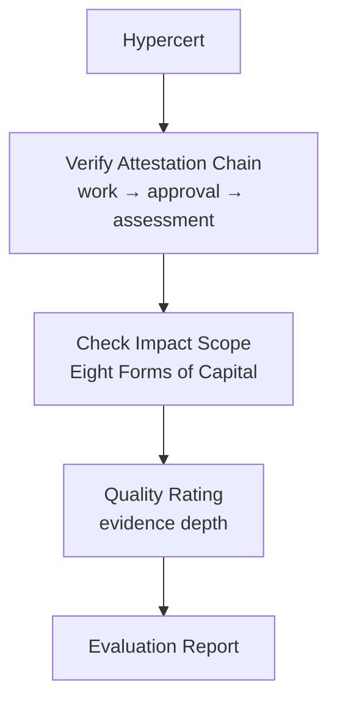

import {
  DecisionGuide,
  FeatureState,
  NextBestAction,
  StatusBadge,
  StepFlow,
} from "@site/src/components/docs";

# Evaluating Impact Certificates

<StatusBadge status="Implemented (activation pending deployment)" />

## Overview

Hypercerts represent claims of verified impact work. As an evaluator, your role is to assess whether these claims are substantiated by real evidence. This means verifying the attestation chain linking work submissions to approvals, checking the scope and quality of the underlying evidence, and evaluating impact claims against frameworks like the Eight Forms of Capital.

<FeatureState
  title="Hypercert evaluation"
  status="Implemented (activation pending deployment)"
  summary="Attestation data and hypercert metadata are queryable. Full marketplace and trade evaluation features are pending activation."
/>

## How It Works

<StepFlow
  steps={[
    {title: "Identify the hypercert", detail: "Select the hypercert to evaluate. Review its metadata: scope of work, time period, contributor list, and the garden that minted it."},
    {title: "Verify attestation chains", detail: "For each piece of work included in the hypercert, confirm the attestation chain is intact: work submission UID exists, approval refUID matches, attester is an authorized operator, and no attestations are revoked."},
    {title: "Assess evidence quality", detail: "Review the underlying work submissions for evidence quality. Check photos, descriptions, and metrics against the action requirements. Evaluate whether the evidence substantiates the impact claims."},
    {title: "Map to impact framework", detail: "If the hypercert includes assessment data, evaluate how well the impact is mapped to the Eight Forms of Capital (Living, Material, Financial, Social, Intellectual, Experiential, Spiritual, Cultural)."},
  ]}
/>

<DecisionGuide
  title="Evaluation decisions"
  items={[
    {
      when: "All attestation chains are valid and evidence quality is strong",
      do: "Document the verification results with confidence. Note any standout contributions.",
      next: "Include the certificate in positive evaluation reports for funders.",
    },
    {
      when: "Some attestation chains are broken or evidence is weak",
      do: "Document specific gaps: which UIDs fail verification, which evidence is insufficient.",
      next: "Report findings to the garden operator and note caveats in evaluation reports.",
    },
    {
      when: "Impact scope claims exceed what the evidence supports",
      do: "Note the discrepancy between claimed and evidenced impact.",
      next: "Recommend scope adjustments before including in funding recommendations.",
    },
  ]}
/>

## Best Practices

- Evaluate a random sample of attestation chains, not just the most recent — this catches historical inconsistencies
- Cross-reference contributor allowlists with the actual attestation data to confirm the right gardeners are credited
- Document your evaluation methodology so that your results are reproducible by other evaluators
- When impact claims span multiple forms of capital, verify that each form has supporting evidence
- Consider the garden's review standards and operator history when assessing evidence quality — well-run gardens typically produce more reliable attestation chains

## What's Next

<NextBestAction
  title="Next best action"
  why="With evaluation skills established, understand how your work builds your evaluator reputation."
  actionLabel="Earning Badges"
  actionHref="/community/evaluator-guide/earning-badges"
  alternatives={[
    {label: "Verify Attestation Chains", href: "/community/evaluator-guide/making-assessments"},
    {label: "Cross-Framework Mapping", href: "/community/evaluator-guide/cross-framework-mapping"},
  ]}
/>
