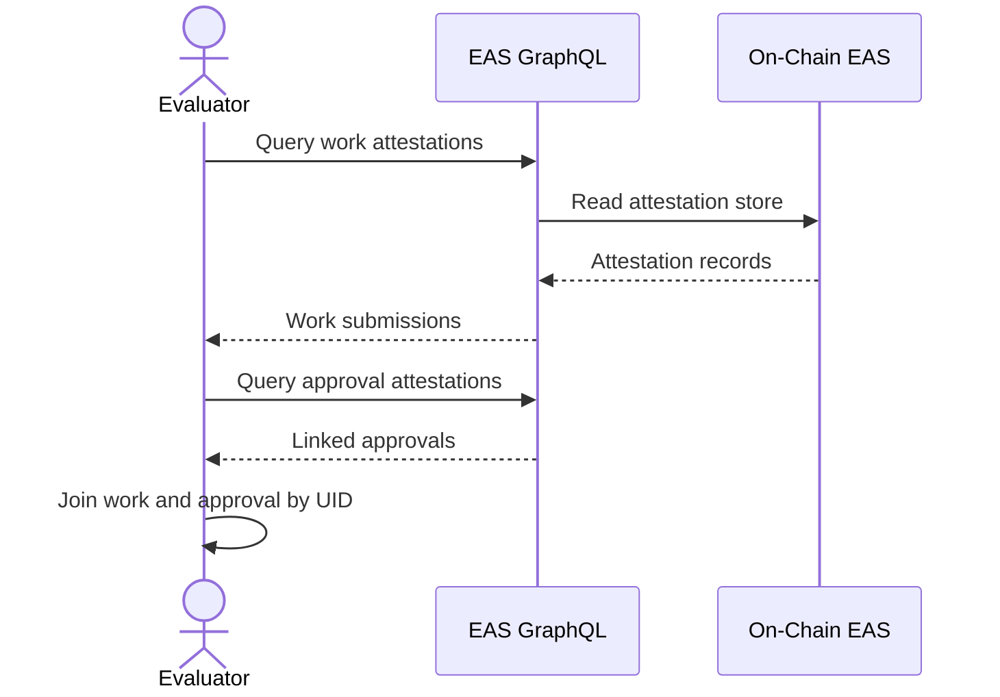

import {
  ChainBadge,
  DecisionGuide,
  JourneyMap,
  NextBestAction,
  QueryBlock,
  StatusBadge,
} from "@site/src/components/docs";
import {EAS_GRAPHQL_ENDPOINTS} from "@site/src/data/endpoints";

# Query Attestations (EAS)

<StatusBadge status="Live" />

## When to use this page

Use this guide when you need to query attestations from EAS for work submissions and work approvals.

## EAS GraphQL endpoints

- <ChainBadge name="Arbitrum" chainId={42161} /> <code>{EAS_GRAPHQL_ENDPOINTS[42161]}</code>
- <ChainBadge name="Celo" chainId={42220} /> <code>{EAS_GRAPHQL_ENDPOINTS[42220]}</code>
- <ChainBadge name="Sepolia" chainId={11155111} /> <code>{EAS_GRAPHQL_ENDPOINTS[11155111]}</code>

<JourneyMap
  role="Evaluator"
  steps={[
    {title: "Get started", href: "./joining-a-garden", state: "complete"},
    {title: "Query indexer", href: "./query-indexer", state: "complete"},
    {title: "Query attestations (EAS)", href: "./query-eas", state: "current"},
    {title: "Verify attestation chains", href: "./making-assessments", state: "upcoming"},
  ]}
/>

<QueryBlock
  title="Work attestations"
  endpoint={EAS_GRAPHQL_ENDPOINTS[42161]}
  query={`query WorkSubmissions($schemaId: String!, $recipient: String!) {
  attestations(
    where: {
      schemaId: { equals: $schemaId }
      recipient: { equals: $recipient }
      revoked: { equals: false }
    }
    orderBy: { timeCreated: desc }
  ) {
    id
    attester
    recipient
    timeCreated
    decodedDataJson
  }
}`}
  variables={`{
  "schemaId": "<workSchemaUID from deployments/{chain}-latest.json>",
  "recipient": "0xGardenAccountAddress"
}`}
/>

<QueryBlock
  title="Work approval attestations"
  endpoint={EAS_GRAPHQL_ENDPOINTS[42161]}
  query={`query WorkApprovals($schemaId: String!, $recipient: String!) {
  attestations(
    where: {
      schemaId: { equals: $schemaId }
      recipient: { equals: $recipient }
      revoked: { equals: false }
    }
    orderBy: { timeCreated: desc }
  ) {
    id
    attester
    recipient
    refUID
    timeCreated
    decodedDataJson
  }
}`}
  variables={`{
  "schemaId": "<workApprovalSchemaUID from deployments/{chain}-latest.json>",
  "recipient": "0xGardenAccountAddress"
}`}
/>

## Query hygiene

1. Always pin chain and schema IDs together.
2. Filter revoked attestations unless you need full history.
3. Keep work and approval datasets separate until join stage.

<DecisionGuide
  title="Pick the right EAS query"
  items={[
    {
      when: "You need raw submission evidence",
      do: "Query work schema IDs first.",
      next: "Use IDs as candidates for approval-chain validation.",
    },
    {
      when: "You need evaluator-approved outcomes",
      do: "Query approval schema IDs and include `refUID`.",
      next: "Verify each approval points to an existing work UID.",
    },
  ]}
/>

<NextBestAction
  title="Next best action"
  why="Validate linkage quality by proving work-to-approval chains."
  actionLabel="Verify attestation chains"
  actionHref="./making-assessments"
  alternatives={[
    {label: "Cross-framework mapping", href: "./cross-framework-mapping"},
  ]}
/>
