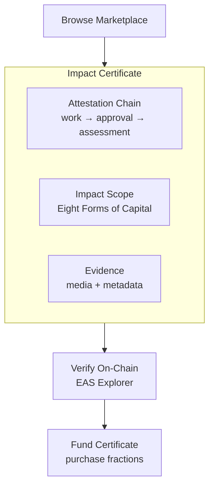

import {
  DecisionGuide,
  NextBestAction,
  StatusBadge,
  StepFlow,
} from "@site/src/components/docs";

# Getting Started as a Funder

<StatusBadge status="Live" />

## Overview

Funders play a critical role in the Green Goods ecosystem: they supply the capital that keeps garden operations alive between harvests, approvals, and funding cycles. The cleanest current funder flow is simple: **open a garden, use its treasury drawer, deposit into the vault, and monitor the garden's verified work over time**.

As a funder, you can:

- **Deposit into impact vaults** — Your principal supports garden operations, and harvested yield is routed to impact while claim value stays flat by design
- **Inspect Hypercert-backed impact** — See how gardens package verified work into impact certificates and where certificate flows may fit your strategy
- **Track real impact** — Every claim is backed by EAS attestations verified by community operators
- **Choose your gardens** — Support specific communities and bioregions that align with your values

## How It Works

<StepFlow
  steps={[
    {title: "Sign in and choose a garden", detail: "Open the app, pick the garden you want to support, and review its recent work, assessments, and treasury health."},
    {title: "Open Treasury", detail: "From the garden view, open the Treasury drawer to see supported vault assets, your balance, and any existing deposit position."},
    {title: "Deposit support", detail: "Choose the asset and amount, approve if needed, and submit the deposit. Your principal stays in the vault while routed yield funds garden activity later."},
    {title: "Track outcomes", detail: "Monitor the garden's approved work, assessment cadence, and treasury activity so your funding decision stays grounded in visible evidence."},
  ]}
/>

### Why Verified Impact Matters

Traditional impact funding relies on self-reported metrics. Green Goods changes this:

| Traditional Funding | Green Goods Funding |
|---|---|
| Self-reported impact | Community-verified attestations |
| Annual reports | Real-time attestation chain |
| Trust the organization | Verify on-chain |
| One-time grants | Routed endowment funding + impact tokens |

Every piece of funded work has a verifiable chain: **Gardener submission → Operator approval → Evaluator assessment → Hypercert**. Each step creates an on-chain attestation you can independently verify.

## Best Practices

<DecisionGuide
  title="Choose your funding approach"
  items={[
    {
      when: "You want passive, sustainable support",
      do: "Deposit into a garden vault. Your principal stays in the endowment while harvested yield is routed to operations.",
      next: "Monitor harvest activity, routed yield, and garden operations over time.",
    },
    {
      when: "You want direct ownership of verified impact",
      do: "Purchase Hypercerts from gardens with strong attestation histories.",
      next: "Review the attestation chain backing each Hypercert before purchasing.",
    },
    {
      when: "You want to influence community priorities",
      do: "Combine vault deposits with conviction voting to signal which work matters most.",
      next: "Participate in governance to help shape garden strategy.",
    },
  ]}
/>

- Always verify the attestation chain before purchasing Hypercerts — check EAS explorer for approval records
- Start with smaller deposits to understand a garden's operational cadence before committing larger amounts
- Treat vault deposits as mission-aligned principal support, not as a depositor PPS-up investment product
- Review garden assessments across the Eight Forms of Capital for holistic impact understanding
- Diversify across gardens and bioregions for broader impact coverage

## What's Next

<NextBestAction
  title="Next best action"
  why="Learn the mechanics of vault deposits and Hypercert purchases."
  actionLabel="Vaults & Hypercerts"
  actionHref="/community/funder-guide/vaults-and-hypercerts"
  alternatives={[
    {label: "How It Works", href: "/community/how-it-works"},
    {label: "Glossary", href: "/glossary"},
  ]}
/>
