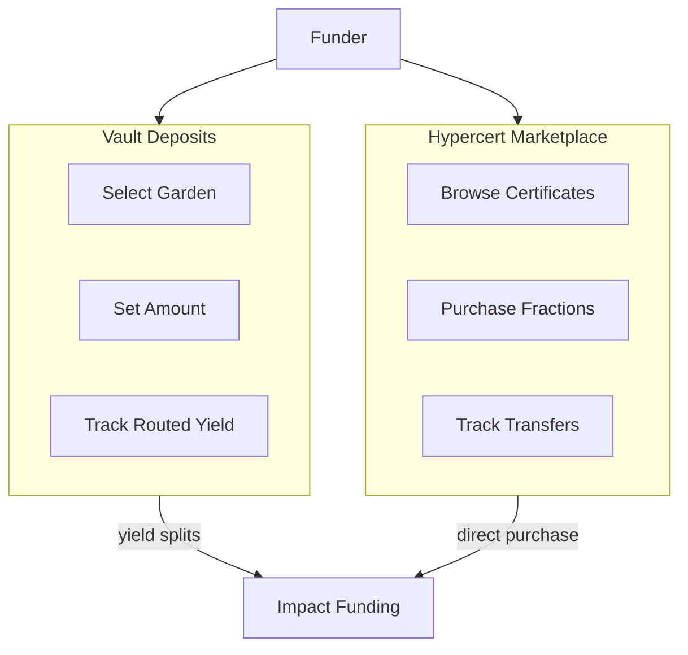

import {
  DecisionGuide,
  FeatureState,
  NextBestAction,
  StatusBadge,
  StepFlow,
} from "@site/src/components/docs";

# Vaults & Hypercerts

<StatusBadge status="Live" />

## Overview

Green Goods offers two ways to think about funding:

- **Vaults** are the primary live product flow for most funders.
- **Hypercerts** are the certificate layer for impact packaging and more advanced market participation.

Both depend on attestation-backed impact, but they behave differently and should not be confused.

## How It Works

### Vault Deposits

<FeatureState
  title="Octant Vault deposits"
  status="Live"
  summary="Funders can deposit supported assets into garden vaults. Depositor claim value stays flat by design, while harvested strategy yield is routed to garden operations."
/>

<StepFlow
  steps={[
    {title: "Select a garden vault", detail: "Browse gardens and their vault configurations. Each vault shows current deposits, routed yield history, and supported assets."},
    {title: "Deposit assets", detail: "Connect your wallet, choose the deposit amount, and approve the transaction. Your deposit adds principal to the impact vault."},
    {title: "Track routed yield", detail: "Monitor your position through the vault dashboard. Depositor claim value stays flat by design, while harvested yield funds garden operations."},
    {title: "Withdraw", detail: "Request withdrawal of your principal when ready. Processing time depends on the vault's configuration and current liquidity."},
  ]}
/>

Vault deposits do not pay funders through share appreciation. Instead, harvest converts strategy gains into routed impact funding for the garden community.

Harvested vault yield flows back to the garden community, funding:
- Gas sponsorship for gardener submissions
- Operator and evaluator incentives
- Community governance allocations
- Infrastructure maintenance

### Hypercert Purchases

<FeatureState
  title="Hypercert marketplace"
  status="Live"
  summary="Hypercert minting and listing are live on supported deployments, but the buyer journey is still more advanced than the vault deposit path. Confirm where and how a garden expects supporters to acquire fractions before treating this as your default funding flow."
/>

<StepFlow
  steps={[
    {title: "Inspect the claim", detail: "Review the Hypercert title, included attestations, contributors, and whatever listing context the garden provides."},
    {title: "Verify the attestation chain", detail: "Check that the certificate is backed by work submissions, approvals, and assessments you can defend independently."},
    {title: "Confirm the market path", detail: "Make sure you know where the fraction is being listed and whether that chain and venue are the intended purchase surface."},
    {title: "Buy only after that diligence", detail: "Use the market flow the garden is actually operating with rather than assuming every certificate has the same in-app purchase path."},
  ]}
/>

### Understanding Hypercert Value

A Hypercert's value comes from its attestation chain:

- **Work attestations** — Proof that physical regenerative work was performed
- **Approval attestations** — Community operator verification of work quality
- **Assessment attestations** — Evaluator analysis across Eight Forms of Capital
- **Contributor weights** — Fair distribution among verified gardeners

## Best Practices

<DecisionGuide
  title="Vaults vs. Hypercerts"
  items={[
    {
      when: "You want ongoing, passive support with routed yield",
      do: "Deposit into a vault. Your principal stays in the endowment while harvested yield is routed to impact funding.",
      next: "Monitor garden activity and harvest cadence to ensure your funded community is active.",
    },
    {
      when: "You want provable ownership of specific impact",
      do: "Use Hypercerts, but only after verifying the claim and the market path you are expected to use.",
      next: "Use your Hypercert holdings for impact reporting to your own stakeholders.",
    },
    {
      when: "You want maximum community influence",
      do: "Start with a vault deposit and stay close to the garden's reporting and governance signals.",
      next: "Use the garden's actual governance surfaces when they are active, rather than assuming every garden exposes the same controls.",
    },
  ]}
/>

- Verify attestation chains independently on [EAS Explorer](https://attest.sh) before large purchases
- Use vaults when you want mission-aligned endowment support, not depositor share-price growth
- Understand transfer restrictions on Hypercerts — some may be non-transferable
- Review the garden's assessment history for consistent, quality-backed impact claims
- Consider the garden's operational track record (approval rates, active gardeners, submission frequency)

## What's Next

<NextBestAction
  title="Next best action"
  why="Now that the funding instruments are clear, decide what you want your funding history to signal over time."
  actionLabel="Earning Recognition"
  actionHref="/community/funder-guide/earning-recognition"
  alternatives={[
    {label: "Getting Started as a Funder", href: "/community/funder-guide/getting-started"},
    {label: "How It Works", href: "/community/how-it-works"},
  ]}
/>
