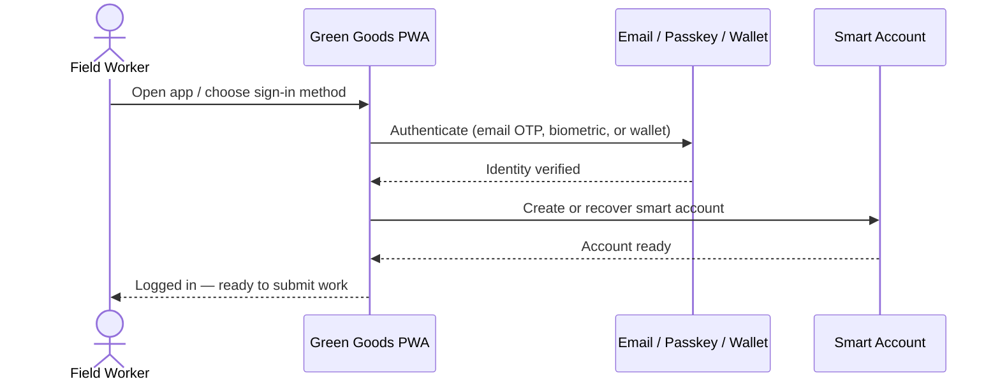
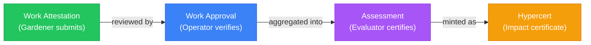

import {NextBestAction} from "@site/src/components/docs";

# How It Works

Green Goods combines several innovations to make documenting and funding regenerative work practical for field workers. Here's how each piece works.

---

## Local 1st Experience

Green Goods is built for the reality of field work — **intermittent connectivity**, **mid-range devices**, and **diverse languages**. Everything works locally first, then syncs when conditions allow.

### Privacy & Security

Your data stays on your device until you choose to submit. Green Goods uses **passkey authentication** tied to your device's secure enclave — your biometric data never leaves your phone. Behind the scenes, a **smart account** is created for you using account abstraction, giving you a secure on-chain identity without exposing private keys.

### Multiple Ways to Sign In

Green Goods eliminates the biggest barrier to web3 adoption — wallet setup. Choose the method that works best for you:

- **Email or social login** — Sign in with your email, Google, Apple, Discord, or other social accounts. No crypto knowledge required. A managed wallet is created for you behind the scenes.
- **Passkey authentication** — Sign in with your fingerprint, face, or device PIN. No seed phrases, no browser extensions. A [smart account](/glossary#smart-account-account-abstraction) is created using account abstraction.
- **Wallet connection** — Experienced users can connect an existing wallet (MetaMask, Rainbow, etc.) for direct on-chain interaction.

All methods provide:
- **Automatic smart account** — A secure on-chain identity is created for you, regardless of how you sign in.
- **Gasless transactions** — Work submissions are bundled and sponsored, so you never need to buy tokens or pay gas fees.
- **Under a minute** — From first visit to first submission, the onboarding flow takes less than 60 seconds.

:::note Address Continuity
Each sign-in method creates an independent on-chain account with its own address. Your contribution history, roles, and reputation are tied to the address from your chosen sign-in method. Pick one method and stick with it — switching methods means starting with a new identity.
:::

### Works In All Conditions

Green Goods is a [Progressive Web App](/glossary#pwa-progressive-web-app) — it works like a native app on your phone, even in low-connectivity environments:

- **Install from your browser** — Tap "Add to Home Screen" on any mobile browser. No app store required.
- **Offline-first** — All submissions are saved locally before syncing. The service worker caches the app shell and critical assets.
- **Background sync** — When you come back online, queued submissions sync automatically with exponential backoff and retry logic.
- **Mobile optimized** — Designed for mid-range Android devices with limited bandwidth. Touch targets, image compression, and lazy loading keep the experience fast.

### Supports English, Spanish & Portuguese Currently

Full UI support across three languages with more coming:

| Tier | Languages | Status | Coverage |
|------|-----------|--------|----------|
| **Tier 1** | English, Portuguese, Spanish | Active | Full UI, all action schemas, documentation |
| **Tier 2** | French, Swahili | Planned | Core UI, common action schemas |
| **Tier 3** | Arabic, Hausa | Future | Core submission flow only |

Language detection follows your device settings, with manual override available. Action titles, descriptions, instructions, and form labels are all translated. Translation files are open for community contributions.

---

## MDR Workflow (Media → Details → Review)

The **MDR workflow** is how every piece of work gets documented. It's designed for mobile phones in the field, mirroring the simplicity of posting to social media.

### Capture Photos, Videos & Audio

**Step 1: Media** — Open the camera and capture photos of your work. The action specifies minimum and maximum media requirements (e.g., "at least 2 photos of the planted trees"). Photos are stored locally on your device first, then uploaded to IPFS when you submit.

### Provide Action Specific Details

**Step 2: Details** — Fill in action-specific form fields. These are generated from the action's configuration and can include:

- Text inputs (descriptions, notes)
- Number fields (tree count, kg collected, kWh generated)
- Dropdowns (species selection, waste category)
- Sliders (confidence rating, quality assessment)
- Repeating rows (multiple observations in one session)

Each action follows the **CIDS Framework** (Activity → Output → Outcome → Impact), ensuring that the details you provide connect to verifiable outcomes:

| CIDS Stage | What You Provide | Example |
|-----------|-----------------|---------|
| **Activity** | What you did | "Planted trees in zone A" |
| **Output** | Direct product | "12 mango trees, geotagged" |
| **Outcome** | Change produced | "15% canopy cover increase" |
| **Impact** | Long-term effect | "Carbon sequestration, food security" |

### Review Before Uploading

**Step 3: Review** — See a summary of your photos and answers. Add optional feedback or notes, then submit. The submission enters the operator's review queue.

The full step-by-step:

1. **Open the app** and navigate to your garden
2. **Browse available actions** — Each action card shows the title, domain badge, description, and requirements
3. **Select an action** to start the MDR workflow
4. **Capture media** — Take photos using your device camera or select from your gallery
5. **Fill in details** — Complete the action-specific form fields
6. **Review and submit** — Check your submission summary and tap submit
7. **Track progress** — Monitor your submission status in the work dashboard (pending, approved, or changes requested)

---

## Hub To Manage Gardens

The **admin dashboard** gives operators full visibility and control over their garden community.

### Manage Gardeners & Operations

Operators spend **2-4 hours per week** on garden management. The dashboard streamlines their core workflows:

- **Work review queue** — See all pending submissions, approve or request changes with one tap
- **Action management** — Configure which actions are available, set media requirements, define form fields
- **Role management** — Add gardeners, promote contributors, assign evaluator roles via Hats Protocol
- **Garden health** — At-a-glance dashboard showing work volume, approval rates, and capital measurements

### Build Relationships With Evaluators & Funders

The dashboard is the bridge between field operations and impact certification:

- **Assessment creation** — Operators initiate assessments that evaluators complete
- **Hypercert minting** — Package verified work into tokenized impact certificates
- **Vault management** — Monitor deposits, trigger harvests, configure yield splits
- **Impact reporting** — Export reports in formats funders expect via Karma GAP integration

### Engage The Community

Community governance tools built into the dashboard:

- **Conviction voting** through Gardens V2 signal pools
- **Cookie Jar** management for petty cash operations
- **Community proposals** for resource allocation
- **ENS subdomains** for human-readable garden identities

---

## Impact Reporting & Verification

Every approved piece of work creates a verifiable on-chain record that builds into a complete impact story.

### Capturing & Proving Impact

The attestation chain creates an **unbroken trail** from field work to certified impact:

Each step is recorded on the **Ethereum Attestation Service** (EAS) with schema-validated data. Smart contract **resolvers** enforce that attesters have the correct Hats Protocol role and that the data matches the expected schema.

### Build Trust & Transparency

- **Permanent records** — Every attestation is on-chain and immutable. Your work history is verifiable by anyone, forever.
- **Portable reputation** — Your attestation history travels with you across gardens and platforms. Consistent, quality work builds an on-chain reputation.
- **Auditable governance** — Roles, permissions, and decisions are on-chain. Any community member can verify who approved what.

### A Full Repeatable Cycle

The impact cycle is designed to be **self-reinforcing**:

1. **Gardeners** document work → creates activity records
2. **Operators** verify and approve → creates on-chain attestations
3. **Evaluators** assess and certify → creates Hypercerts
4. **Funders** purchase Hypercerts and deposit in vaults → capital flows back to the community
5. **Community** uses funding to enable more work → cycle repeats

Each cycle strengthens the next: more verified impact attracts more funding, which enables more work, which produces more verified impact. Green Goods is the infrastructure that makes this flywheel turn.

---

<NextBestAction
  title="Next: Why We Build"
  why="Now that you understand how the platform works, learn about the mission and ecosystem that drives Green Goods."
  actionLabel="Why We Build"
  actionHref="/community/why-we-build"
  alternatives={[
    { label: "Gardener Guide", href: "/community/gardener-guide/joining-a-garden" },
    { label: "Operator Guide", href: "/community/operator-guide/creating-a-garden" }
  ]}
/>
