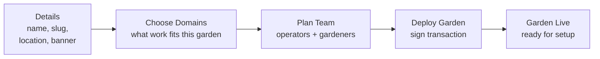

import {JourneyMap, NextBestAction, StatusBadge, StepFlow} from "@site/src/components/docs";

# Creating A Garden

<StatusBadge status="Live" />

<JourneyMap
  role="Operator"
  steps={[
    {title: "Get started + roles", href: "/community/operator-guide/creating-a-garden", state: "complete"},
    {title: "Create garden", href: "/community/operator-guide/creating-a-garden", state: "current", note: "Define metadata, policy, and membership setup."},
    {title: "Manage actions", href: "/community/operator-guide/managing-actions", state: "upcoming"},
    {title: "Review work", href: "/community/operator-guide/reviewing-work", state: "upcoming"},
  ]}
/>

## Overview

A garden is your community hub for regenerative work. Creating one sets up a community account that can hold assets, manage members, and coordinate impact. In the current admin flow, **creating a brand-new garden is a deployer-level action**. If you are already an operator inside an existing garden, you usually skip this page and jump straight to actions, reviews, and treasury work.

## How It Works

<StepFlow
  steps={[
    {title: "Open Create Garden", detail: "In admin, navigate to `/gardens/create`. If you cannot open that route, you likely need deployer access."},
    {title: "Complete Details", detail: "Enter name, slug, description, location, optional banner image, open-vs-restricted joining policy, and the garden's active domains."},
    {title: "Plan the initial team", detail: "Add the operators and gardeners you expect to onboard first. This helps the setup stay coherent even if membership is finalized later."},
    {title: "Review and deploy", detail: "Confirm the chain and transaction details, sign the deployment, then verify the garden appears in the garden cockpit."},
  ]}
/>

**What you need before you start:**

- Garden name, slug, and short description
- Location and any banner/media assets you want on day one
- Joining policy (open vs restricted)
- Domain selection, because domains determine which actions appear to gardeners
- A practical first-team plan for operators and gardeners

## Best Practices

- If you are an operator without deployer access, ask the platform admin to create the garden first instead of working around permissions
- Choose a clear, descriptive garden name that reflects the bioregion or community focus
- Set your joining policy thoughtfully — open gardens grow faster, restricted gardens maintain tighter quality control
- Pick domains carefully — they control which actions gardeners can submit against later
- Verify that metadata renders correctly in both admin and client before sharing the garden with your community
- Confirm operator/admin permissions before inviting members, reviewing work, or touching treasury flows

## What's Next

<NextBestAction
  title="Next best action"
  why="Once the garden exists, the next question is which actions will actually be available to your gardeners."
  actionLabel="Managing Actions"
  actionHref="./managing-actions"
  alternatives={[
    {label: "Reviewing Work", href: "./reviewing-work"},
  ]}
/>
