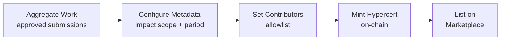

import {FeatureState, NextBestAction, StatusBadge, StepFlow} from "@site/src/components/docs";

# Creating Impact Certificates

<StatusBadge status="Live" />

## Overview

Hypercerts are semi-fungible tokens representing claims of verified impact work. Minting a hypercert bundles your garden's approved work and assessments into a tradeable on-chain certificate. Once minted, you can list hypercerts on the marketplace for retroactive funding.

<FeatureState
  title="Wizard and listing flow"
  status="Live"
  summary="Admin minting, listing, and marketplace approval flows are live on supported deployments. Verify the chain you are operating on before promising a marketplace path to contributors or funders."
/>

## How It Works

<StepFlow
  steps={[
    {title: "Prepare the claim", detail: "Collect the approved work, the assessment window, contributor addresses, and the metadata you want embedded in the Hypercert."},
    {title: "Mint in the Hypercert wizard", detail: "Open your garden's Hypercerts view, start the wizard, upload metadata, confirm allowlist entries, and sign the mint transaction."},
    {title: "Check the detail page", detail: "After minting, confirm the Hypercert detail page shows the expected title, attestations, contributors, and minted record."},
    {title: "List if the garden needs a marketplace path", detail: "If your garden wants secondary distribution, use the marketplace approval and listing flow from the Hypercert detail page."},
  ]}
/>

## Best Practices

- Verify all included work is approved and attestation chains are intact before minting
- Set clear contributor allowlists so that fractions go to the gardeners who did the work
- Review transfer restriction settings carefully — they cannot be changed after minting
- Confirm the target chain has active Hypercert and marketplace module addresses before promising a listing workflow
- Run an end-to-end mint/list test on Sepolia or your current test environment before going live on production chains

**Operator checklist:**

1. Approved work and assessment scope are clean
2. Contributor allowlist is correct
3. Metadata reflects the claim you actually want to defend publicly
4. The selected chain supports the listing path you want to use

## What's Next

<NextBestAction
  title="Next best action"
  why="With impact certificates minted, manage your garden's financial infrastructure."
  actionLabel="Managing Endowments"
  actionHref="./managing-endowments"
  alternatives={[
    {label: "Managing Governance", href: "./managing-governance"},
  ]}
/>
