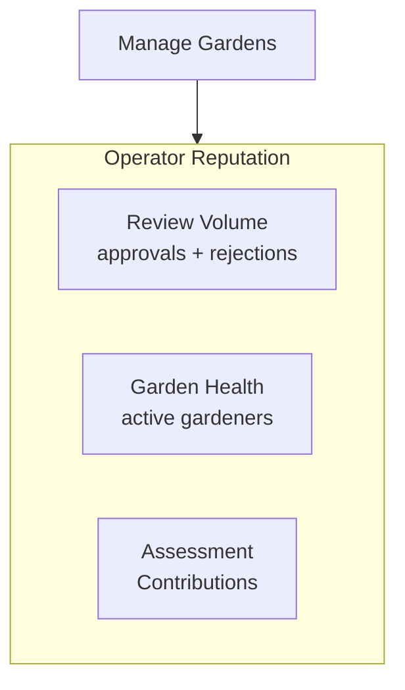

import {
  FeatureState,
  NextBestAction,
  StatusBadge,
  StepFlow,
} from "@site/src/components/docs";

# Earning Recognition & Rewards

<StatusBadge status="Live" />

## Overview

Operator reputation is built through the on-chain record of your garden management activities. Every work approval, assessment, and governance action you take creates verifiable attestations that demonstrate your commitment to the community. Over time, this record becomes a portable, provable track record of impact coordination.

## How It Works

<StepFlow
  steps={[
    {title: "Review work consistently", detail: "Every approval or rejection you issue creates an on-chain attestation linked to your address. A steady cadence of fair, thorough reviews builds your review history."},
    {title: "Create quality assessments", detail: "Garden assessments you author are permanently recorded. Well-structured assessments that lead to successful funding rounds demonstrate strategic capacity."},
    {title: "Manage your garden actively", detail: "Active gardens with engaged gardeners, current actions, and transparent governance reflect well on the operating team."},
    {title: "Build a portable record", detail: "Your attestation history is on-chain and verifiable by any protocol. This record follows you across gardens, platforms, and funding ecosystems."},
  ]}
/>

**What contributes to your reputation:**

- **Review volume and quality** — consistent, timely reviews with actionable feedback
- **Assessment quality** — well-structured evaluations that map impact to the Eight Forms of Capital
- **Garden health** — active membership, regular submissions, and transparent governance
- **Attestation history** — the cumulative on-chain record of all your operator actions

<FeatureState
  title="Formal reputation scoring"
  status="Planned"
  summary="Structured reputation metrics and visual badges for operators are planned for a future release. Current recognition is based on raw attestation history."
/>

## Best Practices

- Maintain a regular review cadence — gardens with responsive operators attract and retain more gardeners
- Document your reasoning when approving or rejecting edge-case submissions — this builds trust with your community
- Keep your garden's actions up to date and clearly described to reduce submission quality issues
- Participate in cross-garden coordination to extend your reputation beyond a single community
- Share your attestation history when applying for grants or new operator roles — it serves as a verifiable resume

## What's Next

<NextBestAction
  title="Next best action"
  why="Understand the broader platform to contextualize your role."
  actionLabel="How It Works"
  actionHref="/community/how-it-works"
  alternatives={[
    {label: "Managing Certificates", href: "/community/operator-guide/managing-certificates"},
    {label: "Managing Payouts", href: "/community/operator-guide/managing-payouts"},
  ]}
/>
