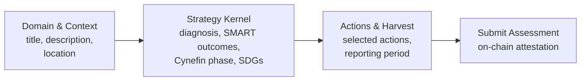

import {DecisionGuide, NextBestAction, StatusBadge, StepFlow} from "@site/src/components/docs";

# Making An Assessment

<StatusBadge status="Live" />

## Overview

Assessments are garden-level impact statements that turn a set of approved work into something legible: a reporting window, a domain, a diagnosis, a strategy kernel, and a selected group of actions. In the current admin flow, the assessment wizard is organized into **Domain & Context**, **Strategy Kernel**, and **Actions & Harvest**.

Use assessments when you need to formally evaluate your garden's progress, prepare for funding rounds, or create a baseline for comparing impact over time.

## How It Works

<StepFlow
  steps={[
    {title: "Open assessments", detail: "Navigate to your garden's Assessments view in admin and start a new assessment."},
    {title: "Fill Domain & Context", detail: "Set the title, description, location, and domain. Keep the title stable enough that your team can reference it later."},
    {title: "Build the strategy kernel", detail: "Add the diagnosis, SMART outcomes, Cynefin phase, and SDG targets. This is where you explain what changed and why it matters."},
    {title: "Choose actions and reporting period", detail: "Select the actions that belong in this assessment and define the reporting window. Then submit and verify the assessment appears in the garden list and EAS view."},
  ]}
/>

<DecisionGuide
  title="When to create assessments"
  items={[
    {
      when: "You have accumulated a body of approved work and want one coherent impact story",
      do: "Create an assessment with a clear reporting period and only the actions that genuinely belong together.",
      next: "Use the assessment as a basis for hypercert minting or funding reports.",
    },
    {
      when: "You are entering a funding round or grant cycle",
      do: "Create a time-bounded assessment matching that reporting period.",
      next: "Export the assessment data for inclusion in grant applications.",
    },
    {
      when: "You need to adjust strategy mid-cycle",
      do: "Create a follow-on assessment rather than editing the existing one.",
      next: "Document how the new assessment builds on or diverges from the previous one.",
    },
  ]}
/>

## Best Practices

- Keep assessment names stable and reporting dates explicit so they can be referenced consistently
- Use diagnoses and SMART outcomes that a reviewer can understand quickly, not abstract strategy language
- Use follow-on assessments for major scope changes rather than editing existing assessments
- Align assessment timelines with your garden's natural work cycles (seasonal, quarterly, etc.)
- Review approved work first so you are selecting actions from a complete set instead of a half-reviewed queue

## What's Next

<NextBestAction
  title="Next best action"
  why="Turn your assessed impact into tradeable impact certificates."
  actionLabel="Creating Impact Certificates"
  actionHref="./creating-impact-certificates"
  alternatives={[
    {label: "Reporting and GAP", href: "./reporting-and-gap"},
  ]}
/>
