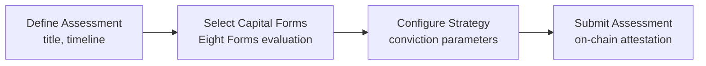

import {DecisionGuide, NextBestAction, StatusBadge, StepFlow} from "@site/src/components/docs";

# Making An Assessment

<StatusBadge status="Live" />

## Overview

Assessments are garden-level evaluations that document impact across the Eight Forms of Capital (Living, Material, Financial, Social, Intellectual, Experiential, Spiritual, Cultural). They aggregate individual work into a broader picture of your garden's regenerative contribution and create on-chain attestation records via EAS.

Use assessments when you need to formally evaluate your garden's progress, prepare for funding rounds, or create a baseline for comparing impact over time.

## How It Works

<StepFlow
  steps={[
    {title: "Open assessments", detail: "Navigate to your garden's Assessments tab in the admin dashboard."},
    {title: "Create new assessment", detail: "Set the title, description, timeline, and evaluation domain. Choose which forms of capital you are evaluating."},
    {title: "Attach strategy config", detail: "Include diagnosis, target outcomes, and supporting references. Document your assumptions and methodology."},
    {title: "Publish", detail: "Submit the assessment on-chain. Confirm it is visible in the garden's assessment list."},
  ]}
/>

<DecisionGuide
  title="When to create assessments"
  items={[
    {
      when: "You have accumulated a body of approved work and want to measure overall impact",
      do: "Create a comprehensive assessment covering the relevant forms of capital.",
      next: "Use the assessment as a basis for hypercert minting or funding reports.",
    },
    {
      when: "You are entering a funding round or grant cycle",
      do: "Create a time-bounded assessment matching the grant period.",
      next: "Export the assessment data for inclusion in grant applications.",
    },
    {
      when: "You need to adjust strategy mid-cycle",
      do: "Create a follow-on assessment rather than editing the existing one.",
      next: "Document how the new assessment builds on or diverges from the previous one.",
    },
  ]}
/>

## Best Practices

- Keep assessment names stable and date ranges explicit so they can be referenced consistently
- Document assumptions in attached config references — future evaluators need to understand your methodology
- Use follow-on assessments for major scope changes rather than editing existing assessments
- Align assessment timelines with your garden's natural work cycles (seasonal, quarterly, etc.)
- Review approved work in the garden before creating an assessment to ensure the data is complete

## What's Next

<NextBestAction
  title="Next best action"
  why="Turn your assessed impact into tradeable impact certificates."
  actionLabel="Creating Impact Certificates"
  actionHref="./creating-impact-certificates"
  alternatives={[
    {label: "Reporting and GAP", href: "./reporting-and-gap"},
  ]}
/>
