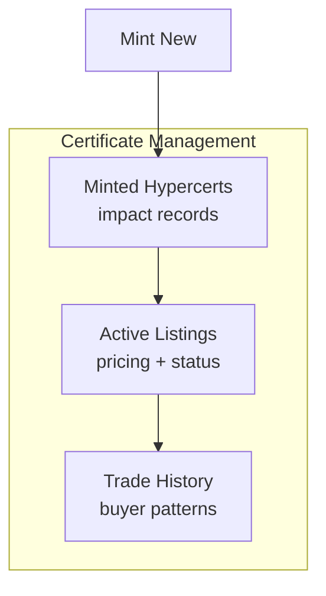

import {
  DecisionGuide,
  FeatureState,
  NextBestAction,
  StatusBadge,
  StepFlow,
} from "@site/src/components/docs";

# Managing Certificates & Work

<StatusBadge status="Implemented (activation pending deployment)" />

## Overview

After minting hypercerts, operators manage their lifecycle: monitoring active listings, reviewing trade history, ensuring contributor allowlists are accurate, and maintaining the connection between certificates and underlying verified work. This page covers the ongoing management responsibilities beyond the initial mint.

<FeatureState
  title="Hypercert management"
  status="Implemented (activation pending deployment)"
  summary="Detail views, listing tables, and trade history are implemented. Full marketplace activation is pending non-zero adapter addresses."
/>

## How It Works

<StepFlow
  steps={[
    {title: "Review minted hypercerts", detail: "Open your garden's Hypercerts tab to see all minted certificates. Check metadata, contributor lists, and claim status."},
    {title: "Monitor active listings", detail: "The Active Listings table shows currently listed hypercerts with pricing, unit availability, and expiration dates. Verify listings are priced correctly."},
    {title: "Track trade history", detail: "The Trade History table records all completed trades. Review buyer addresses, prices, and volumes to understand market activity."},
    {title: "Maintain integrity", detail: "Periodically verify that attestation chains backing each hypercert are still valid. If underlying work is revoked, assess the impact on the certificate."},
  ]}
/>

<DecisionGuide
  title="Certificate management decisions"
  items={[
    {
      when: "A listing is about to expire with no bids",
      do: "Review pricing and unit count. Consider relisting with adjusted terms.",
      next: "Check if the hypercert scope or description could be clearer to potential funders.",
    },
    {
      when: "Trade history shows unexpected buyer patterns",
      do: "Verify buyer addresses are legitimate. Review transfer restrictions on the hypercert.",
      next: "Consult with your community about governance implications of concentrated ownership.",
    },
    {
      when: "Underlying work evidence is questioned after minting",
      do: "Re-verify the attestation chain. Check if any work or approval attestations have been revoked.",
      next: "Document findings and communicate transparently with certificate holders.",
    },
  ]}
/>

## Best Practices

- Review active listings weekly to catch expiring or mispriced certificates early
- Keep contributor allowlists accurate — they represent the gardeners who did the verified work
- Document the relationship between assessments and minted hypercerts for transparency
- Monitor trade volume and pricing trends to understand how the market values your garden's impact
- If you need to cancel a listing, use the cancel flow in the admin dashboard rather than letting it expire

## What's Next

<NextBestAction
  title="Next best action"
  why="With certificates managed, understand how your operator work builds reputation."
  actionLabel="Earning Recognition"
  actionHref="/community/operator-guide/earning-recognition"
  alternatives={[
    {label: "Managing Payouts", href: "/community/operator-guide/managing-payouts"},
    {label: "Mint Hypercerts (detailed)", href: "/community/operator-guide/creating-impact-certificates"},
  ]}
/>
