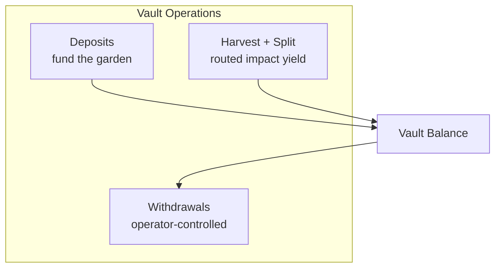

import {
  DecisionGuide,
  FeatureState,
  NextBestAction,
  StatusBadge,
  StepFlow,
} from "@site/src/components/docs";

# Managing Endowments

<StatusBadge status="Live" />

## Overview

Garden vaults are impact endowment positions powered by Octant that hold deposited assets on behalf of your garden. Depositor claim value is expected to stay flat by design. When strategies generate yield, that yield is routed later through harvest and split flows to support garden operations, gardener compensation, and community initiatives.

<FeatureState
  title="Operator UI"
  status="Live"
  summary="Vault and endowment surfaces are live in admin. What an operator can do depends on wallet permissions, selected chain, and the vaults configured for that garden."
/>

<FeatureState
  title="Chain readiness"
  status="Live"
  summary="Current Arbitrum and Sepolia deployment artifacts include non-zero vault-related module addresses. Verify the selected chain before assuming the same on every network."
/>

## How It Works

<StepFlow
  steps={[
    {title: "Create or select vault", detail: "Choose a supported asset and verify strategy settings in the Vault tab of your garden."},
    {title: "Deposit assets", detail: "Execute endowment deposits with role controls. Deposits add principal to the garden vault, while yield routing happens later during harvest."},
    {title: "Monitor routed yield", detail: "Track harvest windows, pending allocations, routed impact yield, and current balances through the vault dashboard."},
    {title: "Withdraw or rebalance", detail: "Run controlled exits with a full audit trail. Withdrawals go back to the garden's Tokenbound Account."},
  ]}
/>

<DecisionGuide
  title="When to use vaults vs other endowment paths"
  items={[
    {
      when: "You need managed deposit/harvest/withdraw strategy operations",
      do: "Use Vaults and Endowment.",
      next: "Track harvest windows, routed-yield policy, and rebalance decisions in this workflow.",
    },
    {
      when: "You need recurring capped member withdrawals",
      do: "Use Cookie Jars.",
      next: "Move to cookie-jar flow for interval and allowance controls.",
    },
    {
      when: "You need community signaling before allocation",
      do: "Use Conviction and Signal Pools.",
      next: "Configure pool strategy and voting power mappings first.",
    },
  ]}
/>

## Best Practices

- Establish a clear endowment policy before depositing — document deposit authority, withdrawal approvals, and reporting cadence
- Monitor vault health regularly: check principal balances, harvest readiness, routed impact yield, and withdrawal liquidity
- Use vaults for strategic, long-horizon allocations and cookie jars for operational expenses
- Explain to funders and contributors that depositor claim value stays flat by design and that yield is routed at harvest time
- Maintain transparent records of all vault operations for community accountability
- Test deposit and withdrawal flows on Sepolia before running operations on production chains

## What's Next

<NextBestAction
  title="Next best action"
  why="Set up lightweight payout mechanisms for your gardeners."
  actionLabel="Cookie Jars"
  actionHref="./cookie-jars"
  alternatives={[
    {label: "Managing Governance", href: "./managing-governance"},
  ]}
/>
