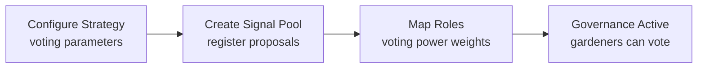

import {
  DecisionGuide,
  FeatureState,
  NextBestAction,
  StatusBadge,
  StepFlow,
} from "@site/src/components/docs";

# Managing Governance

<StatusBadge status="Implemented (activation pending deployment)" />

## Overview

Conviction voting and signal pools give your garden community a voice in resource allocation. Signal pools let members express preferences on which hypercerts or initiatives should receive funding, while conviction strategies apply time-weighted voting mechanics to turn signals into binding decisions.

<FeatureState
  title="Routes and hooks"
  status="Implemented (activation pending deployment)"
  summary="Strategy and signal-pool routes are present in admin and supported by conviction hooks in shared."
/>

<FeatureState
  title="On-chain modules"
  status="Implemented (activation pending deployment)"
  summary="gardensModule and unifiedPowerRegistry addresses are zero in latest deployment artifacts."
/>

## How It Works

<StepFlow
  steps={[
    {title: "Configure strategy", detail: "Set conviction strategy addresses and role hat IDs in the Strategies tab. Define how voting power is calculated and distributed."},
    {title: "Create pools", detail: "Create signal pools for selected weight schemes. Each pool can target different allocation decisions."},
    {title: "Register hypercerts", detail: "Register or deregister eligible hypercert claims for signaling. Only registered claims can receive votes."},
    {title: "Allocate support", detail: "Community members stake their voting power on preferred claims. Track conviction changes over time as support accumulates or shifts."},
  ]}
/>

<DecisionGuide
  title="Pick a governance path"
  items={[
    {
      when: "You need directional preference before endowment commitment",
      do: "Start with signal pools and monitor participation.",
      next: "Promote high-signal items to formal allocation decisions.",
    },
    {
      when: "You need weighted, time-based conviction dynamics",
      do: "Use conviction strategy with explicit power registry inputs.",
      next: "Review role mappings and anti-capture controls before launch.",
    },
    {
      when: "You need immediate discretionary funding",
      do: "Use cookie jars or operator-approved endowment actions.",
      next: "Reserve conviction for longer-horizon governance.",
    },
  ]}
/>

## Best Practices

- Start with signal pools to gauge community preferences before committing to full conviction voting
- Clearly communicate to your community how voting power is calculated (role-based, stake-based, or equal)
- Review role mappings and anti-capture controls carefully before launching conviction strategies
- Monitor participation rates — low participation can lead to outcomes that don't reflect broad community preferences
- Use signal pools for advisory governance and conviction voting for binding allocation decisions

## What's Next

<NextBestAction
  title="Next best action"
  why="With governance configured, track and report your garden's impact."
  actionLabel="Reporting and GAP"
  actionHref="./reporting-and-gap"
  alternatives={[
    {label: "Troubleshooting", href: "./troubleshooting"},
  ]}
/>
