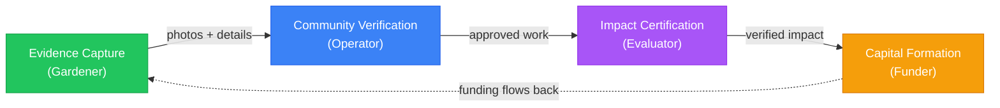

import {Hero, NextBestAction} from "@site/src/components/docs";

<Hero />

---

Green Goods is a mobile-first platform that helps local communities **document**, **verify**, and **fund** their regenerative work — from tree planting and waste collection to solar maintenance and agroforestry.

Built by the [Greenpill Dev Guild](https://paragraph.com/@greenpilldevguild), Green Goods connects field workers to the verification and capital systems that make regenerative action sustainable. The platform works **offline**, speaks **your language**, and puts **community trust** at the center of every transaction.

---

## What is Green Goods?

**A regenerative compliance and local-first impact reporting platform.** Green Goods captures, verifies, and funds community-led regenerative work. It connects field workers documenting environmental actions to the capital and verification systems that make those actions sustainable.

### Simple & Accessible Reporting Tool

Green Goods makes impact reporting as simple as taking a photo. The **MDR workflow** (Media → Details → Review) guides field workers through structured evidence capture — no grant writing skills, no data science background, no blockchain knowledge required. Sign in with your **fingerprint or face** (no wallets, no seed phrases), and your first submission takes under 60 seconds.

### An Open Path To Build Capital

Verified work doesn't stay in a spreadsheet. Green Goods turns approved work into **on-chain attestations** that build into **Hypercerts** — tokenized impact certificates that funders can purchase. **Octant Vaults** hold endowment principal for each garden while harvested strategy yield is routed into regenerative operations. Depositor claim value stays flat by design, and the funding effect appears through harvest and split flows.

### A Community Coordination Platform

Green Goods isn't just a reporting tool — it's a coordination layer for regenerative communities. **Hats Protocol** roles define who can submit, review, evaluate, and fund. **Gardens V2** conviction voting lets communities signal which work matters most. **Cookie Jars** provide petty cash for daily operations. Together, these tools give communities the infrastructure to govern themselves transparently.

---

## Growing Gardens

Gardens are the core organizational unit in Green Goods. Each garden represents a **local community** working on regenerative projects in their area.

### Gardens Are Hyper Local Hubs

A garden could be a university campus maintaining solar panels in **Nigeria**, a waste collection cooperative in **Cape Town**, an agroforestry collective in **Brazil**, or a school tree-planting program in **Uganda**. Each garden has its own team, its own actions, its own governance — and its own on-chain identity.

### Fund At A Local Level

Each garden gets its own **Octant Vault** for impact-aligned deposits, its own **Cookie Jars** for petty cash operations, and its own **Hypercerts** for impact certification. Capital is coordinated locally, and harvested yield is routed by the community that earned it.

### Garden Areas Of Focus

Gardens organize their work into **five action domains**, each with specific impact metrics:

| Domain | Impact Metrics | Example Communities |
|--------|---------------|-------------------|
| **Agroforestry** | Trees planted, species diversity, canopy cover, harvest yield | AgroforestryDAO Brasil |
| **Waste Management** | Kg diverted from landfill, recycling rate, area cleaned | Cape Town Sarafu |
| **Solar Infrastructure** | kWh generated, panels maintained, outages prevented | University of Nigeria Nsukka |
| **Education** | Students engaged, curricula completed, knowledge assessments | Uganda School-Tree-Student |
| **Mutual Credit** | Transactions facilitated, participation rate, economic velocity | Sarafu Network communities |

### Create Relationships With Other Gardens

Gardens don't operate in isolation. The **Greenpill Network** connects gardens across regions, enabling shared learning, cross-garden evaluations, and collective funding opportunities. A garden in Cape Town can learn from an agroforestry operation in Brazil, and evaluators can assess impact across multiple gardens.

---

## Building Community & Trust

Trust in Green Goods flows from **neighbors verifying neighbors**, not from distant algorithms or centralized authorities.

### Governance With Continuous Signal

**Conviction voting** through Gardens V2 lets community members continuously signal support for specific actions and proposals. Unlike traditional voting (one vote, one moment), conviction voting lets support accumulate over time — the longer you signal, the stronger your conviction weight. This means the community's priorities emerge organically from sustained engagement, not from snapshot votes.

### Trust Based Payouts

When work is verified and approved, payouts flow through transparent on-chain mechanisms. **Cookie Jars** handle small, frequent payments for daily operations. **Harvested vault yield** funds larger initiatives after operators run the harvest and split flow. **Hypercert sales** reward high-impact work. Every transaction is auditable, and payout rules are defined by the community's governance configuration.

### Community Garden Engagement

Every garden has six on-chain roles managed through **Hats Protocol**:

- **Owner** — Full control over garden configuration
- **Operator** — Approves work, manages actions, creates assessments
- **Evaluator** — Certifies impact, creates Hypercerts
- **Gardener** — Documents work in the field
- **Funder** — Deposits into vaults, purchases Hypercerts
- **Community** — Participates in governance and signaling

Role transitions are transparent — a gardener who consistently delivers quality work can be promoted to operator by the garden admin.

---

## Turning Impact into Funding

The ultimate goal is a **self-reinforcing cycle** where verified impact attracts capital, and capital enables more impact work.

### Establish A Baseline

Every action in Green Goods follows the **CIDS Framework** — a structured chain from raw activity to measurable impact:

| Stage | Definition | Example |
|-------|-----------|---------|
| **Activity** | The work performed | "Planted 12 mango trees" |
| **Output** | The direct product | "12 trees in the ground, geotagged" |
| **Outcome** | The change produced | "Increased canopy cover by 15% in zone A" |
| **Impact** | The long-term effect | "Carbon sequestration, improved biodiversity, food security" |

This chain ensures that every submission connects to verifiable outcomes, not just activity logs.

### Compliant Impact Reporting

Green Goods integrates with **Karma GAP** to aggregate approved work across actions and reporting periods. Impact data maps to grant milestones, and evaluators can export reports in formats that funders expect. Assessments are framed using the **Eight Forms of Capital** — measuring impact beyond just financial value:

| Capital Form | What It Measures |
|-------------|-----------------|
| **Natural** | Ecosystem health, biodiversity, soil quality |
| **Social** | Community bonds, trust networks, collective action |
| **Financial** | Economic value generated, costs saved |
| **Material** | Physical infrastructure created or maintained |
| **Living** | Food produced, species supported, health outcomes |
| **Intellectual** | Knowledge generated, research data, curricula |
| **Experiential** | Skills developed, practices learned |
| **Spiritual/Cultural** | Cultural preservation, connection to land |

### Impact Certificates

Aggregated, assessed work becomes a **Hypercert** — a tokenized impact certificate that represents verified outcomes. Hypercerts are:

- **Purchasable** — Funders buy fractions to support specific impact claims
- **Verifiable** — Each Hypercert links back to the full attestation chain (Work → Approval → Assessment)
- **Portable** — Standard ERC-1155 tokens, tradeable and composable across platforms

### Endowment Based Funnel

The **Octant Vault** system creates a sustainable funding funnel:

1. **Funders deposit** ERC-20 tokens into impact vaults
2. **Strategies generate yield** in the background while depositor claim value stays flat by design
3. **Harvest** routes yield three ways: Cookie Jar (petty cash), Hypercert fractions (impact investment), and community endowment
4. **More deposits and more verified impact** strengthen the funding cycle for each garden

---

## Who Is Green Goods For?

Green Goods serves five roles in the impact cycle:

| Role | What you do | Where to start |
|------|-------------|----------------|
| **Gardener** | Document regenerative work in the field | [Gardener Guide](/community/gardener-guide/joining-a-garden) |
| **Operator** | Manage your garden community | [Operator Guide](/community/operator-guide/creating-a-garden) |
| **Evaluator** | Verify impact claims and create assessments | [Evaluator Guide](/community/evaluator-guide/joining-a-garden) |
| **Community Member** | Participate in garden governance | [Community Guide](/community/community-member-guide/getting-involved) |
| **Funder** | Deposit in vaults and purchase Hypercerts | [Funder Guide](/community/funder-guide/funding-a-garden) |

## Community Spotlights

Green Goods supports **20+ active garden communities** across Latin America, Africa, and North America.

**University of Nigeria Nsukka — Solar Infrastructure** — Students and staff monitor and maintain solar panels that provide critical power to campus facilities. Green Goods' **offline-first design** is essential here — submissions happen in areas with limited connectivity and sync when WiFi is available.

**Cape Town — Waste Management with Sarafu** — Waste collectors in Cape Town earn **Sarafu mutual credits** for verified waste collection and sorting. Multi-language support enables collectors to work in their preferred language.

**AgroforestryDAO Brasil — Agroforestry & DeSci** — Brazilian agroforestry practitioners combine fieldwork with **decentralized science** data partnerships. Portuguese language support is critical for this community.

**Uganda — School-Tree-Student Program** — Students adopt and monitor trees as part of their curriculum, learning ecological stewardship while generating **verifiable impact data**. The mobile-first, low-bandwidth design ensures the app works on mid-range Android devices.

---

<NextBestAction
  title="Next: How It Works"
  why="Now that you understand the platform, dive deeper into the technical workflows — MDR submissions, passkey onboarding, offline sync, and more."
  actionLabel="How It Works"
  actionHref="/community/how-it-works"
  alternatives={[
    { label: "Why We Build", href: "/community/why-we-build" },
    { label: "Glossary", href: "/glossary" }
  ]}
/>
