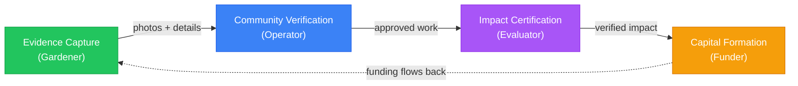

import {NextBestAction} from "@site/src/components/docs";

# Welcome to Green Goods

Green Goods is a mobile-first platform that helps local communities **document**, **verify**, and **fund** their regenerative work — from tree planting and waste collection to solar maintenance and agroforestry.

Built by the [Greenpill Dev Guild](https://paragraph.com/@greenpilldevguild), Green Goods connects field workers to the verification and capital systems that make regenerative action sustainable. The platform works offline, speaks your language, and puts community trust at the center of every transaction.

{/* IMAGE PLACEHOLDER: Hero — gardener using app in field (800x400) */}

## The Core Loop

Every piece of regenerative work flows through four stages:

1. **You do the work** — A gardener photographs their tree planting, composting session, or solar panel maintenance using the Green Goods app. The MDR workflow (Media, Details, Review) guides them through capturing evidence.
2. **Your community verifies it** — An operator reviews the submission, checks the photos and details, and approves or requests changes. This creates an on-chain attestation — a permanent, verifiable record.
3. **Impact gets certified** — An evaluator aggregates approved work into assessments, measuring outcomes across the Eight Forms of Capital. Verified impact becomes a Hypercert — a tokenized impact certificate.
4. **Funding flows back** — Funders deposit into yield-bearing vaults and purchase Hypercerts. The returns flow back to the garden community, creating a sustainable funding cycle.

## Who Is Green Goods For?

Green Goods serves five roles in the impact cycle:

| Role | What you do | Where to start |
|------|-------------|----------------|
| **Gardener** | Document regenerative work in the field | [Gardener Guide](/community/gardener-guide/joining-a-garden) |
| **Operator** | Manage your garden community | [Operator Guide](/operator/create-garden) |
| **Evaluator** | Verify impact claims and create assessments | [Evaluator Guide](/evaluator/get-started) |
| **Community Member** | Participate in garden governance | [Community Member Guide](/community/community-member-guide/getting-involved) |
| **Funder** | Deposit in vaults and purchase Hypercerts | [Funder Guide](/community/funder-guide/getting-started) |

## Community Spotlights

Green Goods supports 20+ active garden communities across Latin America, Africa, and North America:

**University of Nigeria Nsukka — Solar Infrastructure** — Students and staff monitor and maintain solar panels that provide critical power to campus facilities. Green Goods' offline-first design is essential here — submissions happen in areas with limited connectivity and sync when WiFi is available.

**Cape Town — Waste Management with Sarafu** — Waste collectors in Cape Town earn Sarafu mutual credits for verified waste collection and sorting. Multi-language support enables collectors to work in their preferred language.

**AgroforestryDAO Brasil — Agroforestry & DeSci** — Brazilian agroforestry practitioners combine fieldwork with decentralized science data partnerships. Portuguese language support is critical for this community.

**Uganda — School-Tree-Student Program** — Students adopt and monitor trees as part of their curriculum, learning ecological stewardship while generating verifiable impact data. The mobile-first, low-bandwidth design ensures the app works on mid-range Android devices.

## What Makes Green Goods Different

- **Offline-first**: Works without internet. Your submissions queue locally and sync when you're back online.
- **No wallet needed**: Sign in with your fingerprint or face — no seed phrases, no browser extensions.
- **Community-verified**: Your neighbors verify your work, not a distant algorithm.
- **Impact = Funding**: Verified work becomes tokenized impact certificates that attract real capital.
- **Multi-language**: Full UI support in English, Spanish, and Portuguese — with French and Swahili planned — so communities can work in their preferred language.
- **Open protocols**: Built on [EAS](/glossary#eas-ethereum-attestation-service), [Hats Protocol](https://www.hatsprotocol.xyz/), [Hypercerts](/glossary#hypercert), and other open standards — your data is portable and verifiable by anyone.

---

<NextBestAction
  title="Next: How It Works"
  why="Now that you understand the platform, dive deeper into the technical workflows — MDR submissions, passkey onboarding, offline sync, and more."
  actionLabel="How It Works"
  actionHref="/community/how-it-works"
  alternatives={[
    { label: "Why We Build", href: "/community/why-we-build" },
    { label: "Glossary", href: "/glossary" }
  ]}
/>
