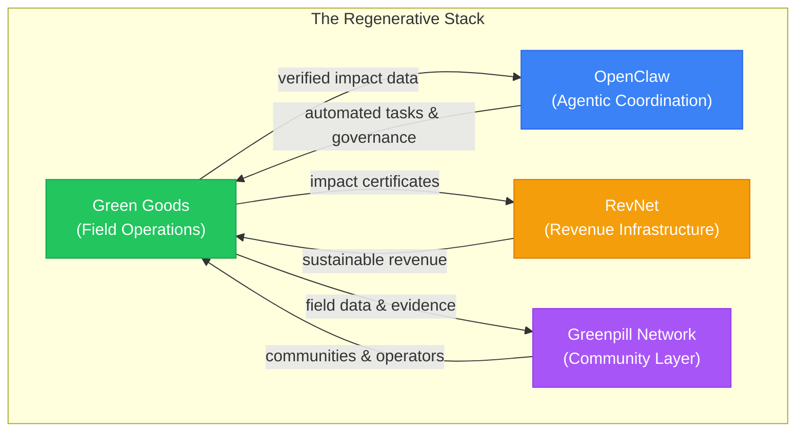
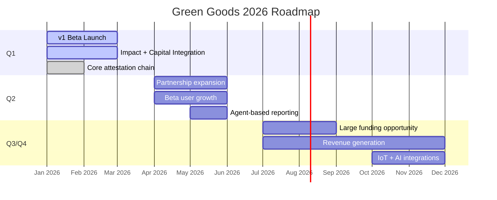

import {NextBestAction} from "@site/src/components/docs";

# Where We're Headed

Green Goods is evolving from a field reporting tool into a **full-stack regenerative coordination platform**, connecting impact capture, community governance, and sustainable funding into one integrated system.

---

## Vision & Strategy of Green Goods

### Our Long Term Vision

Green Goods pursues three strategic goals, each reinforcing the others:

**1. Capital Formation**: Regenerative communities need sustainable funding, not one-off grants. Green Goods creates a cycle where **verified impact attracts capital**:

- **Octant Vaults**: Yield-generating deposits where returns fund regenerative operations
- **Hypercerts**: Tokenized impact certificates that funders can purchase
- **RevNets**: Revenue-sharing token models for long-term community funding
- **Conviction voting**: Communities signal which work matters most

| Metric | Target |
|--------|--------|
| Total Value Locked (TVL) | $100k – $200k (self-sustaining) |
| Hypercerts minted/month | Growing month-over-month |
| Funder retention rate | Tracked quarterly |

**2. Impact Accessibility**: Impact reporting shouldn't require a grant writer or data scientist:

- **MDR workflow**: Evidence capture as simple as taking a photo
- **AI agents** on WhatsApp/SMS for communities without smartphones
- **Offline-first PWA** for low-connectivity environments
- **Passkey authentication** eliminating wallet and seed phrase barriers

| Metric | Target |
|--------|--------|
| Active gardeners/month | Growing across 20+ gardens |
| Time-to-submit | Under 2 minutes on 2G/3G |
| Actions submitted/gardener | Consistent weekly engagement |

**3. On-Chain Governance & Reputation**: Trust should be verifiable, not assumed:

- **Hats Protocol roles**: Transparent, revocable community permissions
- **EAS attestations**: Permanent, portable records of verified work
- **Gardens V2**: Conviction voting for community resource allocation
- **ENS integration**: Human-readable identities for gardens and gardeners

| Metric | Target |
|--------|--------|
| Governance participation rate | Tracked per garden |
| Signal pool utilization | Active use in funded gardens |
| Role transitions | Gardener → Operator progression |

### Our 2026 Strategy

The 2026 strategy centers on **proving economic sustainability** at small scale before growing. The break-even point is achievable at **~$60k TVL** given minimal operational costs (~$195/mo for gas, IPFS, and infrastructure).

**Revenue Structure:**

| Source | Range | Notes |
|--------|-------|-------|
| Operator subscriptions | $49 – $1,000/mo per Garden | Scales with garden size and features |
| Funder dashboards | $2k – $50k/yr | Impact reporting and analytics |
| Yield from vaults | Variable | Octant vault returns fund operations |

**Competitive moats** that strengthen over time:

| Moat | Description |
|------|-------------|
| **Network effects** | More gardeners → more data → more funder confidence → more capital |
| **Data moat** | Longitudinal impact data across 20+ communities builds unique evidence base |
| **Capital moat** | Yield-backed vaults create compounding returns new entrants can't replicate |
| **Switching costs** | Attestation history is portable, but workflow integration is sticky |

---

## Where It Fits In Our Regen Stack

Green Goods is one of four products in the Greenpill Dev Guild's **Regenerative Stack**. Each layer addresses a different coordination challenge.

### Connects the 4 Elements Into One

| Layer | Product | What it does |
|-------|---------|-------------|
| **Field Operations** | **Green Goods** | Mobile-first work documentation, community verification, and impact certification |
| **Agentic Coordination** | **OpenClaw** | AI-powered meeting-to-action pipeline, transcripts become tasks, tasks become on-chain operations |
| **Revenue Infrastructure** | **RevNet** | Sustainable revenue distribution for open-source projects and communities |
| **Community Layer** | **Greenpill Network** | The broader community of builders, gardeners, and funders working on regenerative public goods |

Green Goods serves as the **field operations layer**, the point where physical regenerative work enters the digital verification and funding stack.

### How GreenWill Grows

**GreenWill** is the upcoming agentic layer that extends Green Goods into automated coordination:

- **Meeting-to-action pipelines**: Community meetings are transcribed, and action items are automatically created as on-chain tasks
- **Agent-based reporting**: WhatsApp and SMS bots let gardeners submit work without a smartphone
- **Automated evidence validation**: AI assists operators in reviewing submissions for completeness and consistency
- **Cross-garden coordination**: GreenWill connects gardens that work on related ecological goals

### Public Good Staking Integration Points

Green Goods connects to broader **public goods funding** mechanisms:

- **Hypercerts Marketplace**: Verified impact certificates listed for purchase
- **Octant Epoch Funding**: Community gardens eligible for quadratic funding rounds
- **Gitcoin integration**: Impact data from Green Goods feeds into Gitcoin passport and funding rounds
- **Squad Staking**: Community members can stake together to boost their garden's funding allocation

---

## Our 2026 Roadmap

### Q1: Launch of v1 Beta connecting impact reporting with capital formation

The v1 release brings together the full stack:

- Offline-first work submission with photo evidence
- Operator review and approval workflows
- Hypercert minting from approved work batches
- Vault deposits with yield tracking
- Role management via Hats Protocol
- EAS attestation chains (Work → Approval → Assessment)
- Indexer for core state queries
- Admin dashboard for garden operations

### Q2: Growing partnerships and integrations for Beta users

Focus shifts to **adoption and partnerships**:

- Agent-based impact reporting (WhatsApp/SMS bots)
- Unlock Protocol badge integration
- Sarafu Network community currency integration (Cape Town)
- AgroforestryDAO DeSci data partnership (Brazil)
- Expanded Karma GAP reporting capabilities

### Q3/Q4: Secure large funding opportunity and start to generate revenue

The target: **economic sustainability**:

- RevNet tokenization for community revenue sharing
- IoT + AI integrations for automated evidence capture
- Bio-regional quadratic funding streams
- Community stablecoins
- Target TVL of $100k – $200k for self-sustaining operations

**Out of scope**: Not planned:

- Carbon credit issuance or offset marketplace
- Self-custodial wallet flows for gardeners
- Always-online features
- Direct fiat on/off-ramp integration

### Partnerships

**Active:**

- **Hypercerts Foundation**: Impact certificate standard
- **Hats Protocol**: Role-based access control
- **Octant**: Yield-generating vault infrastructure
- **Gardens V2**: Conviction voting and community governance
- **EAS**: On-chain attestation infrastructure

**Planned:**

- **Unlock Protocol**: Token-gated credentials and badges
- **Sarafu Network**: Community currency integration
- **AgroforestryDAO**: DeSci data partnerships (Brazil)
- **Fireflies.ai**: Meeting transcript processing for OpenClaw

---

<NextBestAction
  title="Next: Gardener Guide"
  why="Ready to participate? Start with the Gardener Guide to learn how to join a garden and begin documenting your work."
  actionLabel="Joining a Garden"
  actionHref="/community/gardener-guide/joining-a-garden"
  alternatives={[
    { label: "Operator Guide", href: "/community/operator-guide/creating-a-garden" },
    { label: "Builder Docs", href: "/builders/getting-started" }
  ]}
/>
