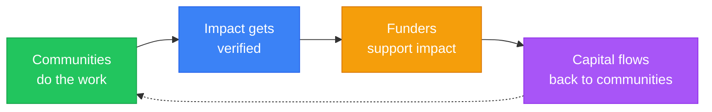

import {NextBestAction} from "@site/src/components/docs";

# Why We Build

Green Goods exists because regenerative communities deserve better tools. Field workers plant trees, collect waste, maintain solar panels, and teach — but their impact often goes undocumented, unverified, and unfunded. We're building the infrastructure to change that.

## Impact = Profit

Green Goods operates on a core belief: **the people who create positive impact should be the ones who benefit from it**. Not intermediaries, not platform operators — the gardeners, waste collectors, and community organizers doing the work.

## Regenerative Principles

- **Community-first**: Local communities verify their own work. Trust flows from neighbors, not algorithms.
- **Offline-first**: Technology should work where the work happens, even without internet.
- **Open protocols**: No lock-in. Your data, attestations, and impact records are portable and verifiable by anyone.
- **Accessible by default**: No wallets, no gas fees, no technical knowledge required. If you can take a photo and tap a button, you can use Green Goods.
- **Transparent governance**: Roles, permissions, and decisions are on-chain and auditable.

## Where It Fits in the Regen Stack

{/* IMAGE PLACEHOLDER: Regen Stack — protocol layer diagram showing EAS, Hats, Hypercerts integration (800x400) */}

Green Goods is one piece of a broader regenerative technology ecosystem built by the [Greenpill Dev Guild](https://paragraph.com/@greenpilldevguild):

| Layer | Project | What it does |
|-------|---------|-------------|
| **Field Operations** | **Green Goods** | Mobile-first work documentation, community verification, and impact certification |
| **Agentic Coordination** | **OpenClaw** | AI-powered meeting-to-action pipeline — transcripts become tasks, tasks become on-chain operations |
| **Revenue Infrastructure** | **RevNet** | Sustainable revenue distribution for open-source projects and communities |
| **Network** | **Greenpill Network** | The broader community of builders, gardeners, and funders working on regenerative public goods |

Green Goods serves as the **field operations layer** — the point where physical regenerative work enters the digital verification and funding stack. OpenClaw handles coordination and governance automation. RevNet manages revenue flows. Together, they form an integrated stack for regenerative communities.

## The Funding Flywheel

The ultimate vision is a self-reinforcing cycle:

Each cycle strengthens the next: more verified impact attracts more funding, which enables more work, which produces more verified impact. Green Goods is the infrastructure that makes this flywheel turn.

---

<NextBestAction
  title="Next: Where We're Headed"
  why="Now that you understand why we build, see the strategic goals, roadmap, and partnerships driving Green Goods forward."
  actionLabel="Where We're Headed"
  actionHref="/community/where-were-headed"
  alternatives={[
    { label: "Gardener Guide", href: "/community/gardener-guide/joining-a-garden" },
    { label: "Builder Docs", href: "/developers/getting-started" }
  ]}
/>
