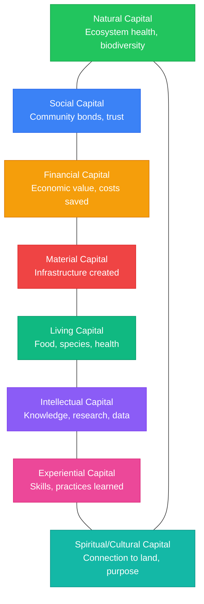

import {NextBestAction} from "@site/src/components/docs";

# Why We Build

Green Goods exists because regenerative communities deserve better tools. Field workers plant trees, collect waste, maintain solar panels, and teach, but their impact often goes **undocumented**, **unverified**, and **unfunded**. We're building the infrastructure to change that.

---

## Greenpill & Regen Core

Green Goods is built by the **Greenpill Dev Guild**, a collective of developers and designers whose mission is to foster positive-sum actions where **impact = profit**.

### Greenpill Dev Guild Mission

The Greenpill Dev Guild builds open-source tools for regenerative communities. We believe that the people who create positive impact should be the ones who benefit from it, not intermediaries, not platform operators, but the **gardeners**, **waste collectors**, and **community organizers** doing the work.

Our core services:

- **Platform development**: Building and maintaining the Green Goods protocol
- **Community onboarding**: Helping garden operators set up and manage their communities
- **Impact methodology**: Designing action schemas and assessment frameworks
- **Integration support**: Connecting to funding mechanisms (Hypercerts, Octant, Gardens)
- **Localization**: Adapting the platform for communities across languages and regions

### Greenpill Ethos

The Greenpill movement asks a simple question: **What if we used coordination technology to create abundance rather than extract it?** Green Goods answers this by connecting real-world regenerative work to on-chain verification and capital, making impact legible, fundable, and sustainable.

Every feature decision is evaluated against this ethos:

- Does it **create more value** than it consumes?
- Does it **empower communities** or create dependencies?
- Does it **reduce barriers** for field workers?
- Does it **increase transparency** for funders?

### The Regen Movement

Green Goods is part of a broader ecosystem of regenerative builders who believe technology should serve ecological and social renewal. We build on **open protocols** (EAS, Hats, Hypercerts) rather than proprietary infrastructure. We share learnings publicly. We iterate based on feedback from the gardeners in **Cape Town** and the agroforesters in **Brazil**, not abstract personas.

Our work maps to these United Nations Sustainable Development Goals:

| SDG | Connection |
|-----|------------|
| **Good Health & Well-Being** (3) | Community gardens improve food security and nutrition |
| **Clean Water & Sanitation** (6) | Watershed protection and water system maintenance |
| **Affordable & Clean Energy** (7) | Solar infrastructure monitoring and maintenance |
| **Sustainable Cities & Communities** (11) | Urban greening, waste management, community spaces |
| **Responsible Consumption & Production** (12) | Waste reduction, recycling, circular economy actions |
| **Life on Land** (15) | Reforestation, agroforestry, biodiversity monitoring |

---

## Create Stronger Local Economies

Regenerative work shouldn't depend on perpetual grant funding. Green Goods creates the infrastructure for communities to **build their own sustainable economies** around verified impact.

### Bringing Accessible Tools To Communities

Most impact reporting tools are built for NGOs with dedicated staff and reliable internet. Green Goods is built for the opposite reality:

- **Offline-first**: Works without internet. Submissions queue locally and sync when you're back online.
- **No wallet needed**: Sign in with your fingerprint or face. No seed phrases, no browser extensions.
- **Multi-language**: Full UI support in English, Spanish, and Portuguese. French and Swahili are next.
- **Low bandwidth**: Designed for mid-range Android devices on 2G/3G networks.
- **Minutes, not hours**: From first visit to first submission in minutes.

These aren't nice-to-have features, they're **requirements** driven by the real constraints of 20+ active garden communities across Latin America, Africa, and North America.

### Making Capital Formation Simple

The biggest challenge for regenerative communities isn't doing the work, it's **proving the work happened** and **connecting that proof to funding**. Green Goods solves both:

1. **Evidence capture** is as simple as taking a photo with the MDR workflow
2. **Community verification** creates permanent, on-chain attestations
3. **Impact certification** aggregates verified work into Hypercerts
4. **Capital formation** flows through impact vault deposits, harvest routing, and Hypercert purchases

Vault deposits are designed so depositor claim value stays flat. When strategies generate yield, Green Goods routes that yield through harvest and split flows into community funding rather than depositor share-price appreciation.

The result: a field worker in Nigeria can photograph their solar panel maintenance, get it verified by their campus operator, and have that verified work attract real capital from funders anywhere in the world.

### Connecting Communities To Their Bioregions

Green Goods organizes impact around **action domains** that map to local ecological contexts:

- An **agroforestry** garden in Brazil tracks tree plantings, canopy cover, and harvest yields
- A **waste management** garden in Cape Town tracks kilograms diverted from landfill
- A **solar infrastructure** garden in Nigeria tracks kWh generated and panels maintained
- An **education** garden in Uganda tracks students engaged and trees adopted

Each domain has its own impact metrics, but all feed into the same verification and funding pipeline. Communities document what matters to their bioregion, and the platform handles the rest.

---

## Love For Nature

At its core, Green Goods is driven by a simple motivation: **care for the living world and the communities that steward it**.

### Our Core Driver Is Care for Mother Earth

Technology is a means, not an end. Every protocol integration, every smart contract, every UI component exists to serve one purpose: making it easier for people to **do regenerative work** and **be recognized for it**. The dignity of small work, planting a single tree, collecting a bag of trash, maintaining a solar panel, is what Green Goods is built to honor.

### The Many Ways We Connect To Nature

Green Goods communities show us that regenerative work takes many forms:

- **Students in Uganda** learn ecological stewardship by adopting and monitoring individual trees
- **Waste collectors in Cape Town** clean their neighborhoods while earning community credits
- **Agroforesters in Brazil** generate scientific datasets alongside their practical fieldwork
- **Solar teams in Nigeria** keep critical infrastructure running for their campus community

Each of these connections is valuable, measurable, and fundable, when the right tools exist to capture them.

### Striving For A Healthy Ecological Relationship

Green Goods measures impact across the **Eight Forms of Capital**, because the relationship between humans and nature is richer than any single metric:

By measuring all eight forms, Green Goods ensures that regenerative work is valued **holistically**. A tree planted isn't just carbon sequestered, it's also food security, biodiversity, community engagement, and educational opportunity.

These are illustrative examples. Each garden adapts the forms to its bioregional context.

<!-- TODO: Source Gitcoin/Hypercert imagery for Forms of Capital -->

| Capital Form | What It Measures |
|-------------|-----------------|
| **Natural** | Ecosystem health, biodiversity, soil quality |
| **Social** | Community bonds, trust networks, collective action |
| **Financial** | Economic value generated, costs saved |
| **Material** | Physical infrastructure created or maintained |
| **Living** | Food produced, species supported, health outcomes |
| **Intellectual** | Knowledge generated, research data, curricula |
| **Experiential** | Skills developed, practices learned |
| **Spiritual/Cultural** | Cultural preservation, connection to land |

### Community Spotlights

Green Goods supports **20+ active garden communities** across Latin America, Africa, and North America.

**University of Nigeria Nsukka, Solar Infrastructure**: Students and staff monitor and maintain solar panels that provide critical power to campus facilities. Green Goods' **offline-first design** is essential here, submissions happen in areas with limited connectivity and sync when WiFi is available.

**Cape Town, Waste Management with Sarafu**: Waste collectors in Cape Town earn **Sarafu mutual credits** for verified waste collection and sorting. Multi-language support enables collectors to work in their preferred language.

**AgroforestryDAO Brasil, Agroforestry & DeSci**: Brazilian agroforestry practitioners combine fieldwork with **decentralized science** data partnerships. Portuguese language support is critical for this community.

**Uganda, School-Tree-Student Program**: Students adopt and monitor trees as part of their curriculum, learning ecological stewardship while generating **verifiable impact data**. The mobile-first, low-bandwidth design ensures the app works on mid-range Android devices.

---

<NextBestAction
  title="Next: Where We're Headed"
  why="Now that you understand why we build, see the strategic goals, roadmap, and partnerships driving Green Goods forward."
  actionLabel="Where We're Headed"
  actionHref="/community/where-were-headed"
  alternatives={[
    { label: "Gardener Guide", href: "/community/gardener-guide/joining-a-garden" },
    { label: "Builder Docs", href: "/builders/getting-started" }
  ]}
/>
