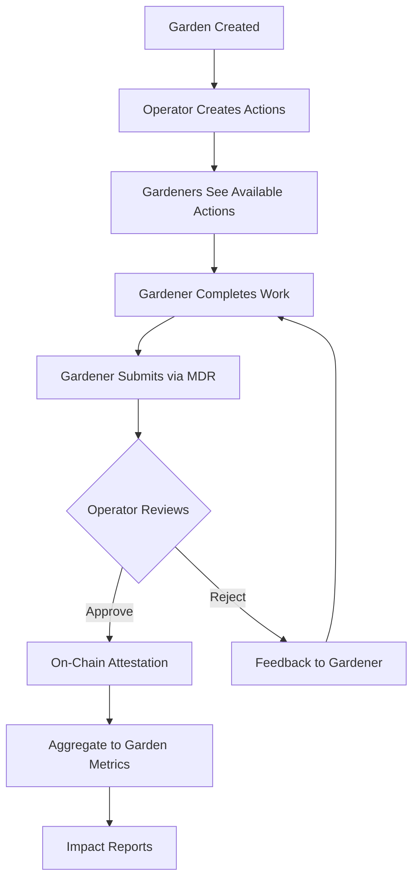

# Gardens, Assessments, Actions & Work

Understanding the core entities of Green Goods: how gardens coordinate impact, actions define tasks, and work creates verifiable records.

---

## What Is a Garden?

A **Garden** is a community hub for coordinating regenerative work in a specific bioregion or around a shared mission.

### Garden as NFT

Each garden is represented as an **ERC-721 NFT** with special properties:

```
Garden NFT #1
├── Token ID: 1
├── Owner: Multisig or DAO
└── Account: Tokenbound Account (ERC-6551)
    ├── Can hold assets
    ├── Can execute transactions
    └── Has unique on-chain identity
```

**Benefits of NFT gardens**:
- 🪙 **Ownership clarity**: Clear who controls the garden
- 💰 **Asset management**: Gardens can hold tokens, NFTs
- 🤝 **Transferable**: Garden ownership can be transferred
- ⛓️ **Composable**: Gardens can interact with other protocols

### Garden Components

**Metadata**:
- Name and description
- Geographic location
- Banner image (IPFS)
- Tags and categorization

**Members**:
- **Gardeners**: Workers who submit tasks
- **Operators**: Validators who approve work

**Actions**:
- Available tasks gardeners can complete
- Each with specific requirements

**History**:
- All work submissions
- All approvals/rejections
- Cumulative impact metrics

<!-- TODO: Add diagram showing garden structure -->
<!-- TODO: Add image - Garden Structure -->
<!--  -->
*A garden coordinates members, actions, and work*

### The Root Garden

Every Green Goods deployment includes a **Root Community Garden**:
- **Name**: "Green Goods Community Garden"
- **Purpose**: Universal garden all users can join
- **Auto-join**: New gardeners added automatically
- **Scope**: General conservation and community actions

---

## Garden Assessments

**Assessments** are comprehensive evaluations of a garden's health and impact across the eight forms of capital.

### Assessment Schema

```
Assessment {
  title: "Q1 2024 Biodiversity Assessment"
  assessmentType: "Quarterly"
  capitals: ["LIVING", "SOCIAL", "CULTURAL"]
  metricsJSON: "ipfs://Qm..." // Structured data
  evidenceMedia: ["ipfs://...", "ipfs://..."]
  impactAttestations: [0xabc..., 0xdef...] // Links to work
  startDate: 1704067200
  endDate: 1711929600
  location: "San Francisco Bay Area"
  tags: ["biodiversity", "restoration"]
}
```

### Eight Forms of Capital

Assessments track impact across:

1. **Living Capital**: Biodiversity, soil, water
2. **Material Capital**: Physical infrastructure
3. **Financial Capital**: Money and assets
4. **Social Capital**: Relationships and trust
5. **Intellectual Capital**: Knowledge and skills
6. **Experiential Capital**: Lived wisdom
7. **Spiritual Capital**: Meaning and purpose
8. **Cultural Capital**: Traditions and identity

### Creating Assessments

**Who**: Operators and evaluators
**When**: Quarterly, annually, or milestone-based
**Purpose**: Holistic impact measurement

<!-- TODO: Add screenshot of assessment form -->
<!-- TODO: Add image - Assessment Form -->
<!--  -->
*Create comprehensive garden assessments*

---

## Actions: Tasks for Gardeners

**Actions** define specific work gardeners can complete within a garden.

### Action Structure

```
Action {
  id: 1
  owner: 0xGardenAccount...
  title: "Plant 10+ Native Trees"
  instructions: "ipfs://Qm..." // Detailed guide
  startTime: 1704067200 // Optional
  endTime: 1711929600 // Optional
  capitals: ["LIVING", "MATERIAL"]
  media: ["ipfs://..."] // Example photos
}
```

### Action Lifecycle

**1. Creation** (by operator)
- Define task requirements
- Set metrics to track
- Upload example media
- Choose capital alignment

**2. Active** (available to gardeners)
- Gardeners see in app
- Can submit work
- Tracked for completions

**3. Completed** (optional)
- Deactivate after time window
- Keep for historical reference
- Archive if no longer relevant

### Example Actions

**Conservation**:
- "Remove invasive blackberry bushes from 500 sqm area"
- "Plant 25 native oak seedlings along creek"
- "Install 3 nest boxes for native birds"

**Monitoring**:
- "Conduct biodiversity survey (photograph 10+ species)"
- "Test water quality at 3 locations"
- "Count bird species in restoration area"

**Community**:
- "Lead community planting workshop (10+ participants)"
- "Create educational signage for trail"
- "Organize neighborhood cleanup event"

### Time-Bound Actions

Actions can have optional time windows:

```
Action: "Spring Planting"
Start: March 1, 2024
End: May 31, 2024
Status after end date: "Archived"
```

**Use cases**:
- Seasonal work (planting, harvest)
- Time-sensitive events
- Grant-funded projects with deadlines

---

## Work: Documenting Impact

**Work** is a gardener's submission documenting a completed action.

### Work Submission Structure

```
Work Submission {
  actionUID: 1
  gardener: 0xabc...
  title: "Planted 25 oak trees at River Valley"
  feedback: "Great planting locations chosen"
  metadata: {
    species: "Quercus agrifolia",
    area: "500 sqm",
    treeCount: 25
  }
  media: [
    "ipfs://Qm.../before.jpg",
    "ipfs://Qm.../after.jpg",
    "ipfs://Qm.../closeup.jpg"
  ]
  timestamp: 1704067200
}
```

### MDR Workflow

Work follows the **Media → Details → Review** pattern:

1. **Media**: Capture before/after photos
2. **Details**: Fill in metrics and context
3. **Review**: Confirm and submit

[See detailed MDR workflow →](mdr-workflow.md)

### Work States

**Pending** ⏳
- Submitted by gardener
- Awaiting operator review
- Visible to operators only

**Approved** ✅
- Validated by operator
- On-chain attestation created
- Permanently recorded

**Rejected** ❌
- Did not meet standards
- Operator provided feedback
- Gardener can revise and resubmit

---

## Work Approvals

**Work Approvals** are operator validations of gardener submissions.

### Approval Structure

```
Work Approval {
  actionUID: 1
  workUID: 0xabc...
  operator: 0xOperatorAddress...
  approved: true
  feedback: "Excellent documentation, trees well-spaced"
  timestamp: 1704153600
}
```

### Approval Process

**1. Operator Reviews**:
- Check photo evidence
- Verify metrics reasonable
- Assess quality of documentation

**2. Decision**:
- **Approve**: Create on-chain attestation
- **Reject**: Provide constructive feedback

**3. On-Chain Record**:
- EAS attestation links work → approval
- Karma GAP impact attestation auto-created
- Permanent, verifiable record

### Approval Best Practices

**Operators should**:
- ✅ Review within 24-48 hours
- ✅ Provide specific, constructive feedback
- ✅ Be consistent in standards
- ✅ Recognize exceptional work

**Operators shouldn't**:
- ❌ Approve without reviewing media
- ❌ Reject without clear feedback
- ❌ Apply inconsistent standards
- ❌ Delay reviews indefinitely

---

## Garden-Level Impact

All work aggregates to the garden level for holistic impact tracking.

### Cumulative Metrics

**Example garden dashboard**:
```
Watershed Restoration Garden
├── Total work submissions: 127
├── Approved: 119 (94% approval rate)
├── Active gardeners: 23
├── Trees planted: 1,450
├── Area restored: 12,000 sqm
├── Species documented: 87
└── Community events: 15
```

### Impact Reports

Gardens can generate reports for:
- Grant applications
- Community updates
- Research publications
- Funder accountability

**Export formats**:
- CSV (for Excel)
- JSON (for databases)
- PDF (formatted report)

---

## Gardens → Actions → Work Flow



---

## Multi-Garden Participation

### Gardeners Can Join Multiple Gardens

```
Gardener Alice
├── Garden A: Urban Farm (5 work submissions)
├── Garden B: Creek Restoration (12 submissions)
└── Garden C: Community Garden (3 submissions)
```

**Benefits**:
- Diversify impact
- Contribute across bioregions
- Build varied portfolio

### Operators Can Manage Multiple Gardens

```
Operator Bob
├── Manages Garden X
├── Co-manages Garden Y
└── No access to Garden Z
```

**Garden-specific permissions**:
- Operator in one garden ≠ operator in all gardens
- Each garden controls its own member list

---

## Garden Discovery

### Finding Gardens

**By Location**:
- Filter by city, region, or country
- Map view (future)

**By Interest**:
- Tags: restoration, urban farming, education
- Capital focus: Living, Social, Cultural

**By Invitation**:
- Operators can invite gardeners directly
- Share garden invite links

### Joining Gardens

**Process**:
1. Browse available gardens
2. Request to join (or get invited)
3. Operator approves membership
4. Start completing actions

---

## Advanced: Garden Templates (Future)

**Coming soon**: Pre-configured garden templates for common use cases:

- 🌳 **Reforestation Garden**: Actions for tree planting, monitoring
- 🌾 **Urban Farm Garden**: Actions for food production, education
- 🌊 **Watershed Garden**: Actions for water quality, habitat
- 🏫 **Education Garden**: Actions for workshops, outreach

---

## Learn More

- [Roles & Responsibilities](roles.md) — How members interact with gardens
- [MDR Workflow](mdr-workflow.md) — Detailed work submission process
- [Attestations](attestations.md) — How work becomes permanent records
- [Operator Guide: Managing Gardens](../guides/operators/managing-gardens.md)
- [Gardener Guide: Logging Work](../guides/gardeners/logging-work.md)

