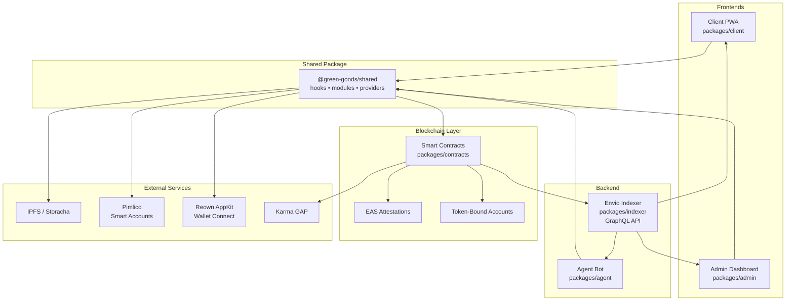
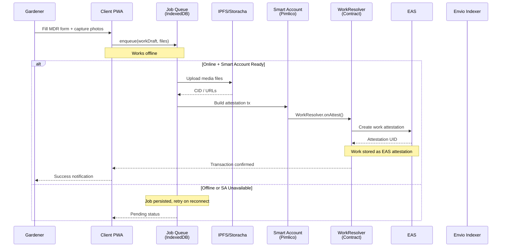
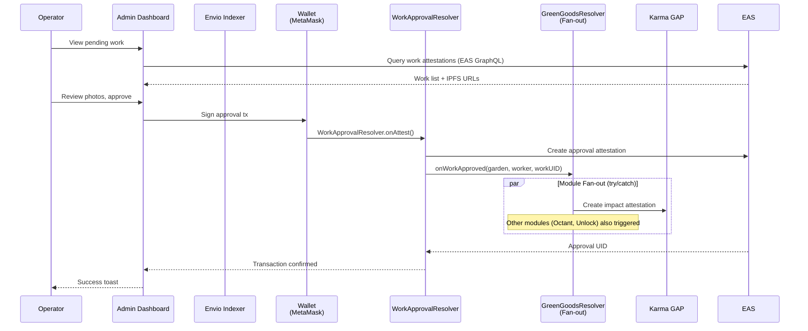
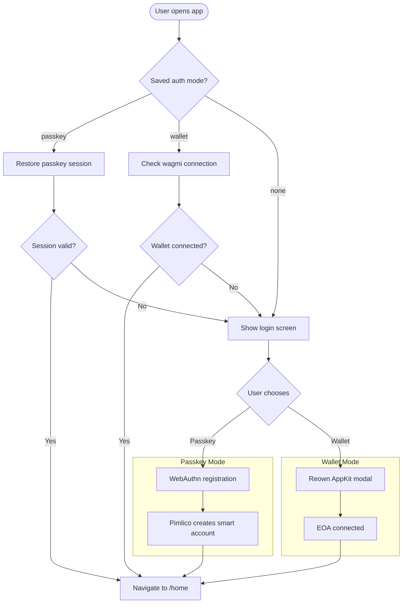
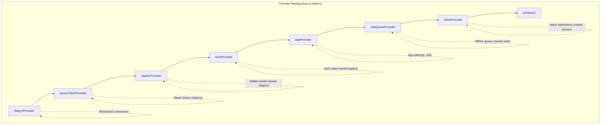
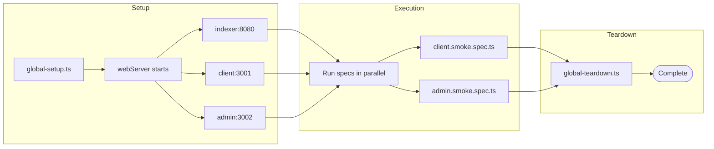
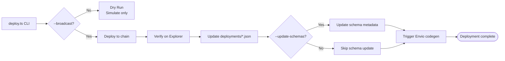
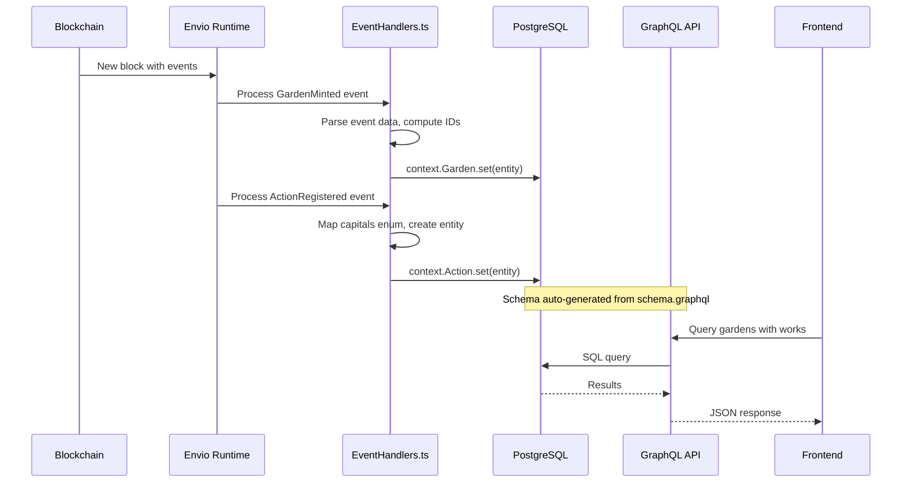
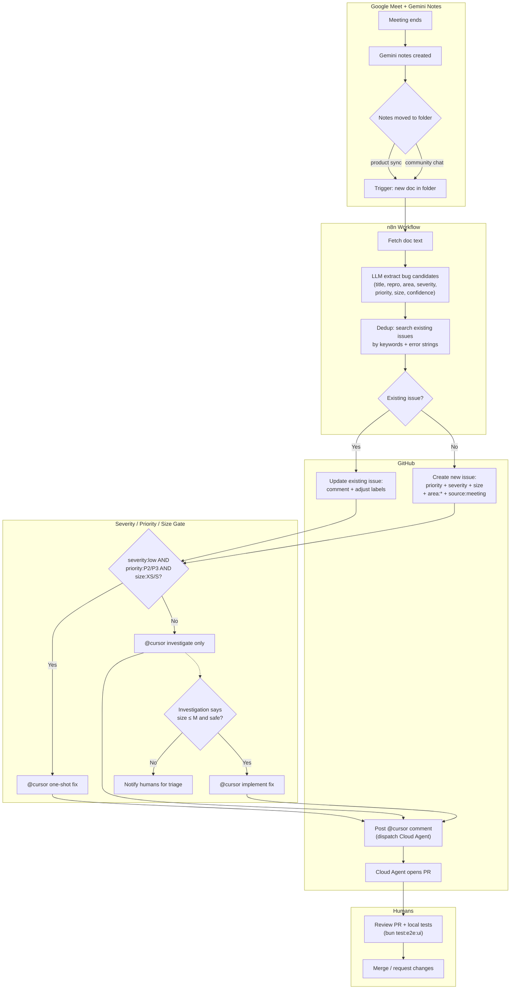

# Green Goods Architecture Diagrams

Canonical Mermaid diagrams for understanding Green Goods data flows and system architecture.

> **Usage:** Reference these diagrams in documentation, PRs, and agent explanations. Install [Mermaid Preview](https://marketplace.cursorapi.com/items?itemName=bierner.markdown-mermaid) in VS Code/Cursor to render inline.

---

## System Context {#system-context}

High-level view of the Green Goods monorepo and external integrations.



**When to use:** Explaining package relationships, onboarding new contributors, architecture discussions.

---

## Work Submission Flow {#work-submission}

Complete flow from gardener form input to on-chain attestation.



**When to use:** Explaining offline-first architecture, debugging submission issues, client PRs.

---

## Work Approval Flow {#work-approval}

Operator review through to Karma GAP impact attestation.



**When to use:** Explaining approval workflow, admin PRs, contract resolver changes.

---

## Authentication Flow {#auth-flow}

Passkey vs wallet authentication branching.



**When to use:** Auth-related PRs, debugging login issues, explaining auth modes.

---

## Provider Hierarchy {#provider-hierarchy}

Required React context nesting order for client/admin apps.



**When to use:** Setting up new entry points, debugging provider issues, understanding context dependencies.

---

## E2E Test Execution {#e2e-test-flow}

Playwright test run lifecycle.



**When to use:** Understanding test infrastructure, CI/CD debugging, E2E test PRs.

---

## Contract Deployment {#deployment-flow}

deploy.ts CLI execution flow.



**When to use:** Contract deployment PRs, understanding deploy.ts, upgrade procedures.

---

## Indexer Event Processing {#indexer-flow}

Envio event handler data flow.



**When to use:** Indexer PRs, understanding data flow, debugging GraphQL issues.

---

## n8n Issue Automation {#n8n-automation}

Meeting notes → GitHub issue → Cursor Cloud Agent pipeline.



**When to use:** Understanding automated issue creation, n8n setup, Cloud Agent dispatch.

**Labels used:**
- **priority** (custom field): P0, P1, P2, P3
- **severity** (custom field): low, med, high
- **size** (custom field): XS, S, M, L, XL
- **area**: client, admin, shared, contracts, indexer, agent
- **source**: meeting, bugbot, manual

---

## Quick Reference

| Diagram | Anchor | Use Case |
|---------|--------|----------|
| System Context | `#system-context` | Package relationships, onboarding |
| Work Submission | `#work-submission` | Offline queue, client PRs |
| Work Approval | `#work-approval` | Admin PRs, resolver changes |
| Auth Flow | `#auth-flow` | Auth PRs, login debugging |
| Provider Hierarchy | `#provider-hierarchy` | Context issues, new entry points |
| E2E Test Flow | `#e2e-test-flow` | Test infrastructure, CI/CD |
| Deployment Flow | `#deployment-flow` | Contract PRs, deploy.ts |
| Indexer Flow | `#indexer-flow` | Indexer PRs, GraphQL issues |
| n8n Automation | `#n8n-automation` | Meeting → issue → agent pipeline |

---

## Mermaid Syntax Reference

```mermaid
%% Flowchart (logic, decisions)
graph TD
  A[Start] --> B{Decision?}
  B -->|Yes| C[Action]
  B -->|No| D[Other]

%% Sequence (interactions over time)
sequenceDiagram
  participant U as User
  participant S as Server
  U->>S: Request
  S-->>U: Response
```

**Tips:**
- Use `graph TD` for top-down flows, `graph LR` for left-right
- Use `sequenceDiagram` for time-ordered interactions
- Wrap labels in quotes if they contain special characters
- Use `subgraph` to group related nodes
