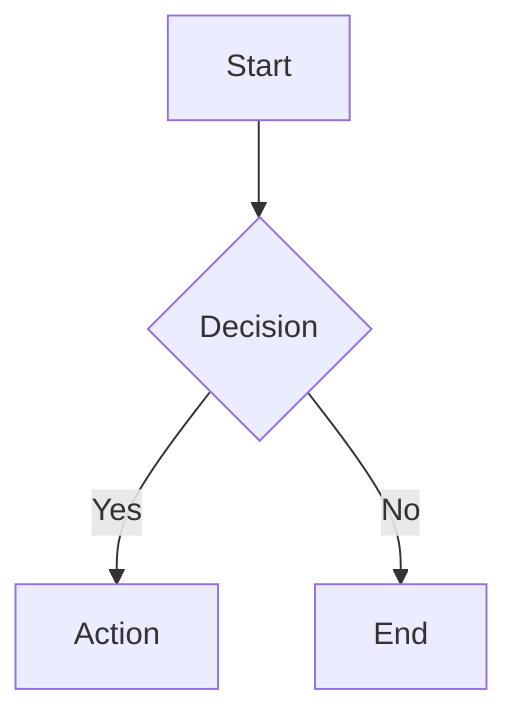

# Contributing to Documentation

Green Goods documentation is built with Docusaurus. This guide explains how to contribute to the docs from the monorepo.

## Documentation Structure

- **Source of truth:** `docs/docs/` directory contains all documentation markdown files
- **Site configuration:** `docs/docusaurus.config.ts` and `docs/sidebars.ts`
- **Assets:** Store images and static files in `docs/static/img/`
- **Build output:** Generated site lives in `docs/build/`

## Quick Start

```bash
# From repository root
bun docs:dev

# Or from docs directory
cd docs && bun start
```

The dev server will open at `http://localhost:3000` with hot reloading.

## Workflow

1. **Clone the repo** and create a branch
2. **Edit markdown files** in `docs/docs/` using standard Markdown
3. **Preview locally** with `bun docs:dev` to see changes live
4. **Run build** with `bun docs:build` to check for broken links
5. **Open a PR** and label it `docs`

## Style Guidelines

### Markdown Conventions

- **Headings**: Use `#` for title, `##` for sections, `###` for subsections. Don't skip levels.
- **Tone**: Friendly, direct, and actionable. Use "you" when giving instructions.
- **Links**: 
  - Internal docs: Use relative links **without `.md` extension** (e.g., `[link](../concepts/roles)`)
  - External: Use full URLs
  - Package files: Link to GitHub (e.g., `https://github.com/greenpill-dev-guild/green-goods/tree/main/packages/contracts#readme`)
- **Code blocks**: Always specify language for syntax highlighting:
  ````markdown
  ```typescript
  const example = "code";
  ```
  ````

### MDX Considerations

Docusaurus uses MDX (Markdown + JSX). Keep in mind:

- Self-closing tags must include `/`: `<br/>` not `<br>`
- Escape angle brackets in text: `&lt;50%` not `<50%`
- Tables and HTML work as expected

### Frontmatter

Add frontmatter to control page metadata:

```markdown
---
sidebar_position: 2
title: Custom Page Title
---

# Page Heading
```

**Common frontmatter options:**
- `sidebar_position`: Order in sidebar (number)
- `title`: Override page title
- `slug`: Custom URL path
- `sidebar_label`: Custom sidebar text

## Adding Content

### New Documentation Page

1. Create `.md` file in appropriate directory under `docs/docs/`
2. Add to `docs/sidebars.ts` if you need custom ordering
3. Use relative links to connect pages

### New Sidebar Category

Edit `docs/sidebars.ts`:

```typescript
{
  type: 'category',
  label: 'New Section',
  items: [
    'path/to/doc1',
    'path/to/doc2',
  ],
}
```

## Screenshots & Diagrams

### Images

- Place in `docs/static/img/`
- Reference as `/img/filename.png` (Docusaurus resolves from static/)
- Keep files under 1 MB. Use SVG for diagrams when possible.
- Use descriptive alt text

Example:
```markdown

```

### Mermaid Diagrams

Mermaid is fully supported:

````markdown

````

For complex diagrams, see the [Mermaid documentation](https://mermaid.js.org/).

## Testing Your Changes

### Check for Broken Links

```bash
bun docs:build
```

Docusaurus will fail the build if any internal links are broken. Fix all errors before submitting PR.

### Preview Production Build

```bash
bun docs:build
bun docs:serve
```

This shows exactly how the site will look when deployed.

## Deployment

The documentation site can be deployed to:
- **GitHub Pages**: Configured via `docusaurus.config.ts`
- **Vercel**: Zero-config deployment
- **Netlify**: Standard static site

Build command: `bun run build`
Output directory: `build`

## Common Tasks

### Update Navigation

Edit `docs/sidebars.ts` to change sidebar structure.

### Change Site Metadata

Edit `docs/docusaurus.config.ts`:
- Site title/tagline
- Navbar/footer links
- Theme configuration

### Add Search

Consider adding Algolia DocSearch or a local search plugin. See [Docusaurus search docs](https://docusaurus.io/docs/search).

## Troubleshooting

### Build Fails with Broken Links

Check the error output - Docusaurus lists all broken links. Common issues:
- Using `.md` extension in links (remove it)
- Linking to files outside docs (use GitHub URLs)
- Incorrect relative paths

### Mermaid Diagrams Not Rendering

Ensure `@docusaurus/theme-mermaid` is installed and configured in `docusaurus.config.ts`.

### Hot Reload Not Working

Restart the dev server:
```bash
# Kill existing process
pkill -f "docusaurus start"

# Start fresh
bun docs:dev
```

## Getting Help

- Open an issue on [GitHub](https://github.com/greenpill-dev-guild/green-goods/issues)
- Ask in [Telegram](https://t.me/+N3o3_43iRec1Y2Jh)
- Check [Docusaurus documentation](https://docusaurus.io/docs)

## Resources

- [Docusaurus Docs](https://docusaurus.io/docs)
- [Markdown Features](https://docusaurus.io/docs/markdown-features)
- [Docusaurus Configuration API](https://docusaurus.io/docs/api/docusaurus-config)
- [Mermaid Documentation](https://mermaid.js.org/)
