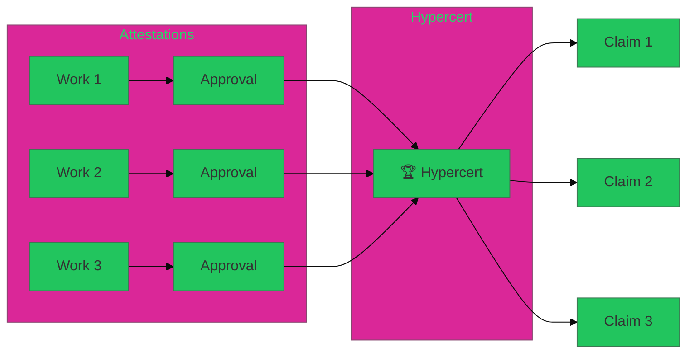
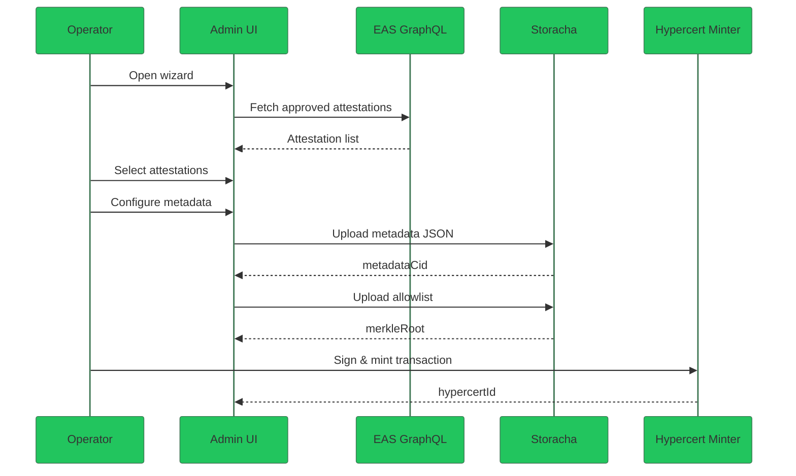
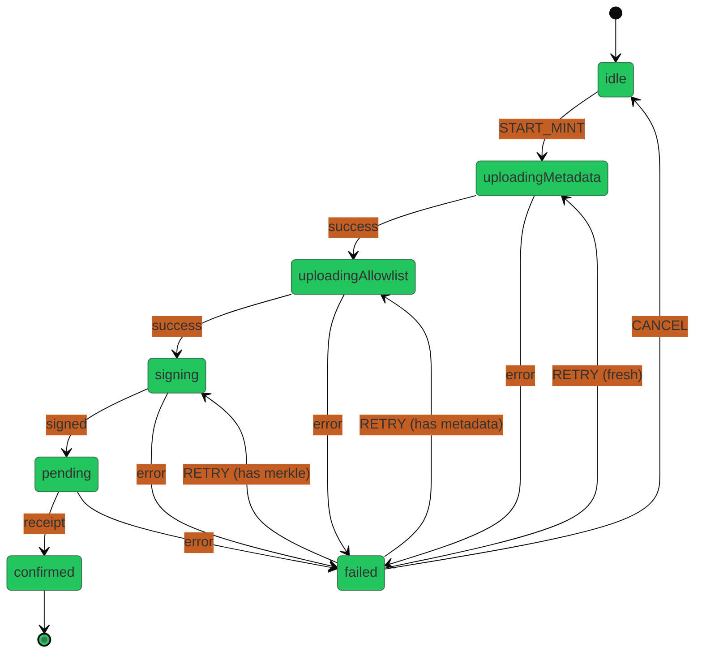

# Hypercerts

> **Audience:** Developers working on Hypercert minting features.
> **Related:** [API Reference](api-reference#hypercerts-api), [Shared Package](shared), [Feature Spec](../specs/hypercerts/feature-spec)
> **Status:** Active development (January 2026)

Hypercerts are ERC-1155 tokens that bundle verified work attestations into tradeable impact certificates.

---

## What is a Hypercert?

A Hypercert represents a claim of positive impact. In Green Goods:

1. **Gardeners** submit work (photos, descriptions)
2. **Operators** approve work → creates EAS attestation
3. **Operators** bundle approved attestations → mints Hypercert
4. **Recipients** can claim their share of the Hypercert



---

## Architecture

### Data Flow



### Key Files

| File | Purpose |
|------|---------|
| [types/hypercerts.ts](https://github.com/greenpill-dev-guild/green-goods/tree/main/packages/shared/src/types/hypercerts.ts) | All Hypercert type definitions |
| [stores/useHypercertWizardStore.ts](https://github.com/greenpill-dev-guild/green-goods/tree/main/packages/shared/src/stores/useHypercertWizardStore.ts) | 4-step wizard state management |
| [workflows/mintHypercert.ts](https://github.com/greenpill-dev-guild/green-goods/tree/main/packages/shared/src/workflows/mintHypercert.ts) | XState minting workflow |
| [hooks/hypercerts/](https://github.com/greenpill-dev-guild/green-goods/tree/main/packages/shared/src/hooks/hypercerts) | React hooks for data fetching |
| [lib/hypercerts/](https://github.com/greenpill-dev-guild/green-goods/tree/main/packages/shared/src/lib/hypercerts) | Distribution calculations, merkle trees |

---

## The 4-Step Wizard

| Step | Name | Description |
|------|------|-------------|
| 1 | **Attestations** | Select approved work attestations to bundle |
| 2 | **Metadata** | Configure title, description, timeframe, SDGs, capitals |
| 3 | **Distribution** | Set allocation mode and recipient shares |
| 4 | **Preview + Mint** | Review and execute the mint transaction |

---

## Minting States

The `mintHypercertMachine` manages the async minting process:



**Smart Retry**: When retrying, the machine resumes from the last successful step to avoid re-uploading data.

---

## External Dependencies

| Dependency | Purpose | Chain |
|------------|---------|-------|
| [Hypercert Minter](https://github.com/hypercerts-org/hypercerts) | ERC-1155 contract | Arbitrum One |
| [EAS](https://docs.attest.org/) | Work attestations | Multiple |
| [Storacha](https://storacha.network/) | IPFS metadata storage | N/A |
| [Pimlico](https://pimlico.io/) | Gas sponsorship | Multiple |

**Contract Address** (Arbitrum One):
```typescript
const HYPERCERT_MINTER = "0x822F17A9A5EeCFd66dBAFf7946a8071C265D1d07";
```

---

## Quick Start

### Using the Hooks

```typescript
import {
  useHypercerts,
  useHypercertAttestations,
  useHypercertDraft,
  useMintHypercert,
} from '@green-goods/shared';

// List hypercerts for a garden
const { data: hypercerts } = useHypercerts(gardenId);

// Fetch eligible attestations
const { data: attestations } = useHypercertAttestations(gardenId, filters);

// Manage draft state
const { draft, updateDraft, saveDraft } = useHypercertDraft(gardenId);

// Execute minting
const { mint, state, error, reset } = useMintHypercert();
```

### Using the Store

```typescript
import { useHypercertWizardStore } from '@green-goods/shared';

const {
  currentStep,
  selectedAttestationIds,
  title,
  description,
  allowlist,
  mintingState,
  nextStep,
  previousStep,
  toggleAttestation,
  updateMetadata,
  setAllowlist,
} = useHypercertWizardStore();
```

---

## Related Documentation

**Implementation Details:**
- [API Reference: Hypercerts API](api-reference#hypercerts-api) — Data fetching, types, queries
- [Shared Package: Stores](shared#hypercert-wizard-store-multi-step-pattern) — Wizard store patterns
- [Shared Package: Workflows](shared#mint-hypercert-workflow) — XState minting machine
- [Testing: Hypercerts](testing#hypercerts-testing) — Test patterns and mocks

**Product Specs:**
- [Feature Spec](../specs/hypercerts/feature-spec) — Product requirements
- [Technical Spec](../specs/hypercerts/technical-spec) — Implementation details
