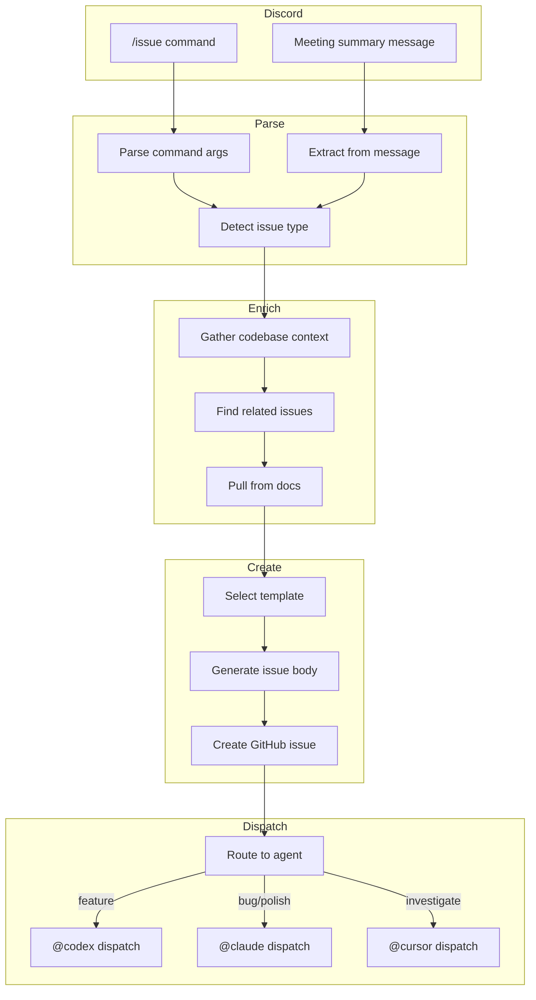

# n8n Story-Based Workflow

Automated pipeline from PRDs to Stories to Features with agent dispatch.

## Overview

This workflow extends the [n8n Issue Automation](n8n-automation.md) to support:

1. **PRD Processing**: Parse PRDs and generate stories
2. **Story Decomposition**: Break stories into feature tasks
3. **Multi-Source Triggers**: Discord, meetings, manual
4. **Agent Routing**: Codex for features, Claude for bugs, Cursor for investigation
5. **Hierarchical Linking**: Maintain PRD → Story → Feature relationships

---

## Issue Hierarchy

```
PRD (Epic)                    Labels: epic, prd
├── Story 1                   Labels: story, user-facing
│   ├── Feature Task A        Labels: enhancement
│   └── Feature Task B        Labels: enhancement, hook
├── Story 2                   Labels: story, technical
│   └── Feature Task C        Labels: enhancement, contract
└── Story 3                   Labels: story, enabler
    ├── Feature Task D        Labels: enhancement
    └── Feature Task E        Labels: enhancement
```

### Linking Convention

| Link Type | Format | Example |
|-----------|--------|---------|
| Story → PRD | `Parent: #N` in body | `Parent: #100` |
| Feature → Story | `Story: #N` in body | `Story: #101` |
| Feature → Multiple Stories | `Stories: #N, #M` | `Stories: #101, #102` |

---

## Trigger Sources

### 1. Discord Commands

**Bot Commands:**
```
/issue prd "Garden Management System"
/issue story "As a gardener, I want to create a garden" --prd 100
/issue feature "useCreateGarden hook" --story 101 --complete
/issue bug "Loading spinner missing on mobile"
```

**Meeting Summary Trigger:**
When a meeting summary is posted in `#meeting-notes`:
1. Bot detects message with meeting summary format
2. Extracts action items, bugs, feature requests
3. Creates appropriate issues with linking

### 2. Google Meet Notes

Same as existing [n8n-automation.md](n8n-automation.md#1-trigger), extended with:
- Story extraction from product discussions
- PRD candidate detection for major features

### 3. PRD Approval Webhook

When a PRD issue transitions to `status:approved`:
1. Webhook triggers story generation
2. Parse functional requirements
3. Create stories for each requirement
4. Link stories to PRD

### 4. Story Completion Webhook

When all features in a story are closed:
1. Auto-close the story
2. Update PRD progress
3. Notify in Discord

---

## Workflow Nodes

### Discord Trigger Flow



### Node 1: Discord Webhook Trigger

```javascript
// n8n Discord Trigger node config
{
  "resource": "message",
  "event": "messageCreate",
  "options": {
    "channelIds": ["CHANNEL_ID_1", "CHANNEL_ID_2"]
  }
}
```

Filter function:
```javascript
const message = $input.first().json;

// Check for /issue command
const isCommand = message.content.startsWith('/issue');

// Check for meeting summary format
const isMeetingSummary = message.content.includes('## Meeting Summary') ||
  message.content.includes('## Action Items');

return isCommand || isMeetingSummary;
```

### Node 2: Parse Discord Input

```javascript
const message = $input.first().json.content;

// Command format: /issue <type> "<title>" [--flags]
const commandMatch = message.match(/\/issue\s+(\w+)\s+"([^"]+)"(.*)$/);

if (commandMatch) {
  const [, type, title, flagsStr] = commandMatch;

  // Parse flags
  const flags = {};
  const prdMatch = flagsStr.match(/--prd\s+#?(\d+)/);
  const storyMatch = flagsStr.match(/--story\s+#?(\d+)/);
  const completeFlag = flagsStr.includes('--complete');

  if (prdMatch) flags.prdId = parseInt(prdMatch[1]);
  if (storyMatch) flags.storyId = parseInt(storyMatch[1]);
  if (completeFlag) flags.complete = true;

  return [{
    json: {
      source: 'discord-command',
      type,
      title,
      flags,
      userId: $input.first().json.author.id,
      channelId: $input.first().json.channelId
    }
  }];
}

// Meeting summary parsing
const actionItems = [];
const bugMatches = message.matchAll(/- \[BUG\]\s*(.+)/gi);
const featureMatches = message.matchAll(/- \[FEATURE\]\s*(.+)/gi);
const storyMatches = message.matchAll(/- \[STORY\]\s*(.+)/gi);

for (const match of bugMatches) {
  actionItems.push({ type: 'bug', title: match[1].trim() });
}
for (const match of featureMatches) {
  actionItems.push({ type: 'feature', title: match[1].trim() });
}
for (const match of storyMatches) {
  actionItems.push({ type: 'story', title: match[1].trim() });
}

return actionItems.map(item => ({
  json: {
    source: 'meeting-summary',
    ...item,
    channelId: $input.first().json.channelId
  }
}));
```

### Node 3: Gather Context

```javascript
const { type, title, flags } = $input.first().json;

// Build context gathering queries
const queries = [];

// Search related files by keywords
const keywords = title.toLowerCase()
  .split(' ')
  .filter(w => w.length > 3)
  .slice(0, 5);

queries.push({
  action: 'search-code',
  query: keywords.join(' OR '),
  limit: 10
});

// Get parent issue if linked
if (flags?.prdId) {
  queries.push({
    action: 'get-issue',
    issueNumber: flags.prdId
  });
}

if (flags?.storyId) {
  queries.push({
    action: 'get-issue',
    issueNumber: flags.storyId
  });
}

// Search for related open issues
queries.push({
  action: 'search-issues',
  query: `repo:greenpill-dev-guild/green-goods is:issue is:open ${keywords.slice(0, 3).join(' ')}`
});

return [{ json: { queries, originalInput: $input.first().json } }];
```

### Node 4: Pull Documentation Context

For features and stories, pull relevant documentation:

```javascript
const { type, title } = $input.first().json.originalInput;

// Determine which docs to pull
const docPaths = [];

if (title.toLowerCase().includes('hook') || type === 'hook') {
  docPaths.push('packages/shared/src/hooks/README.md');
  docPaths.push('CLAUDE.md'); // For hook patterns
}

if (title.toLowerCase().includes('contract') || type === 'contract') {
  docPaths.push('packages/contracts/README.md');
  docPaths.push('packages/contracts/src/');
}

if (title.toLowerCase().includes('offline')) {
  docPaths.push('packages/shared/src/stores/jobStore.ts');
}

// Always include CLAUDE.md for patterns
if (!docPaths.includes('CLAUDE.md')) {
  docPaths.push('CLAUDE.md');
}

return [{
  json: {
    docPaths,
    ...($input.first().json)
  }
}];
```

### Node 5: Select Template

```javascript
const { type, flags } = $input.first().json.originalInput;

const templateMap = {
  'prd': 'prd.md',
  'story': 'story.md',
  'feature': flags?.complete ? 'feature-complete.md' : 'feature.md',
  'bug': 'bug.md',
  'hook': 'feature-complete.md', // Hooks use complete template
  'contract': 'contract section in feature-complete.md',
  'polish': 'polish.md',
  'spike': 'spike.md',
  'docs': 'docs.md'
};

const template = templateMap[type] || 'feature.md';

// Determine labels
const labelMap = {
  'prd': ['epic', 'prd'],
  'story': ['story'],
  'feature': ['enhancement'],
  'bug': ['bug', 'triage'],
  'hook': ['enhancement', 'component', 'shared'],
  'contract': ['contract'],
  'polish': ['enhancement', 'polish'],
  'spike': ['spike'],
  'docs': ['documentation']
};

const labels = labelMap[type] || ['enhancement'];

// Add linking labels
if (flags?.storyId) {
  labels.push('has-parent');
}

return [{
  json: {
    template,
    labels,
    ...($input.first().json)
  }
}];
```

### Node 6: Generate Issue Body (LLM)

```javascript
// System prompt for issue generation
const systemPrompt = `You are generating a GitHub issue for the Green Goods project.

Project context:
- Offline-first PWA for conservation work documentation
- Monorepo: client, admin, shared, contracts, indexer, agent
- All hooks must be in @green-goods/shared package
- Uses React 19, TanStack Query, Wagmi, Zustand

Template to use: ${$input.first().json.template}

Parent context (if any):
${$input.first().json.parentContext || 'None'}

Related issues found:
${JSON.stringify($input.first().json.relatedIssues || [], null, 2)}

Documentation context:
${$input.first().json.docContext || 'Standard patterns from CLAUDE.md'}

Generate a complete issue body following the template structure.
Include:
- Clear acceptance criteria
- Package detection
- File inventory (for features)
- Agent assignment recommendation
- Compliance checklist

For stories: Include story breakdown into potential features.
For features with --complete: Include full API contracts and test specs.
`;

return [{
  json: {
    systemPrompt,
    userPrompt: `Create a ${$input.first().json.originalInput.type} issue titled: "${$input.first().json.originalInput.title}"`,
    ...($input.first().json)
  }
}];
```

### Node 7: Create GitHub Issue

```javascript
// GitHub API call
const { title, type, flags } = $input.first().json.originalInput;
const { labels, generatedBody } = $input.first().json;

// Format title with type prefix
const titlePrefixes = {
  'prd': '[PRD]',
  'story': '[STORY]',
  'feature': '[FEATURE]',
  'bug': '[BUG]',
  'hook': '[HOOK]',
  'contract': '[CONTRACT]',
  'polish': '[POLISH]',
  'spike': '[SPIKE]',
  'docs': '[DOCS]'
};

const formattedTitle = `${titlePrefixes[type] || ''} ${title}`.trim();

// Add parent linking to body
let body = generatedBody;

if (flags?.prdId) {
  body = `**Parent PRD**: #${flags.prdId}\n\n${body}`;
}

if (flags?.storyId) {
  body = `**Parent Story**: #${flags.storyId}\n\n${body}`;
}

return [{
  json: {
    title: formattedTitle,
    body,
    labels: labels.join(','),
    project: 4 // Green Goods project board
  }
}];
```

### Node 8: Agent Routing Decision

```javascript
const issue = $input.first().json;
const { type, flags } = issue.originalInput;

// Routing logic
function routeToAgent(issue) {
  // Features → Codex
  if (['feature', 'hook'].includes(type)) {
    const isComplex = flags?.complete ||
      issue.labels.includes('contract') ||
      (issue.packagesAffected || []).length > 3;

    return {
      agent: 'codex',
      mode: isComplex ? 'supervised' : 'autonomous',
      dispatchTemplate: 'feature'
    };
  }

  // Bugs → Claude Code
  if (type === 'bug') {
    const isHighSeverity = issue.severity === 'high' ||
      issue.labels.includes('contract');

    return {
      agent: 'claude',
      mode: isHighSeverity ? 'supervised' : 'autonomous',
      dispatchTemplate: 'bug-fix'
    };
  }

  // Polish/Docs → Claude Code
  if (['polish', 'docs'].includes(type)) {
    return {
      agent: 'claude',
      mode: 'autonomous',
      dispatchTemplate: type === 'polish' ? 'polish' : 'documentation'
    };
  }

  // Stories → Generate features first, then dispatch
  if (type === 'story') {
    return {
      agent: null,
      mode: 'generate-features',
      dispatchTemplate: null
    };
  }

  // PRDs → No auto-dispatch, wait for approval
  if (type === 'prd') {
    return {
      agent: null,
      mode: 'await-approval',
      dispatchTemplate: null
    };
  }

  // Spikes → Cursor for investigation
  if (type === 'spike') {
    return {
      agent: 'cursor',
      mode: 'investigate-only',
      dispatchTemplate: 'investigation'
    };
  }

  // Contracts → Claude with supervision
  if (type === 'contract') {
    return {
      agent: 'claude',
      mode: 'supervised',
      dispatchTemplate: 'contract'
    };
  }

  // Default: human triage
  return {
    agent: null,
    mode: 'manual',
    dispatchTemplate: null
  };
}

const routing = routeToAgent(issue);

return [{
  json: {
    ...issue,
    routing
  }
}];
```

### Node 9: Dispatch Templates

```javascript
const { routing, issueNumber, title } = $input.first().json;

const templates = {
  'feature': `@codex Implement this feature.

**Context**: This is a Green Goods feature task.

**Requirements**:
1. Follow patterns in CLAUDE.md
2. Hooks ONLY in packages/shared/src/hooks/
3. Add tests meeting coverage targets
4. Include i18n keys for en, es, pt
5. Use conventional commits

**Validation**:
\`\`\`bash
bun lint && bun test && bun build
\`\`\`

If you encounter blockers, document them and request human review.`,

  'bug-fix': `@claude Investigate and fix this bug.

**Approach**:
1. Identify root cause
2. Write failing test first
3. Implement minimal fix
4. Verify fix with existing tests

**Constraints**:
- Keep changes focused and minimal
- Don't refactor unrelated code
- Add regression test

**Validation**:
\`\`\`bash
bun test && bun lint
\`\`\`

If you cannot fix confidently, document your investigation findings.`,

  'polish': `@claude Apply this polish/refinement.

**Focus**:
- Visual consistency
- Accessibility (WCAG 2.1 AA)
- Responsive behavior
- Interaction smoothness

**Validation**:
- Manual visual review
- Axe accessibility audit
- Mobile viewport testing`,

  'documentation': `@claude Update documentation as specified.

**Guidelines**:
- Keep docs concise and actionable
- Include code examples where helpful
- Update any outdated references
- Ensure links are valid`,

  'contract': `@claude Review and implement this contract change.

**CRITICAL**:
- Follow CEI pattern
- Add comprehensive tests (100% coverage)
- Include fuzz tests for parameters
- Update NatSpec documentation
- Security checklist verification

**Validation**:
\`\`\`bash
cd packages/contracts && forge test -vvv
\`\`\`

Request security review before merging.`,

  'investigation': `@cursor Investigate this issue.

**Deliverables**:
1. Affected files and packages
2. Root cause analysis
3. Proposed solution(s) with trade-offs
4. Effort estimate (XS/S/M/L/XL)
5. Recommended validation approach

**Do NOT implement changes** - await human approval first.`
};

if (routing.agent && routing.dispatchTemplate) {
  return [{
    json: {
      action: 'post-comment',
      issueNumber,
      comment: templates[routing.dispatchTemplate],
      addLabel: `${routing.agent}:dispatched`
    }
  }];
}

// No dispatch - just log
return [{
  json: {
    action: 'none',
    reason: routing.mode,
    issueNumber
  }
}];
```

---

## Story Auto-Generation Flow

When a PRD is approved, automatically generate stories:

### PRD Approval Trigger

```javascript
// GitHub webhook filter
const event = $input.first().json;

// Check for PRD label and approved status
const isPRD = event.issue.labels.some(l => l.name === 'prd' || l.name === 'epic');
const isApproved = event.label?.name === 'status:approved';

return isPRD && isApproved;
```

### Extract Requirements

```javascript
const prdBody = $input.first().json.issue.body;

// Parse functional requirements table
const frMatch = prdBody.match(/### Functional Requirements\n\n\|.*\n\|.*\n([\s\S]*?)(?=\n###|\n---|\n\n##|$)/);

if (!frMatch) return [];

const rows = frMatch[1].trim().split('\n');
const requirements = [];

for (const row of rows) {
  const cells = row.split('|').map(c => c.trim()).filter(Boolean);
  if (cells.length >= 3) {
    requirements.push({
      id: cells[0],
      requirement: cells[1],
      priority: cells[2],
      existingStory: cells[3] || null
    });
  }
}

// Filter out requirements that already have stories
const newRequirements = requirements.filter(r => !r.existingStory || r.existingStory === '-');

return newRequirements.map(r => ({
  json: {
    prdNumber: $input.first().json.issue.number,
    prdTitle: $input.first().json.issue.title,
    requirement: r.requirement,
    priority: r.priority,
    type: 'story'
  }
}));
```

### Generate Story for Each Requirement

Loop through requirements and create stories using the story template.

---

## Feature Auto-Generation from Story

When a story is created with clear acceptance criteria:

```javascript
const storyBody = $input.first().json.issue.body;

// Parse acceptance criteria
const acMatch = storyBody.match(/### Functional Requirements\n\n\|.*\n\|.*\n([\s\S]*?)(?=\n###|\n---|\n\n##|$)/);

// Parse package impact
const packageMatch = storyBody.match(/## Package Impact\n\n([\s\S]*?)(?=\n---|\n\n##|$)/);

const packages = [];
if (packageMatch) {
  const checked = packageMatch[1].matchAll(/- \[x\] `([^`]+)`/gi);
  for (const match of checked) {
    packages.push(match[1]);
  }
}

// Determine feature tasks needed
const features = [];

// If shared package → likely needs hook
if (packages.includes('packages/shared')) {
  features.push({
    type: 'hook',
    title: `Create hook for ${$input.first().json.issue.title.replace('[STORY]', '').trim()}`
  });
}

// If contracts package → needs contract work
if (packages.includes('packages/contracts')) {
  features.push({
    type: 'contract',
    title: `Contract implementation for ${$input.first().json.issue.title.replace('[STORY]', '').trim()}`
  });
}

// If client → needs view
if (packages.includes('packages/client')) {
  features.push({
    type: 'feature',
    title: `Client view for ${$input.first().json.issue.title.replace('[STORY]', '').trim()}`
  });
}

return features.map(f => ({
  json: {
    storyNumber: $input.first().json.issue.number,
    ...f,
    complete: packages.length > 2 // Use complete template for multi-package
  }
}));
```

---

## Discord Notifications

### Issue Created Notification

```javascript
const { issueNumber, title, type, routing } = $input.first().json;

const emoji = {
  'prd': '📋',
  'story': '📖',
  'feature': '✨',
  'bug': '🐛',
  'hook': '🪝',
  'contract': '📜',
  'polish': '✨',
  'spike': '🔬',
  'docs': '📚'
};

const agentEmoji = {
  'codex': '🤖',
  'claude': '🧠',
  'cursor': '🔍'
};

let message = `${emoji[type] || '📌'} **${title}**\n`;
message += `Issue: #${issueNumber}\n`;

if (routing.agent) {
  message += `${agentEmoji[routing.agent]} Dispatched to ${routing.agent} (${routing.mode})\n`;
} else {
  message += `⏳ ${routing.mode === 'await-approval' ? 'Awaiting approval' : 'Manual triage needed'}\n`;
}

return [{
  json: {
    channel: 'project-updates',
    content: message
  }
}];
```

### Agent Completion Notification

```javascript
const { issueNumber, agent, status, prNumber } = $input.first().json;

let message;

if (status === 'pr-opened') {
  message = `✅ ${agent} completed #${issueNumber}\n`;
  message += `PR: #${prNumber} ready for review`;
} else if (status === 'blocked') {
  message = `⚠️ ${agent} blocked on #${issueNumber}\n`;
  message += `Human review needed`;
} else if (status === 'investigation-complete') {
  message = `🔍 Investigation complete for #${issueNumber}\n`;
  message += `Ready for implementation approval`;
}

return [{
  json: {
    channel: 'project-updates',
    content: message
  }
}];
```

---

## State Machine Labels

| Label | Meaning |
|-------|---------|
| `codex:dispatched` | Sent to Codex |
| `codex:in-progress` | Codex working |
| `codex:pr-open` | Codex PR ready |
| `claude:dispatched` | Sent to Claude |
| `claude:in-progress` | Claude working |
| `claude:pr-open` | Claude PR ready |
| `cursor:investigating` | Cursor analyzing |
| `cursor:findings-ready` | Investigation complete |
| `status:approved` | PRD/Story approved |
| `status:blocked` | Blocked by dependency |
| `has-parent` | Linked to parent issue |

---

## Monitoring Dashboard

### Metrics to Track

| Metric | Query |
|--------|-------|
| Open PRDs | `is:issue is:open label:prd` |
| Stories without features | `is:issue is:open label:story -linked:issue` |
| Features awaiting dispatch | `is:issue is:open label:enhancement -label:*:dispatched` |
| Agent success rate | Track PR merge rate by agent label |
| Avg time to completion | Issue created → PR merged |

### Alerts

- PRD open > 2 weeks without stories
- Story open > 1 week without features
- Feature dispatched > 3 days without PR
- Agent blocked > 24 hours

---

## Reference

- [n8n Issue Automation](n8n-automation.md) - Bug-focused automation
- **gh-ticket Skill** (`.claude/skills/gh-ticket/SKILL.md`) - Manual ticket creation
- **Orchestration Rules** (`.cursor/rules/orchestration.mdc`) - Agent dispatch patterns
