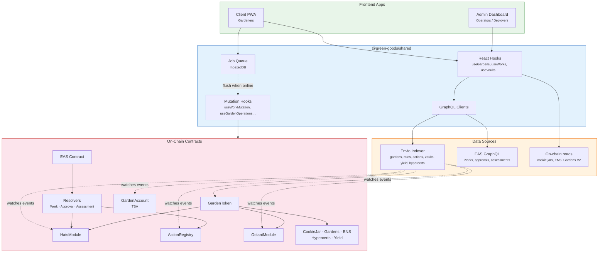
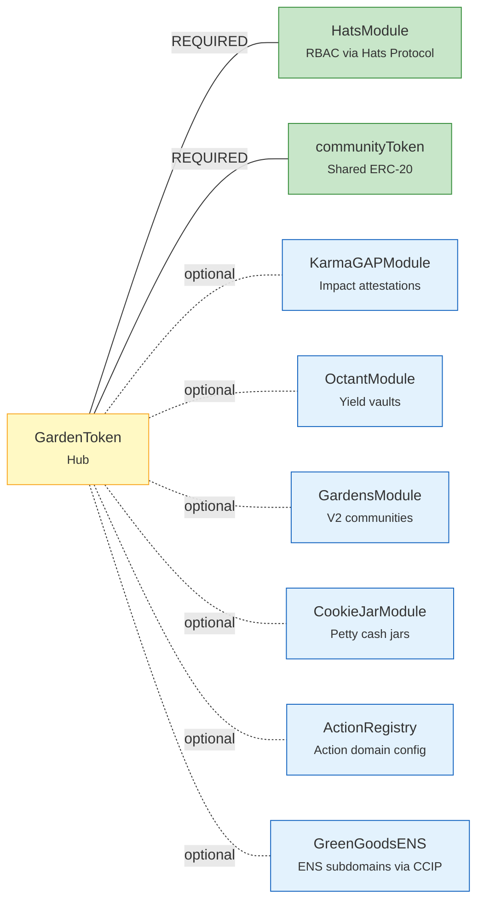
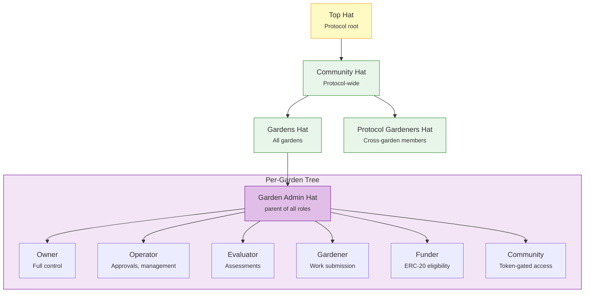
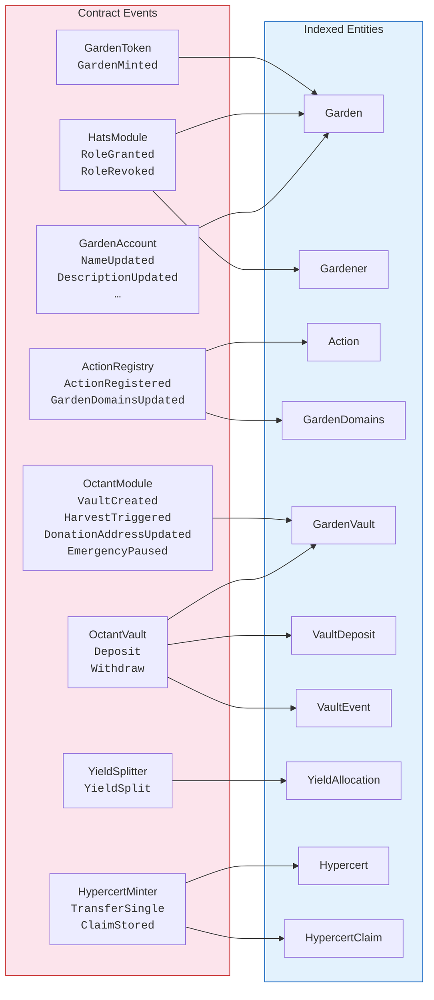
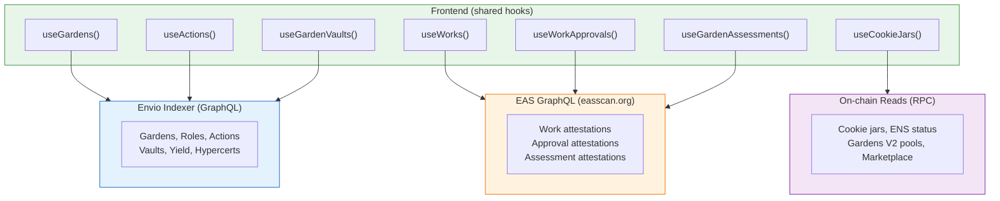
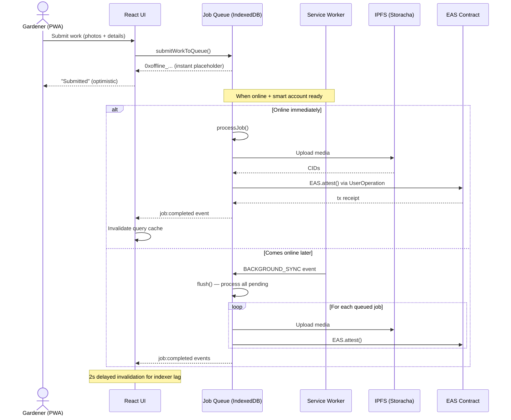
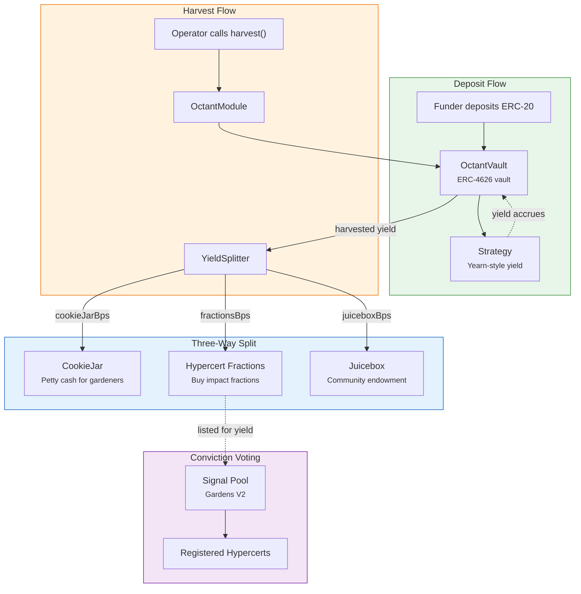
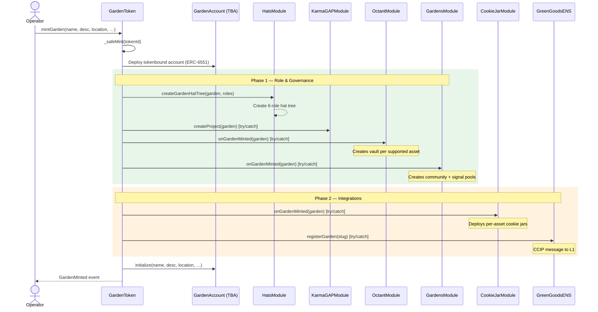
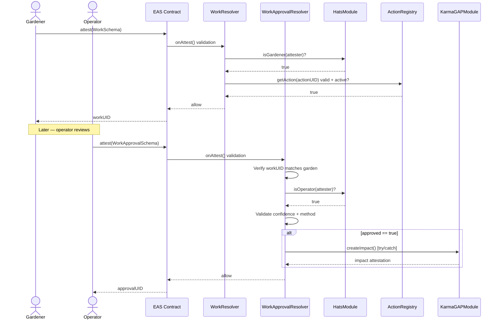

import {NextBestAction, StatusBadge} from "@site/src/components/docs";

# Architecture

<StatusBadge status="Live" />

{/* IMAGE PLACEHOLDER: Green Goods system architecture overview diagram (800x400) */}

## Package boundaries

| Package | Responsibility |
| --- | --- |
| `packages/client` | Gardener-facing PWA UI |
| `packages/admin` | Operator-facing dashboard UI |
| `packages/shared` | Hooks, providers, stores, business logic |
| `packages/contracts` | Solidity modules + deployment scripts |
| `packages/indexer` | Envio event indexing and GraphQL surface |
| `packages/agent` | Automation/bot workflows |

## Architecture principles

- DRY for shared hooks/query keys/deployment addresses.
- KISS for chain/environment model.
- YAGNI for config surface and feature toggles.
- Separation of concerns across packages.

---

## System context

How all packages connect end-to-end: contracts emit events, the indexer materializes them into GraphQL, and frontends read through shared hooks.

---

## Contract module system

GardenToken uses a **hub-and-spoke pattern** with typed module slots. Each module is a UUPS-upgradeable proxy deployed via CREATE2. Optional modules degrade gracefully — every call is wrapped in `if (address != 0)` + `try/catch`.

Adding a new module type requires a GardenToken UUPS upgrade (one new storage slot from the `uint256[37] __gap`), a setter function, and wiring in `DeploymentBase`.

---

## Hats Protocol role tree

Each garden gets a 6-role hat tree created by `HatsModule.createGardenHatTree()` during minting. Roles are hierarchical — each parent hat is admin of its children.

---

## Contract-to-indexer event mapping

The Envio indexer watches specific contract events and materializes them into GraphQL entities. EAS attestations (works, approvals, assessments) are **not** re-indexed — they're queried directly from easscan.org.

**Dynamic contract registration**: When a garden is minted, its TBA address is registered for `GardenAccount` events. When a vault is created, its address is registered for `Deposit`/`Withdraw` events.

**Indexer boundary**: The Envio indexer only covers core Green Goods state. Several modules have stub handler files that are explicitly externalized: cookie jars, ENS lifecycle, Gardens V2 communities/pools, marketplace orders, and power registry audits are all read via direct RPC calls or external subgraphs at query time. EAS attestations (works, approvals, assessments) are queried from easscan.org, not re-indexed.

---

## Two-indexer read path

The frontend queries **two separate data sources** — this is a key architectural decision that avoids re-indexing standard EAS attestations.

---

## Offline-first job queue lifecycle

The client PWA supports offline work submission via an IndexedDB-backed job queue. Jobs are queued instantly, then flushed when connectivity returns.

**Retry policy**: exponential backoff (1s base, doubling, max 60s), max 5 retries before permanent failure. Mutex prevents concurrent flush operations.

---

## Vault and yield flow

When gardens receive deposits, the yield is harvested and split three ways by the `YieldSplitter`.

---

## Garden minting sequence

When an operator mints a garden, GardenToken fans out to all configured modules in two phases.

---

## Work submission and approval

The core user flow: a gardener submits work, an operator reviews it, and the attestation chain is anchored on EAS.

---

## Further reading

- [Deployment/indexer status model](./reference/deployment-indexer-status)
- [Build patterns](./build-patterns)
- [Integrations](./integrations)

<NextBestAction
  title="Next best action"
  why="Move from static architecture context into implementation conventions."
  actionLabel="Open build patterns"
  actionHref="./build-patterns"
  alternatives={[
    {label: "Integrations", href: "./integrations"},
    {label: "Deployment/indexer status", href: "./reference/deployment-indexer-status"},
  ]}
/>
