# GG-FEAT-007: Gardens Conviction Voting Integration

| | |
|---|---|
| **Feature ID** | GG-FEAT-007 |
| **Priority** | High |
| **Status** | Planned |
| **Estimated Effort** | 6 weeks |
| **Last Updated** | January 18, 2026 |

---

## 1) Feature Overview

**Brief description:** Integrate Gardens V2 Conviction Voting mechanism to enable community-driven allocation of vault yield to Hypercert-backed impact projects. Garden members stake governance tokens and allocate conviction to proposals requesting yield distributions, creating a democratic and time-weighted funding mechanism for verified environmental impact.

**Target users:**
- Garden Member (Persona C from PRD): Stakes tokens, allocates conviction to proposals
- Garden Operator (Persona B): Creates funding pools, manages conviction parameters
- Action Verifier (Persona A): Receives yield based on Hypercert verification

**Related goals/objectives:**
- PRD Goal 2 (Impact Verification): Conviction voting connects verified Hypercerts to yield allocation
- PRD M3 Integration: Gardens V2 integration for participatory governance
- PRD Vision: "Community-owned public goods treasury" via democratic yield routing

**Feature-specific success criteria:**
- First conviction voting pool created within 1 week of launch
- 50+ unique addresses participate in conviction voting within first month
- At least 3 successful yield allocation proposals executed
- Average conviction accumulation time aligns with expected parameters
- Zero failed proposal executions due to smart contract issues

**Non-goals:**
- General DAO governance (only yield allocation decisions)
- Token issuance or distribution (uses existing Garden tokens)
- Quadratic voting (Phase 2 feature)
- Streaming proposals via Superfluid (not yet live in Gardens V2)
- Cross-chain conviction voting (all voting on Arbitrum)

**Dependencies / preconditions:**
- GG-FEAT-006 (Octant Vaults): Yield must be generated for allocation
- GG-FEAT-005 (Hypercerts): Proposals reference minted Hypercerts
- Gardens V2: Deployed on Arbitrum with CVStrategy diamond contracts (Signaling Pool)
- Hats Protocol: Operator roles for pool management
- Garden Token: ERC-20 governance token for staking

:::info Gardens V2 Architecture Status
Gardens V2 uses a **Diamond Proxy Pattern (EIP-2535)** with 5 facets: CVAdmin, CVAllocation, CVDispute, CVPower, CVProposal. Green Goods integrates with the **current main branch** using Signaling Pools. The yield distribution features in [PR #714](https://github.com/1Hive/gardens-v2/pull/714) (CVVault, IVotingPowerRegistry) are in draft status—see [GG-TECH-007 Section 3B](/specs/gardens/gardens-tech-spec#3b-pr-714-analysis-draft---not-merged) for details.
:::

---

## 2) Conviction Voting Primer

### 2.1 What is Conviction Voting?

Conviction Voting is a **time-weighted, continuous voting mechanism** where:
- Proposals are evaluated concurrently (not sequentially)
- Support ("conviction") accumulates over time the longer it's allocated
- No discrete voting periods—voting is always open

:::info Green Goods Adaptation
Traditional conviction voting uses **threshold execution** (proposal passes when conviction exceeds threshold). Green Goods uses **proportional allocation** instead—yield is distributed to ALL proposals proportionally to their conviction share, triggered by Chainlink Automation on a schedule.
:::

**Key Insight:** Unlike snapshot voting, conviction voting rewards sustained commitment. A proposal with 10% support for 2 weeks has more conviction than one with 20% support for 1 day.

### 2.2 Core Concepts


**Half-Life (Conviction Growth):** The time for conviction to reach 50% of its maximum potential. A 7-day half-life means:
- After 7 days: 50% conviction
- After 14 days: 75% conviction
- After 21 days: 87.5% conviction

**Threshold:** The conviction level required for a proposal to pass. Calculated based on:
- Amount requested (larger requests = higher threshold)
- Minimum conviction parameter
- Spending limit parameter

### 2.3 Pool Types in Gardens V2

| Pool Type | Purpose | Execution |
| :---- | :---- | :---- |
| **Funding Pool** | Request tokens from treasury | Single winner—threshold triggers transfer |
| **Signaling Pool** | Express preferences | No onchain action (read-only conviction) |
| **Streaming Pool** | Continuous funding streams | Superfluid integration (future) |

:::tip Green Goods Integration: Signaling Pool
**For Green Goods:** We use **Signaling Pools** because we need **proportional allocation** (all proposals receive yield based on conviction %), not threshold-based execution (single winner). Green Goods' `HypercertYieldAllocator` reads conviction state from the Signaling Pool and calculates proportional yield allocation independently.
:::

---

## 3) Feature Map (Actions + Integration Points)

### 3.1 User Actions

- **Action A:** View active Hypercert proposals (Member browses yield allocation candidates)
- **Action B:** Allocate conviction to proposals (Member stakes tokens and supports Hypercerts)
- **Action C:** Remove/reallocate conviction (Member changes support)
- **Action D:** Create Hypercert proposal (Operator/Verifier links Hypercert to signaling pool)
- **Action E:** Trigger yield allocation (Chainlink Automation distributes yield proportionally)
- **Action F:** Configure pool parameters (Operator sets conviction parameters)
- **Action G:** Dispute proposal (Member challenges suspicious proposal)

:::info Action E: Automated vs Manual Trigger
Unlike traditional threshold-based conviction voting, Green Goods uses **proportional allocation** triggered by Chainlink Automation on a schedule (e.g., weekly). All proposals with conviction receive yield proportional to their conviction share.
:::

### 3.2 Integration / Interaction Points

- [x] **UI / Client** (Governance dashboard, proposal cards, conviction visualizations)
- [x] **Backend API** (Envio indexer for conviction state, proposal history)
- [x] **Data layer** (TheGraph subgraph for Gardens V2, Hypercerts registry)
- [x] **External services** (Safe for treasury execution)
- [x] **Onchain / contracts** (CVStrategy, RegistryCommunity, GardenVaultManager)
- [x] **Permissions / roles** (Hats Protocol for Operator/Member roles)
- [x] **Notifications** (Proposal created, conviction allocated, yield distributed)

### 3.3 Action x Integration Matrix

| Action | UI | API | Data | External | Onchain | Permissions | Notifications |
| :---- | :----: | :----: | :----: | :----: | :----: | :----: | :----: |
| View proposals | Yes | Yes | Yes | - | Yes | - | - |
| Allocate conviction | Yes | Yes | Yes | - | Yes | Yes | Yes |
| Remove conviction | Yes | Yes | Yes | - | Yes | Yes | - |
| Create proposal | Yes | Yes | Yes | - | Yes | Yes | Yes |
| View allocation history | Yes | Yes | Yes | - | Yes | - | - |
| Configure pool | Yes | Yes | Yes | - | Yes | Yes | - |
| Dispute proposal | Yes | Yes | Yes | Yes | Yes | Yes | Yes |

### 3.4 API Endpoint Inventory

**GraphQL Queries (via Envio/TheGraph)**

```graphql
# Fetch active proposals in a conviction voting pool
query GetPoolProposals($poolId: String!, $status: ProposalStatus) {
  # Green Goods Signaling Pool query - no requestedAmount/threshold
  proposals(
    where: { pool: $poolId, status: $status }
    orderBy: conviction_DESC
  ) {
    id
    proposer
    title
    description
    hypercertId
    maxPricePerFraction  # Optional price ceiling
    conviction
    convictionLast
    stakedTokens
    supportersCount
    status
    createdAt
  }
}

# Fetch member's conviction allocations
query GetMemberAllocations($member: String!, $poolId: String!) {
  allocations(where: { member: $member, pool: $poolId }) {
    id
    proposal {
      id
      title
    }
    amount
    conviction
    allocatedAt
    lastUpdated
  }
}

# Fetch pool parameters and state
query GetPoolState($poolId: String!) {
  convictionPool(id: $poolId) {
    id
    name
    token
    totalStaked
    totalConviction
    proposalCount
    activeProposals
    parameters {
      convictionGrowth
      minConviction
      spendingLimit
      fixedMinThreshold
    }
    treasury {
      balance
      lastYieldDeposit
    }
  }
}

# Fetch proposals linked to Hypercerts
query GetHypercertProposals($hypercertId: String!) {
  proposals(where: { hypercertId: $hypercertId }) {
    id
    status
    requestedAmount
    conviction
    threshold
    executedAt
    yieldDistributed
  }
}
```

**Contract Calls (via CVStrategy + HypercertYieldAllocator)**

| Function | Purpose | Auth | Parameters |
| :---- | :---- | :---- | :---- |
| `createProposal` | Submit new signaling proposal | Member | `metadata`, `hypercertId`, `maxPricePerFraction` |
| `allocateConviction` | Support a proposal with tokens | Member | `proposalId`, `amount` |
| `removeConviction` | Remove support from proposal | Member | `proposalId`, `amount` |
| `allocateYield` | Trigger yield allocation (Chainlink) | Keeper | - |
| `disputeProposal` | Challenge proposal | Member + Collateral | `proposalId`, `reason` |
| `updatePoolParams` | Modify conviction parameters | Operator | `params` |

---

## 4) User Experience (Flows per Action)

### 4.1 Action A: View Active Signaling Proposals

**User story:** As a Garden Member, I want to see all active yield allocation proposals, so I can decide which impact projects to support.

**Primary flow:**
1. Member navigates to Garden governance dashboard
2. Clicks "Yield Allocation" or "Signaling Proposals" tab
3. System displays list of active proposals with:
   - Proposal title and description
   - Linked Hypercert (with verification badge)
   - Current conviction percentage (animated pie chart/bar)
   - Allocation share preview (% of next yield distribution)
   - Number of supporters and total staked
   - Last allocation amount (if any)
4. Member can sort by: conviction, time created, supporters
5. Member can filter by: status (active, cancelled, disputed)

**Conviction Visualization (Signaling Pool):**

```mermaid
graph TB
    subgraph "Proposal Card"
        Title["🌱 Urban Garden Maintenance Q1"]
        HC["Hypercert: #1234 - Verified ✓"]

        subgraph "Conviction Share"
            Conv["Conviction: 2,500 GG staked"]
            Share["Allocation Share: ████████████░░░░░░░░ 45%"]
        end

        LastAlloc["📊 Last allocation: 225 USDC (45% of 500 USDC yield)"]
        Support["👥 12 supporters"]
        Actions["[View Details] [Allocate Conviction]"]
    end
```



**Alternate flows:**
- No active proposals: Show "No proposals yet" with CTA to create one
- Pool has no yield: Show "Waiting for yield deposit" with vault link

**Edge cases:**
- High conviction proposal: Show "Top conviction!" badge
- Conviction decaying: Show warning if support being removed

### 4.2 Action B: Allocate Conviction to Proposals

**User story:** As a Garden Member, I want to allocate my governance tokens to proposals I believe in, so my support influences yield allocation.

**Primary flow:**
1. Member views proposal detail page
2. Sees their current allocation (if any) and available tokens
3. Clicks "Allocate Conviction" or "Add Support"
4. System displays allocation form:
   - Current staked balance
   - Available to allocate (not already committed elsewhere)
   - Slider or input for amount
   - Conviction preview (how much this adds)
   - Allocation share change preview
5. Member enters allocation amount
6. System shows preview:
   - New conviction contribution
   - Updated time estimate
   - Note: "Conviction grows over time while allocated"
7. Member clicks "Confirm Allocation"
8. System constructs transaction
9. Member signs (Passkey)
10. System shows success with updated proposal state

**Conviction Growth Explanation:**

```mermaid
graph LR
    subgraph "Your Allocation Preview"
        Tokens["Tokens to Allocate: 100 GG"]
        Weight["Your Voting Weight: 2.5% of pool"]

        subgraph "Conviction Growth (7-day half-life)"
            D1["Day 1: █░░░░░░░░░ ~0.5%"]
            D7["Day 7: █████░░░░░ ~1.25%"]
            D14["Day 14: ███████░░░ ~1.88%"]
            D21["Day 21: █████████░ ~2.19%"]
        end

        Tip["💡 Keep support allocated for maximum impact"]
    end
```



**Alternate flows:**
- Insufficient balance: Show "Stake more tokens" with staking link
- Already at max allocation: Show warning "All tokens allocated"

**Edge cases:**
- Reallocating from another proposal: Show confirmation dialog
- Proposal about to pass: Show "Your support may trigger execution!"

### 4.3 Action C: Remove/Reallocate Conviction

**User story:** As a Garden Member, I want to move my support between proposals, so I can respond to new information or priorities.

**Primary flow:**
1. Member views their allocations in "My Governance" section
2. Sees list of all current allocations
3. Clicks "Manage" on specific allocation
4. System shows options:
   - Remove all conviction (returns tokens to available)
   - Reduce allocation (partial removal)
   - Reallocate to different proposal
5. Member selects action and amount
6. System shows impact:
   - Conviction removed from current proposal
   - New time estimate for that proposal
   - Available tokens after removal
7. Member confirms and signs
8. If reallocating: prompted to select new proposal

**Important Note:** Conviction decays when support is removed—you cannot "bank" conviction.

### 4.4 Action D: Create Funding Proposal

**User story:** As an Action Verifier, I want to create a proposal requesting yield for my verified Hypercert, so the community can vote to fund my impact.

**Primary flow:**
1. User navigates to "Create Proposal" from governance dashboard
2. System checks requirements:
   - User has staked tokens in Garden
   - User meets minimum stake for proposal creation
3. User fills out proposal form:
   - **Title:** Short descriptive name
   - **Description:** Detailed explanation of impact and funding use
   - **Linked Hypercert:** Select from verified Hypercerts (typeahead)
   - **Max Price per Fraction:** Optional price ceiling for marketplace purchase (0 = no limit)
4. System validates:
   - Hypercert exists and is verified
   - Hypercert has fractions available on marketplace (or warns if escrowing likely)
5. User previews proposal with current pool stats
6. User clicks "Submit Proposal"
7. System constructs and submits transaction
8. User signs
9. System shows pending, then confirmed with proposal link

**Alternate flows:**
- User has no verified Hypercerts: Show "Get Hypercert verified first" with link
- No fractions on marketplace: Show warning "Yield may be escrowed until fractions available"
- Pool has no yield yet: Show info "Pool awaiting yield from vault"

**Edge cases:**
- Duplicate proposal for same Hypercert: Allow, but warn user
- Hypercert disputed: Block proposal creation until resolved

### 4.5 Action E: View Yield Allocation Results

:::info Signaling Pool Model
Green Goods uses a **Signaling Pool** (not threshold-based Funding Pool). Yield allocation is triggered automatically by **Chainlink Automation** on a schedule (e.g., weekly), not by crossing a threshold.
:::

**User story:** As a Garden Member, I want to see how yield was allocated based on conviction voting, so I understand the impact of my participation.

**Primary flow:**
1. Chainlink Automation triggers `allocateYield()` on schedule (e.g., every Sunday)
2. System reads conviction percentages from all active proposals
3. System calculates proportional allocation:
   - `allocation = totalYield × (proposalConviction / totalConviction)`
4. For each Hypercert proposal:
   - Purchases fractions on marketplace with allocated yield
   - Deposits fractions to Garden treasury (GardenAccount TBA)
5. User views "Allocation History" showing:
   - Date of allocation
   - Total yield distributed
   - Per-proposal breakdown (conviction %, USDC allocated, fractions purchased)
   - Transaction hashes

**Alternate flows:**
- No fractions available: Yield escrowed, retried daily
- Insufficient yield: Show "Waiting for yield" status

**Edge cases:**
- All proposals have zero conviction: Yield remains in vault until next period
- Manual trigger by Operator: Allowed in emergency situations

### 4.6 Action F: Configure Pool Parameters

**User story:** As a Garden Operator, I want to configure conviction voting parameters, so the governance matches our community's needs.

**Primary flow:**
1. Operator navigates to Pool Settings in admin dashboard
2. System verifies Operator Hat
3. Operator views current parameters:
   - Conviction Growth (half-life in days)
   - Minimum Conviction (% for smallest proposal)
   - Spending Limit (max % of pool per proposal)
   - Fixed Minimum Threshold (override for low-stake pools)
4. Operator adjusts parameters
5. System shows simulation:
   - "A proposal for 10% of pool would need X% conviction"
   - "Average time to pass: Y days"
6. Operator confirms changes
7. System submits transaction
8. Operator signs

**Parameter Guidance:**

| Parameter | Low Value Effect | High Value Effect | Recommended |
| :---- | :---- | :---- | :---- |
| Conviction Growth | Fast decisions, less commitment | Slow decisions, more deliberation | 7 days |
| Min Conviction | Small proposals pass easily | All proposals need significant support | 5% |
| Spending Limit | Small individual allocations | Large individual allocations | 20% |
| Fixed Min Threshold | Low-stake pools vulnerable | Protects small pools | 10% |

### 4.7 Action G: Dispute Proposal

**User story:** As a Garden Member, I want to challenge a suspicious proposal, so bad actors don't exploit the yield pool.

**Primary flow:**
1. Member views proposal they believe is invalid
2. Clicks "Dispute" button
3. System shows dispute requirements:
   - Must stake collateral (returned if dispute succeeds)
   - Must provide written reason
   - Dispute goes to arbitrator (Safe Arbitrator or Kleros)
4. Member enters dispute reason
5. Member stakes collateral
6. System submits dispute
7. Proposal enters "Disputed" status (execution blocked)
8. Arbitrator reviews and rules
9. If dispute upheld: Proposal cancelled, collateral returned
10. If dispute rejected: Proposal continues, collateral forfeited

---

## 5) Two Conviction-Based Models for Yield Allocation

### 5.1 Model A: Yield → Purchase Hypercert Fractions

**Concept:** Community uses conviction voting to determine which Hypercerts the Garden should invest in. Yield is used to **purchase Hypercert fractions** on the marketplace, with those fractions held by the Garden treasury. This creates direct ownership of verified impact.

```mermaid
flowchart TB
    subgraph "YIELD TO HYPERCERT PURCHASE MODEL"
        VY["Vault Yield<br/>(500 USDC)"]
        CV["Conviction Voting<br/>(45%)"]
        HC["Hypercert #1234"]
        MP["Marketplace<br/>(buy 50 fractions)"]
        GT["Garden Treasury<br/>(GardenAccount TBA)"]

        VY -->|"allocate via"| CV
        CV -->|"select"| HC
        HC -->|"purchase fractions"| MP
        MP -->|"deposit"| GT

        GT -->|"Garden now owns<br/>50 fractions of<br/>Hypercert #1234"| END((("🌱")))
    end
```



**Flow:**
1. Verifier mints Hypercert with work scope and contributors
2. Hypercert fractions listed on marketplace (by holders seeking liquidity)
3. Proposal created: "Purchase fractions of Hypercert #1234"
4. Community allocates conviction to proposals they support
5. Conviction determines allocation %: `yield × (conviction / Σ convictions)`
6. System purchases Hypercert fractions using allocated yield
7. Fractions deposited to Garden treasury (GardenAccount TBA)

**Proposal Structure (MVP):**
```solidity
struct HypercertSignalingProposal {
    uint256 hypercertId;        // Which Hypercert to purchase fractions of
    uint256 maxPricePerFraction; // Optional price ceiling (0 = no limit)
    string metadata;            // IPFS hash of proposal details
    address proposer;           // Who created the proposal
    // NOTE: No requestedAmount - allocation is purely proportional to conviction
}
```

**Advantages:**
- Garden builds portfolio of verified impact ownership
- Creates demand for Hypercert fractions (benefits impact creators)
- Conviction determines "how much", not "whether" (proportional allocation)
- Garden treasury accumulates impact assets over time

**Use Case:** Building Garden's verified impact portfolio through market purchases

### 5.2 Model B: Yield → Garden Actions Priority

**Concept:** Community uses conviction voting to prioritize which Garden actions should receive support (funding, resources, attention). Not direct yield distribution, but rather governance over Garden strategy.


**Flow:**
1. Garden has multiple potential actions/projects
2. Each action is a signaling proposal in conviction voting
3. Community allocates conviction to actions they prioritize
4. Conviction distribution determines yield allocation ratio
5. Higher conviction = more yield directed to that action
6. Actions are funded proportionally, not winner-take-all

**Signaling Proposal Structure:**
```solidity
struct ActionPriorityProposal {
    bytes32 actionId;           // Unique action identifier
    string actionDescription;   // What the Garden should do
    address coordinator;        // Who leads this action
    uint256 estimatedCost;      // Rough cost estimate
    string[] outcomes;          // Expected impact outcomes
    // No direct amount requested - ratio determined by relative conviction
}
```

**Allocation Formula:**
```
action_allocation = total_yield × (action_conviction / sum_all_convictions)
```

**Advantages:**
- Non-zero-sum: all priorities get something
- Continuous prioritization (not discrete decisions)
- Encourages broad participation
- Aligns Garden activities with community values

**Use Case:** Prospective funding for planned initiatives

### 5.3 MVP Architecture: Single Signaling Pool

:::tip Simplified MVP Model
For MVP, Green Goods uses a **single Signaling Pool** with proportional allocation. The hybrid model (Funding + Signaling pools) is deferred to Phase 2.
:::

**MVP Flow:**

1. Members create proposals linked to verified Hypercerts
2. Community allocates conviction to proposals they support
3. Conviction determines allocation percentage: `yield × (conviction / Σ convictions)`
4. Chainlink Automation triggers `allocateYield()` on schedule (e.g., weekly)
5. System purchases Hypercert fractions using proportionally allocated yield
6. Fractions deposited to Garden treasury (GardenAccount TBA)


**Key Characteristics:**
- **No threshold execution** — All proposals with conviction receive proportional yield
- **No requestedAmount** — Allocation purely based on conviction percentage
- **Automated trigger** — Chainlink Automation, not manual execution
- **Proportional allocation** — Non-zero-sum (all proposals get something)

:::info Future Phase 2: Hybrid Model
In Phase 2, consider adding:
- Funding Pool for threshold-based grants (single winner model)
- Configurable pool split ratio (e.g., 60% Signaling / 40% Funding)
- Action Priority pool for prospective Garden planning
:::

---

## 6) System Architecture

### 6.1 High-Level Architecture


### 6.2 Contract Architecture


### 6.3 Integration with Gardens V2

Green Goods uses Gardens V2 contracts deployed on Arbitrum:

| Contract | Address (Arbitrum) | Purpose |
| :---- | :---- | :---- |
| RegistryFactory | `0x...` | Creates new community registries |
| RegistryCommunity | Per-Garden | Manages community membership and pools |
| CVStrategyV0_0 | Per-Pool | Implements conviction voting logic |
| SafeArbitrator | `0x...` | Handles disputes |

**Integration Pattern:**

:::warning Outdated Code Pattern
The code below shows the deprecated `HypercertYieldDistributor` pattern. See [GG-TECH-007 Section 4](/specs/gardens/gardens-tech-spec#4-hypercertyieldallocator-adapter-specification) for the correct `HypercertYieldAllocator` implementation that **purchases fractions** instead of distributing to holders.
:::

```solidity
// DEPRECATED - See HypercertYieldAllocator in GG-TECH-007
contract GreenGoodsGovernance is RegistryCommunity {
    IHypercertMinter public hypercertMinter;
    HypercertYieldAllocator public yieldAllocator; // Changed from Distributor

    // Create a funding pool linked to Hypercerts
    function createHypercertFundingPool(
        bytes memory poolParams,
        address donationToken
    ) external onlyOperator returns (address pool) {
        pool = _createPool(PoolType.Funding, poolParams, donationToken);
        // Additional Hypercert-specific setup
    }

    // Trigger yield allocation to PURCHASE Hypercert fractions
    function _executeProposal(
        uint256 proposalId,
        bytes memory data
    ) internal override {
        Proposal memory prop = proposals[proposalId];

        // Route to HypercertYieldAllocator which PURCHASES fractions
        // See GG-TECH-007 for full implementation
        yieldAllocator.allocateYield();
    }
}

/* DEPRECATED PATTERN - distributes to holders instead of purchasing:
    function _executeProposal(...) internal override {
        // Get Hypercert fractions
        uint256[] memory fractionIds = hypercertMinter.getFractionsByClaimId(
            prop.hypercertId
        );

        // Distribute yield proportionally
        yieldDistributor.distribute(
            prop.requestedAmount,
            prop.hypercertId,
            fractionIds
        );
    }
*/
```

---

## 7) Data Model

### 7.1 Envio Indexer Schema

```graphql
# Signaling Pool proposal with Hypercert link (MVP)
type HypercertProposal {
  id: ID!                          # Proposal ID from Gardens
  pool: ConvictionPool!
  proposer: String!

  # Proposal metadata
  title: String!
  description: String!
  metadataURI: String              # IPFS hash with full details

  # Hypercert integration
  hypercertId: String!             # Required for MVP
  hypercert: Hypercert
  maxPricePerFraction: BigInt      # Optional price ceiling (0 = no limit)

  # Conviction state (Signaling Pool - no threshold)
  conviction: BigInt!              # Current raw conviction value
  convictionLast: BigInt!          # Last calculated conviction
  convictionPercentage: Float!     # conviction / totalConviction (for display)
  stakedTokens: BigInt!            # Total tokens staked on this proposal

  # Supporters
  supporters: [ConvictionAllocation!]!
  supportersCount: Int!

  # Lifecycle
  status: ProposalStatus!
  createdAt: BigInt!
  disputedAt: BigInt

  # Allocation history (from Chainlink-triggered allocations)
  allocations: [YieldAllocation!]!
  totalYieldAllocated: BigInt!
  totalFractionsPurchased: BigInt!
}

type ConvictionPool {
  id: ID!
  garden: Garden!
  poolType: PoolType!              # SIGNALING for MVP
  token: String!

  # State
  totalStaked: BigInt!
  totalConviction: BigInt!
  proposalCount: Int!

  # Parameters
  convictionGrowth: BigInt!        # Half-life in seconds
  minConviction: BigInt!           # Basis points
  spendingLimit: BigInt!           # Basis points
  fixedMinThreshold: BigInt!

  # Treasury link
  yieldPool: String                # Address of yield source
  availableYield: BigInt!

  proposals: [YieldProposal!]!
}

type ConvictionAllocation {
  id: ID!                          # {member}-{proposal}
  member: String!
  proposal: YieldProposal!
  pool: ConvictionPool!

  amount: BigInt!
  conviction: BigInt!
  allocatedAt: BigInt!
  lastUpdated: BigInt!
}

type YieldAllocation {
  id: ID!
  proposal: HypercertProposal!
  hypercert: Hypercert!

  # Allocation details
  yieldAmount: BigInt!             # USDC allocated to this proposal
  convictionPercentage: Float!     # % of total conviction at allocation time
  fractionsPurchased: BigInt!      # Number of fractions bought
  pricePerFraction: BigInt!        # Actual price paid

  # Execution
  allocatedAt: BigInt!
  txHash: String!

  # Escrow (if fractions weren't available)
  wasEscrowed: Boolean!
  escrowResolvedAt: BigInt
}

type AllocationBatch {
  id: ID!                          # {pool}-{timestamp}
  pool: ConvictionPool!
  triggeredBy: String!             # Chainlink or Operator address
  triggeredAt: BigInt!

  totalYield: BigInt!
  allocations: [YieldAllocation!]!

  txHash: String!
}

enum PoolType {
  SIGNALING     # MVP: Single signaling pool with proportional allocation
  # FUNDING     # Phase 2: Threshold-based execution
}

enum ProposalStatus {
  ACTIVE        # Open for conviction allocation
  DISPUTED      # Under arbitration
  CANCELLED     # Cancelled by proposer
  # Note: No PASSED/EXECUTED - Signaling Pool has no threshold execution
  # Allocations happen to all ACTIVE proposals proportionally
}
```

### 7.2 Client-Side State (Zustand)

```typescript
// stores/governanceStore.ts

interface GovernanceState {
  // Pool state
  fundingPool: ConvictionPool | null;
  signalingPool: ConvictionPool | null;
  poolsLoading: boolean;

  // Proposals
  proposals: YieldProposal[];
  proposalsLoading: boolean;
  selectedProposal: YieldProposal | null;

  // User allocations
  userAllocations: ConvictionAllocation[];
  userStakedBalance: bigint;
  userAvailableBalance: bigint;

  // Form state
  allocationAmount: string;
  proposalForm: ProposalFormState;

  // Actions
  fetchPools: (gardenId: string) => Promise<void>;
  fetchProposals: (poolId: string, status?: ProposalStatus) => Promise<void>;
  fetchUserAllocations: (member: string) => Promise<void>;

  allocateConviction: (proposalId: string, amount: bigint) => Promise<string>;
  removeConviction: (proposalId: string, amount: bigint) => Promise<string>;
  createProposal: (params: CreateProposalParams) => Promise<string>;
  disputeProposal: (proposalId: string, reason: string) => Promise<string>;
  // NOTE: No executeProposal - Chainlink triggers allocateYield() on schedule
}

interface CreateProposalParams {
  title: string;
  description: string;
  hypercertId?: string;
  requestedAmount: bigint;
  beneficiary: string;
  poolType: 'funding' | 'signaling';
}

interface ProposalFormState {
  title: string;
  description: string;
  selectedHypercert: Hypercert | null;
  requestedAmount: string;
  beneficiary: string;
  errors: Record<string, string>;
}
```

---

## 8) Smart Contract Implementation

:::danger Outdated Contract Code - See GG-TECH-007
The contract code in this section (`HypercertYieldDistributor`) describes an **alternative pattern** that distributes yield to existing Hypercert holders.

**The approved architecture uses `HypercertYieldAllocator` instead**, which:
- **Purchases** Hypercert fractions on the marketplace using yield
- **Deposits** purchased fractions to Garden treasury (GardenAccount TBA)
- Does NOT distribute yield to existing fraction holders

See [GG-TECH-007 Section 4](/specs/gardens/gardens-tech-spec#4-hypercertyieldallocator-adapter-specification) for the correct contract specification.

The code below is preserved for reference as a potential future pattern (retroactive funding to impact creators).
:::

### 8.1 HypercertYieldDistributor.sol (DEPRECATED - See Warning Above)

```solidity
// SPDX-License-Identifier: MIT
pragma solidity ^0.8.20;

import {IERC20} from "@openzeppelin/contracts/token/ERC20/IERC20.sol";
import {SafeERC20} from "@openzeppelin/contracts/token/ERC20/utils/SafeERC20.sol";
import {IHypercertMinter} from "./interfaces/IHypercertMinter.sol";

/// @title HypercertYieldDistributor
/// @notice Distributes yield to Hypercert fraction holders proportionally
contract HypercertYieldDistributor {
    using SafeERC20 for IERC20;

    IHypercertMinter public immutable hypercertMinter;

    event YieldDistributed(
        bytes32 indexed hypercertId,
        uint256 totalAmount,
        uint256 recipientCount
    );

    event RecipientPaid(
        bytes32 indexed hypercertId,
        address indexed recipient,
        uint256 fractionId,
        uint256 amount
    );

    error NoFractions();
    error ZeroAmount();

    constructor(address _hypercertMinter) {
        hypercertMinter = IHypercertMinter(_hypercertMinter);
    }

    /// @notice Distribute yield to all holders of a Hypercert
    /// @param token The yield token to distribute (e.g., USDC)
    /// @param amount Total amount to distribute
    /// @param hypercertId The Hypercert claim ID
    function distribute(
        address token,
        uint256 amount,
        bytes32 hypercertId
    ) external returns (uint256 distributed) {
        if (amount == 0) revert ZeroAmount();

        // Get all fraction token IDs for this claim
        uint256[] memory fractionIds = _getFractionIds(hypercertId);
        if (fractionIds.length == 0) revert NoFractions();

        // Calculate total units
        uint256 totalUnits = 0;
        uint256[] memory fractionUnits = new uint256[](fractionIds.length);
        address[] memory owners = new address[](fractionIds.length);

        for (uint i = 0; i < fractionIds.length; i++) {
            fractionUnits[i] = hypercertMinter.unitsOf(fractionIds[i]);
            owners[i] = hypercertMinter.ownerOf(fractionIds[i]);
            totalUnits += fractionUnits[i];
        }

        // Transfer from caller
        IERC20(token).safeTransferFrom(msg.sender, address(this), amount);

        // Distribute proportionally
        for (uint i = 0; i < fractionIds.length; i++) {
            uint256 share = (amount * fractionUnits[i]) / totalUnits;
            if (share > 0) {
                IERC20(token).safeTransfer(owners[i], share);
                distributed += share;

                emit RecipientPaid(
                    hypercertId,
                    owners[i],
                    fractionIds[i],
                    share
                );
            }
        }

        emit YieldDistributed(hypercertId, distributed, fractionIds.length);

        // Return any dust to caller
        uint256 remaining = IERC20(token).balanceOf(address(this));
        if (remaining > 0) {
            IERC20(token).safeTransfer(msg.sender, remaining);
        }
    }

    /// @notice Preview distribution amounts without executing
    function previewDistribution(
        uint256 amount,
        bytes32 hypercertId
    ) external view returns (
        address[] memory recipients,
        uint256[] memory amounts
    ) {
        uint256[] memory fractionIds = _getFractionIds(hypercertId);

        recipients = new address[](fractionIds.length);
        amounts = new uint256[](fractionIds.length);

        uint256 totalUnits = 0;
        uint256[] memory fractionUnits = new uint256[](fractionIds.length);

        for (uint i = 0; i < fractionIds.length; i++) {
            fractionUnits[i] = hypercertMinter.unitsOf(fractionIds[i]);
            recipients[i] = hypercertMinter.ownerOf(fractionIds[i]);
            totalUnits += fractionUnits[i];
        }

        for (uint i = 0; i < fractionIds.length; i++) {
            amounts[i] = (amount * fractionUnits[i]) / totalUnits;
        }
    }

    function _getFractionIds(
        bytes32 hypercertId
    ) internal view returns (uint256[] memory) {
        // Implementation depends on Hypercert indexing approach
        // May need to query from external indexer or use enumerable extension
        return hypercertMinter.getFractionsByClaimId(uint256(hypercertId));
    }
}
```

### 8.2 SignalingPoolAllocator.sol

```solidity
// SPDX-License-Identifier: MIT
pragma solidity ^0.8.20;

import {IERC20} from "@openzeppelin/contracts/token/ERC20/IERC20.sol";
import {SafeERC20} from "@openzeppelin/contracts/token/ERC20/utils/SafeERC20.sol";
import {ICVStrategy} from "./interfaces/ICVStrategy.sol";

/// @title SignalingPoolAllocator
/// @notice Allocates yield proportionally based on signaling pool conviction
contract SignalingPoolAllocator {
    using SafeERC20 for IERC20;

    ICVStrategy public signalingPool;

    struct AllocationTarget {
        bytes32 actionId;
        address recipient;
        uint256 conviction;
        uint256 allocation;
    }

    event ProportionalAllocation(
        uint256 totalAmount,
        uint256 targetCount,
        uint256 timestamp
    );

    event TargetAllocated(
        bytes32 indexed actionId,
        address indexed recipient,
        uint256 conviction,
        uint256 amount
    );

    constructor(address _signalingPool) {
        signalingPool = ICVStrategy(_signalingPool);
    }

    /// @notice Calculate and execute proportional allocation based on conviction
    /// @param token The yield token to allocate
    /// @param totalAmount Total amount to allocate
    /// @param minConvictionThreshold Minimum conviction to receive allocation
    function allocateProportionally(
        address token,
        uint256 totalAmount,
        uint256 minConvictionThreshold
    ) external returns (AllocationTarget[] memory targets) {
        // Get all active proposals from signaling pool
        uint256[] memory proposalIds = signalingPool.getActiveProposalIds();

        // Calculate total conviction and filter by threshold
        uint256 totalConviction = 0;
        uint256 eligibleCount = 0;

        uint256[] memory convictions = new uint256[](proposalIds.length);
        address[] memory recipients = new address[](proposalIds.length);
        bytes32[] memory actionIds = new bytes32[](proposalIds.length);

        for (uint i = 0; i < proposalIds.length; i++) {
            ICVStrategy.Proposal memory prop = signalingPool.getProposal(proposalIds[i]);
            convictions[i] = prop.conviction;
            recipients[i] = prop.beneficiary;
            actionIds[i] = prop.metadata; // Action ID stored in metadata

            if (convictions[i] >= minConvictionThreshold) {
                totalConviction += convictions[i];
                eligibleCount++;
            }
        }

        // Build allocation targets
        targets = new AllocationTarget[](eligibleCount);
        uint256 j = 0;

        // Transfer from caller
        IERC20(token).safeTransferFrom(msg.sender, address(this), totalAmount);

        uint256 distributed = 0;

        for (uint i = 0; i < proposalIds.length; i++) {
            if (convictions[i] >= minConvictionThreshold) {
                uint256 allocation = (totalAmount * convictions[i]) / totalConviction;

                targets[j] = AllocationTarget({
                    actionId: actionIds[i],
                    recipient: recipients[i],
                    conviction: convictions[i],
                    allocation: allocation
                });

                if (allocation > 0) {
                    IERC20(token).safeTransfer(recipients[i], allocation);
                    distributed += allocation;

                    emit TargetAllocated(
                        actionIds[i],
                        recipients[i],
                        convictions[i],
                        allocation
                    );
                }

                j++;
            }
        }

        emit ProportionalAllocation(distributed, eligibleCount, block.timestamp);

        // Return dust
        uint256 remaining = IERC20(token).balanceOf(address(this));
        if (remaining > 0) {
            IERC20(token).safeTransfer(msg.sender, remaining);
        }
    }

    /// @notice Preview allocation without executing
    function previewAllocation(
        uint256 totalAmount,
        uint256 minConvictionThreshold
    ) external view returns (AllocationTarget[] memory targets) {
        uint256[] memory proposalIds = signalingPool.getActiveProposalIds();

        uint256 totalConviction = 0;
        uint256 eligibleCount = 0;

        // First pass: calculate totals
        for (uint i = 0; i < proposalIds.length; i++) {
            ICVStrategy.Proposal memory prop = signalingPool.getProposal(proposalIds[i]);
            if (prop.conviction >= minConvictionThreshold) {
                totalConviction += prop.conviction;
                eligibleCount++;
            }
        }

        targets = new AllocationTarget[](eligibleCount);
        uint256 j = 0;

        // Second pass: calculate allocations
        for (uint i = 0; i < proposalIds.length; i++) {
            ICVStrategy.Proposal memory prop = signalingPool.getProposal(proposalIds[i]);
            if (prop.conviction >= minConvictionThreshold) {
                uint256 allocation = (totalAmount * prop.conviction) / totalConviction;
                targets[j] = AllocationTarget({
                    actionId: prop.metadata,
                    recipient: prop.beneficiary,
                    conviction: prop.conviction,
                    allocation: allocation
                });
                j++;
            }
        }
    }
}
```

---

## 9) Requirements

### 9.1 Functional Requirements

**Conviction Voting Core:**

- **FR-001:** System shall allow members to allocate staked tokens to proposals
  - Priority: Critical
  - AC1: Member can allocate any amount up to available balance
  - AC2: Allocation is reflected in conviction calculation

- **FR-002:** System shall calculate conviction using time-weighted formula
  - Priority: Critical
  - AC1: Conviction grows exponentially based on half-life
  - AC2: Conviction updates on each block or allocation change

- **FR-003:** System shall allocate yield proportionally based on conviction
  - Priority: Critical
  - AC1: Chainlink Automation triggers allocation on schedule (e.g., weekly)
  - AC2: Allocation = totalYield × (proposalConviction / totalConviction)

**Hypercert Integration:**

- **FR-010:** System shall link signaling proposals to verified Hypercerts
  - Priority: High
  - AC1: Proposal form allows Hypercert selection
  - AC2: Only verified Hypercerts can be selected

- **FR-011:** System shall purchase Hypercert fractions with allocated yield
  - Priority: High
  - AC1: HypercertYieldAllocator purchases fractions on marketplace
  - AC2: Purchased fractions deposited to Garden treasury (GardenAccount TBA)

**Signaling Pool (MVP):**

- **FR-020:** System shall use single Signaling Pool for proportional allocation
  - Priority: High
  - AC1: Allocation ratio = proposal_conviction / total_conviction
  - AC2: All proposals with conviction > 0 receive proportional allocation

### 9.2 Non-Functional Requirements

**Performance:**

| Operation | Target |
| :---- | :---- |
| Conviction calculation | < 100ms |
| Proposal list load | < 2 seconds |
| Allocation transaction | < 10 seconds |

**Security:**

- All governance actions require staked tokens
- Proposals can be disputed with collateral
- Operator-only pool configuration

---

## 10) Analytics and Telemetry

| Event | When | Properties |
| :---- | :---- | :---- |
| conviction_allocated | Member supports proposal | memberId, proposalId, amount |
| conviction_removed | Member removes support | memberId, proposalId, amount |
| proposal_created | New proposal submitted | proposalId, hypercertId, maxPricePerFraction |
| yield_allocated | Scheduled allocation executed | batchId, totalYield, proposalCount |
| fractions_purchased | Hypercert fractions acquired | hypercertId, fractionCount, totalCost |
| allocation_queued | No fractions available, yield escrowed | hypercertId, amount, queuedAt |

---

## 11) Testing Strategy

**Happy Path:**
- TS1: Create proposal linked to Hypercert
- TS2: Allocate conviction, watch accumulation
- TS3: Verify proportional allocation on scheduled trigger

**Edge Cases:**
- TS4: Conviction decay when support removed
- TS5: Zero conviction proposals receive no allocation
- TS6: Dispute flow and resolution
- TS7: No fractions available → yield queued in escrow

**Security:**
- TS8: Non-member cannot allocate
- TS9: Only Chainlink Keeper can trigger allocation
- TS10: Price tolerance prevents manipulation

---

## 12) Open Questions

- **Q1:** ~~What is the optimal split between Funding and Signaling pools?~~
  - **RESOLVED:** MVP uses single Signaling Pool only. Funding Pool may be added post-MVP.

- **Q2:** ~~Should signaling pool allocation be automated or manual?~~
  - **RESOLVED:** Chainlink Automation on weekly schedule.

- **Q3:** How to handle Hypercerts with disputed fractions?
  - Owner: @product
  - By: February 10, 2026
  - Impact: May need to pause distribution until resolved
  - **Current approach:** Skip disputed Hypercerts, queue yield in escrow

- **Q4:** What is the optimal conviction half-life?
  - Owner: @engineering
  - By: February 15, 2026
  - Current default: 7 days (fast accumulation for MVP)
  - Options: 3 days (faster) vs. 14 days (slower decay)

---

## Appendix

**References:**
- Gardens V2 Docs: https://docs.gardens.fund
- Gardens V2 GitHub: https://github.com/1Hive/gardens-v2
- Hypercerts Docs: https://hypercerts.org/docs
- Octant Vaults Spec: GG-FEAT-006

**Contract Addresses (Arbitrum):**
- Gardens RegistryFactory: `0x...` (TBD)
- CVStrategyV0_0 Implementation: `0x...` (TBD)
- HypercertMinter: `0x822F17A9A5EeCFd66dBAFf7946a8071C265D1d07`
- Hats Protocol: `0x3bc1A0Ad72417f2d411118085256fC53CBdDd137`

**Changelog:**

| Version | Date | Author | Changes |
| :---- | :---- | :---- | :---- |
| 1.0 | Jan 18, 2026 | Claude | Initial specification |
| 1.1 | Jan 22, 2026 | Claude | Migrated to Docusaurus, converted diagrams to Mermaid |

---

*End of Feature Specification*
