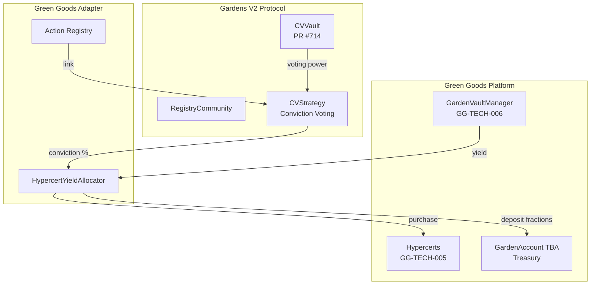

# Gardens Conviction Voting

**Status:** 🟡 In Development

Integration of [Gardens V2](https://docs.gardens.fund) Conviction Voting to enable community-driven allocation of vault yield to Hypercert-backed impact projects.

## Overview

Gardens Conviction Voting is a **time-weighted, continuous voting mechanism** where:
- Proposals are evaluated concurrently (not sequentially)
- Support ("conviction") accumulates over time the longer it's allocated
- Yield is used to **purchase Hypercert fractions** on behalf of the Garden treasury
- No discrete voting periods—voting is always open

## Key Architecture Decision

:::info Yield → Hypercert Fraction Purchases
Unlike direct distribution to beneficiaries, Green Goods uses conviction voting to determine which Hypercerts the Garden should **invest in**. Yield is used to purchase Hypercert fractions on the marketplace, with those fractions held by the Garden treasury (GardenAccount TBA). This creates direct ownership of verified impact.
:::

## Specifications

| Document | Purpose |
|----------|---------|
| [Feature Spec (GG-FEAT-007)](./gardens-feature-spec) | Product requirements, user stories, acceptance criteria |
| [Technical Spec (GG-TECH-007)](./gardens-tech-spec) | Engineering architecture, implementation details, TDD stubs |

## Integration Points

## Key Contracts

| Contract | Purpose | Status |
|----------|---------|--------|
| `HypercertYieldAllocator` | Routes yield to Hypercert fraction purchases based on conviction | 🔴 Not Started |
| `GardensProposalRegistry` | Open registry for community action proposals | 🔴 Not Started |
| `GardenConvictionAdapter` | Adapter between Green Goods and Gardens V2 | 🔴 Not Started |

## Related Features

- **[Octant Vaults (GG-FEAT-006)](../octant/octant-overview):** Generates yield for conviction-based allocation
- **[Hypercerts (GG-FEAT-005)](../hypercerts):** Target of yield-funded fraction purchases

## Quick Links

- [Gardens V2 Documentation](https://docs.gardens.fund)
- [Gardens V2 GitHub](https://github.com/1Hive/gardens-v2)
- [CVVault PR #714](https://github.com/1Hive/gardens-v2/pull/714)
- [Hypercerts Documentation](https://hypercerts.org/docs)
