# GG-TECH-007: Gardens Conviction Voting Technical Specification

| | |
|---|---|
| **Document ID** | GG-TECH-007 |
| **Feature Reference** | GG-FEAT-007 |
| **Version** | 1.1 |
| **Status** | Draft |
| **Last Updated** | January 22, 2026 |
| **Author** | Engineering Team |

---

## 1. Overview

### 1.1 Purpose

This technical specification defines the implementation details for integrating Gardens V2 Conviction Voting with Green Goods yield allocation. The system enables Garden members to use conviction voting to determine how vault yield is allocated across multiple Hypercerts, with yield being used to **purchase Hypercert fractions** on behalf of the Garden treasury.

This specification serves as the engineering blueprint for:
- Conviction voting pool configuration and management
- Yield-to-Hypercert allocation logic
- Integration with Gardens V2 CVStrategy contracts
- GardensProposalRegistry for Hypercert-linked conviction proposals
- Frontend governance dashboard components
- Indexer schema for conviction state tracking

### 1.2 Scope

**In Scope:**
- Gardens V2 CVStrategy adapter contracts
- HypercertYieldAllocator contract for yield routing
- GardensProposalRegistry for conviction voting proposals
- Conviction voting pool creation and configuration
- Member staking and conviction allocation
- Proposal lifecycle management (create, vote, execute)
- Integration with GardenVaultManager (GG-TECH-006)
- Governance dashboard UI components
- Envio indexer handlers for conviction state

**Out of Scope:**
- Vault deposit/withdrawal logic (see GG-TECH-006)
- Hypercert minting and verification (see GG-TECH-005)
- Cross-chain conviction voting (all voting on Arbitrum)
- Quadratic voting (Phase 2 enhancement)
- Streaming proposals via Superfluid (not yet in Gardens V2)
- Dispute arbitration implementation (uses existing Kleros/Safe)

### 1.3 Definitions, Acronyms, and Abbreviations

| Term | Definition |
| :--- | :--- |
| **Conviction** | Time-weighted voting power that accumulates while tokens are allocated |
| **Half-Life** | Time for conviction to reach 50% of maximum potential |
| **Threshold** | Conviction level required for a proposal to pass and execute |
| **CVStrategy** | Gardens V2 Conviction Voting Strategy contract |
| **CVVault** | ERC-4626 vault that tracks depositors as voting power (PR #714) |
| **harvestYDS()** | Function in CVStrategy for yield distribution (PR #714) |
| **IVotingPowerRegistry** | Interface for voting power sources (PR #714) |
| **RegistryCommunity** | Gardens contract managing community membership and tokens |
| **Funding Pool** | Pool type where passed proposals transfer tokens |
| **Signaling Pool** | Pool type for expressing preferences (no token transfer) |
| **GardensProposalRegistry** | Registry where anyone can create Hypercert-linked conviction proposals |
| **Garden Token** | ERC-20 governance token for conviction voting |
| **Hypercert Fraction** | Fungible share of a Hypercert representing impact ownership |

### 1.4 References

| Document | Description |
| :--- | :--- |
| GG-FEAT-007 | Gardens Conviction Voting Feature Specification |
| GG-TECH-006 | Octant Vaults Technical Specification |
| GG-FEAT-005 | Hypercerts Minting Feature Specification |
| GG-PRD-001 | Green Goods v1 Product Requirements Document |
| Gardens V2 Docs | https://docs.gardens.fund |
| Gardens V2 Contracts | https://github.com/1Hive/gardens-v2 |
| CVVault PR #714 | https://github.com/1Hive/gardens-v2/pull/714 |
| Hypercerts Docs | https://hypercerts.org/docs |
| Allo V2 Protocol | https://docs.allo.gitcoin.co |

---

## 2. System Overview

### 2.1 System Architecture


### 2.2 Environment

#### 2.2.1 Development Environment

| Component | Technology | Version |
| :--- | :--- | :--- |
| Smart Contracts | Solidity | ^0.8.19 |
| Contract Framework | Foundry | Latest |
| Frontend | Vite + React + TypeScript | Vite 5.x, React 19.x |
| State Management | Zustand + XState | Zustand 5.x, XState 5.x |
| GraphQL Client | React Query + graphql-request | 5.x |
| Indexer | Envio | Latest |
| Testing | Foundry (contracts), Vitest + Playwright (frontend) | Latest |

#### 2.2.2 External Dependencies

| Dependency | Network | Address |
| :--- | :--- | :--- |
| Gardens RegistryFactory | Arbitrum One | `0x...` (TBD - deploy as contributor) |
| Allo V2 Registry | Arbitrum One | `0x4AAcca72145e1dF2aeC137E1f3C5E3D75DB8b5f3` |
| HypercertMinter | Arbitrum One | `0x822F17A9A5EeCFd66dBAFf7946a8071C265D1d07` |
| Hats Protocol | Arbitrum One | `0x3bc1A0Ad72417f2d411118085256fC53CBdDd137` |
| GardenVaultManager | Arbitrum One | `0x...` (from GG-TECH-006) |

---

## 3. Gardens V2 Architecture Analysis

### 3.1 Current Architecture (Main Branch)

:::info Diamond Pattern Implementation
Gardens V2 uses the **Diamond Proxy Pattern (EIP-2535)** for its core contracts. This is the deployed, production architecture as of January 2026.
:::

**CVStrategy Diamond Structure:**

```
CVStrategy (Diamond Proxy)
├── CVAdminFacet.sol       → Administrative functions, pool configuration
├── CVAllocationFacet.sol  → allocate(), distribute(), conviction updates
├── CVDisputeFacet.sol     → Dispute resolution, arbitration
├── CVPowerFacet.sol       → Voting power management, point activation
└── CVProposalFacet.sol    → registerRecipient(), cancelProposal(), editProposal()
```

**RegistryCommunity Diamond Structure:**

```
RegistryCommunity (Diamond Proxy)
├── CommunityBaseFacet.sol → Base community functionality
└── [Additional facets]    → Member management, power tracking
```

### 3.2 Key Functions on Main Branch

**Proposal Lifecycle:**

| Function | Facet | Purpose |
|----------|-------|---------|
| `registerRecipient()` | CVProposalFacet | Creates a new proposal |
| `allocate()` | CVAllocationFacet | Members add/remove conviction |
| `updateProposalConviction()` | CVAllocationFacet | Recalculates time-weighted conviction |
| `distribute()` | CVAllocationFacet | Executes passed proposals (threshold-based) |
| `cancelProposal()` | CVProposalFacet | Proposer cancels their proposal |

**Voting Power:**

| Function | Location | Purpose |
|----------|----------|---------|
| `activatePoints()` | CVPowerFacet | Member activates voting power in strategy |
| `increasePower()` | CVPowerFacet | Called by RegistryCommunity to increase power |
| `decreasePower()` | CVPowerFacet | Reduces power with proportional rebalancing |
| `getMemberPowerInStrategy()` | RegistryCommunity | Gets member's voting power |

### 3.3 ProposalType Enum (Current)

```solidity
/// @notice Current ProposalType on main branch
enum ProposalType {
    Signaling,   // Express preferences (no token transfer)
    Funding,     // Request tokens from treasury (threshold-based)
    Streaming    // Continuous funding via Superfluid
}
```

:::warning No YieldDistribution Type on Main
The `YieldDistribution` proposal type exists only in draft PR #714 (not merged). The current architecture uses **Signaling** for preference expression without execution.
:::

### 3.4 CVParams Structure

```solidity
/// @notice Conviction voting parameters
struct CVParams {
    uint256 maxRatio;          // Maximum ratio for threshold calculation
    uint256 weight;            // Weight factor for conviction
    uint256 decay;             // Decay rate for conviction over time
    uint256 minThresholdPoints; // Minimum points required for threshold
}
```

### 3.5 Current Distribution Model (Threshold-Based)

The `distribute()` function on main branch is **threshold-based, not proportional**:

```solidity
// CVAllocationFacet.sol - Current behavior
function distribute() external {
    // 1. Verify proposal conviction meets threshold
    // 2. Check requested amount doesn't exceed pool limits
    // 3. Transfer tokens to SINGLE beneficiary
    // 4. Mark proposal as Executed
}
```

**Key Limitation:** This is a "single winner" model—one proposal passes and executes. Green Goods needs **proportional allocation** across multiple Hypercerts.

---

## 3B. PR #714 Analysis (Draft - Not Merged)

:::danger Draft PR - Not Available on Main
[PR #714](https://github.com/1Hive/gardens-v2/pull/714) introduces yield distribution features but is in **draft status** as of January 2026. The features below are NOT available on the deployed Gardens V2 contracts.

**Last Updated:** January 16, 2026
**Status:** Draft (requires 1 approving review)
:::

### 3B.1 CVVault.sol (Future)

PR #714 introduces an ERC-4626 vault implementing `IVotingPowerRegistry`:

```solidity
/// @notice FUTURE: In PR #714, not on main
contract CVVault is ERC4626, IVotingPowerRegistry {
    function getVotingPower(address account) external view returns (uint256) {
        return balanceOf(account);
    }

    function totalVotingPower() external view returns (uint256) {
        return totalSupply();
    }
}
```

### 3B.2 CVYDSFacet (Future)

PR #714 adds a new diamond facet for yield distribution:

```solidity
/// @notice FUTURE: In PR #714, not on main
/// Handles yield harvesting and proportional distribution
contract CVYDSFacet {
    function harvestYDS() external {
        // Proportional distribution based on conviction
    }
}
```

### 3B.3 IVotingPowerRegistry Interface (Future)

```solidity
/// @notice FUTURE: In PR #714, not on main
interface IVotingPowerRegistry {
    function getVotingPower(address account) external view returns (uint256);
    function totalVotingPower() external view returns (uint256);
}
```

---

## 3C. Integration Strategy

Given PR #714's draft status, Green Goods has three integration options:

### Option 1: Signaling Pool + Custom Allocator (Recommended for MVP)

Use **Signaling Pool** on current main branch with Green Goods' own proportional allocation logic:


**Pros:**
- Works with current deployed Gardens V2
- Full control over allocation logic
- No dependency on draft PR

**Cons:**
- More work for Green Goods (custom allocator)
- Signaling pools don't execute natively

### Option 2: Wait for PR #714

Monitor PR #714 status and integrate when merged:

**Pros:**
- Native proportional yield distribution
- Uses Gardens' CVYDSFacet

**Cons:**
- Unknown timeline
- May require testnet deployment first

### Option 3: Contribute to PR #714

Contribute code/testing to accelerate PR #714 merge:

**Pros:**
- Influences Gardens V2 direction
- Gets features we need upstream

**Cons:**
- Requires Gardens team coordination
- Still dependent on their merge timeline

---

## 4. HypercertYieldAllocator Adapter Specification

:::tip Key Architecture Decision
The `HypercertYieldAllocator` bridges Gardens V2 yield distribution with Hypercert fraction purchases. It's the key contract that connects community governance to verified impact ownership.
:::

### Architecture Summary

**The correct data flow (confirmed with stakeholders):**

```
┌─────────────────────┐     ┌──────────────────────┐     ┌─────────────────────┐
│ GardenVaultManager  │     │      CVStrategy      │     │ HypercertYield      │
│ (GG-TECH-006)       │     │ (Gardens V2)         │     │ Allocator           │
│                     │     │                      │     │                     │
│ • Holds principal   │     │ • Members vote       │     │ • Reads yield       │
│ • Generates yield   │────▶│ • Conviction accrues │────▶│ • Reads conviction  │
│   (e.g., 500 USDC)  │     │ • Proportional %     │     │ • PURCHASES fracs   │
└─────────────────────┘     └──────────────────────┘     └──────────┬──────────┘
                                                                    │
                            ┌──────────────────────┐                │
                            │ Hypercert Marketplace│◀───────────────┘
                            │                      │     (buy fractions)
                            │ • HypercertExchange  │
                            └──────────┬───────────┘
                                       │
                            ┌──────────▼───────────┐
                            │ GardenAccount (TBA)  │
                            │                      │
                            │ • Garden Treasury    │
                            │ • Holds fractions    │
                            │ • Verified impact    │
                            └──────────────────────┘
```

**Key distinction:**
- ❌ `HypercertYieldDistributor` (deprecated) → Distributes yield TO existing fraction holders
- ✅ `HypercertYieldAllocator` (correct) → Uses yield to PURCHASE fractions for Garden treasury

### Contract Organization

:::tip Module Architecture Alignment
Green Goods uses a **modules pattern** where each external protocol integration has its own upgradeable module contract. The Gardens integration follows this established pattern.
:::

**File Structure:**

| Contract Type | File Path | Purpose |
|--------------|-----------|---------|
| **GardensModule** | `packages/contracts/src/modules/Gardens.sol` | Main adapter wrapping CVStrategy interactions |
| **YieldAllocatorModule** | `packages/contracts/src/modules/YieldAllocator.sol` | Routes yield to Hypercert fraction purchases |
| **GardensProposalRegistry** | `packages/contracts/src/registries/GardensProposal.sol` | Conviction voting proposals linked to Hypercerts |
| **IGardens** | `packages/contracts/src/interfaces/IGardens.sol` | Interface for Gardens V2 external contracts |
| **IYieldAllocator** | `packages/contracts/src/interfaces/IYieldAllocator.sol` | Interface for yield allocation logic |
| **IGardensProposalRegistry** | `packages/contracts/src/interfaces/IGardensProposalRegistry.sol` | Interface for conviction proposal registry |

**External Dependencies (NOT in Green Goods repo):**

| Contract | Source | Network |
|----------|--------|---------|
| CVStrategy, RegistryCommunity | [Gardens V2 main branch](https://github.com/1Hive/gardens-v2) | Arbitrum One |
| HypercertMinter, HypercertExchange | [hypercerts-org](https://github.com/hypercerts-org) | Arbitrum One |
| Hats Protocol | Deployed | Arbitrum One |

**Module Pattern (existing in codebase):**

```solidity
// All modules follow this pattern:
// - UUPS upgradeable
// - Owner-controlled with router access
// - Isolated failures (don't block attestations)
// - Called via IntegrationRouter from resolvers

packages/contracts/src/modules/
├── Gardens.sol       # NEW: Gardens V2 integration
├── YieldAllocator.sol # NEW: Hypercert fraction purchasing
├── Hats.sol          # Existing: Hats Protocol integration
├── Karma.sol         # Existing: Karma GAP integration
├── Octant.sol        # Existing: Octant vault integration
└── Unlock.sol        # Existing: Unlock Protocol integration
```

### 4.1 Purpose

:::tip Recommended Integration: Signaling Pool + Custom Allocator
Based on Section 3C analysis, the MVP approach uses Gardens' **Signaling Pool** for conviction expression, with Green Goods' `HypercertYieldAllocator` handling the proportional yield distribution logic.
:::

The `HypercertYieldAllocator` contract:
- **Reads conviction state** from CVStrategy Signaling Pool (view calls to diamond)
- **Calculates proportional allocation** (Green Goods logic, not relying on Gardens' distribute())
- **Claims yield** from GardenVaultManager (Octant integration)
- **Purchases Hypercert fractions** proportionally on the marketplace
- **Routes purchased fractions** to Garden treasury (GardenAccount TBA)
- **Handles escrow queue** for unavailable fractions

### 4.2 Interface

```solidity
// packages/contracts/src/interfaces/IYieldAllocator.sol
// Implementation: packages/contracts/src/modules/YieldAllocator.sol

interface IHypercertYieldAllocator {
    struct AllocationConfig {
        address cvStrategy;           // Gardens CVStrategy Signaling Pool (reads conviction via view calls)
        address registryCommunity;    // Gardens RegistryCommunity (for member validation)
        address gardenVaultManager;   // Source of YIELD (GG-TECH-006 Octant vault)
        address hypercertMinter;      // Hypercerts contract (0x822F17...)
        address hypercertMarketplace; // Hypercerts native marketplace (0xcE8fa...)
        address gardenAccount;        // Destination for fractions (ERC-6551)
        uint256 minAllocationAmount;  // Skip allocations below this (wei)
        uint256 priceTolerance;       // Max % above floor price (500 = 5%)
        uint256 allocationInterval;   // Minimum time between allocations (86400 = 1 day)
    }

    struct YieldAllocation {
        uint256 proposalId;
        uint256 hypercertId;
        uint256 yieldAmount;
        uint256 fractionsPurchased;
        uint256 pricePerFraction;
        bool queued;                  // True if fractions unavailable, yield escrowed
    }

    struct EscrowedYield {
        uint256 hypercertId;
        uint256 amount;
        uint256 queuedAt;
        uint256 retryCount;
    }

    /// @notice Allocate yield to Hypercerts based on conviction voting
    /// @dev Called by Chainlink Automation on schedule
    function allocateYield() external returns (YieldAllocation[] memory);

    /// @notice Get current allocation percentages from conviction state
    function getConvictionPercentages() external view returns (
        uint256[] memory proposalIds,
        uint256[] memory hypercertIds,
        uint256[] memory percentages  // Basis points (10000 = 100%)
    );

    /// @notice Purchase Hypercert fractions via native marketplace
    /// @param hypercertId The Hypercert to purchase fractions of
    /// @param amount Amount of yield to spend
    /// @param maxPrice Floor price + tolerance
    function purchaseFractions(
        uint256 hypercertId,
        uint256 amount,
        uint256 maxPrice
    ) external returns (uint256 fractionsPurchased);

    /// @notice Retry escrowed yield purchases
    function retryEscrowedYield(uint256 hypercertId) external;

    /// @notice Get all escrowed yield waiting for fractions
    function getEscrowedYield() external view returns (EscrowedYield[] memory);

    /// @notice Emergency withdraw for Operator
    function emergencyWithdraw(address token, uint256 amount) external;
}
```

### 4.3 Escrow Queue Logic

When Hypercert fractions aren't available for purchase on the marketplace:


**Implementation Details:**

1. **Yield Held in Contract:** When fractions aren't available, yield is held in the `HypercertYieldAllocator` contract itself
2. **EscrowedYield Struct:** Tracks amount, timestamp, and retry count for each escrowed allocation
3. **Daily Retry via Chainlink:** Chainlink Automation checks for available fractions daily
4. **30-Day Timeout:** After 30 days, Operator role can manually redirect funds via `emergencyWithdraw`

```solidity
/// @notice Escrow queue storage
mapping(uint256 => EscrowedYield) public escrowedYield;
uint256[] public escrowedHypercertIds;

/// @notice Queue yield for later purchase
function _queueEscrow(uint256 hypercertId, uint256 amount) internal {
    if (escrowedYield[hypercertId].amount == 0) {
        escrowedHypercertIds.push(hypercertId);
    }
    escrowedYield[hypercertId].amount += amount;
    escrowedYield[hypercertId].queuedAt = block.timestamp;
    escrowedYield[hypercertId].retryCount++;

    emit YieldEscrowed(hypercertId, amount, block.timestamp);
}

/// @notice Retry all escrowed purchases (called by Keeper)
function retryAllEscrowed() external returns (uint256 purchased) {
    for (uint i = 0; i < escrowedHypercertIds.length; i++) {
        uint256 hypercertId = escrowedHypercertIds[i];
        EscrowedYield storage escrowed = escrowedYield[hypercertId];

        if (escrowed.amount > 0 && _fractionsAvailable(hypercertId)) {
            purchased += purchaseFractions(
                hypercertId,
                escrowed.amount,
                _getMaxPrice(hypercertId)
            );
            delete escrowedYield[hypercertId];
        }
    }
}
```

### 4.4 Marketplace Integration (Direct Contract Calls)

Green Goods integrates directly with the Hypercerts native marketplace (`HypercertExchange`) via contract calls.

:::warning Verify Interface
The interface below is **proposed** for Green Goods adapter. The actual `HypercertExchange` contract is at [`0xcE8fa09562f07c23B9C21b5d0A29a293F8a8BC83`](https://arbiscan.io/address/0xcE8fa09562f07c23B9C21b5d0A29a293F8a8BC83) on Arbitrum. Verify the actual interface from the [hypercerts-org/marketplace](https://github.com/hypercerts-org/marketplace) repository before implementation.
:::

```solidity
// PROPOSED interface for Green Goods HypercertYieldAllocator
// Verify against actual HypercertExchange contract
interface IHypercertMarketplaceAdapter {
    struct Listing {
        uint256 hypercertId;
        uint256 fractionId;
        uint256 pricePerUnit;
        uint256 availableUnits;
        address seller;
    }

    /// @notice Get all active listings for a Hypercert
    /// @dev Implementation may need to query off-chain indexer + verify on-chain
    function getListingsForHypercert(uint256 hypercertId)
        external view returns (Listing[] memory);

    /// @notice Purchase fractions from a specific listing
    /// @param listingId The listing to purchase from
    /// @param units Number of fraction units to buy
    /// @param maxPricePerUnit Maximum acceptable price per unit
    function buyFractions(
        uint256 listingId,
        uint256 units,
        uint256 maxPricePerUnit
    ) external payable returns (uint256 fractionTokenId);

    /// @notice Get floor price for a Hypercert
    /// @dev May need off-chain indexer for efficient querying
    function getFloorPrice(uint256 hypercertId)
        external view returns (uint256);
}
```

**Actual Hypercert Marketplace Contracts (Arbitrum One):**

| Contract | Address |
|----------|---------|
| HypercertExchange | `0xcE8fa09562f07c23B9C21b5d0A29a293F8a8BC83` |
| StrategyHypercertFractionOffer | `0xecab24cade0261fc6513ca13bb3d10f760af3da8` |
| TransferManager | `0x658c1695DCb298E57e6144F6dA3e83DdCF5e2BaB` |

**Price Protection:**

```solidity
/// @notice Calculate max acceptable price with tolerance
function _getMaxPrice(uint256 hypercertId) internal view returns (uint256) {
    uint256 floorPrice = marketplace.getFloorPrice(hypercertId);
    // priceTolerance in basis points (500 = 5%)
    return floorPrice + (floorPrice * config.priceTolerance) / 10000;
}
```

### 4.5 CVStrategy Diamond Integration

Green Goods' `HypercertYieldAllocator` reads conviction state from the Gardens CVStrategy diamond via view calls. These functions are available on the deployed main branch:

```solidity
// ICVStrategyReader.sol - View functions for reading conviction state
// These exist on the deployed CVStrategy diamond

interface ICVStrategyReader {
    /// @notice Get proposal by ID
    /// @dev Signaling Pool proposals don't have requestedAmount
    function getProposal(uint256 proposalId) external view returns (
        uint256 stakedAmount,        // Tokens staked on this proposal
        uint256 convictionLast,      // Current conviction value
        address submitter,           // Who created the proposal
        ProposalStatus status        // Active, Cancelled, Disputed
    );

    /// @notice Get total staked tokens across all proposals
    function totalStaked() external view returns (uint256);

    /// @notice Get total activated points in the strategy
    function totalPointsActivated() external view returns (uint256);

    /// @notice Get proposal count for iteration
    function proposalCounter() external view returns (uint256);

    /// @notice Get pool parameters (conviction decay, weight, etc.)
    function cvParams() external view returns (
        uint256 maxRatio,
        uint256 weight,
        uint256 decay,
        uint256 minThresholdPoints
    );
}
```

**Calculating Proportional Allocation:**

Green Goods calculates proportional allocation using raw conviction values:

```solidity
/// @notice Calculate allocation percentages from conviction state
/// @dev Called internally during allocateYield()
function _calculateAllocationPercentages() internal view returns (
    uint256[] memory proposalIds,
    uint256[] memory percentages
) {
    uint256 proposalCount = cvStrategy.proposalCounter();
    uint256 totalConviction = 0;

    // First pass: sum total conviction across active proposals
    for (uint256 i = 1; i <= proposalCount; i++) {
        (,uint256 conviction,,,,ProposalStatus status) = cvStrategy.getProposal(i);
        if (status == ProposalStatus.Active) {
            totalConviction += conviction;
        }
    }

    // Second pass: calculate percentage for each proposal
    uint256 activeCount = 0;
    for (uint256 i = 1; i <= proposalCount; i++) {
        (,uint256 conviction,,,,ProposalStatus status) = cvStrategy.getProposal(i);
        if (status == ProposalStatus.Active && conviction > 0) {
            proposalIds[activeCount] = i;
            percentages[activeCount] = (conviction * 10000) / totalConviction; // Basis points
            activeCount++;
        }
    }
}
```

### 4.6 Data Flow


### 4.6 Future: Superfluid Streaming (Phase 2)

For continuous yield streaming (when Superfluid is available in Gardens V2):

```solidity
// Future integration with Superfluid for streaming
interface IStreamingYieldAllocator {
    /// @notice Start streaming yield to Hypercert beneficiary
    function createStream(
        uint256 hypercertId,
        int96 flowRate,          // Tokens per second
        uint256 duration
    ) external;

    /// @notice Update stream based on conviction changes
    function updateStreamFlowRate(
        uint256 hypercertId,
        int96 newFlowRate
    ) external;

    /// @notice Stop stream when conviction removed
    function cancelStream(uint256 hypercertId) external;
}
```

---

## 5. Detailed Requirements

### 5.1 Functional Requirements

#### 5.1.1 Conviction Voting Core

| ID | Title | Description | Priority | Acceptance Criteria |
| :--- | :--- | :--- | :--- | :--- |
| FR-101 | Create Funding Pool | Operators can create conviction voting pools for yield allocation | Critical | Pool created with configurable parameters |
| FR-102 | Stake Governance Tokens | Members can stake Garden tokens to participate in voting | Critical | Tokens staked, voting power registered |
| FR-103 | Allocate Conviction | Members can allocate staked tokens to proposals | Critical | Conviction accumulates over time on supported proposals |
| FR-104 | Remove Conviction | Members can remove support from proposals | High | Conviction removed, tokens available for reallocation |
| FR-105 | View Conviction State | System displays current conviction for all proposals | High | Real-time conviction percentages visible |

#### 5.1.2 Proposal Management

| ID | Title | Description | Priority | Acceptance Criteria |
| :--- | :--- | :--- | :--- | :--- |
| FR-110 | Create Hypercert Proposal | Anyone can propose yield allocation to a specific Hypercert | Critical | Proposal created with Hypercert ID, metadata |
| FR-111 | Create Action Proposal | Anyone can propose actions for Garden prioritization | High | Proposal created in Action Registry |
| FR-112 | Chainlink Yield Allocation | Chainlink Automation triggers yield allocation on schedule | Critical | Proportional yield allocated, Hypercert fractions purchased |
| FR-113 | Dispute Proposal | Members can challenge suspicious proposals | Medium | Proposal enters disputed state, arbitration triggered |
| FR-114 | Cancel Proposal | Proposer can cancel their own unexecuted proposal | Low | Proposal cancelled, no yield allocated |

#### 5.1.3 Yield Allocation

| ID | Title | Description | Priority | Acceptance Criteria |
| :--- | :--- | :--- | :--- | :--- |
| FR-120 | Conviction-Based Allocation | System allocates yield proportionally to conviction percentages | Critical | allocation = yield × (conviction / Σ convictions) |
| FR-121 | Purchase Hypercert Fractions | System uses allocated yield to buy Hypercert fractions | Critical | Fractions purchased on marketplace, held by Garden |
| FR-122 | Route to Garden Treasury | Purchased fractions deposited to GardenAccount TBA | Critical | Fractions visible in Garden treasury |
| FR-123 | Minimum Allocation Threshold | Skip allocation for proposals below minimum yield amount | Medium | Small allocations batched or skipped |
| FR-124 | Escrow Queue | Handle unavailable fractions by escrowing yield | High | Yield queued, retried daily, 30-day timeout |

#### 5.1.4 Action Registry

| ID | Title | Description | Priority | Acceptance Criteria |
| :--- | :--- | :--- | :--- | :--- |
| FR-130 | Register Action | Anyone can register an action in the open registry | High | Action registered with metadata, coordinator |
| FR-131 | Link Action to Hypercert | Actions can be linked to existing Hypercerts | High | Action displays linked Hypercert verification status |
| FR-132 | Prioritize Actions | Conviction voting determines action priority ranking | High | Actions ranked by relative conviction |
| FR-133 | Archive Completed Actions | Completed actions archived with outcome metadata | Low | Historical record of Garden activities |

### 5.2 Non-Functional Requirements

#### 5.2.1 Performance

| Metric | Requirement | Target |
| :--- | :--- | :--- |
| Conviction Calculation | Gas cost per update | < 100,000 gas |
| Allocation Execution | Gas cost per Hypercert | < 200,000 gas |
| Conviction Query | API response time | < 200ms |
| Dashboard Load | Initial governance dashboard | < 2 seconds |

#### 5.2.2 Scalability

| Metric | Requirement |
| :--- | :--- |
| Concurrent Proposals | Support 100+ active proposals per pool |
| Members per Pool | Support 1,000+ staking members |
| Conviction Updates | Support 10,000+ allocations per day |
| Action Registry | Support 10,000+ registered actions |

#### 5.2.3 Security

| Requirement | Implementation |
| :--- | :--- |
| Sybil Resistance | Passport scoring integration (optional) |
| Flash Loan Protection | Snapshot conviction at allocation time |
| Griefing Protection | Minimum stake requirements |
| Dispute Resolution | Kleros or Safe Arbitrator integration |

### 5.3 Interface Requirements

#### 5.3.1 Smart Contract Interfaces

```solidity
// packages/contracts/src/interfaces/IGardensProposalRegistry.sol
interface IGardensProposalRegistry {
    struct Action {
        bytes32 id;
        address proposer;
        address coordinator;
        string title;
        string description;
        string metadataURI;          // IPFS hash with full details
        uint256 hypercertId;         // Optional linked Hypercert
        uint256 estimatedCost;
        ActionStatus status;
        uint256 createdAt;
        uint256 completedAt;
    }

    enum ActionStatus {
        Proposed,
        Active,
        Completed,
        Cancelled
    }

    /// @notice Register a new action in the registry
    function registerAction(
        string calldata title,
        string calldata description,
        string calldata metadataURI,
        address coordinator,
        uint256 hypercertId,
        uint256 estimatedCost
    ) external returns (bytes32 actionId);

    /// @notice Link an existing Hypercert to an action
    function linkHypercert(
        bytes32 actionId,
        uint256 hypercertId
    ) external;

    /// @notice Mark action as completed with outcome
    function completeAction(
        bytes32 actionId,
        string calldata outcomeURI
    ) external;

    /// @notice Get actions sorted by conviction priority
    function getActionsByPriority(
        address cvStrategy,
        uint256 limit
    ) external view returns (Action[] memory);
}
```

```solidity
// packages/contracts/src/interfaces/IGardens.sol
interface IGardenConvictionAdapter {
    /// @notice Create a Hypercert signaling proposal in Gardens CVStrategy
    /// @dev No requestedAmount - allocation is purely proportional to conviction
    function createHypercertProposal(
        uint256 hypercertId,
        uint256 maxPricePerFraction,  // Optional price ceiling (0 = no limit)
        string calldata metadata
    ) external returns (uint256 proposalId);

    /// @notice Allocate conviction to a proposal
    function allocateConviction(
        uint256 proposalId,
        uint256 amount
    ) external;

    /// @notice Remove conviction from a proposal
    function removeConviction(
        uint256 proposalId,
        uint256 amount
    ) external;

    // NOTE: No executeProposal() - Signaling Pool has no threshold execution
    // Yield allocation is triggered by Chainlink Automation calling
    // HypercertYieldAllocator.allocateYield()

    /// @notice Get member's staking and allocation state
    function getMemberState(
        address member
    ) external view returns (
        uint256 stakedBalance,
        uint256 availableToAllocate,
        uint256[] memory allocatedProposals,
        uint256[] memory allocationAmounts
    );
}
```

#### 5.3.2 GraphQL API Interface

```graphql
type Query {
  # Get all active proposals in a conviction pool
  proposals(
    poolId: String!
    status: ProposalStatus
    orderBy: ProposalOrderBy
    first: Int
    skip: Int
  ): [Proposal!]!

  # Get specific proposal details
  proposal(proposalId: String!): Proposal

  # Get member's conviction allocations
  memberAllocations(member: String!, poolId: String!): [Allocation!]!

  # Get pool state and parameters
  convictionPool(poolId: String!): ConvictionPool

  # Get actions from registry
  actions(
    status: ActionStatus
    orderBy: ActionOrderBy
    first: Int
    skip: Int
  ): [Action!]!

  # Get yield allocation history
  yieldAllocations(
    gardenId: String!
    first: Int
    skip: Int
  ): [YieldAllocation!]!

  # Get escrowed yield waiting for fractions
  escrowedYield(gardenId: String!): [EscrowedYield!]!
}

type Proposal {
  id: ID!
  proposer: String!
  hypercertId: String
  title: String!
  description: String!
  metadataURI: String!
  requestedAmount: BigInt!
  conviction: BigInt!
  convictionLast: BigInt!
  threshold: BigInt!
  stakedTokens: BigInt!
  supportersCount: Int!
  status: ProposalStatus!
  createdAt: BigInt!
  executedAt: BigInt
  pool: ConvictionPool!
  allocations: [Allocation!]! @derivedFrom(field: "proposal")
}

type EscrowedYield {
  id: ID!
  hypercertId: String!
  amount: BigInt!
  queuedAt: BigInt!
  retryCount: Int!
}

enum ProposalStatus {
  Active
  Passed
  Executed
  Cancelled
  Disputed
}
```

#### 5.3.3 Frontend Component Interface

```typescript
// types/conviction.ts
export interface Proposal {
  id: string;
  proposer: Address;
  hypercertId: string | null;
  title: string;
  description: string;
  metadataURI: string;
  requestedAmount: bigint;
  conviction: bigint;
  threshold: bigint;
  convictionPercentage: number;  // conviction / threshold as %
  stakedTokens: bigint;
  supportersCount: number;
  status: ProposalStatus;
  estimatedTimeToPass: number | null;  // seconds, null if not enough support
  createdAt: number;
  executedAt: number | null;
}

export interface MemberAllocation {
  proposalId: string;
  proposal: Proposal;
  amount: bigint;
  conviction: bigint;
  allocatedAt: number;
}

export interface MemberState {
  stakedBalance: bigint;
  availableToAllocate: bigint;
  allocations: MemberAllocation[];
  totalAllocated: bigint;
}

// hooks/useConvictionVoting.ts
export interface UseConvictionVoting {
  // Read state
  pool: ConvictionPool | null;
  proposals: Proposal[];
  memberState: MemberState | null;
  allocations: YieldAllocation[];  // Past allocations for this pool
  isLoading: boolean;
  error: Error | null;

  // Write operations
  createProposal: (params: CreateProposalParams) => Promise<TransactionResult>;
  allocateConviction: (proposalId: string, amount: bigint) => Promise<TransactionResult>;
  removeConviction: (proposalId: string, amount: bigint) => Promise<TransactionResult>;
  // NOTE: No executeProposal - Signaling Pool uses automated Chainlink triggers

  // Utilities
  refetch: () => Promise<void>;
  getConvictionPercentage: (proposalId: string) => number;  // Current % of total conviction
  calculateConvictionGrowth: (amount: bigint, days: number) => bigint;
}
```

---

## 6. System Design

### 6.1 Data Flow Diagrams

#### 6.1.1 Conviction Voting and Yield Allocation Flow

```mermaid
flowchart TB
    subgraph "1. STAKING & PROPOSALS"
        GM["Garden Member"]
        RC["Registry Community"]
        AR["Action Registry"]
        CVS["CVStrategy (Pool)"]

        GM -->|"1. Stake Tokens"| RC
        RC -->|"Register Member"| CVS
        GM -->|"2. Create Proposal"| AR
        AR <-->|"Link Action to Proposal"| CVS
    end

    subgraph "2. CONVICTION ACCUMULATION"
        ALLOC["3. Allocate Conviction<br/>to Hypercert Proposal"]
        CONV["4. Conviction<br/>Accumulates"]
        PROP["Proposal<br/>(Hypercert #1234)"]

        GM --> ALLOC
        ALLOC --> PROP
        CONV -->|"Time-weighted<br/>accumulation"| PROP
    end

    subgraph "3. YIELD ALLOCATION"
        TRIGGER["5. Weekly Schedule<br/>(Chainlink Automation)"]
        HYA["HypercertYieldAllocator"]

        PROP --> TRIGGER
        TRIGGER -->|"6. Read Conviction %"| HYA
    end

    subgraph "4. FRACTION PURCHASE"
        CALC["Calculate Allocations:<br/>HC#1234: 45% → 450 USDC<br/>HC#5678: 30% → 300 USDC<br/>HC#9012: 25% → 250 USDC"]
        MARKET["Hypercert Marketplace"]
        TREASURY["GardenAccount (TBA)"]

        HYA --> CALC
        CALC -->|"7. Purchase Fractions"| MARKET
        MARKET -->|"8. Deposit Fractions"| TREASURY
    end

    subgraph "5. INDEXING"
        IDX["ENVIO INDEXER<br/>- YieldAllocated event<br/>- FractionsPurchased event<br/>- Proposal status updated"]
    end

    TREASURY -->|"9. Emit Events"| IDX
```



#### 6.1.2 Action Registry and Signaling Flow

```mermaid
flowchart TB
    subgraph "1. ACTION REGISTRATION"
        ANY["Anyone (Proposer)"]
        AR["Action Registry"]

        ANY -->|"1. Register Action"| AR
        AR -->|"Store Metadata"| ACTION["Action #abc123<br/>- Title<br/>- Coordinator<br/>- Hypercert link<br/>- Cost estimate"]
    end

    subgraph "2. SIGNALING PROPOSAL"
        CVS["CVStrategy<br/>(Signaling Pool)"]
        CONV["Conviction State<br/>Action A: 45%<br/>Action B: 30%<br/>Action C: 25%"]

        AR -->|"2. Create Signaling<br/>Proposal in CVStrategy"| CVS
        ACTION -->|"Link Proposal to Action"| CVS
        CVS -->|"3. Members Allocate Conviction"| CONV
    end

    subgraph "3. PRIORITY RANKING"
        DASH["GARDEN OPERATOR DASHBOARD"]
        PRIORITY["Action Priority (by conviction):<br/>1. 🌱 Expand Garden Plots (45%)<br/>2. 🔧 Improve Compost System (30%)<br/>3. 📚 Host Community Workshop (25%)"]

        CONV -->|"4. Priority Ranking<br/>(No execution, just signal)"| DASH
        DASH --> PRIORITY
        PRIORITY -->|"→ Operator uses this to<br/>guide resource allocation"| OP["Operator"]
    end

    subgraph "4. ACTION COMPLETION"
        COMPLETE["5. When Action Completed"]
        LINK["6. Link Hypercert"]
        FUND["7. Action now eligible<br/>for Funding Pool (Model A)"]

        OP --> COMPLETE
        COMPLETE --> LINK
        LINK --> FUND
    end
```



### 6.2 Data Model and Database Design

#### 6.2.1 Envio Entity Schema

```graphql
# Conviction Voting Entities
type ConvictionPool @entity {
  id: ID!                              # CVStrategy address
  garden: Garden!
  name: String!
  token: String!                       # Governance token address
  tokenSymbol: String!
  tokenDecimals: Int!
  poolType: String!                    # "funding" or "signaling"
  totalStaked: BigInt!
  totalConviction: BigInt!
  proposalCount: Int!
  activeProposals: Int!
  executedProposals: Int!

  # Parameters
  convictionGrowth: BigInt!            # Half-life in seconds
  minConviction: BigInt!
  spendingLimit: BigInt!
  fixedMinThreshold: BigInt!

  # Relations
  proposals: [Proposal!]! @derivedFrom(field: "pool")
  members: [PoolMember!]! @derivedFrom(field: "pool")

  createdAt: BigInt!
  updatedAt: BigInt!
}

type Proposal @entity {
  id: ID!                              # Proposal ID from CVStrategy
  pool: ConvictionPool!
  proposer: String!

  # Proposal details
  title: String!
  description: String!
  metadataURI: String!
  requestedAmount: BigInt!
  beneficiary: String!

  # Hypercert link (for funding proposals)
  hypercertId: String
  hypercert: Hypercert

  # Action link (for signaling proposals)
  actionId: String
  action: Action

  # Conviction state
  conviction: BigInt!
  convictionLast: BigInt!
  threshold: BigInt!
  stakedTokens: BigInt!
  supportersCount: Int!

  # Status
  status: String!                      # Active, Passed, Executed, Cancelled, Disputed

  # Execution details
  executedAt: BigInt
  yieldAllocated: BigInt
  fractionsPurchased: BigInt

  # Relations
  allocations: [Allocation!]! @derivedFrom(field: "proposal")

  createdAt: BigInt!
  updatedAt: BigInt!
}

type Allocation @entity {
  id: ID!                              # {member}-{proposal}
  member: PoolMember!
  proposal: Proposal!
  amount: BigInt!
  conviction: BigInt!
  allocatedAt: BigInt!
  lastUpdated: BigInt!
}

type PoolMember @entity {
  id: ID!                              # {pool}-{member}
  pool: ConvictionPool!
  member: String!
  stakedBalance: BigInt!
  totalAllocated: BigInt!
  availableToAllocate: BigInt!
  allocations: [Allocation!]! @derivedFrom(field: "member")
  joinedAt: BigInt!
  lastActiveAt: BigInt!
}

# Yield Allocation Tracking
type YieldAllocation @entity {
  id: ID!                              # Transaction hash
  garden: Garden!
  pool: ConvictionPool!
  totalYield: BigInt!
  allocations: [HypercertAllocation!]! @derivedFrom(field: "yieldAllocation")
  timestamp: BigInt!
  txHash: String!
  blockNumber: BigInt!
}

type HypercertAllocation @entity {
  id: ID!                              # {yieldAllocation}-{hypercertId}
  yieldAllocation: YieldAllocation!
  proposal: Proposal!
  hypercertId: String!
  hypercert: Hypercert!
  yieldAmount: BigInt!
  convictionPercentage: BigInt!        # Basis points
  fractionsPurchased: BigInt!
  pricePerFraction: BigInt!
  gardenAccount: String!               # GardenAccount TBA that received fractions
}
```

---

## 7. Implementation Guide

### 7.1 Dependency Graph

Build order for Gardens Conviction Voting feature:


### 7.2 Error Taxonomy

| Error Code | Error Name | Description | Recovery |
|------------|------------|-------------|----------|
| `CONVICTION_001` | `InsufficientStake` | Member doesn't have enough staked tokens | Stake more tokens |
| `CONVICTION_002` | `InvalidProposal` | Proposal doesn't exist or is inactive | Check proposal ID |
| `CONVICTION_003` | `ZeroConviction` | Proposal has no conviction allocated | Allocate conviction |
| `CONVICTION_004` | `AllocationInProgress` | Batch allocation currently running | Wait for completion |
| `CONVICTION_005` | `ProposalDisputed` | Proposal is under dispute | Wait for resolution |
| `CONVICTION_006` | `NoFractionsAvailable` | No Hypercert fractions on marketplace | Yield escrowed automatically |
| `CONVICTION_007` | `PriceExceedsTolerance` | Market price above tolerance | Increase tolerance or wait |
| `CONVICTION_008` | `InvalidHypercert` | Hypercert doesn't exist or not verified | Use verified Hypercert |
| `CONVICTION_009` | `UnauthorizedOperator` | Caller not authorized for operation | Check Hat ownership |
| `CONVICTION_010` | `EscrowTimeout` | Escrowed yield past 30-day limit | Operator redirect |

### 7.3 GraphQL Query Contracts

```graphql
# Essential queries for governance dashboard

# 1. Get pool overview with active proposals
query GetPoolOverview($poolId: String!) {
  convictionPool(id: $poolId) {
    id
    name
    totalStaked
    activeProposals
    parameters { convictionGrowth minConviction spendingLimit }
    proposals(where: { status: "Active" }, orderBy: conviction, orderDirection: desc) {
      id title conviction threshold hypercertId supportersCount
    }
  }
}

# 2. Get member's full state
query GetMemberState($member: String!, $poolId: String!) {
  poolMember(id: $member_$poolId) {
    stakedBalance
    availableToAllocate
    allocations {
      proposal { id title }
      amount
      conviction
    }
  }
}

# 3. Get yield allocation history
query GetYieldHistory($gardenId: String!, $first: Int!) {
  yieldAllocations(where: { garden: $gardenId }, first: $first, orderBy: timestamp, orderDirection: desc) {
    id
    totalYield
    timestamp
    allocations { hypercertId yieldAmount fractionsPurchased }
  }
}
```

### 7.4 Zustand Store Shape

```typescript
// stores/governanceStore.ts
import { create } from 'zustand';
import { immer } from 'zustand/middleware/immer';

interface ConvictionState {
  // Pool data
  pool: ConvictionPool | null;
  poolLoading: boolean;
  poolError: Error | null;

  // Proposals
  proposals: Proposal[];
  proposalsLoading: boolean;
  selectedProposalId: string | null;

  // Member state
  memberState: MemberState | null;
  memberLoading: boolean;

  // Escrow queue
  escrowedYield: EscrowedYield[];

  // UI state
  allocationModal: {
    isOpen: boolean;
    proposalId: string | null;
    mode: 'allocate' | 'remove';
  };

  // Actions
  actions: {
    fetchPool: (poolId: string) => Promise<void>;
    fetchProposals: (poolId: string, status?: ProposalStatus) => Promise<void>;
    fetchMemberState: (address: string) => Promise<void>;
    selectProposal: (id: string | null) => void;
    openAllocationModal: (proposalId: string, mode: 'allocate' | 'remove') => void;
    closeAllocationModal: () => void;
  };
}

export const useConvictionStore = create<ConvictionState>()(
  immer((set, get) => ({
    // Initial state
    pool: null,
    poolLoading: false,
    poolError: null,
    proposals: [],
    proposalsLoading: false,
    selectedProposalId: null,
    memberState: null,
    memberLoading: false,
    escrowedYield: [],
    allocationModal: {
      isOpen: false,
      proposalId: null,
      mode: 'allocate',
    },

    actions: {
      fetchPool: async (poolId) => {
        set({ poolLoading: true, poolError: null });
        // Implementation
      },
      // ... other actions
    },
  }))
);
```

### 7.5 Component API Contracts

#### ProposalCard

```typescript
interface ProposalCardProps {
  proposal: Proposal;
  memberAllocation?: MemberAllocation;
  onAllocate: () => void;
  onRemove: () => void;
  onViewHistory?: () => void;  // View allocation history for this proposal
  variant?: 'compact' | 'expanded';
}

// Usage (Signaling Pool - no execute button, automated via Chainlink)
<ProposalCard
  proposal={proposal}
  memberAllocation={userAllocations.find(a => a.proposalId === proposal.id)}
  onAllocate={() => openAllocationModal(proposal.id, 'allocate')}
  onRemove={() => openAllocationModal(proposal.id, 'remove')}
  onViewHistory={() => openHistoryModal(proposal.id)}
/>
```

#### ConvictionAllocator

```typescript
interface ConvictionAllocatorProps {
  proposal: Proposal;
  memberState: MemberState;
  mode: 'allocate' | 'remove';
  onSubmit: (amount: bigint) => Promise<void>;
  onCancel: () => void;
}

// Expected behavior:
// - Shows current allocation and available balance
// - Slider/input for amount selection
// - Preview of conviction percentage contribution
// - Estimated allocation share preview
// - Confirmation and transaction signing
```

### 7.6 Performance Budgets

| Metric | Budget | Measurement |
|--------|--------|-------------|
| **Gas Limits** | | |
| `allocateConviction()` | < 100,000 gas | Foundry gas report |
| `removeConviction()` | < 80,000 gas | Foundry gas report |
| `allocateYield()` per Hypercert | < 200,000 gas | Foundry gas report |
| `purchaseFractions()` | < 150,000 gas | Foundry gas report |
| **Render Times** | | |
| Governance dashboard | < 2s TTI | Lighthouse |
| Proposal list (50 items) | < 500ms | React DevTools |
| Conviction progress animation | 60fps | Chrome DevTools |
| **API Latency** | | |
| GraphQL pool query | < 200ms p95 | Envio metrics |
| Conviction percentage calc | < 100ms p95 | Backend metrics |

### 7.7 Accessibility Requirements

All governance components must meet **WCAG 2.1 AA** standards:

| Requirement | Implementation |
|-------------|----------------|
| **Keyboard Navigation** | All interactive elements focusable, Enter/Space to activate |
| **Screen Reader** | Proposal cards announce: title, conviction %, status, time to pass |
| **Color Contrast** | 4.5:1 minimum for conviction progress indicators |
| **Motion** | Respect `prefers-reduced-motion` for conviction animations |
| **Focus Indicators** | Visible focus ring on all interactive elements |
| **Error Announcements** | Live regions for transaction errors |

### 7.8 Observability

#### Events to Index

| Event | Parameters | Purpose |
|-------|------------|---------|
| `ConvictionAllocated` | `member`, `proposalId`, `amount`, `totalConviction` | Track support changes |
| `ConvictionRemoved` | `member`, `proposalId`, `amount` | Track support removal |
| `ProposalCreated` | `proposalId`, `proposer`, `hypercertId`, `requestedAmount` | New proposals |
| `ProposalExecuted` | `proposalId`, `yieldAllocated`, `fractionsPurchased` | Execution tracking |
| `YieldAllocated` | `gardenId`, `totalYield`, `hypercertCount` | Batch allocation |
| `YieldEscrowed` | `hypercertId`, `amount`, `reason` | Escrow queue |
| `FractionsPurchased` | `hypercertId`, `amount`, `price`, `fractionTokenId` | Purchase details |

#### Metrics to Track

| Metric | Type | Labels |
|--------|------|--------|
| `conviction_allocation_total` | Counter | `garden`, `pool_type` |
| `proposal_execution_time_seconds` | Histogram | `garden` |
| `escrow_queue_length` | Gauge | `garden` |
| `yield_allocated_total` | Counter | `garden`, `hypercert_id` |
| `fractions_purchased_total` | Counter | `garden`, `hypercert_id` |

---

## 8. Deployment and Maintenance

### 8.1 Deployment Strategy

**Deployment Order:**
1. Deploy GardensProposalRegistry
2. Deploy GardenConvictionAdapter
3. Deploy HypercertYieldAllocator
4. Configure integration with GardenVaultManager
5. Create initial conviction pool for Garden
6. Set up Chainlink Automation for harvests
7. Transfer ownership to multisig

### 8.2 Contract Addresses

#### Testnet (Arbitrum Sepolia)

| Contract | Address | Status |
|----------|---------|--------|
| RegistryFactory | `0x...` | TBD - Deploy |
| CVStrategyTemplate | `0x...` | TBD - Deploy |
| CVVaultTemplate | `0x...` | TBD - Deploy |
| HypercertYieldAllocator | `0x...` | TBD - Deploy |
| GardensProposalRegistry | `0x...` | TBD - Deploy |
| HypercertMinter | `0x0A00a2f09cd37B24E7429c5238323bfebCfF3Ed9` | Existing |
| HypercertExchange | `0x1d905Bec93E48C64649300688B99D5F7d11ac412` | Existing |

**Note:** Gardens V2 needs to be deployed to Arbitrum Sepolia as part of this feature. See deployment script at `packages/contracts/script/DeployGardens.s.sol`.

#### Mainnet (Arbitrum One)

| Contract | Address | Status |
|----------|---------|--------|
| RegistryFactory | TBD | Pending testnet validation |
| HypercertMinter | `0x822F17A9A5EeCFd66dBAFf7946a8071C265D1d07` | Existing |
| HypercertExchange | `0xcE8fa09562f07c23B9C21b5d0A29a293F8a8BC83` | Existing |
| Hats Protocol | `0x3bc1A0Ad72417f2d411118085256fC53CBdDd137` | Existing |

### 8.3 Monitoring

- Track conviction state changes
- Monitor yield allocations
- Alert on failed proposal executions
- Alert on escrow queue growth
- Dashboard for governance activity

---

## 9. Testing and Quality Assurance

### 9.1 Testing Strategy

#### 9.1.1 Unit Testing (Smart Contracts)

**Framework:** Foundry Test

**Coverage Target:** > 90%

**Example Tests:**
```solidity
// test/HypercertYieldAllocator.t.sol
contract HypercertYieldAllocatorTest is Test {
    function testAllocateYield_ProportionalToConviction() public {
        // Setup: 3 proposals with 45%, 30%, 25% conviction
        // Act: Allocate 1000 USDC yield
        // Assert: 450, 300, 250 allocated respectively
    }

    function testAllocateYield_SkipsBelowMinimum() public {
        // Setup: Proposal with 1% conviction, minAllocation = 10 USDC
        // Act: Allocate 100 USDC yield
        // Assert: 1 USDC skipped, redistributed to others
    }

    function testAllocateYield_EscrowsWhenNoFractions() public {
        // Setup: Mock marketplace with no listings
        // Act: Allocate yield
        // Assert: Yield escrowed, retryCount = 1
    }

    function testRetryEscrowed_PurchasesWhenAvailable() public {
        // Setup: Escrowed yield, fractions now available
        // Act: retryAllEscrowed()
        // Assert: Fractions purchased, escrow cleared
    }
}
```

#### 9.1.2 Integration Testing

**Framework:** Foundry Fork Tests

**Test Scenarios:**
1. Full conviction voting cycle with real Gardens V2
2. Yield allocation with real Hypercert purchases
3. Escrow queue with retry logic
4. Action Registry lifecycle

#### 9.1.3 Frontend Testing

**Framework:** Vitest + React Testing Library + Playwright

**E2E Test Example:**
```typescript
// e2e/conviction-voting.spec.ts
test.describe('Conviction Voting', () => {
  test('member can allocate conviction to proposal', async ({ page }) => {
    await page.goto('/garden/0x.../governance');

    // Find proposal
    await page.getByText('Urban Garden Maintenance').click();

    // Allocate conviction
    await page.getByRole('button', { name: 'Allocate Conviction' }).click();
    await page.getByLabel('Amount').fill('100');
    await page.getByRole('button', { name: 'Confirm' }).click();

    // Verify updated state
    await expect(page.getByText('Your allocation: 100 GG')).toBeVisible();
  });
});
```

### 9.2 Quality Metrics

| Metric | Target | Measurement |
| :--- | :--- | :--- |
| Contract Test Coverage | > 90% | `forge coverage` |
| Frontend Unit Coverage | > 80% | Vitest |
| E2E Coverage | Critical paths 100% | Playwright |
| Gas Optimization | < 200k gas/allocation | Foundry gas reports |

---

## 10. Risk Management

### 10.1 Risk Analysis

| Risk | Likelihood | Impact | Score |
| :--- | :--- | :--- | :--- |
| Gardens V2 not deployed on Arbitrum | Medium | High | High |
| Conviction gaming (flash loans) | Low | Medium | Low |
| Hypercert marketplace illiquidity | Medium | Medium | Medium |
| Proposal spam | Medium | Low | Low |
| Escrow queue overflow | Low | Medium | Low |

### 10.2 Mitigation Strategies

| Risk | Mitigation |
| :--- | :--- |
| Gardens V2 not on Arbitrum | Deploy as contributor, or fork contracts |
| Conviction gaming | Snapshot at allocation, minimum stake period |
| Marketplace illiquidity | Escrow queue with 30-day timeout, operator redirect |
| Proposal spam | Minimum stake to propose, curation |
| Escrow overflow | Daily retry via Chainlink, operator emergency withdraw |

---

## 11. Appendices

### 11.1 Conviction Voting Math

**Conviction Growth Formula:**
```
conviction(t) = amount × (1 - e^(-t/τ))

Where:
- amount = tokens allocated
- t = time since allocation
- τ = time constant (derived from half-life)
- τ = half_life / ln(2)
```

**Threshold Calculation:**
```
threshold = (spendingLimit × totalEffectiveSupply) /
            (1 - requestedAmount / effectiveFunding)^2

Where:
- spendingLimit = max % of pool per proposal
- totalEffectiveSupply = total staked tokens
- requestedAmount = yield requested
- effectiveFunding = available pool balance
```

### 11.2 Related Specifications

- [GG-TECH-006: Octant Vaults](/specs/octant/octant-tech-spec) - Yield generation
- [GG-FEAT-005: Hypercerts](/specs/hypercerts) - Impact certification
- [Gardens V2 Documentation](https://docs.gardens.fund)
- [CVVault PR #714](https://github.com/1Hive/gardens-v2/pull/714)

---

## Changelog

| Version | Date | Author | Changes |
| :--- | :--- | :--- | :--- |
| 1.0 | Jan 18, 2026 | Engineering | Initial specification |
| 1.1 | Jan 22, 2026 | Engineering | Migrated to Docusaurus, Mermaid diagrams, PR #714 analysis, HypercertYieldAllocator adapter spec, Implementation Guide |

---

*End of Technical Specification*
