# GG-FEAT-005: Local Impact Certification (Hypercerts)

| Field | Value |
|-------|-------|
| **Feature ID** | GG-FEAT-005 |
| **Priority** | High |
| **Status** | Planned |
| **Estimated Effort** | 4 weeks |
| **Last Updated** | January 22, 2026 |

---

## 1) Feature Overview

**Brief description:** Enable Garden Operators to aggregate verified EAS attestations into tradable Hypercerts (ERC-1155 tokens), creating on-chain impact certificates that represent bundled ecological work. Hypercerts unlock yield allocation via Conviction Voting and establish the foundation for the Octant-Backstopped Impact Floor.

**Target user:** Garden Operator (Persona B from PRD)

**Related goals/objectives:**
- PRD Goal 1 (Capital Formation): Hypercerts are the tradable asset that Octant Vault yield purchases
- PRD Goal 3 (Governance): Hypercerts are proposals in Conviction Voting for yield allocation
- Arbitrum Grant M2: Mint 12 Hypercerts by end of Q1 2026
- North Star TVIV: Hypercerts are the unit of measurement for Total Verified Impact Value

**Feature-specific success criteria:**
- First Hypercert minted within 24 hours of feature launch
- 80% of Operators complete minting flow on first attempt
- Average time-to-mint under 10 minutes for return users
- Zero failed mints due to UX confusion (all failures are technical)

**Non-goals:**
- Secondary market trading/listing (Phase 2)
- Fractional sales to external buyers (Phase 2)
- Cross-chain Hypercert bridging (Phase 3)
- Automated AI-driven minting without Operator review

**Dependencies / preconditions:**
- GG-FEAT-002 (Passkey Auth): Operators need authenticated wallets
- GG-FEAT-004 (Admin Dashboard v2): UI container for minting flow
- GG-FEAT-011 (Karma GAP Sync): Actions must be CIDS-compliant
- EAS attestations: Work submissions and approvals must exist
- Hats Protocol: Operator role must be assigned for minting permissions

---

## 2) Feature Map (Actions + Integration Points)

### 2.1 User Actions (what people do)

- **Action A:** Select attestations for bundling (Operator selects which approved actions to include)
- **Action B:** Configure Hypercert metadata (set work scope, impact scope, timeframe, contributors)
- **Action C:** Preview Hypercert (review aggregated data, generated artwork, distribution)
- **Action D:** Configure allowlist distribution (define who receives what fraction shares)
- **Action E:** Mint Hypercert (execute on-chain transaction)
- **Action F:** View/manage minted Hypercerts (track status, view on explorer, share)

### 2.2 Integration / Interaction Points

- [x] **UI / Client** (Admin Dashboard screens, form components, preview rendering)
- [x] **Data Layer** (GraphQL queries via graphql-request, client-side IPFS upload via Storacha)
- [x] **Data Sources** (EAS GraphQL for attestations, Envio indexer for gardens/gardeners, IPFS for metadata)
- [x] **External services** (Storracha for IPFS, Hypercerts API for minting)
- [x] **Onchain / contracts** (HypercertMinter on Arbitrum, EAS for referenced attestations)
- [x] **Permissions / roles** (Hats Protocol Operator role required)
- [x] **Localization** (all labels, tooltips, success/error messages)
- [x] **Notifications** (minting success, transaction confirmation, Karma GAP update)

### 2.4 API Endpoint Inventory

**GraphQL Queries (Reads via Envio)**

```graphql
# Fetch approved attestations for bundling
query GetApprovedAttestations($gardenId: String!, $filters: AttestationFilters) {
  attestations(
    where: {
      gardenId: $gardenId
      approved: true
      bundledInHypercert: null
      ...filters
    }
    orderBy: createdAt_DESC
    first: 100
  ) {
    id
    uid
    title
    actionType
    domain
    workScope
    gardenerAddress
    gardenerName
    mediaUrls
    metrics
    createdAt
    approvedAt
    approvedBy
  }
}

# Fetch Garden's minted Hypercerts
query GetGardenHypercerts($gardenId: String!, $status: HypercertStatus) {
  hypercerts(
    where: { gardenId: $gardenId, status: $status }
    orderBy: mintedAt_DESC
  ) {
    id
    tokenId
    title
    metadataUri
    imageUri
    mintedAt
    txHash
    totalUnits
    claimedUnits
    attestationCount
    status
    allowlistEntries {
      address
      units
      claimed
      claimTxHash
    }
  }
}

# Check if attestations already bundled
query CheckAttestationsBundled($uids: [String!]!) {
  attestations(where: { uid_in: $uids, bundledInHypercert_not: null }) {
    uid
    bundledInHypercert {
      id
      title
    }
  }
}
```

**Client-Side Draft Persistence (IndexedDB)**

> **Note:** Green Goods uses a serverless architecture with no backend API. All draft operations are handled client-side via IndexedDB using `idb-keyval`.

| Operation | Method | Key Format |
| :---- | :---- | :---- |
| Save draft | `set(draftKey, draft)` | `hypercert_draft_{gardenAddress}_{userAddress}` |
| Load draft | `get(draftKey)` | `hypercert_draft_{gardenAddress}_{userAddress}` |
| Delete draft | `del(draftKey)` | `hypercert_draft_{gardenAddress}_{userAddress}` |
| List drafts | `keys()` → filter | Filter by prefix `hypercert_draft_` |

**Client-Side Operations (No Backend Required)**

| Operation | Service | Method |
| :---- | :---- | :---- |
| Upload metadata to IPFS | Storacha (`@storacha/client`) | `uploadJSONToIPFS()` from shared/modules/data/ipfs.ts |
| Upload allowlist to IPFS | Storacha (`@storacha/client`) | `uploadJSONToIPFS()` from shared/modules/data/ipfs.ts |
| Build & sign transaction | Pimlico (ERC-4337) | `sendUserOperation()` via permissionless.js |
| Notify contributors | PostHog / In-app | Analytics event + toast notification |

### 2.3 Action x Integration Matrix

| Action | UI | API | Data | External | Onchain | Permissions | Notifications |
| :---- | :----: | :----: | :----: | :----: | :----: | :----: | :----: |
| Select attestations | Yes | Yes | Yes | - | - | Yes | - |
| Configure metadata | Yes | Yes | Yes | - | - | Yes | - |
| Preview Hypercert | Yes | Yes | Yes | Yes | - | Yes | - |
| Configure allowlist | Yes | Yes | Yes | - | - | Yes | - |
| Mint Hypercert | Yes | Yes | Yes | Yes | Yes | Yes | Yes |
| View/manage | Yes | Yes | Yes | Yes | Yes | - | - |

---

## 3) User Experience (Flows per Action)

### 3.1 Action A: Select Attestations for Bundling

**User story:** As an Operator, I want to select which verified actions to bundle, so I can create a focused impact certificate for a specific timeframe or work type.

**Primary flow:**
1. Operator navigates to Admin Dashboard and selects Garden
2. Clicks "Create Hypercert" button in Treasury or Reports section
3. System displays filter panel: date range, action domain, work scope tags
4. Operator applies filters (e.g., "Waste Management", "Q4 2025")
5. System queries EAS GraphQL API for approved work approvals matching criteria (via `getWorkApprovals` from shared/modules/data/eas.ts)
6. System displays attestation list as selectable cards with: title, date, gardener, domain badge, action type
7. Operator taps attestation cards to select/deselect (cards highlight with primary color border when selected, following GardenCard selection pattern)
8. System shows running totals: selected count, unique contributors, date range covered
9. Operator clicks "Continue to Metadata"

**Alternate flows:**
- No matching attestations: Display empty state with guidance to verify more work first
- Too many attestations (100+): Paginate with "Select All on Page" and "Select All Matching"
- Attestation already in Hypercert: Disable card selection, show "Already bundled in [HC-XXX]" tooltip

**Edge cases:**
- Mixed action domains: Allow cross-domain bundles but warn "Multi-domain Hypercerts may be harder to evaluate"
- Attestations from multiple Gardens: Block, show "All attestations must be from same Garden"

### 3.2 Action B: Configure Hypercert Metadata

**User story:** As an Operator, I want to define the impact claim clearly, so funders and evaluators understand what work was done.

**Primary flow:**
1. System pre-fills fields from aggregated attestations
2. Operator reviews/edits: Title (pre-filled: "[Garden Name] Q4 2025 Impact"), Description (rich text, markdown supported), Work Scope (multi-select from predefined tags plus custom), Impact Scope (default "All" or specific outcomes), Work Timeframe (auto-calculated from attestations), Impact Timeframe (default: work start to Indefinite), External URL (link to Garden page or report)
3. Operator selects SDGs (UN Sustainable Development Goals checkboxes)
4. Operator selects Forms of Capital impacted (8 capitals from Green Goods schema)
5. Operator adds outcome metrics from aggregated action data
6. System validates required fields
7. Operator clicks "Continue to Preview"

**Alternate flows:**
- Custom work scope tag: Allow free text entry, add to Garden's tag registry
- Missing required field: Inline validation, block progression until resolved

**Edge cases:**
- Very long description: Warn if exceeding 2000 characters (IPFS metadata size)
- Special characters in title: Sanitize for filename compatibility

### 3.3 Action C: Preview Hypercert

**User story:** As an Operator, I want to see how the Hypercert will appear before minting, so I can catch errors.

**Primary flow:**
1. System generates preview artwork using Hypercerts visual template
2. System displays: Generated card image, Full metadata JSON preview, List of referenced attestations with links, Estimated gas cost, Total units (default 100,000,000)
3. Operator reviews all elements
4. Operator can "Go Back" to edit or "Continue to Distribution"

**Alternate flows:**
- Artwork generation fails: Show placeholder with "Artwork will be generated on mint"
- Offline: Queue preview data locally, show "Preview may differ when online"
- Browser closed mid-wizard: Draft auto-saved, restore prompt on return (see Section 3.7)

**Edge cases:**
- Very large attestation list (50+): Paginate attestation references, show "and X more" with expand option
- Gas estimate unavailable: Show "Estimate unavailable" with tooltip explaining network issues

### 3.4 Action D: Configure Allowlist Distribution

**User story:** As an Operator, I want to distribute Hypercert shares to contributors fairly, so gardeners are recognized for their work.

**Primary flow:**
1. System pre-generates allowlist from contributors in selected attestations
2. Default distribution: Equal shares among unique contributors
3. Operator can switch distribution mode: Equal (default), Proportional to action count, Proportional to action value/weight, Custom manual entry
4. System displays table: Contributor address/name, Action count, Proposed units, Percentage
5. Operator adjusts individual allocations if needed
6. System enforces: Total must equal 100,000,000 units
7. Operator can add additional recipients (Garden treasury, Protocol, evaluators)
8. Operator clicks "Continue to Mint"

**Distribution modes explained:**
- Equal: 100M units / contributor count
- Proportional (count): Units weighted by number of actions per contributor
- Proportional (value): Units weighted by action-specific value metrics if available
- Custom: Manual entry with validation that sum equals 100M

**Alternate flows:**
- Single contributor: Skip distribution, allocate 100% to that address
- Operator wants to retain some: Add Garden treasury address, allocate percentage

**Edge cases:**
- Contributor address unknown: Use Smart Account address from EAS attestation
- Very small allocation (under 1%): Warn "Small allocations may not be claimable cost-effectively"

### 3.5 Action E: Mint Hypercert

**User story:** As an Operator, I want to mint the Hypercert on-chain, so the impact claim becomes a tradable certificate.

**Primary flow:**
1. System displays final confirmation: Metadata summary, Distribution summary, Estimated gas, Network (Arbitrum One)
2. Operator clicks "Mint Hypercert"
3. System uploads metadata JSON to IPFS via Storracha
4. System uploads allowlist CSV to IPFS
5. System constructs transaction: createAllowlist call to HypercertMinter
6. System prompts Operator wallet signature (Passkey)
7. Transaction submitted to Arbitrum
8. System shows pending state with transaction hash link
9. On confirmation: Success screen with Hypercert ID, Links to EAS explorer and Hypercerts.org, Share buttons, "Notify Contributors" option
10. System creates Karma GAP milestone update

**Alternate flows:**
- Transaction fails: Show error, preserve all inputs, allow retry
- Wallet disconnected: Prompt reconnection, resume from step 6
- Gas estimation fails: Show warning, allow manual gas override or retry

**Edge cases:**
- Network congestion: Show estimated wait time, allow cancellation
- IPFS upload fails: Retry 3 times, then show error with "Save Draft" option

### 3.6 Action F: View/Manage Minted Hypercerts

**User story:** As an Operator, I want to track my Garden's Hypercerts, so I can share them with funders and monitor claims.

**Primary flow:**
1. Operator navigates to Garden Treasury or "Hypercerts" tab
2. System displays list of minted Hypercerts: Card image thumbnail, Title, Minted date, Status (Active/Claimed/Sold), Units remaining, View on Hypercerts.org link
3. Operator clicks on Hypercert for detail view
4. Detail view shows: Full metadata, Allowlist claim status per contributor, Attestation references, Transaction history, Conviction Voting status (if applicable)

**Alternate flows:**
- No Hypercerts yet: Show empty state with "Create Your First Hypercert" CTA
- Hypercert loading: Skeleton UI while fetching from indexer

**Important: Post-Mint Immutability**
Once a Hypercert is minted, ALL data is immutable:
- On-chain token data cannot be changed
- IPFS metadata is permanent and content-addressed
- Attestation references are fixed
- Allowlist entries are fixed

If an error is discovered post-mint:
- Minor errors (typos): Live with it or mint a new Hypercert
- Major errors (wrong attestations): Mint new Hypercert, mark old as "superseded" in our indexer (display only)
- The original remains on-chain and on Hypercerts.org permanently

This is why the Preview step (Action C) must be emphasized in UX.

### 3.7 Session Recovery Flow

**User story:** As an Operator, I want my progress saved if I accidentally close the browser, so I don't lose my work.

**Primary flow:**
1. Every 30 seconds during wizard, system auto-saves draft to IndexedDB
2. On wizard entry, system checks for existing drafts for this Garden
3. If draft exists, show modal: "You have an unfinished Hypercert. Resume where you left off?"
4. Options: "Resume" (loads draft at last step), "Start Fresh" (deletes draft, starts step 1)
5. If session times out (30 min inactivity), auth expires but draft persists
6. On re-auth, same recovery flow applies

**Draft data includes:**
- Current step number
- All form inputs from steps 1-4
- Selected attestation IDs
- Timestamp of last save

**Edge cases:**
- Multiple drafts: Show list with Garden name, date, attestation count; allow selection or bulk delete
- Draft older than 7 days: Warn "This draft is old. Attestations may have changed."
- Attestations in draft now bundled elsewhere: Show warning, remove from selection, allow continue

### 3.8 User Journey Overview

The following diagram shows the complete operator journey from discovery through sharing:


<details>
<summary>📷 View as image (for non-Mermaid renderers)</summary>


</details>

---

## 4) UI Design and Screens

### 4.1 Screen Inventory

**Screen: Hypercert Creation Wizard (multi-step)**
- Purpose: Guide Operator through Hypercert minting
- Key elements: Progress stepper (4 steps), Back/Next navigation, Step content area, ErrorBoundary per step
- States: Step 1 Attestations, Step 2 Metadata, Step 3 Distribution, Step 4 Preview & Mint
- Validation: Per-step validation before progression
- Navigation: Dashboard > Garden > Create Hypercert
- Draft persistence: Auto-saves to IndexedDB, restoration modal on re-entry
- Navigation protection: Blocks route changes with unsaved work, beforeunload handler

> **Design Decision (v2.0):** The wizard was consolidated from 5 steps to 4 steps by combining Preview and Mint into a single final step. This reduces user friction and aligns better with the mental model of "review then submit" as a single action.

**Screen: Attestation Selector (Step 1)**
- Purpose: Filter and select attestations
- Key elements: Search input, Domain filter dropdown, Attestation card list (not checkboxes), Selection summary, Bulk select/deselect controls, Bundled attestation badges
- States: Loading (skeleton), Empty (no attestations), Populated, Filtered empty (no matches), Error
- Validation: At least 1 attestation selected
- UX enhancement: Cards use aria-pressed for selection state, bundled attestations show warning badge and are disabled

**Screen: Metadata Editor (Step 2)**
- Purpose: Configure Hypercert claim data
- Key elements: Title input (required*), Description textarea, Work Scope input with suggested chips, Impact Scope input, Work Timeframe date pickers (required*) with "Use Suggested" button, Impact Timeframe date pickers (optional), SDG multi-select grid (17 goals), Forms of Capital multi-select (8 capitals)
- States: Editing, Valid, Invalid (validation messages shown)
- Validation: Title required, at least 1 work scope, work start/end dates required, end >= start
- Auto-population: Suggested work scopes and timeframes derived from selected attestations

**Screen: Distribution Configurator (Step 3)**
- Purpose: Define allowlist allocations
- Key elements: Distribution mode buttons (equal/count/value/custom), Distribution pie chart, Contributor table with address/units/percentage columns, Add recipient button (custom mode only), Total validation display
- States: Calculating, Valid, Invalid (sum mismatch or non-positive units)
- Validation: Sum equals 100,000,000 units, all units > 0, all addresses valid
- Modes: Equal (split evenly), Count (proportional to attestation count), Value (proportional to work value), Custom (manual editing)

**Screen: Preview & Mint (Step 4)**
- Purpose: Final review and transaction execution (combined)
- Key elements: Hypercert card preview with image, Metadata summary with Edit links, Distribution pie chart with table, Mint button, MintProgress component (during minting)
- Preview states: Ready (shows preview), Minting (shows MintProgress), Confirmed (shows success), Failed (shows error with retry)
- MintProgress states: uploading_metadata → uploading_allowlist → signing → pending → confirmed/failed
- Edit navigation: Links to go back to Steps 2 or 3 for corrections before minting

**Screen: Hypercerts List**
- Purpose: View all Garden Hypercerts
- Key elements: Card grid or list view, Filter by status, Sort by date, Search by title
- States: Loading, Empty, Populated
- Navigation: Dashboard > Garden > Hypercerts

**Screen: Hypercert Detail**
- Purpose: Deep dive into single Hypercert
- Key elements: Full card image, Metadata display, Allowlist claim table, Attestation links, External links (explorer, marketplace), Conviction Voting integration (if applicable)
- States: Loading, Loaded, Error

### 4.2 Reusable Components

**AttestationCard:** Simplified selectable card for list selection, displays: title, date (approvedAt), gardener name/address, domain badge (e.g., "Waste", "Agroforestry"). Uses border highlight for selection state, matching GardenCard pattern. Extends WorkCard pattern with `selected` prop.

> **Mobile-First Selection:** Card selection provides larger tap targets (minimum 44x44px) for mobile users. Visual feedback via border highlight and background tint confirms selection state.

**HypercertPreviewCard:** Generated artwork preview matching Hypercerts.org visual standard

**DistributionTable:** Editable table with contributor, units, percentage columns and inline validation

**TagSelector:** Multi-select with predefined options, custom entry, and search

**SDGPicker:** 17-checkbox grid with SDG icons and names

**CapitalsPicker:** 8-checkbox list for Forms of Capital (Living, Social, Material, Financial, Intellectual, Experiential, Spiritual, Cultural)

**GasEstimator:** Real-time gas estimate with USD equivalent

### 4.3 Copy: Error/Success Messages

**Success messages:**
- "Hypercert minted successfully! View on Hypercerts.org"
- "Metadata uploaded to IPFS"
- "Transaction confirmed on Arbitrum"
- "Contributors notified of their claimable shares"
- "Karma GAP milestone updated"
- "Draft saved"
- "Draft restored from [date]"

**Error messages:**
- "Please select at least one attestation to bundle"
- "Title is required"
- "Distribution must total 100,000,000 units (currently [X])"
- "IPFS upload failed. Please try again."
- "Transaction failed: [error message]. Your inputs have been saved."
- "Wallet signature rejected. Please try again."
- "Network error. Check your connection and retry."
- "Some selected attestations are no longer available. Please review your selection."
- "You don't have permission to create Hypercerts for this Garden."

**Loading state messages:**
- "Loading attestations..." (Step 1)
- "Calculating distribution..." (Step 3)
- "Uploading metadata to IPFS..." (Step 4, phase 1)
- "Uploading allowlist to IPFS..." (Step 4, phase 2)
- "Preparing transaction..." (Step 4, phase 3)
- "Waiting for signature..." (Step 4, phase 4)
- "Confirming on Arbitrum... This may take 10-30 seconds." (Step 4, phase 5)

**Empty state messages:**
- Attestation selector: "No approved attestations found. Verify some work submissions first, then return here to create a Hypercert."
- Hypercerts list: "No Hypercerts yet. Create your first Hypercert to tokenize your Garden's verified impact."
- Filtered empty: "No attestations match your filters. Try adjusting the date range or removing filters."

**Confirmation dialog (before mint):**
- Title: "Ready to mint your Hypercert?"
- Body: "This action is permanent. Once minted, the Hypercert cannot be edited or deleted. Please confirm all details are correct."
- Buttons: "Go Back and Review" | "Mint Hypercert"

**Offline/queued messages:**
- "You are offline. Hypercert creation requires network connection."
- "Draft saved locally. Connect to continue minting."
- "You're back online. Ready to continue."

**Recovery modal:**
- Title: "Resume your Hypercert?"
- Body: "You have an unfinished Hypercert from [date] with [X] attestations selected."
- Buttons: "Start Fresh" | "Resume"

---

## 5) Data and Integrations

### 5.1 Data Structures

**HypercertDraft (local/IndexedDB)**
| Field | Type | Required | Default | Validation | Source |
| :---- | :---- | :----: | :---- | :---- | :---- |
| id | string (uuid) | Yes | Generated | UUID format | System |
| gardenId | string | Yes | - | Valid garden | User |
| attestationIds | string[] | Yes | `[]` | Min 1 | User |
| title | string | Yes | - | 1-100 chars | User |
| description | string | No | "" | Max 2000 chars | User |
| workScopes | string[] | Yes | `[]` | Min 1 | User |
| impactScopes | string[] | No | ["All"] | - | User |
| workTimeframeStart | timestamp | Yes | - | Valid date | System |
| workTimeframeEnd | timestamp | Yes | - | After start | System |
| impactTimeframeStart | timestamp | Yes | - | Valid date | System |
| impactTimeframeEnd | timestamp | No | 0 (indefinite) | After start or 0 | User |
| sdgs | number[] | No | `[]` | 1-17 | User |
| capitals | string[] | No | `[]` | Valid capital types | User |
| outcomes | object | No | `{}` | - | System |
| externalUrl | string | No | "" | Valid URL | User |
| allowlist | AllowlistEntry[] | Yes | `[]` | Sum 100M | User |
| status | enum | Yes | "draft" | draft/pending/minted | System |
| createdAt | timestamp | Yes | Now | - | System |
| updatedAt | timestamp | Yes | Now | - | System |

**AllowlistEntry**
| Field | Type | Required | Default | Validation | Source |
| :---- | :---- | :----: | :---- | :---- | :---- |
| address | string | Yes | - | Valid ETH address | System/User |
| units | bigint | Yes | - | Positive, sum 100M | User |
| label | string | No | "" | - | User |

**HypercertMetadata (IPFS)**
| Field | Type | Required | Default | Validation | Source |
| :---- | :---- | :----: | :---- | :---- | :---- |
| name | string | Yes | - | - | User |
| description | string | Yes | - | - | User |
| image | string | Yes | - | IPFS URI | System |
| external_url | string | No | - | Valid URL | User |
| hypercert.work_scope | object | Yes | - | Hypercert format | User |
| hypercert.impact_scope | object | Yes | - | Hypercert format | User |
| hypercert.work_timeframe | object | Yes | - | Hypercert format | System |
| hypercert.impact_timeframe | object | Yes | - | Hypercert format | User |
| hypercert.contributors | object | Yes | - | Hypercert format | System |
| hypercert.rights | object | Yes | - | Hypercert format | User |
| properties | array | No | `[]` | - | User |
| hidden_properties | object | No | `{}` | - | System |

**GreenGoodsHypercertExtension (hidden_properties)**
| Field | Type | Required | Default | Validation | Source |
| :---- | :---- | :----: | :---- | :---- | :---- |
| gardenId | string | Yes | - | - | System |
| attestationRefs | object[] | Yes | - | EAS UIDs | System |
| sdgs | number[] | No | `[]` | - | User |
| capitals | string[] | No | `[]` | - | User |
| outcomes | OutcomeMetrics | No | `{}` | - | System |
| domain | string | No | - | Action domain | System |
| karmaGapProjectId | string | No | - | - | System |
| protocolVersion | string | Yes | "1.0.0" | - | System |

**OutcomeMetrics Schema**

```typescript
interface OutcomeMetrics {
  // Predefined metrics per domain (auto-aggregated from attestations)
  predefined: {
    [metricKey: string]: {
      value: number;
      unit: string;
      aggregation: "sum" | "count" | "average" | "max";
      label: string;  // Display label
    }
  };
  // Custom metrics added by Operator
  custom: {
    [metricKey: string]: {
      value: number;
      unit: string;
      label: string;
    }
  };
}
```

**Predefined Metrics by Domain**

| Domain | Metric Key | Label | Unit | Aggregation |
| :---- | :---- | :---- | :---- | :---- |
| **Solar** | kwh_generated | Energy Generated | kWh | sum |
| **Solar** | hub_sessions | Hub Sessions | sessions | count |
| **Solar** | workshops_hosted | Workshops Hosted | workshops | count |
| **Solar** | nodes_deployed | Nodes Deployed | nodes | count |
| **Waste** | kg_collected | Waste Collected | kg | sum |
| **Waste** | bags_collected | Bags Collected | bags | sum |
| **Waste** | cleanup_events | Cleanup Events | events | count |
| **Waste** | volunteers | Volunteers Participated | people | sum |
| **Waste** | kg_recycled | Waste Recycled | kg | sum |
| **Waste** | kg_composted | Waste Composted | kg | sum |
| **Agroforestry** | trees_planted | Trees Planted | trees | sum |
| **Agroforestry** | seedlings_distributed | Seedlings Distributed | seedlings | sum |
| **Agroforestry** | hectares_restored | Area Restored | hectares | sum |
| **Agroforestry** | species_planted | Species Variety | species | count |
| **Agroforestry** | students_assigned | Student Caretakers | students | count |
| **Agroforestry** | survival_rate | Survival Rate | % | average |
| **Education** | workshops_held | Workshops Held | workshops | count |
| **Education** | attendees | Total Attendees | people | sum |
| **Education** | certificates_issued | Certificates Issued | certificates | count |
| **Education** | hours_taught | Teaching Hours | hours | sum |
| **Mutual Credit** | farms_registered | Farms Registered | farms | count |
| **Mutual Credit** | commitments_fulfilled | Commitments Fulfilled | commitments | count |
| **Mutual Credit** | credit_extended | Credit Extended | USD equivalent | sum |

**Auto-Suggest Mapping: Domain to Forms of Capital**

| Domain | Primary Capitals | Secondary Capitals |
| :---- | :---- | :---- |
| Solar | Material, Financial | Social, Intellectual |
| Waste | Living, Social | Material |
| Agroforestry | Living, Social | Intellectual, Cultural |
| Education | Intellectual, Social | Experiential |
| Mutual Credit | Financial, Social | Material |

### 5.2 Storage and Lifecycle

**Where stored:**
- Draft data: IndexedDB (local browser storage)
- Metadata JSON: IPFS via Storracha (permanent, immutable)
- Allowlist CSV: IPFS via Storracha (permanent, immutable)
- Hypercert token: Arbitrum One HypercertMinter contract
- Indexed data: Envio indexer, Hypercerts Graph

**Draft/queued behavior:**
- Drafts auto-save every 30 seconds during editing
- Drafts persist across sessions until minted or deleted
- Maximum 10 drafts per Garden (oldest auto-deleted)

**Retention/deletion:**
- Minted Hypercerts are permanent on-chain
- IPFS metadata is permanent (no deletion possible)
- Drafts can be manually deleted by Operator
- Indexed data follows Hypercerts retention policy

### 5.3 External Integrations

**Hypercerts Protocol (Primary)**
- Purpose: Mint ERC-1155 Hypercert tokens
- Calls: HypercertMinter.createAllowlist (Arbitrum 0x822F17A9A5EeCFd66dBAFf7946a8071C265D1d07)
- Failure behavior: Transaction retry with exponential backoff, save draft on persistent failure
- Limits: Gas limits per Arbitrum block

**Storracha (IPFS)**
- Purpose: Store metadata and allowlist permanently
- Calls: w3up-client upload
- Failure behavior: 3 retries with backoff, fallback to local queue
- Limits: 10MB per upload

**EAS GraphQL API (Attestations)**
- Purpose: Query work approvals for bundling into Hypercerts
- Calls: EAS GraphQL queries via `getWorkApprovals()` from shared/modules/data/eas.ts
- Failure behavior: Retry with backoff, show cached data if available
- Limits: 100 results per page default

**Envio Indexer (Gardens/Gardeners)**
- Purpose: Query garden metadata and gardener profiles
- Calls: GraphQL queries via graphql-request + gql.tada
- Failure behavior: Retry with backoff, show cached data if available
- Limits: 100 results per page default

> **Data Source Architecture:**
> | Data Type | Source | Query Method |
> |-----------|--------|--------------|
> | Work submissions & approvals | EAS GraphQL API | `getWorkApprovals()` from eas.ts |
> | Gardens & gardeners | Green Goods Envio Indexer | graphql-request |
> | Hypercerts (post-mint) | Hypercerts Graph API | graphql-request |

**Hypercerts API/Graph**
- Purpose: Query minted Hypercerts, validate no duplicates
- Calls: GraphQL queries
- Failure behavior: Graceful degradation, allow minting without duplicate check (warn user)
- Limits: Rate limiting per Hypercerts API policy

**Karma GAP**
- Purpose: Optional milestone completion after Hypercert mint
- Calls: Karma GAP SDK for milestone updates
- Failure behavior: Non-blocking (Hypercert mint succeeds regardless)
- Limits: Per GAP SDK limits

> **Karma GAP Milestone Integration:**
> | Aspect | v1 Implementation | Notes |
> |--------|-------------------|-------|
> | Project Creation | On garden creation (existing) | Automatic |
> | Milestone Creation | On assessment (existing) | Automatic |
> | Milestone Detection | Auto-detect from linked assessment | System identifies milestone via attestation refs |
> | Milestone Completion | Optional user action post-mint | User confirms or skips |
>
> **UI on Success Screen:**
> After successful Hypercert mint, if the bundled attestations link to an assessment with an open GAP milestone:
> ```
> ─────────────────────────────────────
> Karma GAP Milestone Detected
>
> Milestone: "Q4 2025 Impact Assessment"
> Status: Open
>
> [ ] Mark this milestone as complete
>     [Update Milestone]     [Skip]
> ─────────────────────────────────────
> ```

### 5.4 Security and Privacy

**Access rules:**
- Only Operators with Hats Protocol role can create Hypercerts for a Garden
- Only the Garden's treasury can receive direct allocations
- Contributors can claim their allowlist allocations
- Anyone can view minted Hypercerts (public)

**Sensitive fields:**
- Contributor addresses are public (on-chain)
- GPS data in attestations is obfuscated (per PRD privacy requirements)
- Photos referenced are public IPFS (Operator review gate)

**Abuse prevention:**
- Hats Protocol permission check before minting
- Duplicate attestation check (cannot bundle same attestation twice)
- Rate limiting on API calls
- Gas sponsorship limits per wallet (Pimlico budget)

**Auditability:**
- All mints recorded on-chain with transaction hash
- Attestation references provide complete provenance
- Karma GAP creates additional audit trail

### 5.5 Permission Model (Hats Protocol Integration)

> **Key Insight:** Operator permission is checked twice - once via Envio (for UI gating), once on-chain via HatsModule (before mint transaction).

**Permission Architecture:**


<details>
<summary>📷 View as image (for non-Mermaid renderers)</summary>


</details>

**Dual Permission Check:**

| Check | Location | Purpose | When |
|-------|----------|---------|------|
| Envio Query | `useRole` hook | UI gating (fast) | On wizard mount |
| Hats On-chain | `HatsModule.isOperator()` | Authoritative validation | Before mint tx |

**Code Reference:**
```typescript
// packages/shared/src/hooks/gardener/useRole.ts - EXISTING
const { isOperator, operatorGardens } = useRole();

// In useMintHypercert - BEFORE submitting UserOp
const hatsModule = getContract({ address: HATS_MODULE, abi: HATS_MODULE_ABI });
const isStillOperator = await hatsModule.read.isOperator([gardenAddress, userAddress]);
if (!isStillOperator) throw new PermissionDeniedError('Operator role revoked');
```

**Failure Scenarios:**

| Scenario | UI Behavior | User Action |
|----------|-------------|-------------|
| Not operator (Envio) | Show "Access Denied" page | Request operator role from garden owner |
| Role revoked mid-session | Show error toast "Role revoked" | Contact garden owner |
| Hats contract not configured | Fall back to Garden.operators check | N/A (transparent) |

### 5.6 Hypercerts Integration (Direct Minter)

> **Current Deployment:** Hypercert minting does **not** call GreenGoodsResolver. The IntegrationRouter and
> HypercertsModule are not deployed, so the client interacts only with `HypercertMinter`. The indexer
> infers garden + attestation UIDs from IPFS metadata `hidden_properties`.

**Integration Architecture:**


**Future Extension (Optional):** A HypercertsModule could be added behind `GreenGoodsResolver` later,
but it is not required for the current protocol deployment.

**Why This Pattern:**
- **No new contracts:** Works with currently deployed protocol contracts
- **Deterministic indexing:** Metadata `hidden_properties` link garden + attestations
- **Lower failure surface:** Single mint transaction, no follow-up resolver call

### 5.7 Data Flow Overview

The following diagram shows how data flows from input through processing to permanent storage:

```mermaid
flowchart TB
    subgraph Input["INPUT DATA"]
        ATT["Selected Attestations<br/>(from EAS GraphQL API)"]
        META["User-Entered Metadata<br/>(title, description, tags)"]
        DIST["Distribution Config<br/>(addresses, units)"]
    end

    subgraph ClientProcess["CLIENT-SIDE PROCESSING"]
        AGG["Aggregate Metrics<br/>(timeframe, outcomes)"]
        VAL["Validate Inputs<br/>(Zod schemas)"]
        MERKLE["Generate Merkle Tree<br/>(@hypercerts-org/sdk)"]
        FMT["Format Metadata JSON<br/>(Hypercert schema)"]
    end

    subgraph PermanentStorage["PERMANENT STORAGE"]
        IPFS["IPFS (Storacha)<br/>• metadata.json<br/>• allowlist.json"]
        HC["HypercertMinter<br/>Arbitrum One"]
        Indexer["Envio Indexer<br/>Hypercerts"]
    end

    ATT --> AGG
    META --> FMT
    AGG --> FMT
    DIST --> MERKLE
    FMT --> VAL
    MERKLE --> VAL
    VAL --> IPFS
    IPFS --> HC
    HC -.-> Indexer

    style Input fill:#e3f2fd
    style ClientProcess fill:#fff3e0
    style PermanentStorage fill:#e8f5e9
```



<details>
<summary>📷 View as image (for non-Mermaid renderers)</summary>


</details>

---

## 6) Requirements (Grouped by Action + Cross-Cutting)

### 6.1 Requirements by Action

**Action A: Select Attestations**

- **FR-A-001:** System shall display only approved attestations for selection
  - Priority: High
  - AC1: Only EAS work approvals with `approved=true` appear
  - AC2: Attestations already in a Hypercert are disabled with a bundled label

- **FR-A-002:** System shall provide filtering by date range, action domain, and work scope
  - Priority: High
  - AC1: Date range picker allows custom range
  - AC2: Domain filter includes all 5 action domains
  - AC3: Filters can be combined (AND logic)

- **FR-A-003:** System shall calculate and display aggregated metrics
  - Priority: Medium
  - AC1: Show count of selected attestations
  - AC2: Show count of unique contributors
  - AC3: Show date range of selected attestations

**Action B: Configure Metadata**

- **FR-B-001:** System shall pre-fill metadata from aggregated attestations
  - Priority: High
  - AC1: Title pre-fills with "[Garden] [Quarter] [Year] Impact"
  - AC2: Work timeframe auto-calculates from attestation dates
  - AC3: Contributors auto-populate from attestation data

- **FR-B-002:** System shall provide SDG selection with all 17 goals
  - Priority: Medium
  - AC1: Each SDG displays icon and name
  - AC2: Multiple SDGs can be selected
  - AC3: Selection is optional

- **FR-B-003:** System shall provide Forms of Capital selection
  - Priority: Medium
  - AC1: All 8 capitals available (Living, Social, Material, Financial, Intellectual, Experiential, Spiritual, Cultural)
  - AC2: Selection is optional
  - AC3: Capitals auto-suggest based on action domain using mapping: Solar suggests Material+Financial, Waste suggests Living+Social, Agroforestry suggests Living+Social, Education suggests Intellectual+Social, Mutual Credit suggests Financial+Social
  - AC4: Primary capitals pre-checked, secondary capitals shown but unchecked

- **FR-B-004:** System shall aggregate outcome metrics from attestations
  - Priority: Medium
  - AC1: Predefined metrics auto-aggregate using domain-specific rules (see Predefined Metrics by Domain table)
  - AC2: Display in summary table with metric label, value, and unit
  - AC3: Allow Operator to edit predefined metric values (with "edited" indicator)
  - AC4: Allow Operator to add custom metrics (label, value, unit)
  - AC5: Metrics with zero values are hidden by default, toggleable

**Action C: Preview Hypercert**

- **FR-C-001:** System shall generate preview artwork matching Hypercerts.org standard
  - Priority: High
  - AC1: Preview shows title, work scope, timeframe
  - AC2: Preview matches actual minted appearance
  - AC3: Preview generates within 3 seconds

- **FR-C-002:** System shall display complete metadata JSON for review
  - Priority: Medium
  - AC1: JSON is expandable/collapsible
  - AC2: Format matches Hypercert metadata standard
  - AC3: Syntax highlighting for readability

- **FR-C-003:** System shall estimate gas cost in USD
  - Priority: Medium
  - AC1: Gas estimate updates when ETH price changes (poll every 60s)
  - AC2: Shows both gas units and USD equivalent
  - AC3: Shows "Sponsored by Green Goods" indicator (all Operator mints are gas-free)

- **FR-C-004:** System shall display attestation summary
  - Priority: Medium
  - AC1: Show total attestation count
  - AC2: Show paginated list with first 10, "Show all" expands
  - AC3: Each attestation links to EAS explorer
  - AC4: Show contributor count and date range

- **FR-C-005:** System shall emphasize immutability warning
  - Priority: High
  - AC1: Display persistent banner: "Review carefully. Hypercerts cannot be edited after minting."
  - AC2: Banner uses warning color (yellow/orange)
  - AC3: Link to help article explaining immutability

**Action D: Configure Allowlist**

- **FR-D-001:** System shall support multiple distribution modes
  - Priority: High
  - AC1: Equal distribution divides 100M units evenly
  - AC2: Proportional by count weights by action count
  - AC3: Custom allows manual entry

- **FR-D-002:** System shall validate total equals 100,000,000 units
  - Priority: Critical
  - AC1: Real-time validation as user edits
  - AC2: Block progression if sum is incorrect
  - AC3: Show current sum vs required sum

- **FR-D-003:** System shall allow adding non-contributor recipients
  - Priority: Medium
  - AC1: Can add Garden treasury address
  - AC2: Can add Protocol address
  - AC3: Can add arbitrary valid addresses

**Action E: Mint Hypercert**

- **FR-E-001:** System shall upload metadata to IPFS before minting
  - Priority: Critical
  - AC1: Metadata JSON uploaded to Storracha
  - AC2: IPFS CID returned and verified
  - AC3: Failure blocks minting with retry option

- **FR-E-002:** System shall construct and submit createAllowlist transaction
  - Priority: Critical
  - AC1: Transaction calls HypercertMinter.createAllowlist
  - AC2: Includes correct metadata URI and merkle root
  - AC3: Uses Pimlico for gas sponsorship

- **FR-E-003:** System shall handle transaction lifecycle states
  - Priority: High
  - AC1: Show pending state with transaction hash
  - AC2: Poll for confirmation
  - AC3: Handle failure with preserved inputs

- **FR-E-004:** System shall create Karma GAP milestone on success
  - Priority: Medium
  - AC1: GAP update includes Hypercert ID
  - AC2: Links to Hypercert on hypercerts.org
  - AC3: Non-blocking if GAP fails

**Action F: View/Manage Hypercerts**

- **FR-F-001:** System shall display list of Garden Hypercerts
  - Priority: High
  - AC1: Show thumbnail, title, date, status
  - AC2: Support filtering by status
  - AC3: Link to detail view

- **FR-F-002:** System shall display claim status per allowlist entry
  - Priority: Medium
  - AC1: Show claimed vs unclaimed per contributor
  - AC2: Show units claimed vs remaining
  - AC3: Link to claim transaction if claimed

### 6.2 Cross-Cutting Requirements

- **FR-X-001:** Hats Protocol permissions enforced on all minting actions
  - AC1: Check Operator role before wizard access
  - AC2: Re-validate before transaction submission
  - AC3: Graceful error if permission revoked mid-flow

- **FR-X-002:** All user-facing strings localized (EN, ES, PT)
  - AC1: No hardcoded strings
  - AC2: Locale-aware formatting for numbers/dates
  - AC3: 100% coverage for Tier 1 languages at launch

- **FR-X-003:** Draft auto-save and recovery
  - AC1: Save to IndexedDB every 30 seconds
  - AC2: Prompt to restore on wizard re-entry
  - AC3: Allow explicit draft deletion

- **FR-X-004:** Idempotency for minting transactions
  - AC1: Check for existing Hypercert with same attestation set before mint
  - AC2: Prevent double-submit with disabled button
  - AC3: Detect and handle transaction already submitted

---

## 7) Non-Functional Requirements and Constraints

**Performance by Action:**

| Action | Operation | Target | Measurement |
| :---- | :---- | :---- | :---- |
| A: Select | Initial attestation load (100 items) | < 2 seconds | Time from step entry to list render |
| A: Select | Filter application | < 500ms | Time from filter change to list update |
| A: Select | Checkbox toggle | < 100ms | Time to visual feedback |
| B: Metadata | Form pre-fill | < 1 second | Time from step entry to fields populated |
| B: Metadata | Tag search | < 300ms | Time from keystroke to suggestions |
| B: Metadata | Outcome aggregation | < 2 seconds | Time to calculate all metrics |
| C: Preview | Artwork generation | < 3 seconds | Time from step entry to image display |
| C: Preview | Gas estimation | < 2 seconds | Time to show estimate |
| D: Distribution | Initial calculation | < 1 second | Time to populate table |
| D: Distribution | Recalculation on edit | < 200ms | Time to update totals |
| E: Mint | IPFS metadata upload | < 10 seconds | Time to receive CID |
| E: Mint | IPFS allowlist upload | < 5 seconds | Time to receive CID |
| E: Mint | Transaction preparation | < 3 seconds | Time to build UserOp |
| E: Mint | Transaction confirmation | < 30 seconds | Time from submission to block inclusion |
| F: View | Hypercerts list load | < 2 seconds | Time to render list |
| F: View | Detail page load | < 3 seconds | Time to full detail render |

**Offline capability:**
- Drafts persist locally when offline
- Wizard steps 1-4 work offline (data selection from cached attestations)
- Minting requires network connection
- Clear messaging when offline blocks functionality

**Device constraints:**
- Full functionality on desktop browsers (primary use case)
- Responsive design for tablet viewing
- Mobile view for list/detail only (minting wizard desktop-first)

**Shared device use:**
- Drafts scoped to authenticated wallet
- Session timeout after 30 minutes inactivity
- Clear auth state on logout

**Accessibility:**
- All form inputs have labels
- Keyboard navigation for wizard steps
- Focus management on step transitions
- Error messages read by screen readers
- Color not sole indicator of state

**Security and privacy:**
- No PII stored beyond attestation references
- All addresses are already public via EAS
- Rate limiting on API calls
- Input sanitization for all text fields

---

## 8) Analytics and Telemetry

> **Analytics Stack:** Green Goods uses PostHog exclusively (`posthog-js` v1.284.0). All events below are tracked via the PostHog SDK with automatic session replay and feature flags support.

### 8.1 Events

| Event Name | When it fires | Properties |
| :---- | :---- | :---- |
| hypercert_wizard_started | User opens wizard | gardenId, attestation_count_available, has_existing_draft |
| hypercert_attestations_selected | User completes step 1 | gardenId, attestation_count, domain_distribution, unique_contributors |
| hypercert_metadata_completed | User completes step 2 | gardenId, sdg_count, capitals_count, has_custom_scope |
| hypercert_distribution_configured | User completes step 3 | gardenId, distribution_mode, recipient_count, has_treasury_allocation |
| hypercert_preview_viewed | User enters step 4 (preview) | gardenId, time_on_preview_seconds |
| hypercert_mint_attempted | User clicks mint | gardenId, attestation_count, total_units, estimated_gas_usd |
| hypercert_mint_succeeded | Transaction confirmed | gardenId, hypercert_id, tx_hash, gas_used, total_time_seconds |
| hypercert_mint_failed | Transaction or upload failed | gardenId, error_type, error_code, error_message |
| hypercert_draft_saved | Auto-save or manual save | gardenId, step_number (1-4), trigger (auto/manual) |
| hypercert_draft_restored | User restores draft | gardenId, draft_age_hours |
| hypercert_wizard_abandoned | User exits without completing | gardenId, last_step_completed (1-4), time_spent_seconds, had_selections |

**User Identification:**
- Events are associated with wallet address (already public on-chain)
- No additional PII collected
- Wallet address hashed for analytics aggregation

**Error Type Taxonomy:**

| error_type | error_code | Description |
| :---- | :---- | :---- |
| ipfs_upload_failed | IPFS_001 | Metadata upload to Storracha failed |
| ipfs_upload_failed | IPFS_002 | Allowlist upload to Storracha failed |
| ipfs_upload_failed | IPFS_003 | CID verification failed |
| tx_rejected | TX_001 | User rejected wallet signature |
| tx_rejected | TX_002 | Passkey authentication failed |
| tx_reverted | TX_003 | Contract execution reverted |
| tx_reverted | TX_004 | Insufficient gas (should not happen with sponsorship) |
| tx_timeout | TX_005 | Transaction not included in block within 60s |
| permission_denied | PERM_001 | User lacks Operator role for Garden |
| permission_denied | PERM_002 | Hats Protocol check failed |
| network_error | NET_001 | GraphQL query failed (EAS, Envio, or Hypercerts Graph) |
| network_error | NET_002 | IPFS upload failed (Storacha) |
| network_error | NET_003 | User offline |
| validation_error | VAL_001 | Attestation already bundled |
| validation_error | VAL_002 | Distribution sum invalid |
| validation_error | VAL_003 | Required field missing |

### 8.2 Metrics

**Adoption:**
- Definition: Unique Operators who complete at least one mint per week
- Target: 4 Operators per week by end of beta

**Completion per action:**
- Definition: Funnel completion rate (start to mint success)
- Target: At least 70% of started wizards result in mint

**Time-to-complete:**
- Definition: Average time from wizard start to successful mint
- Target: Under 10 minutes for return users

**Failure rate:**
- Definition: Mint attempts that fail / total mint attempts
- Target: Under 5%

**Data quality:**
- Definition: Hypercerts with at least 2 SDGs and at least 1 capital selected
- Target: At least 80%

### 8.3 Dashboards / Reporting

**Dashboard: Hypercert Minting Health**
- Mints per day/week
- Funnel conversion by step
- Error rate by type
- Average attestations per Hypercert
- Distribution mode usage

**Review cadence:** Weekly during beta, monthly post-GA

---

## 9) QA Plan

### 9.1 Test Scenarios

**Happy Path Tests**

- **TS1:** Happy path, 10 attestations, equal distribution, successful mint
  - Precondition: Garden has 10+ approved attestations, user is Operator
  - Steps: Complete wizard with defaults
  - Expected: Hypercert minted, token ID returned, metadata on IPFS, all 10 attestations referenced, 10 allowlist entries with equal units (10M each), Karma GAP updated

- **TS2:** Happy path, 50 attestations, proportional distribution
  - Precondition: Garden has 50+ approved attestations
  - Steps: Select 50 attestations, choose "Proportional by count" distribution
  - Expected: Units distributed proportional to action count per contributor, sum equals 100M

- **TS3:** Single attestation bundle (minimum case)
  - Precondition: Garden has 1 approved attestation
  - Steps: Select 1 attestation, complete wizard
  - Expected: Hypercert minted with 1 attestation reference, 100M units to single contributor

**Edge Case Tests**

- **TS4:** Maximum attestations (100+), pagination works
  - Precondition: Garden has 150 approved attestations
  - Steps: Apply no filters, scroll/paginate list
  - Expected: Pagination loads additional results, "Select All Matching" selects all 150, list performance stays under 2s

- **TS5:** Custom work scope tag creation
  - Precondition: User enters work scope not in predefined list
  - Steps: Type "Mangrove Restoration" in work scope field
  - Expected: Tag created, saved to Garden's registry, appears in future suggestions

- **TS6:** All SDGs selected (17)
  - Steps: Select all 17 SDG checkboxes
  - Expected: All 17 saved in metadata, displayed in preview

- **TS7:** All capitals selected (8)
  - Steps: Select all 8 Forms of Capital
  - Expected: All 8 saved in hidden_properties, displayed in preview

- **TS8:** Custom distribution with Garden treasury allocation
  - Steps: Switch to Custom mode, add Garden treasury address, allocate 20%
  - Expected: Treasury receives 20M units, remaining 80M distributed to contributors, sum validates

**Validation Tests**

- **TS9:** Distribution sum validation (error state when sum wrong)
  - Steps: Edit units to sum to 99M or 101M
  - Expected: Error shown "Distribution must total 100,000,000 units", Continue button disabled

- **TS13:** Duplicate prevention (same attestations already minted)
  - Precondition: Some attestations already in a Hypercert
  - Steps: View attestation list
  - Expected: Already-bundled attestations show disabled checkbox, tooltip shows "Already in [HC title]"

- **TS14:** Permission denied (non-Operator attempts mint)
  - Precondition: User without Operator role
  - Steps: Navigate to Create Hypercert
  - Expected: Access denied, error message shown, redirected to Garden page

**Error Handling Tests**

- **TS10:** IPFS upload failure and retry
  - Precondition: Storracha returns error (mock)
  - Steps: Reach mint step, click Mint
  - Expected: Error shown "IPFS upload failed", retry button available, draft preserved, retry succeeds

- **TS11:** Transaction failure and recovery
  - Precondition: Transaction reverts (mock)
  - Steps: Reach mint step, click Mint
  - Expected: Error shown with tx details, all inputs preserved, can retry without re-entering data

- **TS12:** Draft save and restore
  - Steps: Complete steps 1-3, close browser, reopen wizard
  - Expected: Modal prompts "Resume your Hypercert?", Resume loads all saved data at step 4

**Cross-Functional Tests**

- **TS15:** Localization verification (ES, PT strings)
  - Steps: Switch locale to Spanish, complete wizard
  - Expected: All strings in Spanish, numbers/dates formatted for locale, no English fallbacks

- **TS16:** Offline behavior (draft persistence, mint blocked)
  - Steps: Go offline mid-wizard (step 3)
  - Expected: Draft saves locally, offline indicator shown, Mint button disabled with message "Requires network connection"

- **TS17:** Mobile responsiveness (list view, detail view)
  - Device: iPhone 12 or Android mid-range
  - Steps: View Hypercerts list, open detail view
  - Expected: Layout adapts, all content accessible, touch targets 44x44px minimum

- **TS18:** Accessibility (keyboard nav, screen reader)
  - Steps: Navigate wizard using only keyboard, test with VoiceOver
  - Expected: All steps reachable via Tab, focus visible, form labels read correctly, errors announced

**Test Data Requirements:**
- Staging environment with 200+ approved attestations across 3 Gardens
- Attestations spanning all 5 action domains
- At least 20 unique contributor addresses
- Test wallets with Operator role (Hats Protocol)
- Mock endpoints for IPFS/transaction failure simulation

### 9.2 Ship Gate Checklist

- [ ] All Critical and High priority requirements pass
- [ ] 100% of test scenarios TS1-TS14 pass
- [ ] Analytics events verified in staging
- [ ] Localization review complete (ES, PT)
- [ ] Security review for input sanitization
- [ ] Gas estimation accuracy verified
- [ ] Karma GAP integration tested end-to-end
- [ ] Hypercerts.org displays minted certificates correctly
- [ ] Rollback plan documented

---

## 10) Risks and Mitigations

- **Risk 1:** Hypercerts SDK changes break integration
  - Likelihood: Medium
  - Impact: High
  - Mitigation: Pin SDK version, monitor releases, abstract SDK calls behind adapter layer

- **Risk 2:** IPFS gateway unreliability causes mint failures
  - Likelihood: Medium
  - Impact: Medium
  - Mitigation: Use Storracha with Filecoin backup, implement retry logic, local queue for failed uploads

- **Risk 3:** Gas costs exceed sponsorship budget
  - Likelihood: Low
  - Impact: High
  - Mitigation: Monitor Pimlico budget, alert at 80% threshold, fallback to user-paid gas

- **Risk 4:** Operators create low-quality Hypercerts (spam)
  - Likelihood: Low
  - Impact: Medium
  - Mitigation: Hats Protocol gating, minimum attestation count, community flagging in v2

- **Risk 5:** ATProtocol transition creates migration burden
  - Likelihood: High
  - Impact: Medium
  - Mitigation: Design for dual-write compatibility, use attestation references that work in both systems

---

## 11) Open Questions

**Resolved Questions**

- **Q1:** ~~Should we use the new ATProtocol SDK or continue with onchain-only approach for v1?~~ **RESOLVED**
  - Decision: Hybrid approach (see Section 12)
  - Use @hypercerts-org/sdk for metadata validation, direct viem contract calls for minting
  - Plan ATProtocol dual-write for v1.5 when SDK matures

- **Q2:** ~~What is the default distribution mode for first-time Operators?~~ **RESOLVED**
  - Decision: Equal distribution as default
  - Rationale: Simplest mental model, fair by default, Operator can switch if needed

**Open Questions**

- **Q3:** Should Hypercerts be auto-listed for Conviction Voting or require Operator action?
  - Owner: @product
  - By: February 1, 2026
  - Recommendation: Auto-list with opt-out to maximize participation
  - Impact: Affects GG-FEAT-008 (Conviction Voting) integration

- **Q4:** How do we handle Hypercerts for mixed-domain attestations (e.g., Waste + Education)?
  - Owner: @product
  - By: January 28, 2026
  - Recommendation: Allow with warning, primary domain based on majority count
  - Impact: Affects outcome metric aggregation logic

- **Q5:** What happens if an attestation is revoked after being bundled into a Hypercert?
  - Owner: @engineering
  - By: February 5, 2026
  - Recommendation: No automatic revocation (Hypercert immutable), add "disputed" flag in indexer display only
  - Impact: Requires indexer schema update, UI treatment for disputed Hypercerts

- **Q6:** Should we require Evaluator certification before minting, or make it optional?
  - Owner: @product
  - By: February 1, 2026
  - Recommendation: Optional for v1 (faster iteration), required for "Certified" tier in v2
  - Impact: Affects flow complexity and time-to-mint

**Escalation Process:**
If questions are not resolved by due date, escalate to Product Lead. Spec cannot move to "Ready for Development" until Q3-Q6 resolved.

---

## 12) Technical Decision: SDK vs Pure Contracts

### 12.1 Analysis

**Option A: Hypercerts SDK (@hypercerts-org/sdk)**
- Pros: Higher-level abstractions, handles IPFS uploads, merkle tree generation, built-in validation
- Cons: Additional dependency, SDK in active development (may have breaking changes), less control

**Option B: Pure Contracts (IHypercertToken interface)**
- Pros: No SDK dependency, maximum control, smaller bundle, works with any provider
- Cons: More code to maintain, manual merkle tree generation, manual IPFS handling

**Option C: Hybrid (SDK for metadata, direct contract for minting)**
- Pros: Best of both, use SDK utilities without full integration
- Cons: Complexity of maintaining two approaches

### 12.2 Recommendation

**Hybrid approach for v1:**
1. Use @hypercerts-org/sdk for metadata validation and formatting (proven helpers)
2. Use our own Storracha integration for IPFS (already in codebase)
3. Use direct contract calls via viem for minting (more control, works with Pimlico)
4. Use @hypercerts-org/contracts for ABI/interface only

This provides stability for v1 while positioning for ATProtocol SDK adoption in v1.5 when the new SDK matures.

---

## 13) Technical Decision: ATProtocol Compatibility

> ⚠️ **DEFERRED TO v1.5+**
>
> This section describes a **future migration path** that is NOT part of the v1 implementation scope.
> The ATProtocol SDK is still in active development. v1 will use the proven onchain-first approach.
>
> **Decision:** Implement v1 without ATProtocol. Revisit when SDK reaches stable release.
> **Owner:** @engineering
> **Review Date:** Q3 2026

### 13.1 Current State (As of January 2026)

Hypercerts is transitioning from purely onchain to ATProtocol-based data layer:
- EVM chains still supported (Arbitrum, Base, Optimism, Celo)
- New ATProtocol SDK provides PDS/SDS storage with onchain anchoring
- Lexicons defined for Activity, Contribution, Evaluation, Evidence, Measurement, Collection, Rights

**Status:** SDK in beta, not production-ready for v1.

### 13.2 v1 Approach (Onchain-First) ✅ CURRENT

For v1, use current production infrastructure:
- Mint to HypercertMinter on Arbitrum (proven, deployed)
- Store metadata on IPFS via Storacha
- Index via Envio (primary) and Hypercerts Graph (secondary)
- Infer garden + attestation UIDs from metadata hidden_properties (no GreenGoodsResolver)

### 13.3 v1.5 Migration Path (Dual-Write) 🔮 FUTURE

> **NOT FOR v1 IMPLEMENTATION** - Documenting for future planning only.

When ATProtocol SDK stabilizes:
1. Create ATProtocol Activity record for each Hypercert
2. Link to onchain token via attestation reference
3. Store extended metadata (SDGs, capitals) in ATProto hidden_properties
4. Index from both sources

**Prerequisites:**
- ATProtocol SDK reaches 1.0 stable
- Green Goods has ATProto PDS/SDS infrastructure
- Migration tooling validated on testnet

### 13.4 Data Mapping (Reference Only)

| Green Goods Concept | Hypercerts ATProto Lexicon |
| :---- | :---- |
| Garden | org.hypercerts.claim.project |
| Assessment | org.hypercerts.claim.collection |
| Hypercert | org.hypercerts.claim.activity |
| Work Submission | org.hypercerts.claim.contribution |
| Work Approval | org.hypercerts.claim.evaluation |
| Evidence media | org.hypercerts.claim.evidence |
| Operator evaluation | org.hypercerts.claim.evaluation |
| Outcome metrics | org.hypercerts.claim.measurement |
| GreenWill badge | app.certified.badge.award |

This mapping ensures minimal friction when migrating to ATProtocol in v1.5+.

---

## 14) UI Wireframes (Conceptual)

### 14.1 Attestation Selector (Step 1)

```
+----------------------------------------------------------+
| Create Hypercert - Step 1 of 4                    [X]    |
+----------------------------------------------------------+
| Filters                                                   |
| Date Range: [Jan 1, 2025] to [Mar 31, 2025]              |
| Domain: [Waste Management v]  Work Scope: [Beach Cleanup] |
| [Apply Filters]                                           |
+----------------------------------------------------------+
| [x] Select All (47 matching)                              |
+----------------------------------------------------------+
| [x] [ img ] Beach Cleanup - Durban       Jan 15, 2025    |
|             @gardener1                    5 bags          |
+----------------------------------------------------------+
| [x] [ img ] Beach Cleanup - Durban       Jan 16, 2025    |
|             @gardener2                    8 bags          |
+----------------------------------------------------------+
| ...                                                       |
+----------------------------------------------------------+
| Selected: 47 attestations | 12 contributors | Jan-Mar 25 |
| [Back]                                [Continue]          |
+----------------------------------------------------------+
```

### 14.2 Metadata Editor (Step 2)

```
+----------------------------------------------------------+
| Create Hypercert - Step 2 of 4                    [X]    |
+----------------------------------------------------------+
| Title *                                                   |
| [Cape Town Beach Cleanup Q1 2025                       ] |
+----------------------------------------------------------+
| Description                                               |
| [Community-organized beach cleanups across 3 beaches... ] |
| (Markdown supported)                                      |
+----------------------------------------------------------+
| Work Scope *              | Impact Scope                  |
| [x] Waste Management      | [x] All                       |
| [x] Beach Cleanup         | [ ] Ocean Health              |
| [ ] Recycling             | [ ] Community Health          |
| [+ Add custom]            |                               |
+----------------------------------------------------------+
| UN Sustainable Development Goals                          |
| [x] 14: Life Below Water  [ ] 1: No Poverty              |
| [x] 11: Sustainable Cities [ ] 2: Zero Hunger            |
| ...                                                       |
+----------------------------------------------------------+
| Forms of Capital Impacted                                 |
| [x] Living    [x] Social    [ ] Material   [ ] Financial |
| [ ] Intellectual  [ ] Experiential  [ ] Spiritual  [ ] Cultural |
+----------------------------------------------------------+
| Aggregated Outcomes                                       |
| Waste collected: 450 kg | Events: 47 | Volunteers: 156   |
+----------------------------------------------------------+
| [Back]                                [Continue]          |
+----------------------------------------------------------+
```

### 14.3 Distribution Configurator (Step 3)

```
+----------------------------------------------------------+
| Create Hypercert - Step 3 of 4                    [X]    |
+----------------------------------------------------------+
| Distribution Mode                                         |
| (o) Equal shares    ( ) By action count    ( ) Custom    |
+----------------------------------------------------------+
| Recipient                    Actions    Units      %      |
+----------------------------------------------------------+
| 0x1234...5678 (gardener1)      12    8,333,333   8.3%    |
| 0x2345...6789 (gardener2)       8    8,333,333   8.3%    |
| 0x3456...7890 (gardener3)      15    8,333,333   8.3%    |
| ...                                                       |
| Garden Treasury                 -    8,333,333   8.3%    |
+----------------------------------------------------------+
| [+ Add Recipient]                                         |
+----------------------------------------------------------+
| Total: 100,000,000 units (100%) [checkmark]               |
+----------------------------------------------------------+
| [Back]                                [Continue]          |
+----------------------------------------------------------+
```

### 14.4 Preview & Mint (Step 4 - Combined)

```
+----------------------------------------------------------+
| Create Hypercert - Step 4 of 4                    [X]    |
+----------------------------------------------------------+
| [!] Review carefully. Hypercerts cannot be edited after  |
|     minting. [Learn more]                                 |
+----------------------------------------------------------+
|  +------------------+                                     |
|  |  [HYPERCERT     |   Cape Town Beach Cleanup Q1 2025   |
|  |   CARD IMAGE    |                                     |
|  |   PREVIEW       |   Work Scope: Waste Management,     |
|  |                 |               Beach Cleanup [Edit]   |
|  |  Cape Town      |                                     |
|  |  Q1 2025        |   Timeframe: Jan 1 - Mar 31, 2025   |
|  +------------------+                                     |
|                        Contributors: 12 gardeners         |
|                        Attestations: 47 verified actions  |
+----------------------------------------------------------+
| Distribution                                    [Edit]    |
|  [PIE CHART]  | Recipient          | Units     | %       |
|               | 0x1234...5678      | 8,333,333 | 8.3%    |
|               | 0x2345...6789      | 8,333,333 | 8.3%    |
|               | ...12 total                              |
+----------------------------------------------------------+
| SDGs: 11, 14 | Capitals: Living, Social                  |
+----------------------------------------------------------+
| Gas: Sponsored by Green Goods (Free)                     |
+----------------------------------------------------------+
| [Back]                              [Mint Hypercert]      |
+----------------------------------------------------------+

--- AFTER CLICKING MINT (MintProgress component shown) ---

+----------------------------------------------------------+
| Creating Hypercert                                        |
+----------------------------------------------------------+
|  [====] [    ] [    ] [    ]                             |
|  Metadata  Allowlist  Signing  Confirming                |
+----------------------------------------------------------+
|  Uploading metadata to IPFS...                           |
|  Please do not close this window.                        |
+----------------------------------------------------------+

--- AFTER CLICKING MINT ---

+----------------------------------------------------------+
| Minting in Progress...                                    |
|                                                           |
| [=====>                    ] Uploading metadata to IPFS   |
|                                                           |
| Please keep this window open.                             |
+----------------------------------------------------------+

--- ON SUCCESS ---

+----------------------------------------------------------+
|                    [checkmark icon]                       |
|                                                           |
|          Hypercert Minted Successfully!                   |
|                                                           |
| Cape Town Beach Cleanup Q1 2025                          |
| Token ID: 42161-0x822F...1d07-123456789                  |
+----------------------------------------------------------+
| [View on Hypercerts.org]    [View on Arbiscan]           |
+----------------------------------------------------------+
| Share your impact:                                        |
| [Twitter] [Farcaster] [Copy Link]                        |
+----------------------------------------------------------+
| [ ] Notify 12 contributors about their claimable shares  |
|     [Send Notifications]                                  |
+----------------------------------------------------------+
| [Create Another]                    [Go to Dashboard]     |
+----------------------------------------------------------+
```

### 14.6 Error State

```
+----------------------------------------------------------+
|                    [X icon]                               |
|                                                           |
|          Minting Failed                                   |
|                                                           |
| IPFS upload failed. Please try again.                    |
| Error: IPFS_001                                          |
+----------------------------------------------------------+
| Your draft has been saved. No data was lost.             |
+----------------------------------------------------------+
| [Try Again]                         [Save and Exit]       |
+----------------------------------------------------------+
```

---

## Appendix

**References and links:**

**Hypercerts Protocol (Primary References):**
- Minting Guide: https://www.hypercerts.org/docs/guide/mint
- Token Standard: https://www.hypercerts.org/docs/developer/token-standard
- Metadata Schema: https://www.hypercerts.org/docs/developer/metadata
- JavaScript Quickstart: https://www.hypercerts.org/docs/developer/quickstart-javascript
- Solidity Quickstart: https://www.hypercerts.org/docs/developer/quickstart-solidity
- Allowlists: https://www.hypercerts.org/docs/developer/allowlists
- Querying: https://www.hypercerts.org/docs/developer/querying
- Contract Deployments: https://hypercerts.org/docs/developer/deployments
- HypercertMinter Arbitrum: `0x822F17A9A5EeCFd66dBAFf7946a8071C265D1d07`

**Pimlico (ERC-4337 Account Abstraction):**
- Wagmi useSendTransaction Hook: https://docs.pimlico.io/references/permissionless/wagmi/reference/hooks/useSendTransaction
- Documentation: https://docs.pimlico.io
- Paymaster API: https://docs.pimlico.io/paymaster/verifying-paymaster
- Bundler API: https://docs.pimlico.io/bundler

**EAS (Ethereum Attestation Service):**
- Documentation: https://docs.attest.org
- GraphQL API: https://docs.attest.org/docs/developer-tools/api
- Schema Registry: https://docs.attest.org/docs/tutorials/schema-registry

**Storacha (IPFS/Filecoin):**
- Documentation: https://storacha.network/docs
- Client SDK: https://github.com/storacha/client

**Karma GAP:**
- Documentation: https://gap.karmahq.xyz/docs
- SDK: https://github.com/show-karma/karma-gap-sdk

**Green Goods Internal References:**
- Green Goods v1 PRD: `/docs/prd/green-goods-v1`
- Architecture Overview: `/docs/developer/architecture`
- Shared Package: `/docs/developer/architecture/monorepo-structure`
- Contracts Handbook: `/docs/developer/contracts-handbook`
- IPFS Deployment: `/docs/developer/ipfs-deployment`

**Design Resources:**
- Figma Designs: https://www.figma.com/design/nSZR8RzIJCHwmrfq5oU4zZ/Designs (Hypercerts Minting Flow)
- Green Goods GitHub: https://github.com/greenpill-dev-guild/green-goods

**Related Feature Specs:**
- GG-FEAT-002: Passkey Authentication (dependency)
- GG-FEAT-004: Admin Dashboard v2 (dependency, UI container)
- GG-FEAT-006: Octant Vault Integration (downstream, uses Hypercerts for yield allocation)
- GG-FEAT-008: Conviction Voting (downstream, Hypercerts as proposals)
- GG-FEAT-011: Karma GAP Sync (dependency, CIDS compliance)

**Glossary:**
- Hypercert: ERC-1155 token representing bundled impact claims
- Allowlist: Merkle tree of addresses and units for claimable distribution
- Work Scope: Tags describing the type of work done
- Impact Scope: Tags describing the expected impact outcomes
- SDG: UN Sustainable Development Goals (17 global goals)
- Forms of Capital: 8 capital framework (Living, Social, Material, Financial, Intellectual, Experiential, Spiritual, Cultural)
- TVIV: Total Verified Impact Value (North Star metric)
- ATProtocol: Bluesky's decentralized social data layer being adopted by Hypercerts
- Pimlico: ERC-4337 bundler and paymaster for gas sponsorship
- Storracha: IPFS/Filecoin storage abstraction layer
- Envio: Blockchain indexer used for querying gardens and gardeners

**Changelog:**

| Version | Date | Author | Changes |
| :---- | :---- | :---- | :---- |
| 1.0 | Jan 18, 2026 | Claude | Initial spec creation |
| 1.1 | Jan 18, 2026 | Claude | Added: API endpoint inventory, outcomes schema with predefined metrics per domain, session recovery flow, post-mint immutability rules, loading/empty state copy, per-action performance targets, error taxonomy, test scenario expected outcomes, resolved Q1/Q2, additional wireframes |
